# 在 Tensorflow(直方图、激活、内部/整体梯度)中具有交互式代码的神经网络的思维内部[带 TF 的手动背部道具]

> 原文：<https://towardsdatascience.com/inside-the-mind-of-a-neural-network-with-interactive-code-in-tensorflow-histogram-activation-a4dff0963103?source=collection_archive---------6----------------------->

GIF from this [website](https://giphy.com/gifs/trippy-9lRBSGg6l68Hm)

很长时间以来，我一直想了解我的模型的内部运作。从今天开始，我希望了解与这个主题相关的话题。在这篇文章中，我想涵盖三个主题，权重直方图，可视化神经元的激活，[内部/积分梯度。](https://arxiv.org/pdf/1703.01365.pdf)

> **请注意，这篇文章是为了我未来的自己来回顾这些材料。**

**在**上阅读之前

Original Video from TechTalksTV ([https://vimeo.com/user72337760](https://vimeo.com/user72337760)) If any problem arises I will delete the video asap. Original video Link here: [https://vimeo.com/238242575](https://vimeo.com/238242575)

这个视频超出了本文的范围，但它确实帮助我理解了内部和积分梯度，以及如何理解神经网络内部工作的概述。

**数据集/网络架构/精确度/类别号**

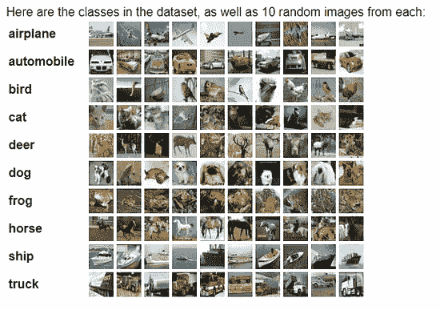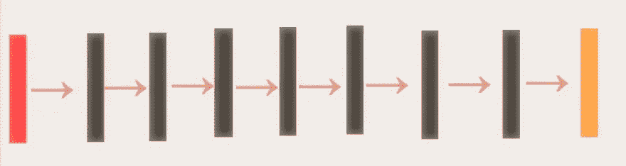

Image from this website

**红色矩形** →输入图像(32*32*3)
**黑色矩形** →与 ELU 卷积()有/无平均池
**橙色矩形** → Softmax 进行分类

像往常一样，我们将使用 CIFAR 10 数据集来训练我们的[全卷积网络](/iclr-2015-striving-for-simplicity-the-all-convolutional-net-with-interactive-code-manual-b4976e206760)，并尝试了解为什么网络会将某些图像预测到它的类别中。

有一点需要注意，因为这篇文章更多的是关于了解网络的内部运作。我将只使用测试集中的 50 张图片来衡量准确性。

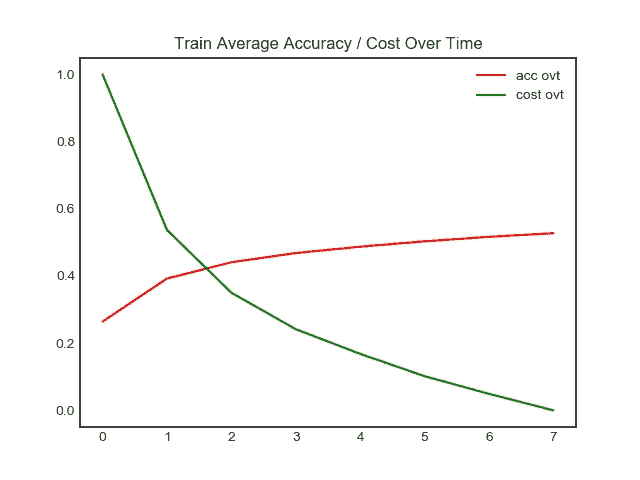

**左图像** →测试图像(50 张图像)的精度/时间成本
**右图像** →训练图像(50000 张图像)的精度/时间成本

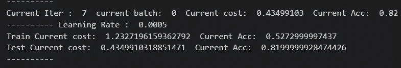

如上所述，该模型在第 7 个时期的最终精度为 81%。(如果您希望访问完整的培训日志，[请点击此处](https://github.com/JaeDukSeo/Daily-Neural-Network-Practice-2/blob/master/Understanding_Concepts/COUNTERFACTUALS/viz/z_viz.txt)。)最后，让我们看看每个类的每个数字代表什么。

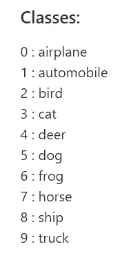

Image from this [website](https://github.com/EN10/CIFAR)

**权重直方图(训练前/后)**

Histogram of weighs before training

上图是每一层的权重直方图，为了便于可视化，我将每一层直方图分为三层。在最左侧，我们可以观察到权重的平均值通常为 0，标准偏差(stddev)值在 0.04 到 0.06 之间。这是意料之中的，因为我们用不同的 stddev 值声明了每个层。此外，一些曲线比其他曲线小的原因是由于每层的权重数不同。(例如，层 0 仅具有 3 * 3 * 128 的权重，而层 2 具有 3 * 128 * 128 的权重。)

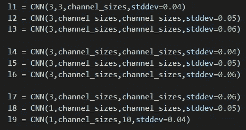

Different stddev values

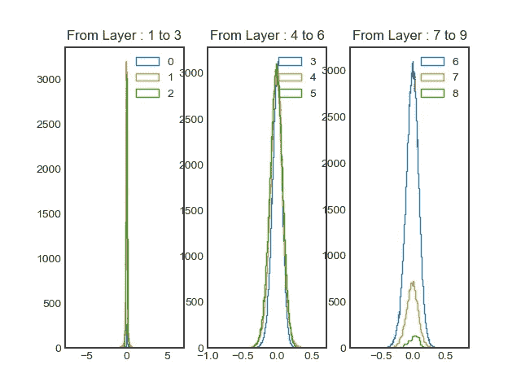

Histogram of weighs after training

马上，我们可以观察到一个明显的差异。尤其是前三层。分布的范围从-5 增加到 5。然而，看起来大部分权重存在于-1 和 1 之间(或者接近于零。)对于第 4 层到第 6 层，看起来平均值和最后三层一样发生了偏移。

**可视化某些层的激活值**

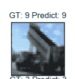

Test Input for the network

使用由[约辛斯基和他的同事](https://arxiv.org/pdf/1506.06579.pdf)完成的技术，让我们想象上面的图像是如何在第 3、6 和 9 层之后被修改的。(请注意，我最初在这篇[博文](https://medium.com/@awjuliani/visualizing-neural-network-layer-activation-tensorflow-tutorial-d45f8bf7bbc4)中发现了[亚瑟·朱利安尼](https://medium.com/@awjuliani?source=post_header_lockup)使用的方法。)

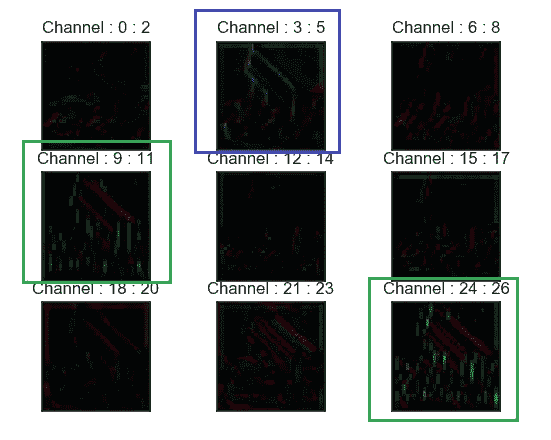

Activation after layer 3

**绿框** →捕捉绿色值的通道
**蓝框** →捕捉蓝色值的通道

现在有 128 个频道，所以我就不一一列举了。相反，我会想象前 27 个通道，如上所示。我们可以看到，在第 3 层之后，某些颜色值在网络中被捕获。

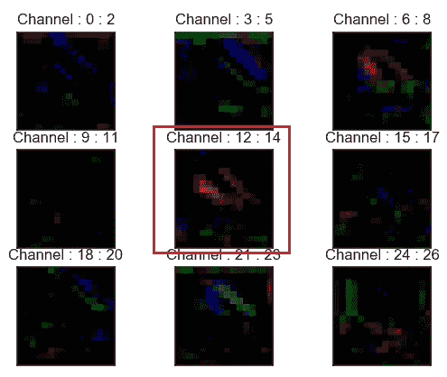

Activation for layer 6

**红色框** →捕捉红色的通道

然而，在第六层之后，似乎某些过滤器能够比绿色或蓝色更好地捕捉红色。

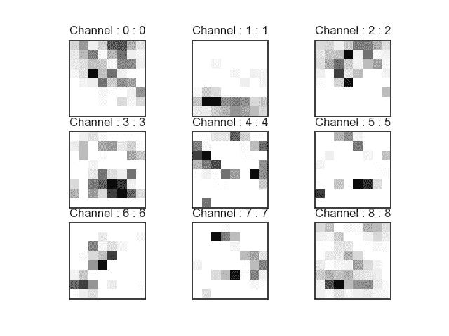

Activation after layer 9

最后，在第九层之后(就在全局平均汇集之前)，我们可以可视化深度为 1 的每个通道(因此它看起来像灰度图像)。然而(至少对我来说)，它似乎不是人类可以理解的。所有的图片都可以在这里找到并且我创建了一个 GIF 来累积所有的变化。

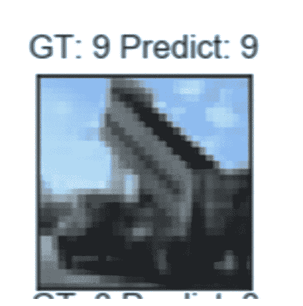

**GIF 的顺序** →输入图像，第 3 层后激活，第 6 层后激活，第 9 层后激活

**内部渐变/正负属性**

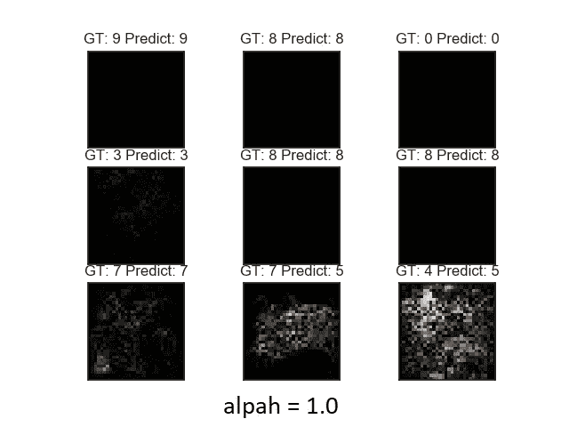

alpha value of 1.0

现在让我们使用[内部渐变](/google-iclr-2017-paper-summary-gradients-of-counterfactuals-6306510935f2)，阿尔法值为…
0.01，0.01，0.03，0.04，0.1，0.5，0.6，0.7，0.8，1.0(与原始输入相同)，来形象化的表现网络的内部运作。

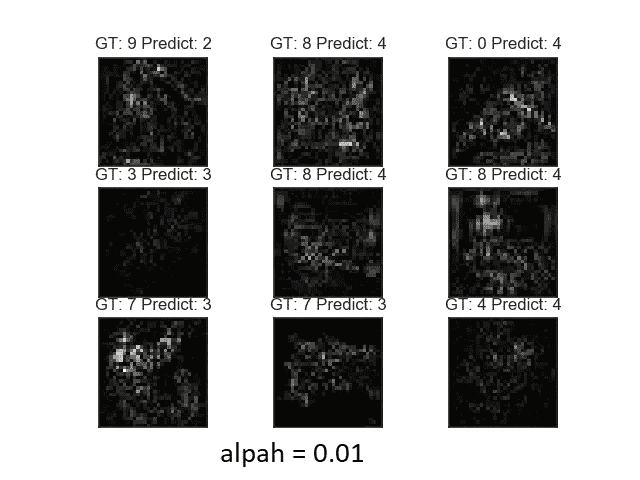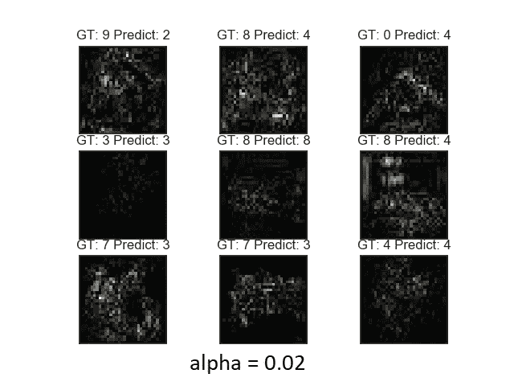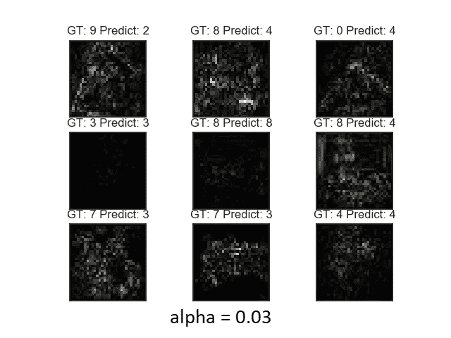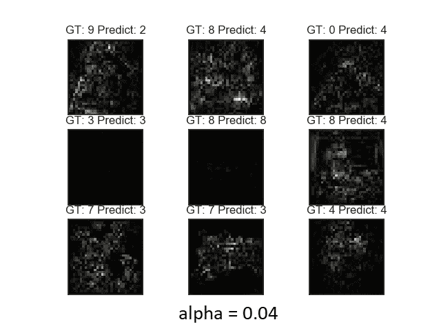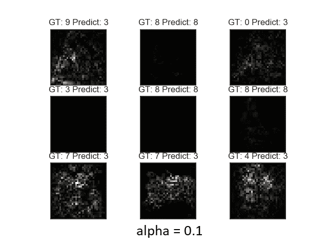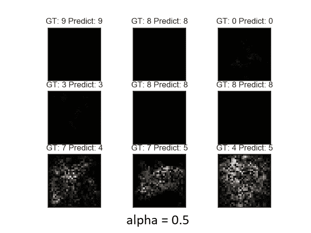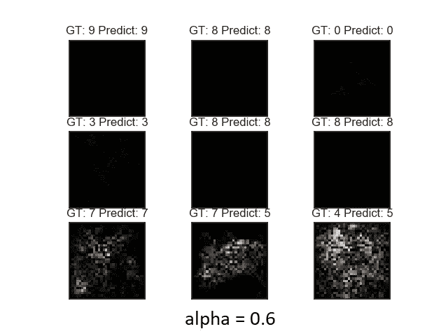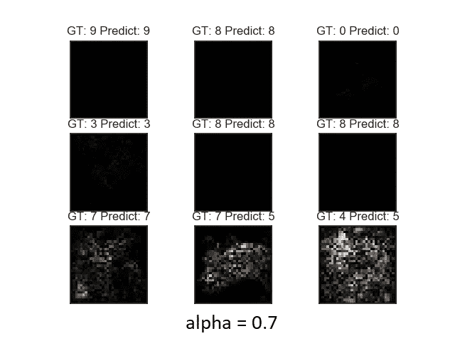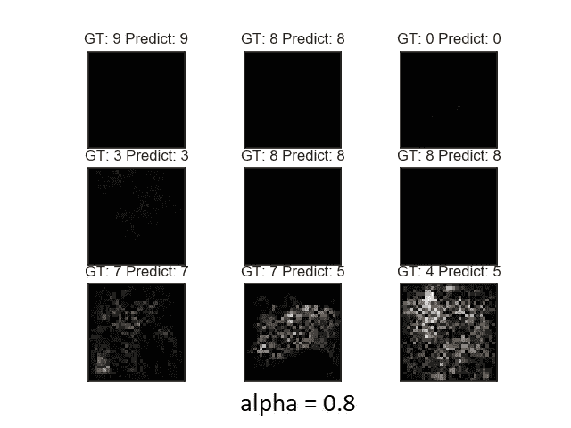

上面的所有图像都代表了相对于具有不同 alpha 值的输入的梯度。我们可以观察到，随着 alpha 值的增加，由于网络中的饱和度，梯度变得更接近 0(黑色)。当我们以 gif 格式查看所有图像时，我们可以清楚地看到渐变是如何变化的。

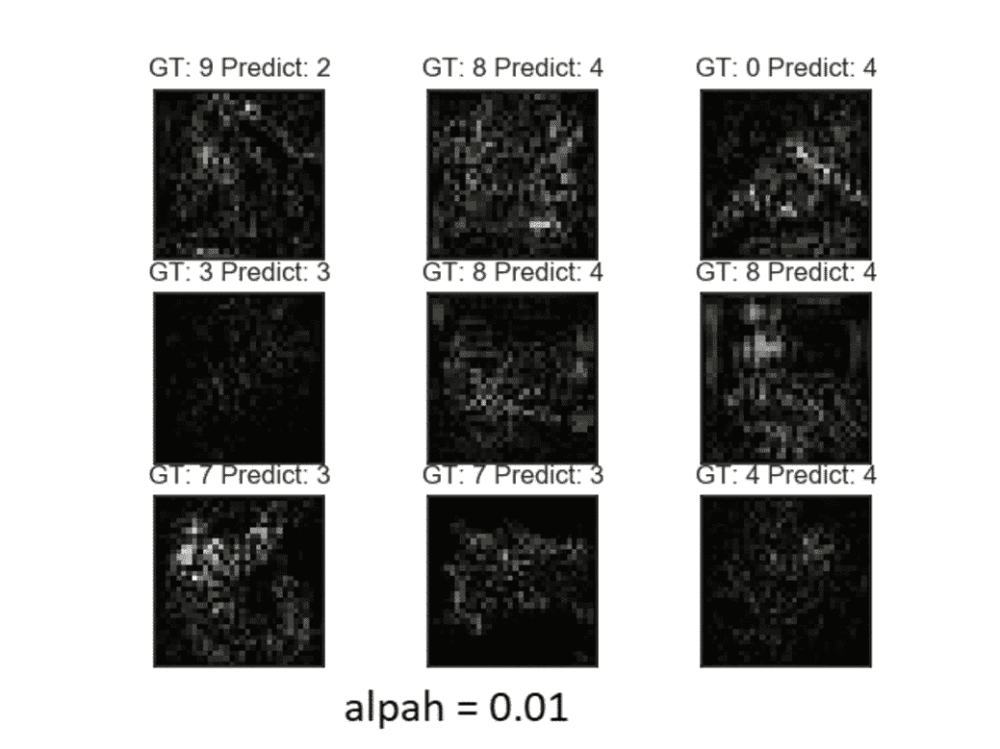

然而，我能够做出一个有趣的观察，随着 alpha 值变小，我的网络无法做出正确的预测。如下所示，当 alpha 值很小(0.01)时，网络通常预测 3 或 4。(猫/鹿)

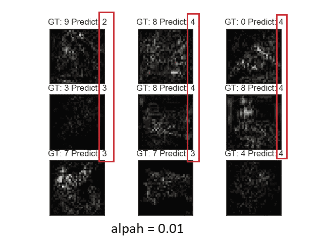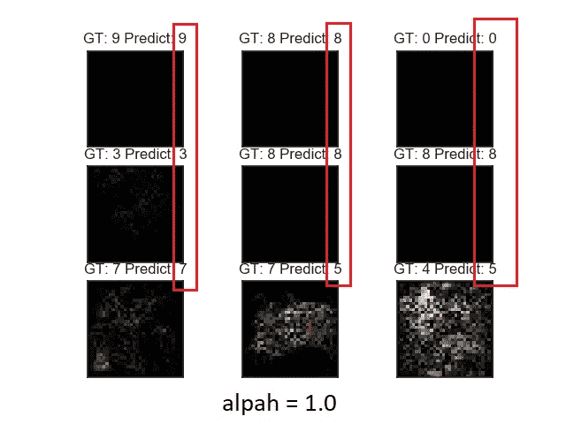

**红框** →车型预测

但是随着 alpha 值的增加，最终达到 1.0，我们可以观察到模型的准确性增加了。最后，让我们看看每个 alpha 值的渐变的正负属性。

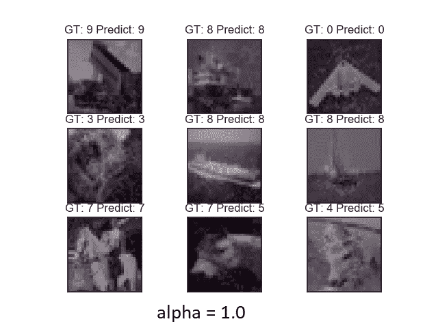

**蓝色像素→** 正属性覆盖原始图像
**红色像素→** 负属性覆盖原始图像

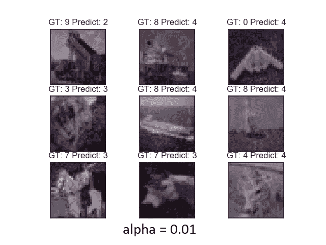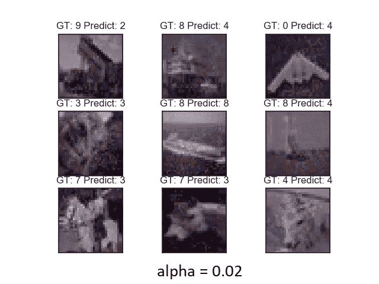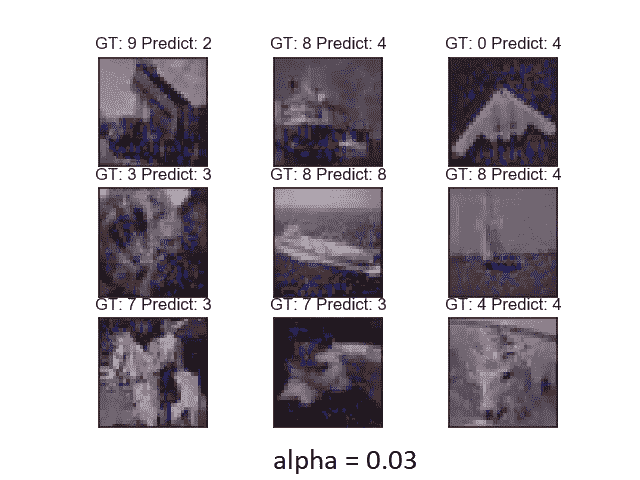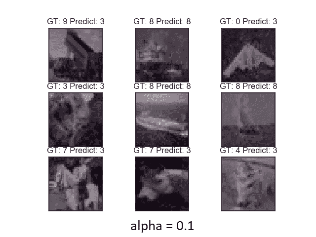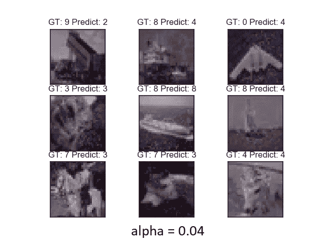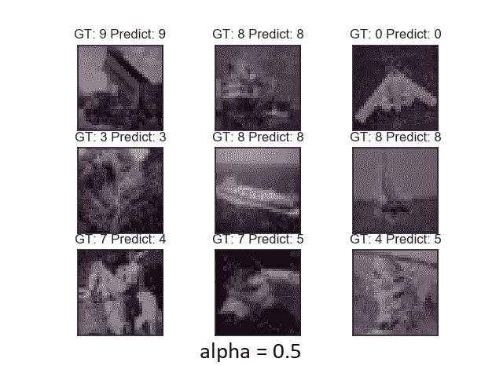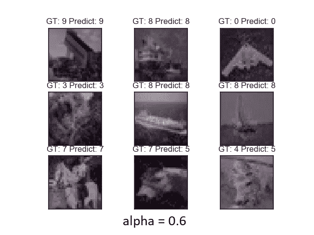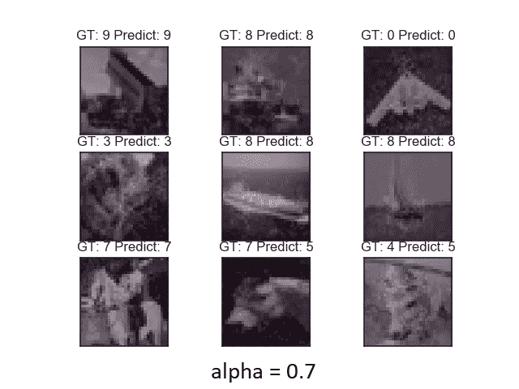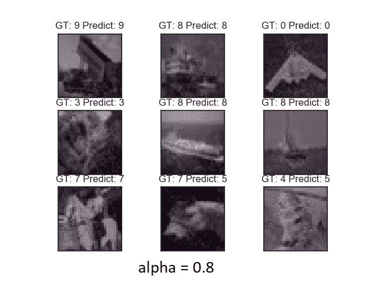

同样，如果我们用这些图像创建一个 gif，会更容易看到变化。

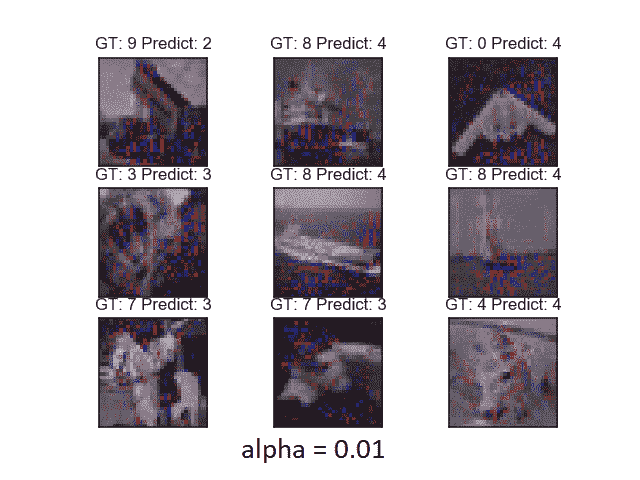

**积分梯度/正负属性**

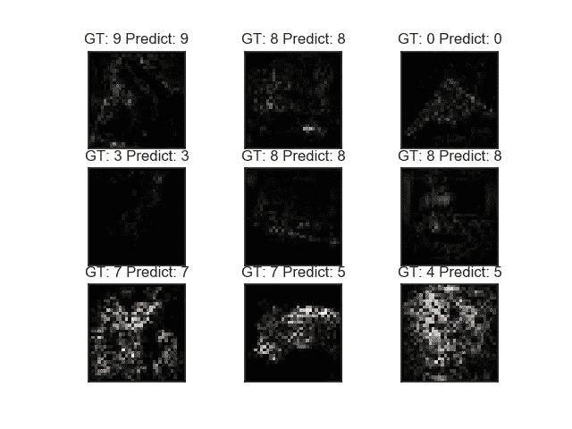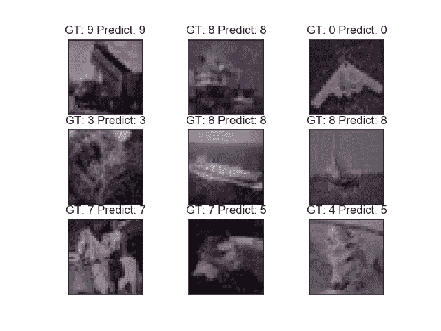

**左图** →步长为 3000 的积分梯度[黎曼近似](https://en.wikipedia.org/wiki/Riemann_sum)
**右图** →蓝色表示正属性，红色表示负属性

最后，当我们使用积分梯度来可视化梯度时，我们可以观察到类似上面的东西。我发现的一个非常有趣的事实是，网络是如何预测马(7)、狗(5)和鹿(4)的。

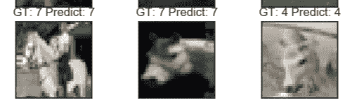

让我们先看看原始图像，如左上图所示，中间的图像是马，右边的图像是羊。

当我们可视化积分梯度时，我们可以看到一些有趣的东西。如中间的图片所示，网络认为马的头部是最重要的。但是，只拍头部的时候，网络以为是狗的形象。(它看起来有点像一只狗)。类似的故事对于右图，当网络只考虑到只有一只羊的头时，它预测为看到一只狗。

**然而**，如最左边的图像所示，当网络获得一匹马的整体形状(包括人类的某个部分)时，它会正确地将图像识别为一匹马。太神奇了！

**互动码**

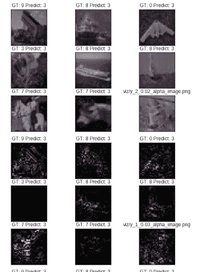

对于 Google Colab，你需要一个 Google 帐户来查看代码，而且你不能在 Google Colab 中运行只读脚本，所以在你的操场上复制一份。最后，我永远不会请求允许访问你在 Google Drive 上的文件，仅供参考。编码快乐！同样为了透明，我在 github 上上传了所有的训练日志。

要访问这篇文章的代码，请[点击这里](https://colab.research.google.com/drive/1ld8_40udZbnWALV1pU582JphXUZD-npn)，培训[日志点击这里。](https://github.com/JaeDukSeo/Daily-Neural-Network-Practice-2/blob/master/Understanding_Concepts/COUNTERFACTUALS/viz/z_viz.txt)

**最后的话**

由于这个领域仍在成长和发展，将会有新的方法和发现。(我希望我也能为这些发现做出贡献。).最后，如果你想访问来自论文原作者的代码"*[请点击这里](https://github.com/ankurtaly/Integrated-Gradients/blob/master/attributions.ipynb)。*

*如果发现任何错误，请发电子邮件到 jae.duk.seo@gmail.com 给我，如果你想看我所有写作的列表，请在这里查看我的网站。*

*同时，在我的推特[这里](https://twitter.com/JaeDukSeo)关注我，访问[我的网站](https://jaedukseo.me/)，或者我的 [Youtube 频道](https://www.youtube.com/c/JaeDukSeo)了解更多内容。我还实现了[广残网，请点击这里查看博文 pos](https://medium.com/@SeoJaeDuk/wide-residual-networks-with-interactive-code-5e190f8f25ec) t。*

***参考***

1.  *[http://公理/定义/定理/证明](http://Axiom/definition/theorem/proof)。(2018).YouTube。检索于 2018 年 6 月 14 日，来自[https://www.youtube.com/watch?v=OeC5WuZbNMI](https://www.youtube.com/watch?v=OeC5WuZbNMI)*
2.  *公理—字典定义。(2018).Vocabulary.com。检索于 2018 年 6 月 14 日，来自[https://www.vocabulary.com/dictionary/axiom](https://www.vocabulary.com/dictionary/axiom)*
3.  *深度网络的公理化属性--穆昆德.孙达拉扬，安库尔.塔利，严琦琦。(2017).Vimeo。检索于 2018 年 6 月 14 日，来自[https://vimeo.com/238242575](https://vimeo.com/238242575)*
4.  *STL-10 数据集。(2018).Cs.stanford.edu。检索于 2018 年 6 月 15 日，来自 https://cs.stanford.edu/~acoates/stl10/*
5.  *贝嫩森河(2018)。分类数据集结果。rodrigob . github . io . 2018 年 6 月 15 日检索，来自[http://rodrigob . github . io/are _ we _ there _ yet/build/classification _ datasets _ results . html # 53544 C2 d 3130](http://rodrigob.github.io/are_we_there_yet/build/classification_datasets_results.html#53544c2d3130)*
6.  *[复本]，H. (2018)。如何在 Matplotlib (python)中隐藏轴和网格线？堆栈溢出。检索于 2018 年 6 月 16 日，来自[https://stack overflow . com/questions/45148704/how-to-hide-axes-and-gridlines-in-matplotlib-python](https://stackoverflow.com/questions/45148704/how-to-hide-axes-and-gridlines-in-matplotlib-python)*
7.  *VanderPlas，J. (2018)。多重支线剧情| Python 数据科学手册。jakevdp . github . io . 2018 年 6 月 16 日检索，来自[https://jakevdp . github . io/python datascience handbook/04.08-multiple-subplots . html](https://jakevdp.github.io/PythonDataScienceHandbook/04.08-multiple-subplots.html)*
8.  *Matplotlib . py plot . subplot-Matplotlib 2 . 2 . 2 文档。(2018).Matplotlib.org。检索于 2018 年 6 月 16 日，来自[https://matplotlib . org/API/_ as _ gen/matplotlib . py plot . subplot . html](https://matplotlib.org/api/_as_gen/matplotlib.pyplot.subplot.html)*
9.  *matplotlib，m. (2018)。matplotlib 中超过 9 个支线剧情。堆栈溢出。检索于 2018 年 6 月 16 日，来自[https://stack overflow . com/questions/4158367/more-than-9-subplots-in-matplotlib](https://stackoverflow.com/questions/4158367/more-than-9-subplots-in-matplotlib)*
10.  *pylab_examples 示例代码:subplots _ demo . py—Matplotlib 2 . 0 . 0 文档。(2018).Matplotlib.org。检索于 2018 年 6 月 16 日，来自[https://matplotlib . org/2 . 0 . 0/examples/pylab _ examples/subplots _ demo . html](https://matplotlib.org/2.0.0/examples/pylab_examples/subplots_demo.html)*
11.  *Matplotlib . py plot . hist-Matplotlib 2 . 2 . 2 文档。(2018).Matplotlib.org。检索于 2018 年 6 月 16 日，来自[https://matplotlib . org/API/_ as _ gen/matplotlib . py plot . hist . html](https://matplotlib.org/api/_as_gen/matplotlib.pyplot.hist.html)*
12.  *Python？，I. (2018)。在 Python 中有没有一个干净的生成折线图的方法？。堆栈溢出。检索于 2018 年 6 月 16 日，来自[https://stack overflow . com/questions/27872723/is-there-a-clean-way-to-generate-a-line-histogram-chart-in-python](https://stackoverflow.com/questions/27872723/is-there-a-clean-way-to-generate-a-line-histogram-chart-in-python)*
13.  *Pyplot 文本— Matplotlib 2.2.2 文档。(2018).Matplotlib.org。检索于 2018 年 6 月 16 日，来自[https://matplotlib . org/gallery/py plots/py plot _ text . html # sphx-glr-gallery-py plots-py plot-text-py](https://matplotlib.org/gallery/pyplots/pyplot_text.html#sphx-glr-gallery-pyplots-pyplot-text-py)*
14.  *【谷歌/ ICLR 2017 /论文摘要】反事实的梯度。(2018).走向数据科学。检索于 2018 年 6 月 16 日，来自[https://towards data science . com/Google-iclr-2017-paper-summary-gradients-of-counter factuals-6306510935 F2](/google-iclr-2017-paper-summary-gradients-of-counterfactuals-6306510935f2)*
15.  *NumPy . transpose—NumPy 1.14 版手册。(2018).Docs.scipy.org。检索于 2018 年 6 月 16 日，来自[https://docs . scipy . org/doc/numpy-1 . 14 . 0/reference/generated/numpy . transpose . html](https://docs.scipy.org/doc/numpy-1.14.0/reference/generated/numpy.transpose.html)*
16.  *命令，G. (2018)。Git 在一个命令中添加和提交。堆栈溢出。检索于 2018 年 6 月 16 日，来自[https://stack overflow . com/questions/4298960/git-add-and-commit-in-one-command](https://stackoverflow.com/questions/4298960/git-add-and-commit-in-one-command)*
17.  *如何将图像切片为红色，g. (2018)。如何使用 misc.imread. Stack 溢出将图像分割为红色、绿色和蓝色通道。检索于 2018 年 6 月 16 日，来自[https://stack overflow . com/questions/37431599/how-to-slice-a image-into-red-green-and-blue-channels-with-misc-imread](https://stackoverflow.com/questions/37431599/how-to-slice-an-image-into-red-green-and-blue-channels-with-misc-imread)*
18.  *如何在 Windows 10 上安装 Bash shell 命令行工具？(2016).Windows 中央。检索于 2018 年 6 月 16 日，来自[https://www . windows central . com/how-install-bash-shell-command-line-windows-10](https://www.windowscentral.com/how-install-bash-shell-command-line-windows-10)*
19.  *Google Colab 免费 GPU 教程—深度学习火鸡—中等。(2018).中等。检索于 2018 年 6 月 16 日，来自[https://medium . com/deep-learning-turkey/Google-colab-free-GPU-tutorial-e 113627 b9f5d](https://medium.com/deep-learning-turkey/google-colab-free-gpu-tutorial-e113627b9f5d)*
20.  *安装— imgaug 0.2.5 文档。(2018).img aug . readthe docs . io . 2018 年 6 月 16 日检索，来自[http://img aug . readthe docs . io/en/latest/source/installation . html](http://imgaug.readthedocs.io/en/latest/source/installation.html)*
21.  *NumPy . absolute—NumPy 1.14 版手册。(2018).Docs.scipy.org。检索于 2018 年 6 月 16 日，来自[https://docs . scipy . org/doc/numpy-1 . 14 . 0/reference/generated/numpy . absolute . html](https://docs.scipy.org/doc/numpy-1.14.0/reference/generated/numpy.absolute.html)*
22.  *NumPy . clip—NumPy 1.10 版手册。(2018).Docs.scipy.org。检索于 2018 年 6 月 16 日，来自[https://docs . scipy . org/doc/numpy-1 . 10 . 0/reference/generated/numpy . clip . html](https://docs.scipy.org/doc/numpy-1.10.0/reference/generated/numpy.clip.html)*
23.  *NumPy . percentile—NumPy 1.14 版手册。(2018).Docs.scipy.org。检索于 2018 年 6 月 16 日，来自[https://docs . scipy . org/doc/numpy/reference/generated/numpy . percentile . html](https://docs.scipy.org/doc/numpy/reference/generated/numpy.percentile.html)*
24.  *CIFAR-10 和 CIFAR-100 数据集。(2018).Cs.toronto.edu。检索于 2018 年 6 月 16 日，来自[https://www.cs.toronto.edu/~kriz/cifar.html](https://www.cs.toronto.edu/~kriz/cifar.html)*
25.  *[ ICLR 2015 ]追求简单:具有交互码的全卷积网。(2018).走向数据科学。检索于 2018 年 6 月 16 日，来自[https://towards data science . com/iclr-2015-forwards-for-simplicity-the-all-convolutional-net-with-interactive-code-manual-b 4976 e 206760](/iclr-2015-striving-for-simplicity-the-all-convolutional-net-with-interactive-code-manual-b4976e206760)*
26.  *EN10/CIFAR。(2018).GitHub。检索于 2018 年 6 月 16 日，来自[https://github.com/EN10/CIFAR](https://github.com/EN10/CIFAR)*
27.  *深度网络的公理化属性--穆昆德.孙达拉扬，安库尔.塔利，严琦琦。(2017).Vimeo。检索于 2018 年 6 月 16 日，来自[https://vimeo.com/238242575](https://vimeo.com/238242575)*
28.  *(2018).Arxiv.org。检索于 2018 年 6 月 16 日，来自[https://arxiv.org/pdf/1506.06579.pdf](https://arxiv.org/pdf/1506.06579.pdf)*
29.  *黎曼和。(2018).En.wikipedia.org。检索于 2018 年 6 月 16 日，来自[https://en.wikipedia.org/wiki/Riemann_sum](https://en.wikipedia.org/wiki/Riemann_sum)*