# 从原始 NBA 投篮记录数据和探索热手现象的见解

> 原文：<https://towardsdatascience.com/insights-from-raw-nba-shot-log-data-and-an-exploration-of-the-hot-hand-phenomenon-1f1c6c63685a?source=collection_archive---------12----------------------->

作者:迈克尔·阿瑟、凯勒·约翰逊、艾蒙·汗、尼迈·库马尔、里德·怀德

Photo by [Ramiro Pianarosa](https://unsplash.com/@rapiana?utm_source=medium&utm_medium=referral) on [Unsplash](https://unsplash.com?utm_source=medium&utm_medium=referral)

# **概述**

数据科学和篮球比赛每年都变得越来越交织在一起。休斯顿火箭队的强力三分中锋进攻使他们一跃成为 NBA 的精英球队之一。他们的总经理达里尔·莫雷十多年来一直是高级分析的公开支持者，在过去的几年里，很明显*莫雷球*(被 NBA 书呆子亲切地称为 T5)正在被整个联盟的总经理模仿。费城 76 人队现在正在收获前通用汽车和数据大师 Sam Hinkie 的好处，他的非正统团队建设战略引起了整个联盟的两极分化辩论，并最终导致他在 2016 年下台。虽然他可能丢掉了工作，但他数据驱动的工作成果是不可否认的。76 人队现在是联盟中最强的球队之一，主要由欣奇选中的年轻球员提供动力。

我们小组认为在篮球分析方面仍有大量有趣的工作要做，我们想探索一个原始数据集并做一些我们自己的分析。具体来说，我们小组希望获取原始 NBA 投篮日志数据，从中提取有意义的信息，并创建引人注目的图形来展示我们的发现。此外，我们想探索“热手”现象的统计学意义。换句话说，我们想发现，事先知道一个球员连续投篮几次，是否会改变我们对他下一次投篮是否会进的预期。

# 数据

## 数据收集

除了 NBA 网站[之外，像我们使用的数据这样的原始空间拍摄数据很难在任何地方找到。不幸的是，NBA 在几年前就停止公开其 API 了。我们需要刮他们的网站，以获取当前的数据。我们对项目的分析和可视化方面比对抓取更感兴趣，所以我们使用了 2014-2015 赛季的](http://www.nba.com)[数据集](https://www.kaggle.com/dansbecker/nba-shot-logs)，该数据集是在公共 API 仍然可用时获得的。当新数据可用时，我们的分析可以很容易地扩展到新数据。数据集的示例如下所示。

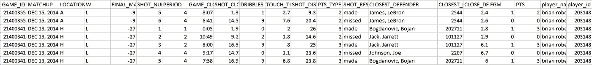

A snippet of the raw NBA shot log dataset

## 数据清理

正如对 NBA 官方数据集的预期，这些数据得到了合理的维护；然而，有一些令人惊讶的差异需要清理。许多名字在数据中被拼错了，这在我们的分析中造成了异常值。此外，CLOSEST_DEFENDER 和 player_id 要素中的名称需要采用相同的格式，以便于我们的分析。一旦我们有了相同格式和正确拼写的名字，我们就可以做一些预处理和特征提取，并做一些分析。

## 特征抽出

由于炮测井数据提供的直接信息很少，我们需要为我们所做的每一种不同类型的分析进行大量的特征提取。我们不会在这一节中用很少的上下文来解释我们所有的预处理工作，我们将回顾一下在*洞察和分析*一节的每个不同小节中什么样的预处理是必要的。

# 见解和分析

## 最佳双向球员

我们希望从 2014-2015 年 NBA 最佳双向球员的简单评估开始我们的分析。一个好的双向球员是进攻和防守都有效的球员。我们决定通过创建一个包含三个特征的数据帧来做到这一点:{player_id，pts_scored，pts_allowed}。通过对 SHOT_RESULTS 列中每个“制造”篮筐的所有 PTS_TYPE 特征求和来计算每个球员的得分。所允许的点数是通过对给定球员在 CLOSEST_DEFENDER 功能中列出的每个投篮进行求和来计算的。新数据框架的示例如下:

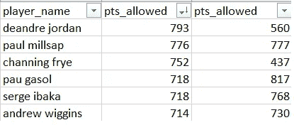

一旦我们有了这个数据框架，我们创建了一个散点图(如下)来更好地可视化数据。

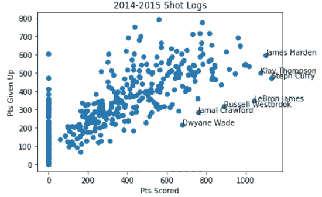

Points given up vs Points scored

正如所料，一些最优秀的双向球员，如德怀恩·韦德，拉塞尔·维斯特布鲁克和勒布朗·詹姆斯，被列在图表的右下部分，因为他们得到了很多分，但在许多篮下没有被列为最接近的防守者。其他球员如克莱·汤普森、斯蒂芬·库里和詹姆斯·哈登也榜上有名。虽然这些球员的防守并不出色(根据这一分析)，但他们的得分能力使他们和其他人一样属于精英类别。

关于这个图表的一个奇怪的事情是贾马尔·克劳福德出现在精英双向球员中。贾马尔·克劳福德被普遍认为是一个糟糕的防守者。他意外出现在图表的这个区域可以用他在团队中的角色来解释。克劳福德的角色是替补能力较弱的球员，并在球队最好的球员休息时承担进攻负担。这个角色导致克劳福德比图表上显示的其他球员少打了 30%的比赛，这也导致他比其他人打了更多的比赛。换句话说，这种特定类型的分析确实有利于像贾马尔·克劳福德这样的球员，显然不是一个完全描述球员价值的指标。事实上，任何先进的体育指标都将固有地偏爱某些类型的球员，这取决于该指标优先考虑比赛的哪些方面。

## 球员得分效率

为了评估单个球员的表现，我们希望收集更多关于他们投篮的背景信息。这位球员的投篮一般都很好，还是效率不高？在深入研究之前，我们首先必须使用特征提取来开发数据，这些数据详细说明了球员的平均投篮距离，他们在每个区域的投篮百分比，以及他们在每个不同区域能够投篮的次数。这些信息给了我们一个球员在比赛中投篮类型的更完整的图像。然后，我们创建了一个模块，该模块接受输入玩家姓名，并将他们的击球距离、击球时间和击球结果数据输出到一个新的数据帧中。我们工具的屏幕截图如下所示:

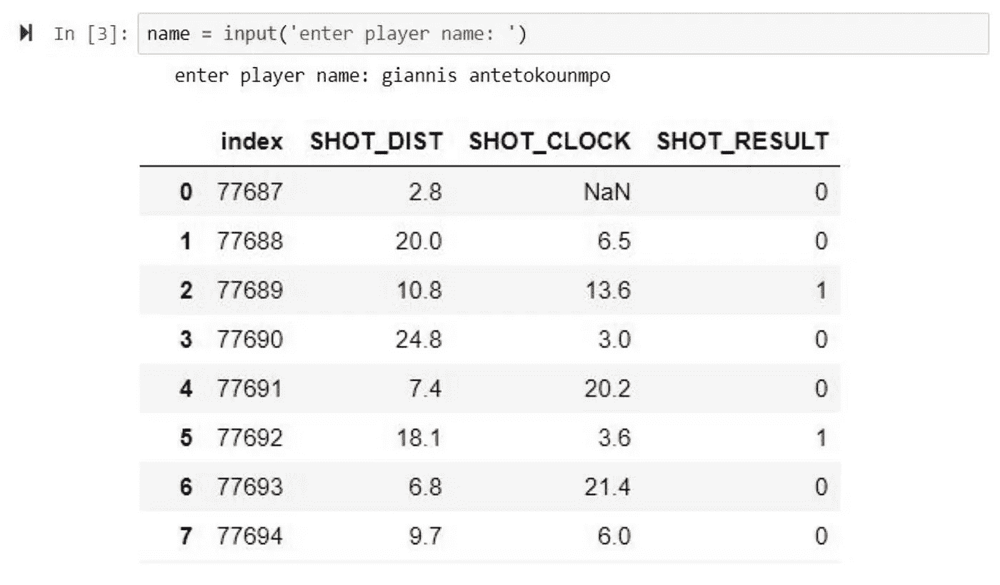

一旦我们有了新的数据帧，所有的镜头都由 DIST 镜头和时钟镜头组织成 144 个独特的箱。投篮距离被分割成 6 个距离范围的<5 ft, 5–10 ft, 10–15 ft, 15–20 ft, 20–25 ft, and 25–30 ft. Clock times were segmented into 24 bins of 1 second each, from 0–24 sec. Each bin was then mapped to the amount of shots taken in that bin, and the amount of shots made.

We then made 2D heatmaps of this data, with distance on the Y-axis and clock time on the X-axis.

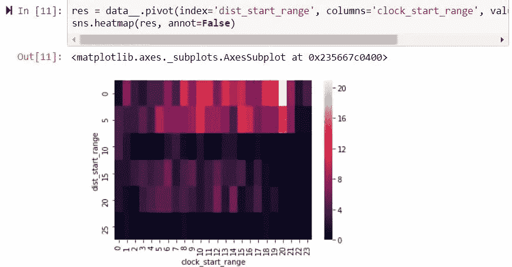

Using this [数据](https://stats.nba.com/teams/shooting/)，我们计算了球场上每个区域的联盟平均投篮命中率(投篮次数/总投篮次数)。然后我们创建了一个二元热图，它显示了一个球员在球场的那个区域是高于还是低于联盟平均水平。棕色区域表示高于联盟平均水平，黑色区域表示低于联盟平均水平。扬尼斯·阿德托昆博的二元热图如下所示:

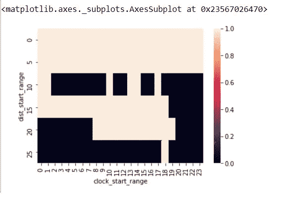

虽然热图很有用，但它们并不十分美观。我们想要更好的东西。使用 matplotlib 中的 plot_trisurf()，我们绘制了# shots made、shots taken 和 binary 图。这些是热图的 3D 视图:

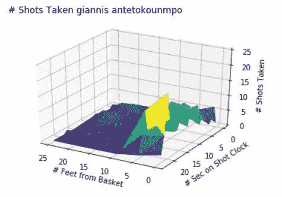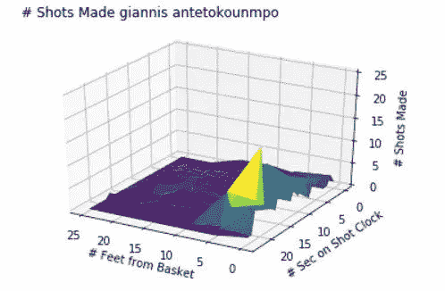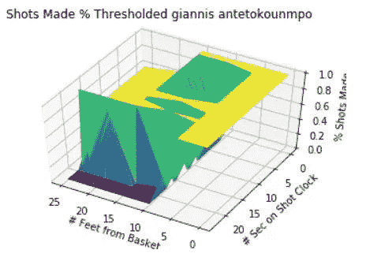

Giannis Antetokounmpo Shot Breakdown

## 解释

使用这些图形，我们可以确定哪些球员知道他们在场上的哪些区域效率很高，哪些球员在他们缺乏持续转换技能的区域持续投篮。在扬尼斯·阿德托昆博(*希腊怪胎*)的例子中，我们可以看到他的大部分投篮都是在离篮筐更近的地方完成的，大部分时间仍然在投篮时间表上。詹尼斯是一个有效率的球员，这张图表显示他的大部分投篮都靠近篮筐，他是一个强有力的射手。

布莱恩·罗伯茨是一个很大程度上在三分球范围内投篮的球员，尽管他不是一个特别好的三分球手。请注意，在第三张图中，当投篮时间低于 3 分范围时，他低于联盟平均水平:

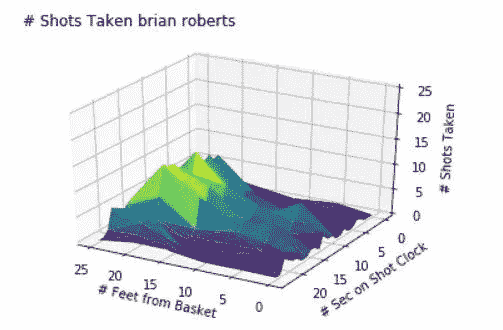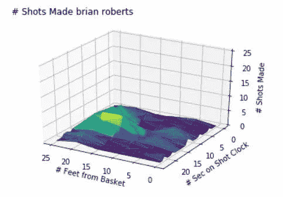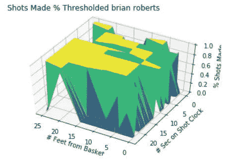

Brian Roberts Shot Breakdown

# 玩家互动

## 使聚集

除了之前提取的数据集特性之外，我们还必须设计一种方法来将一些高级防御指标融入到我们的数据中。我们可以通过在每个球员的数据帧末尾添加防守框加减栏来做到这一点。这个指标让我们可以看到一个球员在球场上的个人防守对整个球队的防守表现有多大贡献。在提取了关于玩家倾向和综合统计数据的有用特征之后，我们想要比较不同玩家如何倾向于相互得分，以及我们是否可以在这些玩家关系中找到任何趋势。

为此，我们考虑了两种聚类算法:K-Means 和 Mean-Shift。我们最终选择使用 K-Means，因为均值漂移在处理不密集且有很多异常值的数据时表现不佳。鉴于我们数据集中合格的 NBA 球员数量相对较少，并且两个球员投篮命中率非常相似的可能性很小，我们决定 K-Means 是我们数据集的一个更好的聚类工具。

使用 K-Means 时最大的挑战是决定聚类的数量。我们发现 4 到 5 个聚类对于这个数据集是最佳的，因为有更多的聚类会创建一些参与者很少的小类，而有更少的聚类会导致类过于一般化。使用 k=5 会产生两类高容量得分玩家，一类中容量玩家和两类低容量玩家。

## *可视化集群*

下一步，我们想要可视化这些职业如何影响玩家的得分和防守。我们用于这个可视化的工具是 [D3.js](https://d3js.org/) ,因为它在创建不同类型的可视化方面非常灵活。受我们在研究数据驱动文档时发现的一个例子的启发，我们选择创建一个力导向图[。创建这个图表需要在 Jupyter Notebook 中进行大量的数据预处理，以构建一个 JSON 文件，该文件的格式易于从 JavaScript 操作。](https://www.analyticsvidhya.com/blog/2017/08/visualizations-with-d3-js/)

首先，我们必须从击球日志数据中创建一个查找矩阵，以记录每个球员在其他球员身上的得分。然后，这个矩阵 attack_defense_matrix.csv 与 players_kmeans.csv 一起被迭代，以构建节点和边的列表。每个节点包含一个玩家的信息，包括一个唯一的标识符，他们的总得分，k-means 定义的类别标签，以及玩家的[防守框加/减(DBPM)](http://Defensive Box Plus/Minus (DBPM)) 。每条边反映了给定玩家相对于其他玩家的得分。这些数据随后被存储为 JSON 文件中的邻接表，JavaScript 文件解析该文件以填充图形。

我们从这些经过处理的数据中创建了两个交互式的力导向图:[一个可视化玩家的进攻能力](http://aimunkhan.com/d3-graph-attack/index.html)和[一个突出他们的防守限制](http://aimunkhan.com/d3-graph-defense/index.html)。在 mouseover 上，进攻图形显示每个球员从我们的得分效率工具生成的 3D 热图。防守图形显示每个球员调整后的 DBPM。

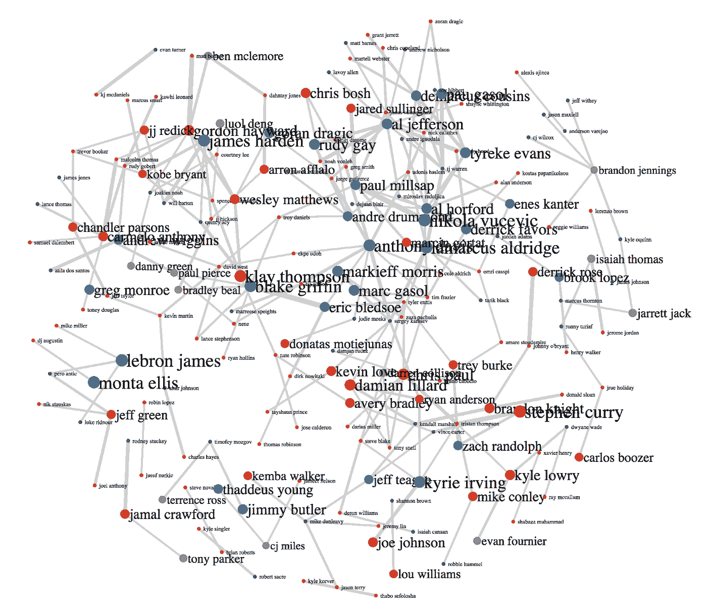

[Force-Directed Graph of NBA Players by Offensive Cluster](http://aimunkhan.com/d3-graph-attack/index.html)

# 图表的解释

## 攻击图

进攻图中节点的大小表明了球员得分的多少。我们选择在 mouseover 上展示一个球员的投篮分布，来探究不同类型球员的进攻能力有何不同。节点的平均大小因类而异。节点的颜色代表 k-means 聚类生成的不同组。红色和蓝色节点往往都是高得分者，但他们通常在球场上的不同区域投篮。紫色节点是次要得分手，投篮分布更均匀，绿色和橙色节点往往是更低输出的球员。我们发现这些 k-Means 定义的类是一种合理有趣的球员分组方式，作为传统篮球位置的替代。

蓝色节点代表在篮筐附近得分最多的球员。虽然这一组主要由大个子组成，但一些凶悍的后卫如凯里·欧文和詹姆斯·哈登也属于这一类。大多数大个子的蓝色节点都是高度连接的，这意味着大个子通常会在其他中锋和大前锋身上得分。这是有道理的，因为这些球员经常互相防守，并且在大多数防守中都倾向于靠近篮筐。

红色节点代表射手，主要是后卫，他们的大部分得分来自三分球范围，如斯蒂芬库里和达米恩·利拉德。这些球员中的一小部分通常会在其他后卫身上得分，这是有道理的，因为后卫是最经常防守远射的球员。其他 K 均值聚类包含对游戏影响较小的玩家。

## 防御图

防守图中节点的大小代表了一个球员允许在其上得分的投篮次数。乍一看，似乎较大的节点代表较差的防守者，因为他们得分最多，但这是误导性的，因为球员上场时间越长，节点越大。此外，中锋和大前锋更有可能在我们的数据中被列为最接近的防守者，因为他们经常在篮下投篮。由于这些原因，我们的防守图不公平地惩罚了‘大个子’。

当鼠标悬停在一个节点上时，我们图表的用户可以看到玩家的防守框正/负(DBPM)评级。这一评级是最广泛用于衡量球员对防守的整体影响的，它是我们的分析偏离球员普遍观点程度的晴雨表。例如，图中保罗·米尔萨普节点的大小暗示他是一个糟糕的防守者，但他的 DBPM 评分是 26——联盟中最强的之一。

# 滚烫的手

一些球员(咳咳克莱·汤普森)怎么可能“走火入魔”，或者换句话说，怎么可能有看似不可阻挡的高效发挥？我们想知道，“热度”，或者一个球员在最后 N 次投篮中的投篮次数，对投篮命中率或者得分有影响吗？

为了研究这一点，我们开发了一个击球条件和球员热度的模型，并研究这些因素如何影响击球精度。

> [作者感谢](http://www.sloansportsconference.com/wp-content/uploads/2014/02/2014_SSAC_The-Hot-Hand-A-New-Approach.pdf)的分析，因为它解决了“热手”问题。所有的编码都是由这篇文章的作者独立完成的。

难度条件分为四类:

*   游戏条件(主场/客场、游戏时间、总游戏时间、积分优势)
*   射门条件(到球网的距离，英尺对 2 对 3 指针，射门时钟)
*   防守条件(最近的防守者距离、防守者技能(DBPM)、身高劣势)
*   球员固定效果(球员真实投篮百分比)

我们做多重回归来找出每个条件类别中特征的重要性。然后，我们对所有条件类别进行回归，找出每个条件类别的相对重要性:

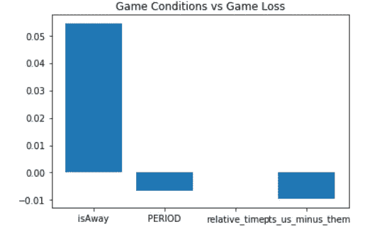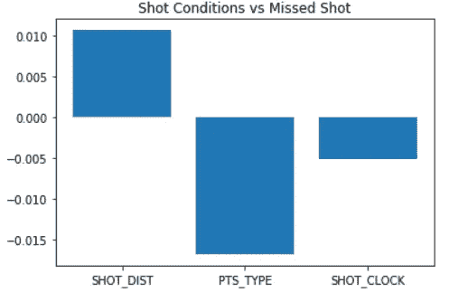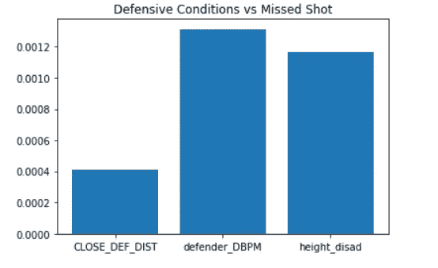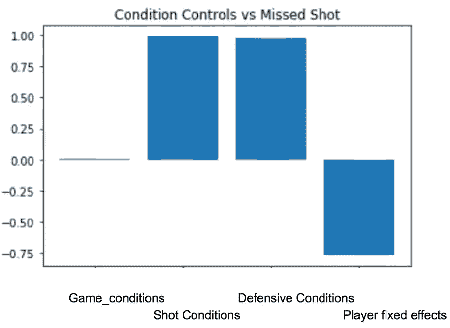

## 难度条件分析

在游戏条件图中，我们看到主场和客场的区别比积分分布和周期占主导地位。经过的游戏时间看起来基本没有影响。我们应该小心不要过早地解释这一点，因为与其他三种难度条件相比，游戏条件显得无关紧要。

投篮条件和防守条件(分别以距离和防守者技能为特征)对投篮难度的贡献相对相等，球员固定效应(真实投篮百分比)的贡献约为投篮条件和防守条件的 75%。

## 热分析

我们必须根据先前的多次发射来定义热。N 热被定义为在最后 N 次尝试中进行的 K 次射击的 K/N。我们比较了 N 次热身赛得分和一次投篮得分:

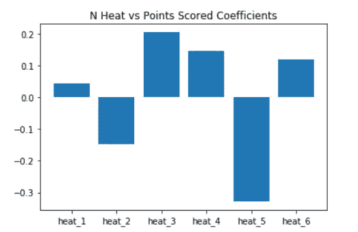

虽然这个模型可能暗示了不同热度之间的显著影响差异，但是我们在线性模型截距的上下文中解释了相对较低的量级分数:0.988402331。

这意味着热量对这些点的影响相对来说是微不足道的。

## 热，在上下文中

为了进一步研究热量的影响，我们做了另一个回归，这次控制困难条件:

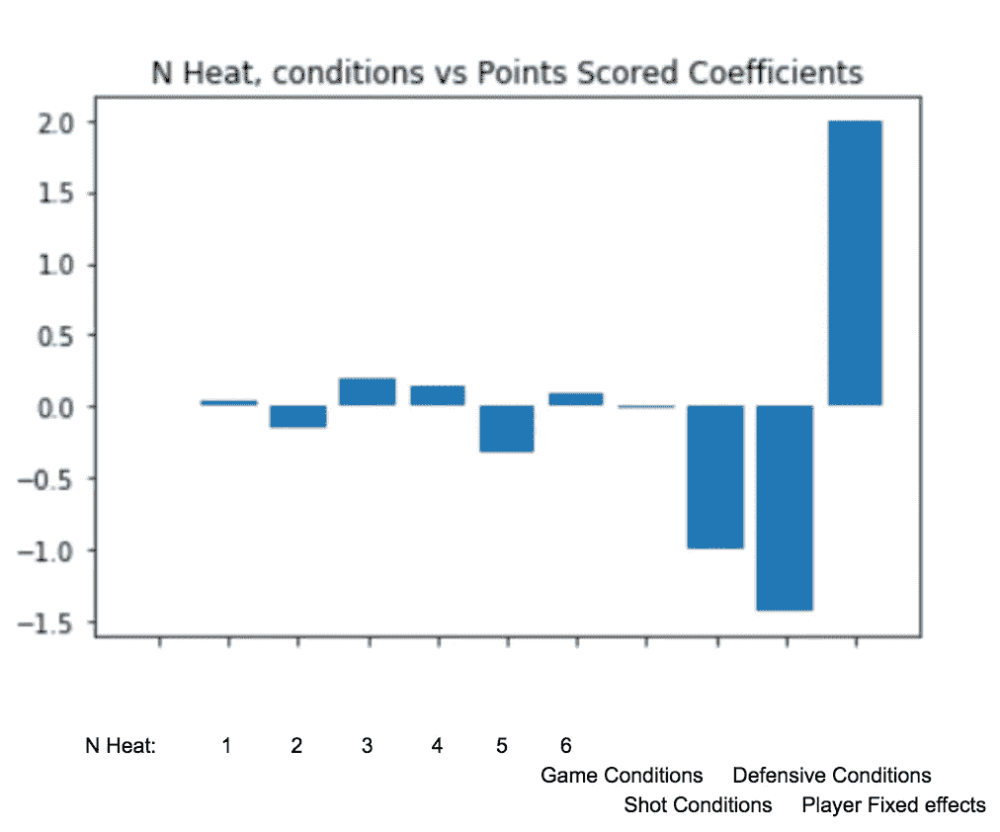

在这个最终回归中，我们看到球员固定效应，即球员的真实投篮命中率，是平均热效应的 8 倍以上，并且是得分的最重要的决定因素。这并不奇怪，因为真实的投篮命中率是一个球员整个赛季的总和，也是他们得分多少的决定性指标。防御条件也是一个相当大的贡献。射击条件本质上是由结构决定的射击距离。我们看到主场优势实际上没有热火重要。

“热手”存在吗？这很难说，但与环境和球员统计相比，这在 NBA 人口中似乎可以忽略不计。要做的进一步工作包括对单个玩家进行分析，看是否只有一些玩家表现出热手牌。可以探索玩家信心指标和更深入的投篮难度分析。

# 结论

在这个项目的过程中，我们清理了一个原始的 NBA 投篮日志数据集，执行了特征提取技术，并创建了有用的分析工具，为球员如何得分提供了有用的视觉效果和洞察力。虽然我们的工具目前只提供了初步的见解，但只需对我们的源代码进行微小的更改，就可以实现更高级的概念，并且可以相对容易地收集和分析更近的炮测井数据。

此外，我们发现热手现象没有统计学意义。虽然有一些我们没有探究的热手问题的变体(例如一些特定的玩家是否有能力变热)，但我们发现，一般来说，连续投篮并不会对未来的投篮产生有意义的影响。

我们希望您喜欢阅读我们的工作。如果你有兴趣，[看看我们的 Github 库](https://github.com/reidwyde/hotHand)。