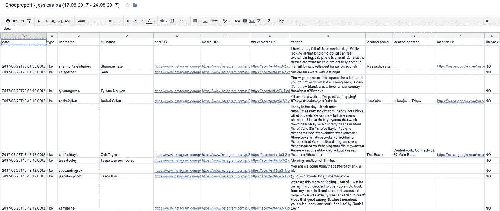
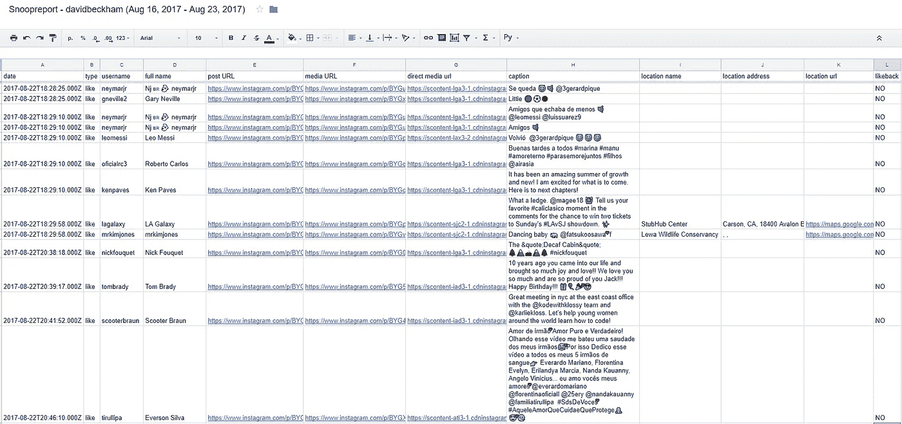
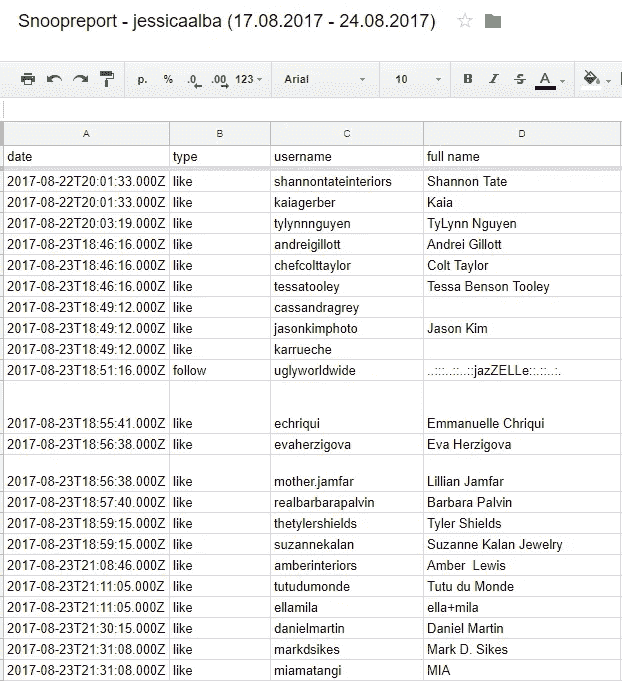
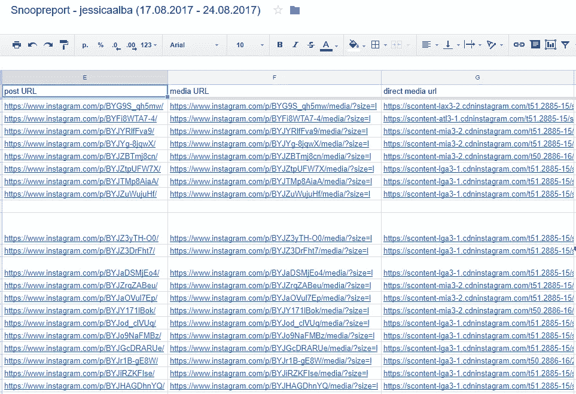
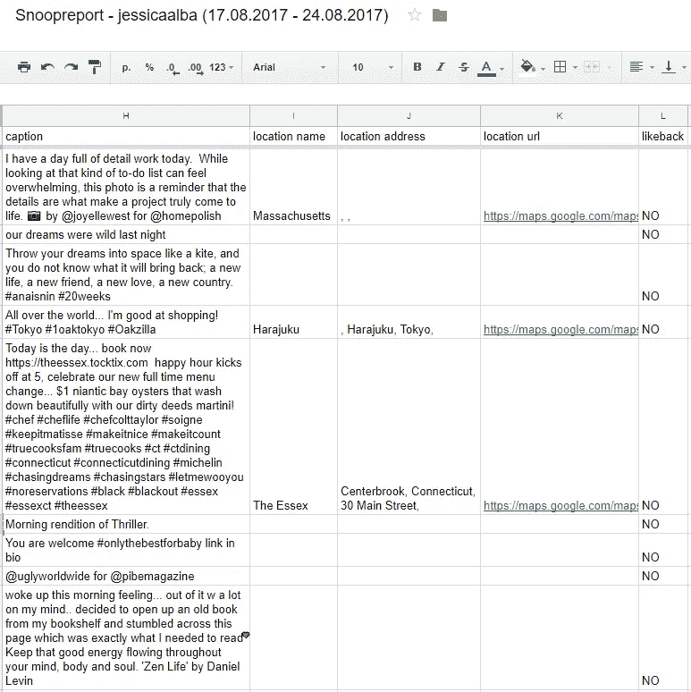

# Snoopreport 服务为深度分析提供 Instagram 用户活动数据

> 原文：<https://towardsdatascience.com/instagram-user-activity-data-provided-for-in-depth-analytics-by-snoopreport-service-c9c2007f1bf6?source=collection_archive---------7----------------------->

[Snoopreport](https://snoopreport.com) 是一个监控平台，监控 Instagram 上的用户活动，如喜欢、评论和关注。

该服务有一个用户友好的仪表盘，你可以添加无限数量的 Instagram 账户进行监控。用户操作在每周和每月的 PDF 报告中提供。要了解 PDF 报告的更多信息，请点击[此处](http://blog.snoopreport.com/2017/08/16/thats-how-snoopreport-single-instagram-user-monitoring-report-looks-like/)。

您还可以按时间顺序下载所有用户操作和 CSV 格式的附加帖子数据，以便进行深入分析。

CSV 报告示例:

# **CSV 报告中提供的数据**

该报告提供您监控的用户的赞、评论和关注，以及获得赞和评论的帖子的相关数据(帖子描述、帖子 URL、地理标签和一些其他指标)。

CSV 报告中显示的数据:

1.  日期—受监控用户执行操作的日期和时间。你可以确定用户在 Instagram 上最活跃的时间间隔
2.  类型—操作的类型:喜欢、评论或关注
3.  用户名—获得赞、评论或关注的用户的用户名
4.  全名—通常是获得赞、评论或关注的用户的名和姓

5.帖子 URL —链接到 Instagram 帖子，带有赞或评论

6.媒体 URL —指向媒体文件的链接。通过这个链接，你只能得到图片(视频也是以图片形式打开的)

7.直接媒体 url —指向您可以直接下载的媒体文件(照片或视频)的直接链接。该数据可用于图像识别，以自动方式确定介质上的物体或人

8.标题——对罐子的描述，包括文字、标签和用户名。使用此字段确定标记的用户或品牌。例如，如果您想知道用户喜欢的品牌，解析该字段以自动获得品牌列表。字幕也可以通过自然语言处理进行分析，以识别作为文本提及的情感、品牌、地理位置和事件。

9.位置名称-文本格式的地理标记。如果用户没有添加位置，则该字段为空

10.位置地址-地址格式的地理标记

11.位置 URL——在谷歌地图上将地理标记为坐标

12.Likeback —显示用户是否在他喜欢的帖子上被标记的指标。用它从简单提到用户的内容中突出用户真正的兴趣。

首先，营销人员和分析师会对 CSV 报告感兴趣。要了解 Snoopreport professional 用于分析的更多信息，请阅读我们的文章。

为了获得更有价值的用户洞察，如果您监控多个用户，我们还提供群组报告。您可以在单个 CSV 报告中下载添加到仪表板中的任意数量用户的活动数据，并分析这组用户的行为。组报告看起来像单个用户的报告，但是添加了 Username_Monitored 列。它有执行某个动作的 Instagram 用户。

我们将在未来的报告中添加新的指标，如品牌、博客或个人用户标志等。关注更新[https://snoopreport.com](https://snoopreport.com)！