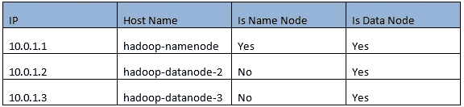

# 在 Ubuntu 16.04 上逐步安装 Hadoop 3.1.0 多节点集群

> 原文：<https://towardsdatascience.com/installing-hadoop-3-1-0-multi-node-cluster-on-ubuntu-16-04-step-by-step-8d1954b31505?source=collection_archive---------2----------------------->


Image Source: www.[mapr.com/products/apache-hadoop/](https://mapr.com/products/apache-hadoop/)

网上有很多关于安装 Hadoop 3 的链接。他们中的许多人工作不好或需要改进。这篇文章摘自官方文件和其他文章以及 Stackoverflow.com 的许多回答

# 1.先决条件

***注意:所有先决条件必须应用于名称节点和数据节点***

# 1.1.安装 JAVA、SSH 和其他软件实用程序

首先，我们需要为 Java 8 安装 SSH 和一些软件安装实用程序:

```
sudo apt install \openssh-server \software-properties-common \python-software-properties
```

然后我们需要安装 Oracle 的 Java 8 发行版，并更新当前的 OS。

```
sudo add-apt-repository ppa:webupd8team/javasudo apt updatesudo apt install oracle-java8-installer
```

要验证 java 版本，您可以使用以下命令:

```
java -version
```

# 1.2.为 Hadoop 创建专门的用户和组

我们将使用专用的 Hadoop 用户帐户来运行 Hadoop 应用程序。虽然这不是必需的，但建议这样做，因为它有助于将 Hadoop 安装与同一台机器上运行的其他软件应用程序和用户帐户(安全、权限、备份等)分开。

```
sudo addgroup hadoopgroupsudo adduser --ingroup hadoopgroup hadoopusersudo adduser hadoopuser sudo
```

您可以使用以下命令检查组和用户:

```
compgen -gcompgen -u
```

# 1.3.SSH 配置

Hadoop 需要 SSH 访问来管理其不同的节点，即远程机器加上您的本地机器。

首先，您需要以 Hadoopuser 的身份登录

```
sudo su -- hadoopuser
```

以下命令用于使用 SSH 生成一个键值对

```
ssh-keygen -t rsa -P “” -f ~/.ssh/id_rsa
```

将 id_rsa.pub 中的公钥复制到 authorized_keys 中。

```
cat ~/.ssh/id_rsa.pub>> ~/.ssh/authorized_keyschmod 0600 ~/.ssh/authorized_keys
```

确保 hadoopuser 可以 ssh 到自己的帐户，无需密码。从 hadoopuser 帐户 ssh 到 localhost，以确保它工作正常。

```
ssh localhost
```

*注意:如果你得到错误:ssh:连接到主机本地主机端口 22:连接被拒绝，那么，请尝试使用下面的命令安装 ssh-server。*

```
sudo apt-get install ssh
```

# 2.下载并配置 Hadoop

在本文中，我们将在三台机器上安装 Hadoop:



第一台机器将充当名称节点(主节点)和数据节点(从节点)，其他机器是数据节点(从节点)

在每台机器上，我们必须使用以下命令编辑/etc/hosts 文件

```
sudo gedit /etc/hosts
```

每个文件必须包含这些行:

```
127.0.0.1 localhost10.0.1.1 hadoop-namenode10.0.1.2 hadoop-datanode-210.0.1.3 hadoop-datadnode-3
```

*注意:如果/etc/hosts 文件包含下面一行*

```
127.0.1.1 <Hostname>
```

然后你要删除这一行。

# 2.1.下载 Hadoop

我们将把所有软件安装在/opt 目录下，并将 HDFS 的底层数据也存储在那里。下面我们将用一个命令创建文件夹。

```
sudo mkdir -p /opt/{hadoop/{logs},hdfs/{datanode,namenode},yarn/{logs}
```

文件夹的布局将如下所示

```
/opt/├── hadoop│ ├── logs├── hdfs│ ├── datanode│ └── namenode├── yarn│ ├── logs
```

您可以使用以下命令下载 hadoop-3.1.0.tar.gz:

```
wget -c -O hadoop.tar.gz [http://www-eu.apache.org/dist/hadoop/common/hadoop-3.1.0/hadoop-3.1.0.tar.gz](http://www-eu.apache.org/dist/hadoop/common/hadoop-3.1.0/hadoop-3.1.0.tar.gz)
```

要解压缩 Hadoop 包，您可以使用以下命令:

```
sudo tar -xvf hadoop.tar.gz \ --directory=/opt/hadoop \--strip 1
```

Hadoop 3 的二进制版本压缩了 293 MB。它的解压缩大小为 733 MB，其中有 400 MB 的小文档文件，解压缩可能需要很长时间。您可以通过在上面的命令中添加以下行来跳过这些文件:

```
--exclude=hadoop-3.1.0/share/doc
```

# 2.2.Hadoop 常见配置

***注意:这些步骤必须在名称节点和数据节点上完成。***

有一些环境设置将被 Hadoop、Hive 和 Spark 使用，并由 root 和普通用户帐户共享。为了集中这些设置，我将它们存储在/etc/profile 中，并从/root/创建了一个符号链接。bashrc 到这个文件。这样，所有用户都将拥有集中管理的设置。

```
sudo gedit /etc/profile
```

/etc/profile 必须类似于:

```
if [ “$PS1” ]; thenif [ “$BASH” ] && [ “$BASH” != “/bin/sh” ]; then# The file bash.bashrc already sets the default PS1.# PS1=’\h:\w\$ ‘if [ -f /etc/bash.bashrc ]; then. /etc/bash.bashrcfielseif [ “`id -u`” -eq 0 ]; thenPS1=’# ‘elsePS1=’$ ‘fififiif [ -d /etc/profile.d ]; thenfor i in /etc/profile.d/*.sh; doif [ -r $i ]; then. $ifidoneunset ifiexport HADOOP_HOME=/opt/hadoopexport PATH=/usr/local/sbin:/usr/local/bin:/usr/sbin:/usr/bin:/sbin:/bin:$HADOOP_HOME/bin:$HADOOP_HOME/sbinexport HADOOP_CONF_DIR=/opt/hadoop/etc/hadoopexport HDFS_NAMENODE_USER=rootexport HDFS_DATANODE_USER=rootexport HDFS_SECONDARYNAMENODE_USER=rootexport JAVA_HOME=/usr/lib/jvm/java-8-oracleexport HADOOP_MAPRED_HOME=/opt/hadoopexport HADOOP_COMMON_HOME=/opt/hadoopexport HADOOP_HDFS_HOME=/opt/hadoopexport YARN_HOME=/opt/hadoop
```

以下命令将在~/之间创建一个符号链接。bashrc 和/etc/profile，并应用对/etc/profile 所做的更改

```
sudo ln -sf /etc/profile /root/.bashrcsource /etc/profile
```

更新/opt/HADOOP/etc/HADOOP/HADOOP-env . sh 文件并设置 JAVA_HOME 变量和 HADOOP_HOME、HADOOP _ CONF _ 目录和 HADOOP _ LOG _ 目录变量

```
export JAVA_HOME=/usr/lib/jvm/java-8-oracleexport HADOOP_HOME=/opt/hadoopexport HADOOP_CONF_DIR=/opt/hadoop /etc/hadoopexport HADOOP_LOG_DIR=/opt/hadoop/logs
```

注销并重新登录到您的 hadoopuser 帐户，并使用以下命令检查 Hadoop 安装。

```
hadoop -version
```

# 2.3.主节点配置

首先，我们必须更新位于/opt/Hadoop/etc/Hadoop/的 hdfs-site.xml 文件，以定义这台机器上的名称节点和数据节点，并定义复制因子和其他设置:

```
sudo gedit /opt/hadoop/etc/hadoop/hdfs-site.xml
```

该文件必须类似于:

```
<configuration><property><name>dfs.namenode.name.dir</name><value>file:///opt/hdfs/namenode</value><description>NameNode directory for namespace and transaction logs storage.</description></property><property><name>dfs.datanode.data.dir</name><value>file:///opt/hdfs/datanode</value><description>DataNode directory</description></property><property><name>dfs.replication</name><value>3</value></property><property><name>dfs.permissions</name><value>false</value></property><property><name>dfs.datanode.use.datanode.hostname</name><value>false</value></property><property><name>dfs.namenode.datanode.registration.ip-hostname-check</name><value>false</value></property></configuration>
```

然后，我们必须更新位于/opt/hadoop/etc/hadoop 的 core-site.xml 文件，并让 hadoop 发行版知道名称节点的位置:

```
sudo gedit /opt/hadoop/etc/hadoop/core-site.xml
```

该文件必须类似于:

```
<configuration><property><name>fs.defaultFS</name><value>hdfs://hadoop-namenode:9820/</value><description>NameNode URI</description></property><property><name>io.file.buffer.size</name><value>131072</value><description>Buffer size</description></property></configuration>
```

然后我们必须更新位于/opt/hadoop/etc/hadoop/的 yarn-site.xml 文件

```
sudo gedit /opt/hadoop/etc/hadoop/yarn-site.xml
```

该文件必须类似于:

```
<configuration><property><name>yarn.nodemanager.aux-services</name><value>mapreduce_shuffle</value><description>Yarn Node Manager Aux Service</description></property><property><name>yarn.nodemanager.aux-services.mapreduce.shuffle.class</name><value>org.apache.hadoop.mapred.ShuffleHandler</value></property><property><name>yarn.nodemanager.local-dirs</name><value>file:///opt/yarn/local</value></property><property><name>yarn.nodemanager.log-dirs</name><value>file:///opt/yarn/logs</value></property></configuration>
```

然后我们必须更新位于/opt/hadoop/etc/hadoop/的 mapred-site.xml 文件

```
<configuration><property><name>mapreduce.framework.name</name><value>yarn</value><description>MapReduce framework name</description></property><property><name>mapreduce.jobhistory.address</name><value>hadoop-namenode:10020</value><description>Default port is 10020.</description></property><property><name>mapreduce.jobhistory.webapp.address</name><value> hadoop-namenode:19888</value><description>Default port is 19888.</description></property><property><name>mapreduce.jobhistory.intermediate-done-dir</name><value>/mr-history/tmp</value><description>Directory where history files are written by MapReduce jobs.</description></property><property><name>mapreduce.jobhistory.done-dir</name><value>/mr-history/done</value><description>Directory where history files are managed by the MR JobHistory Server.</description></property></configuration>
```

现在我们必须格式化名称节点

```
hdfs namenode –format
```

最后，我们必须将您的数据节点(Slaves)添加到位于/opt/hadoop/etc/hadoop 的 workers 文件中

```
10.0.1.110.0.1.210.0.1.3
```

配置数据节点后，您必须确保名称节点可以无密码访问它们:

```
ssh-copy-id -i /home/hadoopuser/.ssh/id_rsa.pub hadoopuser@10.0.1.2ssh-copy-id -i /home/hadoopuser/.ssh/id_rsa.pub hadoopuser@10.0.1.3
```

# 2.4.配置数据节点

***注意:您可以将 Hadoop.tar.gz 文件从名称节点复制到数据节点并提取，而不是下载 Hadoop。你可以使用下面的命令:***

```
scp hadoop.tar.gz hadoop-datanode-2:/home/hadoopuserscp hadoop.tar.gz hadoop-datanode-3:/home/hadoopuser
```

在每个数据节点上，您必须执行以下步骤:

我们必须更新位于/opt/hadoop/etc/hadoop 目录下的 hdfs-site.xml、core-site.xml、yarn-site.xml 和 mapred-site.xml，如下所示:

**hdfs-site.xml**

```
<configuration><property><name>dfs.datanode.data.dir</name><value>file:///opt/hdfs/datanode</value><description>DataNode directory</description></property><property><name>dfs.replication</name><value>3</value></property><property><name>dfs.permissions</name><value>false</value></property><property><name>dfs.datanode.use.datanode.hostname</name><value>false</value></property></configuration>
```

**core-site.xml**

```
<configuration><property><name>fs.defaultFS</name><value>hdfs://hadoop-namenode:9820/</value><description>NameNode URI</description></property></configuration>
```

**yarn-site.xml**

```
<configuration><property><name>yarn.nodemanager.aux-services</name><value>mapreduce_shuffle</value><description>Yarn Node Manager Aux Service</description></property></configuration>
```

**mapred-site.xml**

```
<configuration><property><name>mapreduce.framework.name</name><value>yarn</value><description>MapReduce framework name</description></property></configuration>
```

# 2.5.启动 Hadoop

完成上述步骤后，我们必须从名称节点执行以下命令来启动名称节点、数据节点和辅助名称节点:

```
start-dfs.sh
```

它将给出以下输出:

```
Starting namenodes on [hadoop-namenode]Starting datanodesStarting secondary namenodes [hadoop-namenode]
```

此外，要启动资源管理器和节点管理器，我们必须执行以下命令:

```
start-yarn.sh
```

它将给出以下输出:

```
Starting resourcemanagerStarting nodemanagers
```

之后，为了确保 Hadoop 成功启动，我们必须在 name node 上运行 jps 命令，data nodes 必须给出以下输出:

**在名称节点上(忽略进程 id):**

```
16488 NameNode16622 DataNode17215 NodeManager17087 ResourceManager17530 Jps16829 SecondaryNameNode
```

**在数据节点上(忽略进程 id):**

```
2306 DataNode2479 NodeManager2581 Jps
```

如果您得到类似的输出，那么所有的 Hadoop 守护进程都会成功启动。

注意:您可以通过运行 hdfs dfsadmin -report 命令*(它必须返回 Live datanodes (3))* ，在/opt/hadoop/logs 下检查日志并检查是否一切正常。

# 2.6.在浏览器上访问 Hadoop

**Namenode**

访问以下网址:[https://Hadoop-NameNode:9870/](https://hadoop-namenode:9870/)

**资源经理**

访问以下 URL:[https://Hadoop-NameNode:8088/](https://hadoop-namenode:8088/)

# 3.参考

*   [1] F. Houbart，“如何安装和设置 hadoop 集群”，Linode，2017 年 10 月 16 日。【在线】。可用:[https://www . Li node . com/docs/databases/Hadoop/how-to-install-and-set-up-Hadoop-cluster。](https://www.linode.com/docs/databases/hadoop/how-to-install-and-set-up-hadoop-cluster.)【2018 年 7 月 20 日获取】。
*   [2]“栈溢出问答”，栈溢出，[在线]。可用:[https://www.Stackoverflow.com。](https://www.Stackoverflow.com.)
*   [3]“Apache Hadoop 文档”，Apache，[在线]。可用:[https://www.hadoop.apache.org。](https://www.hadoop.apache.org.)【访问时间 2018 年 01 月 07 日】。
*   [4] G. Bansal，“在 Ubuntu 上安装 Hadoop 3.0.0 多节点集群”，2017 年 8 月 31 日。【在线】。可用:[http://www . gaur av 3 ansal . blogspot . com/2017/08/installing-Hadoop-300-alpha-4-multi . html](http://www.gaurav3ansal.blogspot.com/2017/08/installing-hadoop-300-alpha-4-multi.html.)【访问时间 16 07 2018】。
*   [5] M. Litwintschik，“Hadoop 3 单节点安装指南”，2018 年 3 月 19 日。【在线】。可用:[http://www . tech . marksblogg . com/Hadoop-3-single-node-install-guide . html](http://www.tech.marksblogg.com/hadoop-3-single-node-install-guide.html.)【2018 年 10 月 06 日访问】。