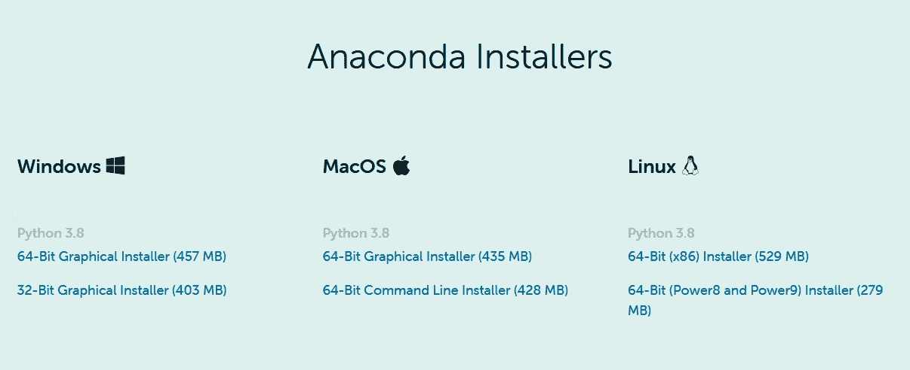
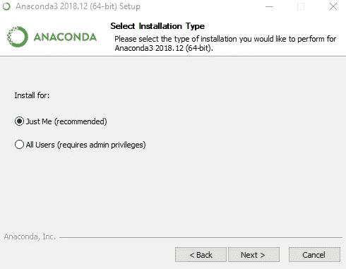
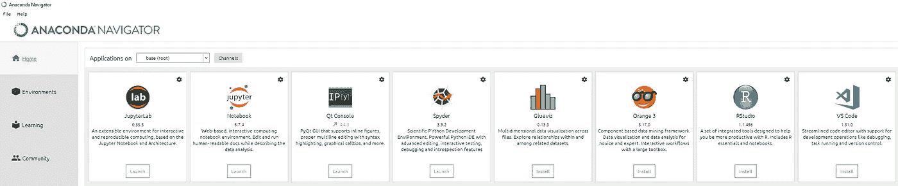
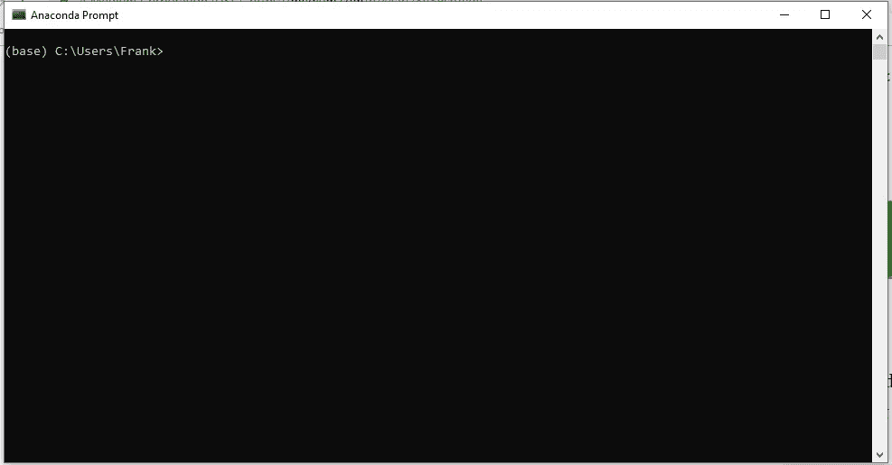
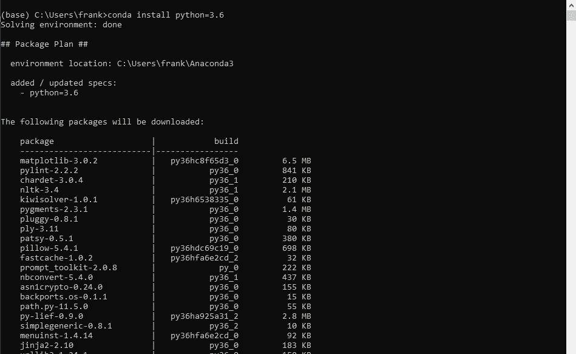
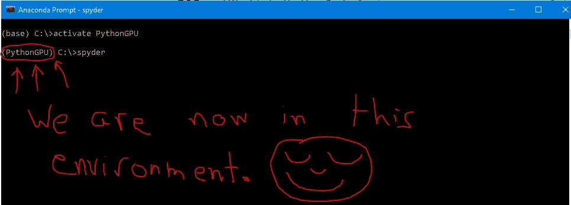
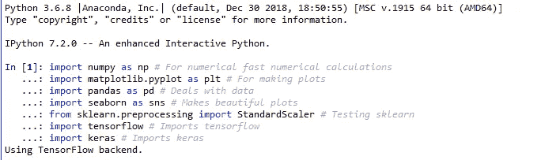

# 在 Windows 10 中安装基于 Python 的机器学习环境

> 原文：<https://towardsdatascience.com/installing-keras-tensorflow-using-anaconda-for-machine-learning-44ab28ff39cb?source=collection_archive---------0----------------------->

## 机器学习入门指南


Photo by [Ahmad Dirini](https://unsplash.com/@ahmadirini?utm_source=medium&utm_medium=referral) on [Unsplash](https://unsplash.com?utm_source=medium&utm_medium=referral)

**目的:**为机器学习安装一个基于 Python 的环境。

```
The following set of instructions were compiled from across the web and written for a Windows 10 OS. Last tested on 02/09/2019.
```


# 概观

当我第一次进入机器学习领域时，我花了几个小时来思考如何正确设置我的 Python 环境。出于沮丧，我决定写这篇文章来帮助任何经历这个过程的人。我们将从安装 Anaconda Navigator 开始，这将允许我们创建独立的环境，这将非常方便。此外，使用 Anaconda，我们可以用非常简单的命令轻松安装兼容的 Python 模块。最后，我们可以使用 Anaconda 获得 Spyder——一个科学的 Python 开发环境。如果您按照下面显示的步骤操作，您将很快安装好 Tensorflow、Keras 和 Scikit-learn。


# 得到蟒蛇

为了开始用 Python 构建您的机器学习(ML)模型，我们将从安装 Anaconda Navigator 开始。Anaconda 提供了一种在您的机器上安装 Python 模块的高效而简单的方法。所以让我们开始吧。

1.  [下载](https://www.anaconda.com/distribution/#download-section)并为你的操作系统安装最新版本的 Anaconda Navigator。



2.继续安装向导，但是跳过需要下载和安装 VS 的步骤，我们将在后面完成。此外，确保为单个用户安装 Anaconda Navigator 为所有用户安装 Anaconda 可能会导致问题。例如，您将无法安装任何模块，因为 Anaconda 没有必要的特权。



Make sure you install Anaconda to the current user else you might face problems down the road.


Skip this step. We will get it done in a bit.

3.启动 Anaconda Navigator 并选择 Home 选项卡，它应该是默认选中的。找到 VS 代码面板，点击安装按钮。这需要一两分钟。



After you install VS Code, you will be able to see a Launch button under the VS Code panel.


# 安装 Keras 和 Tensorflow

现在我们已经安装了 Anaconda，让我们在机器中安装 Keras 和 Tensorflow。

4.关闭 Anaconda Navigator 并启动 Anaconda 提示符。通过在 windows 搜索栏中搜索来启动 Anaconda 提示符。下面的终端应该打开。注意，这将在 **base** Anaconda 环境中打开。



5.将 Python 降级为[Keras](https://keras.io/)&[tensor flow](https://www.tensorflow.org/)兼容版本。Anaconda 将开始寻找 Python 3.6 的所有兼容模块。这可能需要几分钟时间。要降级到 Python 3.6，请使用以下命令:

`conda install python=3.6`



After the environment is resolved, Anaconda will show you all the packages that will be downloaded. Currently, Tensorflow offers compatiblity with Python 3.5–3.8.

6.创建一个新的 conda 环境，我们将在其中安装我们的模块，以使用 GPU 构建我们的模型。为此，请执行以下命令:

`conda create --name PythonGPU`

*注意:确保你有一个 NVIDIA 显卡。如果没有，安装 Keras 的 CPU 版本。*

如果您想使用您的 CPU，请执行以下命令:

`conda create --name PythonCPU`

按照终端上显示的说明进行操作。Conda 环境允许用户自由安装非常特殊的独立模块。我个人创造了两个环境。一个是我可以使用 CPU 构建我的模型，另一个是我可以使用 GPU 构建我的模型。关于康达环境的更多信息，我建议你看一下[官方文档](https://conda.io/docs/user-guide/tasks/manage-environments.html)。

7.要激活刚刚创建的 conda 环境，请使用:

`activate PythonGPU`或`activate PythonCPU`

要停用环境，请使用:

`conda deactivate`

不要停用环境，我们将安装所有好的东西。



8.要安装 Keras & Tensorflow GPU 版本，即使用我们的 GPU 创建模型所必需的模块，请执行以下命令:

`conda install -c anaconda keras-gpu`

如果您想使用您的 CPU 来构建模型，请改为执行以下命令:

`conda install -c anaconda keras`

许多计算机的东西将开始发生。一旦疯狂停止，我们可以继续前进。先不要关闭任何东西。


# 为机器学习/深度学习获取 Spyder 和其他 Python 包

现在，您可能需要一些软件来编写和执行您的 Python 脚本。您可以随时使用 [Vim](https://www.vim.org) 来编写和编辑您的 Python 脚本，并打开另一个终端来执行它们。然而，你将错过 Spyder 提供的所有酷功能。

9.安装 **Spyder。**

`conda install spyder`

10.安装**熊猫**。Pandas 是一个非常强大的库，允许您轻松地读取、操作和可视化数据。

`conda install -c anaconda pandas`

如果您想用 Pandas 读取 Excel 文件，请执行以下命令:

`conda install -c anaconda xlrd`

`conda install -c anaconda xlwt`

11.安装 **Seaborn** 库。Seaborn 是一个令人惊叹的库，可以让您轻松地可视化您的数据。

`conda install -c anaconda seaborn`

12.安装 scikit-learn。

`conda install -c anaconda scikit-learn`

13.安装枕头来处理图像

`conda install pillow`


# 添加缺少的模块

现在，您应该对使用 conda 命令安装模块感到满意了。如果你需要一个特定的模块，只需在谷歌上搜索如下内容:

`Anaconda LibraryNameYouWant Install`

如果你遇到任何问题，搜索网页。很可能你不是第一个遇到给定错误的人。


# 启动 Spyder 并检查所有模块是否安装正确

要启动 Spyder，首先激活您想要的 conda 环境(PythonCPU 或 PythonGPU)并执行以下命令:

`spyder`

为了确保一切安装正确，在 python 控制台上执行以下代码行:

```
import numpy as np # For numerical fast numerical calculations
import matplotlib.pyplot as plt # For making plots
import pandas as pd # Deals with data
import seaborn as sns # Makes beautiful plots
from sklearn.preprocessing import StandardScaler # Testing sklearn
import tensorflow # Imports tensorflow
import keras # Imports keras
```



如果您没有看到 ModuleImport 错误，您现在可以开始使用 Keras、Tensorflow 和 Scikit-Learn 构建基于机器学习的模型了。

你可以在 [LinkedIn](https://www.linkedin.com/in/frank-ceballos/) 找到我，或者访问我的[个人博客](https://www.frank-ceballos.com/)。

[](https://www.frank-ceballos.com/) [## 弗兰克·塞瓦洛斯

### 图表

www.frank-ceballos.com](https://www.frank-ceballos.com/)  [## Frank Ceballos -威斯康星医学院博士后| LinkedIn

### 我是威斯康星医学院的博士后研究员，在那里我分析高维复杂的临床数据…

www.linkedin.com](https://www.linkedin.com/in/frank-ceballos/)