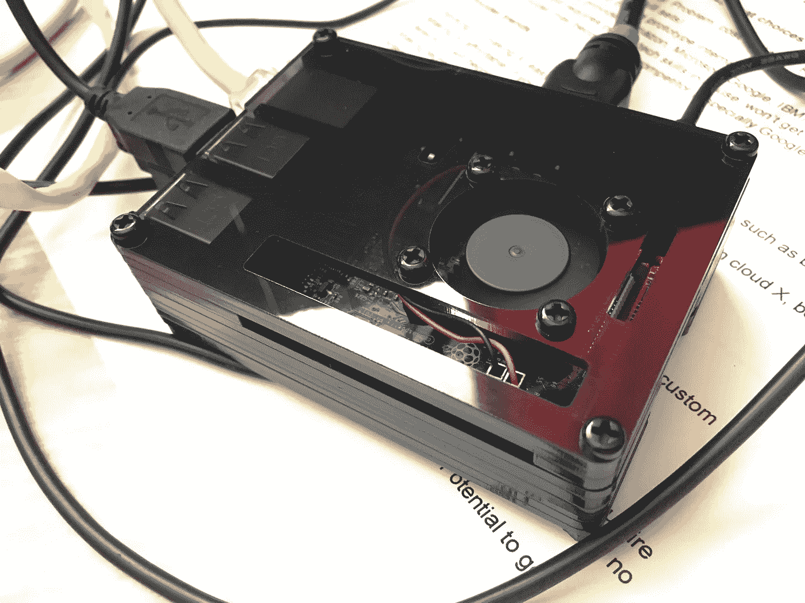

# 在树莓 Pi 3 B 上安装 OpenCV

> 原文：<https://towardsdatascience.com/installing-opencv-on-raspberry-pi-3-b-46ab17a9fc5a?source=collection_archive---------6----------------------->



我用的是 B 版本，在亚马逊购买，规格如下:

*   1.2GHz 64 位四核 ARMv8 CPU，1 GB 内存
*   802.11n 无线局域网，10/100Mbps 局域网速度
*   蓝牙 4.1，蓝牙低能耗
*   4 个 USB 端口、40 个 GPIO 引脚、全 HDMI 端口、组合 3.5 毫米音频插孔和复合视频
*   相机接口(CSI)、显示器接口(DSI)、Micro SD 卡插槽(现在是推拉式而不是推推式)、VideoCore IV 3D 图形核心

现在有一个[的更新版本](https://amzn.to/2HAhHVt)(“b+”)，它应该以同样的方式工作，但一些步骤(如编译 OpenCV，在我的设备上花了近 2 个小时)应该更快。

此外，正如所料，编译 OpenCV 使无风扇 CPU 过热 30 分钟——所以我不得不在它旁边放置一个强大的风扇，直到我收到一个有适当冷却的案例。

第一步:确保你有最新版本的操作系统

当前 OS 版本为[Raspbian Stretch](https://www.raspberrypi.org/downloads/raspbian/)(2018 年 4 月)。您可以从 SD 进行全新安装(遵循此处[列出的说明](https://www.raspberrypi.org/documentation/installation/installing-images/README.md))，或者升级您现有的版本。

要升级，请在您最喜欢的编辑器中打开(以 sudo 身份)文件 */etc/apt/sources.list* 和*/etc/apt/sources . list . d/raspi . list*，并将当前发行版名称(如“jessie”)的所有出现处更改为“stretch”。然后，打开终端并运行更新:

```
sudo apt-get update 
sudo apt-get -y dist-upgrade
```

**步骤 2:配置 SSH 和实用程序**

确保 SSH 已启用。也更改默认密码！

我在 Linux 上最喜欢的一些实用程序是 *screen* (如果你的终端会话丢失，保持进程运行)和 *htop* (性能监控)——这些可能已经预装了:

```
sudo apt-get install screen 
sudo apt-get install htop
```

**第三步:放弃 Wolfram 和 Libreoffice，释放 1GB+**

您的计算机视觉系统不太可能需要这两个软件包，因此:

```
sudo apt-get purge wolfram-engine 
sudo apt-get purge libreoffice* 
sudo apt-get clean sudo apt-get autoremove
```

**第四步:安装依赖关系**

```
sudo apt-get install build-essential cmake pkg-config sudo apt-get install libjpeg-dev libtiff5-dev libjasper-dev libpng12-dev sudo apt-get install libavcodec-dev libavformat-dev libswscale-dev libv4l-dev sudo apt-get install libxvidcore-dev libx264-dev sudo apt-get install libgtk2.0-dev libgtk-3-dev sudo apt-get install libatlas-base-dev gfortran
```

**第五步:安装 Python 2.7 & 3**

为了在 Open CV 中启用 Python [绑定](https://docs.opencv.org/3.2.0/da/d49/tutorial_py_bindings_basics.html)，我们需要这样做:

> *在 OpenCV 中，所有算法都是用 C++实现的。但是这些算法可以在不同的语言中使用，如 Python、Java 等。这是由绑定生成器实现的。这些生成器在 C++和 Python 之间架起了一座桥梁，使用户能够从 Python 中调用 C++函数。要全面了解后台发生的事情，需要对 Python/C API 有很好的了解。关于将 C++函数扩展到 Python 的一个简单例子可以在官方 Python 文档中找到[1]。因此，通过手动编写包装函数将 OpenCV 中的所有函数扩展到 Python 是一项耗时的任务。所以 OpenCV 以一种更智能的方式来做这件事。OpenCV 使用位于 modules/python/src2* 中的一些 Python 脚本从 C++头文件自动生成这些包装函数

```
sudo apt-get install python2.7-dev 
sudo apt-get install python3-dev
```

**第六步:获取最新的 OpenCV 源代码**

我使用的是 OpenCV 的 3.4.1 版本。你可以查看官方网站(或者 Github)的[版本](https://opencv.org/releases.html)部分，看看当前的版本是什么。如果您想要的版本不同，请相应地更新下面的命令和路径。

下载并解压 OpenCV 3.4.1 及其实验模块(存储在 [opencv_contrib](https://github.com/opencv/opencv_contrib) 库):

```
wget -O opencv.zip [https://github.com/opencv/opencv/archive/3.4.1.zip](https://github.com/opencv/opencv/archive/3.4.1.zip) wget -O opencv_contrib.zip [https://github.com/opencv/opencv_contrib/archive/3.4.1.zip](https://github.com/opencv/opencv_contrib/archive/3.4.1.zip) unzip opencv.zip unzip opencv_contrib.zip
```

**第七步:安装 pip 和 virtualenv**

这些是[管理 Python 包](https://packaging.python.org/guides/installing-using-pip-and-virtualenv/)的最底层工具。

首先获取 pip:

```
wget -O get-pip.py [https://bootstrap.pypa.io/get-pip.py](https://bootstrap.pypa.io/get-pip.py) 
sudo python get-pip.py 
sudo python3 get-pip.py
```

来源:[https://pip.pypa.io/en/stable/installing/](https://pip.pypa.io/en/stable/installing/)

然后，安装虚拟环境:

```
sudo pip install virtualenv virtualenvwrapper
```

修改你的 *~/。配置文件*包括以下行:

*导出 WORKONHOME=$HOME/。virtualenvs 导出 VIRTUALENVWRAPPERPYTHON =/usr/bin/python 3*

*source/usr/local/bin/virtualenvwrapper . sh*

这是我的文件的样子:

```
# ~/.profile: executed by the command interpreter for login shells. # This file is not read by bash(1), if ~/.bash_profile or ~/.bash_login # exists. 
# see /usr/share/doc/bash/examples/startup-files for examples. 
# the files are located in the bash-doc package. # the default umask is set in /etc/profile; for setting the umask 
# for ssh logins, install and configure the libpam-umask package. #umask 022 # if running bash 
if [ -n "$BASH_VERSION" ]; then 
    # include .bashrc if it exists 
    if [ -f "$HOME/.bashrc" ]; then 
        . "$HOME/.bashrc" 
    fi 
fi # set PATH so it includes user's private bin if it exists 
if [ -d "$HOME/bin" ] ; then 
     PATH="$HOME/bin:$PATH" 
fi # virtualenv and virtualenvwrapper settings 
export WORKON_HOME=$HOME/.virtualenvs export VIRTUALENVWRAPPER_PYTHON=/usr/bin/python3 source /usr/local/bin/virtualenvwrapper.sh
```

…激活更改:

```
source ~/.profile
```

第八步:创建一个虚拟环境

```
mkvirtualenv cv -p python3
```

…或者，如果您想使用 Python 2.7 而不是 Python 3:

```
mkvirtualenv cv -p python2
```

以下是使用 virtualenvwarapper 的基本命令:

```
mkvirtualenv virtualenv_name # create virtualenv workon virtualenv_name # activate/switch to a virtualenv deactivate virtualenv_name # deactivate virtualenv
```

在我们的例子中，我们可以激活一个名为“cv”的 virtualenv:

```
pi@raspberrypi:~ $ workon cv 
(cv) pi@raspberrypi:~ $
```

**第九步:安装 Numpy，Scipy**

现在您已经进入了虚拟环境(如终端窗口中的“(cv)”前缀所示)，让我们安装一些用于数据分析的附加包— [*numpy*](http://www.numpy.org//) 和 [*scipy*](https://www.scipy.org/) :

```
sudo pip install numpy scipy
```

**第十步:最后，安装 OpenCV**

*注意:这将需要很长、很长、很长的时间。在我的设备上花了将近 2 个小时。此外，如果没有适当的冷却，您的覆盆子酱会过热。*

同样，我使用的是 OpenCV 的 3.4.1 版本。如果不是，请相应地更新您的路径:

```
cd ~/opencv-3.4.1/ mkdir build cd build cmake -D CMAKE_BUILD_TYPE=RELEASE \ -D CMAKE_INSTALL_PREFIX=/usr/local \ -D INSTALL_PYTHON_EXAMPLES=ON \ -D OPENCV_EXTRA_MODULES_PATH=~/opencv_contrib-3.4.1/modules \ -D BUILD_EXAMPLES=ON ..
```

请确保 cmake 完成时没有错误。

现在，给自己拿杯啤酒，准备最后一步——编译。为了加快速度，暂时增加您的 */etc/dphys-swapfile* 中的交换文件大小，将 CONF _ 交换大小从 100 改为 1024:

```
# set size to absolute value, leaving empty (default) then uses computed value 
# you most likely don't want this, unless you have an special disk situation 
#CONF_SWAPSIZE=100 
CONF_SWAPSIZE=1024
```

要避免重新启动以使这些更改生效，只需重新启动交换服务:

```
sudo /etc/init.d/dphys-swapfile restart
```

这里有一个关于如何用包编译 OpenCV 的详细指南:

[https://github.com/opencv/opencv_contrib](https://github.com/opencv/opencv_contrib)

我所做的(使用所有 4 个 CPU 内核):

```
make -j4
```

OpenCV 编译成功后，继续安装:

```
sudo make install 
sudo ldconfig 
sudo apt-get update
```

…然后重新启动系统，您就可以开始了！

还有一件事:

测试安装:

```
$ python3 
Python 3.5.3 (default, Jan 19 2017, 14:11:04) [GCC 6.3.0 20170124] on linux Type "help", "copyright", "credits" or "license" for more information. 
>>> import cv2 
>>> cv2.__version__ '3.4.1' 
>>>
```

如果出现错误(ImportError:没有名为“cv2”的模块)，则库的命名可能不正确:

```
(cv) pi@raspberrypi:$ ls -l /usr/local/lib/python3.5/site-packages/ total 4500 -rw-r--r-- 1 root staff 4604912 Apr 27 14:41 cv2.cpython-35m-arm-linux-gnueabihf.so
```

通过将库文件重命名为“cv2.so”来修复它:

```
cd /usr/local/lib/python3.5/site-packages/ sudo mv cv2.cpython-35m-arm-linux-gnueabihf.so cv2.so
```

*原载于 2018 年 4 月 27 日*[*www.alatortsev.com*](https://www.alatortsev.com/2018/04/27/installing-opencv-on-raspberry-pi-3-b/)*。*