# 实例嵌入:没有建议的分段

> 原文：<https://towardsdatascience.com/instance-embedding-instance-segmentation-without-proposals-31946a7c53e1?source=collection_archive---------3----------------------->

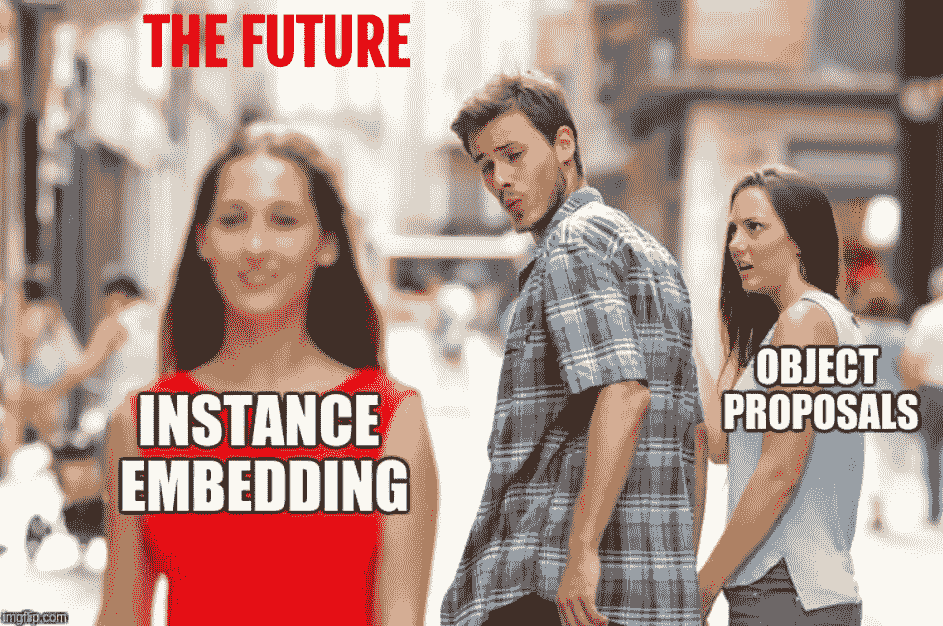

在这篇文章中，我将回顾实例分割领域的 3 篇论文。它们不同于主流的基于提议的基于 fast-RCNN 的方法，如 [Mask-RCNN](https://arxiv.org/abs/1703.06870) 或 [MaskLab](https://arxiv.org/abs/1712.04837) 和最新的 [PANet](https://arxiv.org/abs/1803.01534) ，在多个数据集上实现了最先进的结果( [CityScapes](https://www.cityscapes-dataset.com/) 、 [COCO](http://cocodataset.org/) 、 [MVD](https://www.mapillary.com/dataset/vistas) )。参见此处的 Mask-RCNN [教程。](http://kaiminghe.com/iccv17tutorial/maskrcnn_iccv2017_tutorial_kaiminghe.pdf)

在基于提议的实例分段架构中有三个基本缺陷。首先，两个对象可能共享同一个边界框，或者非常相似的框。在这种情况下，遮罩头部无法判断要在盒子中选取哪个对象。对于其边界框中填充率较低的线状对象(如自行车和椅子)，这是一个严重的问题。其次，架构中没有任何东西阻止两个实例共享一个像素。第三，实例的数量受限于网络处理的提案数量(通常为数百)。

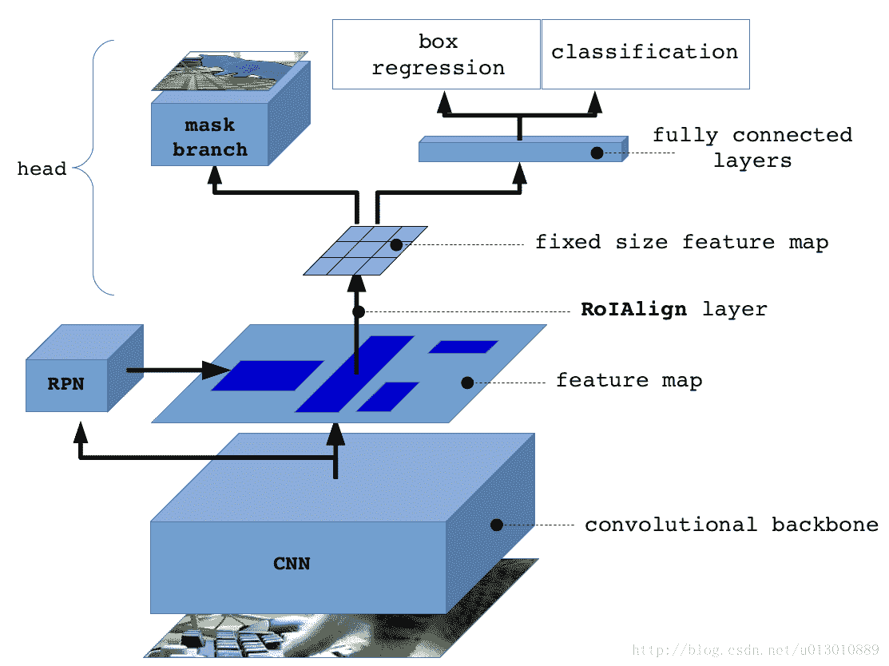

architecture for Mask-RCNN, [https://www.slideshare.net/IldooKim/deep-object-detectors-1-20166](https://www.slideshare.net/IldooKim/deep-object-detectors-1-20166)

此外，该架构非常复杂，很难调整和“调试”。在目标检测中，这个问题的前兆，已经成功地使用了更简单的单级架构，例如 [RetinaNet](https://arxiv.org/abs/1708.02002) 。

使用实例嵌入，每个对象都被分配一个 n 维空间中的“颜色”。网络处理图像并产生与输入图像相同大小的密集输出。网络输出中的每个像素是嵌入空间中的一个点。属于同一对象的像素在嵌入空间中是靠近的，而属于不同对象的像素在嵌入空间中是远离的。解析图像嵌入空间涉及某种聚类算法。

# 论文 1:具有区别损失函数的语义实例分割

[伯特·德·布拉班德雷](https://arxiv.org/find/cs/1/au:+Brabandere_B/0/1/0/all/0/1)，[戴维·内文](https://arxiv.org/find/cs/1/au:+Neven_D/0/1/0/all/0/1)，[吕克·范古尔](https://arxiv.org/find/cs/1/au:+Gool_L/0/1/0/all/0/1)[https://arxiv.org/abs/1708.02551](https://arxiv.org/abs/1708.02551)
https://github.com/DavyNeven/fastSceneUnderstanding

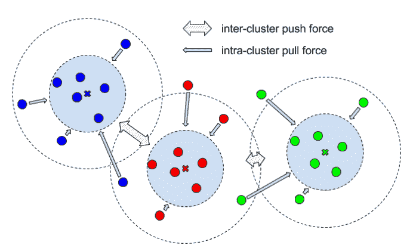

visualizing the contrastive loss.

**损失。**本文使用由三部分组成的对比损失函数:

(1)拉力。惩罚相同实例的所有元素与其平均值的距离。也就是说，获取一个实例的所有像素并计算它们的平均值。拉力会将同一实例的所有像素嵌入吸引到同一点。简而言之，减少每个实例嵌入的差异。

(2)一个推力。取所有的中心点(在嵌入空间中，而不是空间中心)并将它们推得更远。

(3)正规化。中心不应该离原点太远。

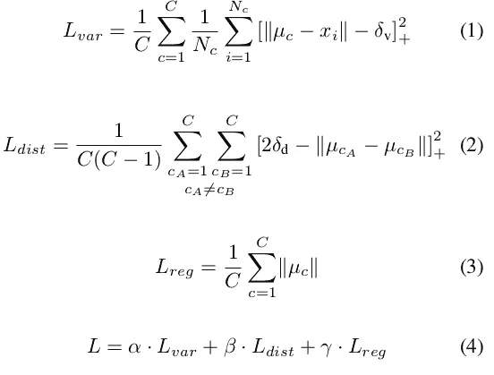

α和β的值为 1，γ设置为 0.001。两个增量都是拉力和推力的阈值。

**解析**。在获得语义分割图(汽车、狗、计算机……)之后，我们将每个类别掩码细分为实例。这是通过在语义掩码中选取一个随机未分配的点，并迭代应用均值漂移算法来找到实例的均值点来实现的。

均值的第一个假设是最初选取的随机像素的嵌入。然后，围绕该点(在嵌入空间中)扩展一组点，然后再次计算它们的平均值，并且重复该过程，直到平均值的变化不显著。根据我的经验，算法收敛不超过 10 次迭代。大多数时候 3-4 次迭代就足够了。

用于在嵌入空间中扩展实例遮罩的半径与拉取阈值相同。理论上，如果测试误差为 0，并且中心之间的最小距离至少是方差分量的拉阈值的两倍，则我们可以使用这些阈值来解析图像。距离不大于拉动阈值的所有点应属于同一个实例。因为测试误差几乎从不为 0，所以使用均值漂移算法来寻找嵌入的高密度部分的中心。

a nice visualization of this tracking process in a two dimensional embedding space where the mode of the set, the peak of the density, is finally found.

**错误来源**

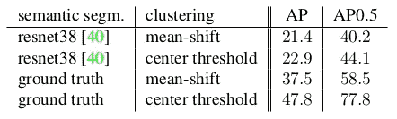

这些结果显示了 Cityscapes 数据集上大多数错误的来源。如果语义分段没有被断定，而是使用了基础事实，则 AP50 结果从 40.2 跳到 58.5。如果也使用实际的中心，而不是使用均值漂移来估计，则得分几乎增加了 20 分，达到 77.8 分。使用[面板](https://arxiv.org/abs/1803.01534)(参见[仪表板](https://www.cityscapes-dataset.com/benchmarks/.))在 COCO 上不进行预训练的当前技术水平结果是 57.1。与使用语义分段基本原理相同。我们了解到嵌入本身可能非常好。

# 嵌入示例

下面是一个由一个训练有素的网络嵌入生成的实例。它用于解决目前正在 Kaggle 上运行的[数据科学碗 2018](https://www.kaggle.com/c/data-science-bowl-2018) 提出的问题。目的是在医学图像中找到细胞核。

左上角的图像是原始图像。中上部图像是语义分割(这里只有两类，背景和前景)。其余的图像是 64 个嵌入空间的前 7 个通道。从嵌入可以明显看出，网络学习了在空间上区分细胞核的通道。对角线或水平编码的例子。一些编码从图像中心的距离。但是，在实例内部，颜色是同质的。这让我们对网络如何学习分割实例有了一些了解。

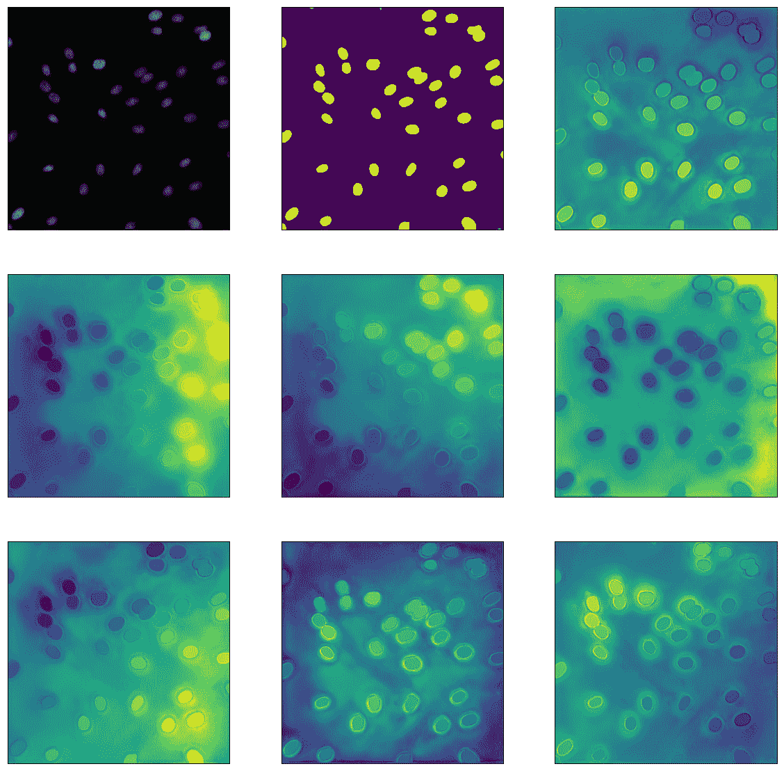

# 论文 2:通过深度度量学习的语义实例分割

[阿里雷扎·法蒂](https://arxiv.org/find/cs/1/au:+Fathi_A/0/1/0/all/0/1)，[兹比格涅夫·沃伊纳](https://arxiv.org/find/cs/1/au:+Wojna_Z/0/1/0/all/0/1)，[维韦克·拉特霍德](https://arxiv.org/find/cs/1/au:+Rathod_V/0/1/0/all/0/1)，[王鹏](https://arxiv.org/find/cs/1/au:+Wang_P/0/1/0/all/0/1)，[玄武铉](https://arxiv.org/find/cs/1/au:+Song_H/0/1/0/all/0/1)，[塞尔吉奥·瓜达拉马](https://arxiv.org/find/cs/1/au:+Guadarrama_S/0/1/0/all/0/1)，[凯文·p·墨菲](https://arxiv.org/find/cs/1/au:+Murphy_K/0/1/0/all/0/1)
【https://arxiv.org/abs/1703.10277

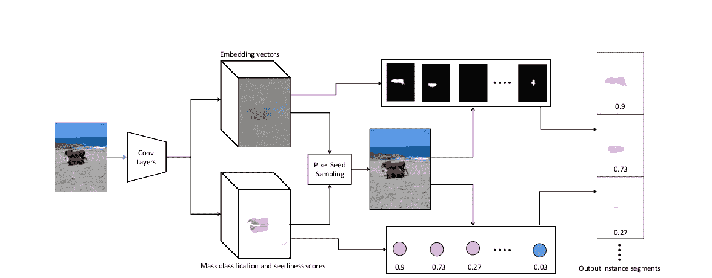

Network architecture proposed in Semantic Instance Segmentation via Deep Metric Learning

本文的主要贡献是为每个像素学习种子分数。分数告诉我们该像素是否是扩展遮罩的良好候选。在之前的论文中，种子是随机选择的，然后使用均值漂移算法来细化中心。这里只做了一次扩展。

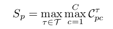

seedeness score per pixel. taken as the maximum over all classes and bandwidths.

该论文提出为每个像素学习几个可能种子。我们为每个半径(在嵌入空间中)和类学习一个种子。因此，如果我们有 C 类，我们学习 T 带宽(半径),我们有 CxT 种子“建议”每像素。对于每个像素，只考虑得分最高的建议。

**嵌入损失。**本文对像素对的嵌入进行惩罚。我们考虑具有相同实例的对和来自不同实例的对。

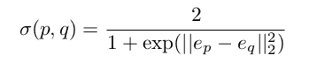

a logistic distance function in embedding space

本文使用一种改进的逻辑函数，将嵌入空间中的欧氏距离变换到[0，1]域。嵌入空间中接近的对将被函数赋予接近 1 的值，而距离远的对将接近 0。

自然地，logloss 被用作损失函数。实例大小可能会有所不同，因此，为了减轻这种不平衡问题，根据实例的大小对它们进行加权。

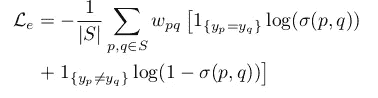

logloss over logistic distance between pairs of pixels

**落英。**对于每个像素，模型学习几个种子性分数。带宽(嵌入空间的半径)和类别的每个组合得一分。由于种子分数接近但不同于语义分割，因此每次评估嵌入时都要确定每一个的基础事实。围绕像素的嵌入扩展掩码，并且如果具有基本事实实例的 IoU 超过某个阈值，则该像素被认为是该实例的类的种子。这个损失将会惩罚这个职业的低种子分数。

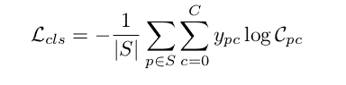

seediness loss

每批图像中只有 10 个左右的种子被评估，随机挑选。学习几个这样的模型，一个用于一个带宽。带宽越宽，物体越大。在某种程度上，获得最高分数的带宽是模型传达其对实例大小的估计的方式(相对于嵌入空间中的距离)。

**训练程序。**本文使用在 COCO 数据集上预处理的 ResNet-101 主干。训练从没有分类/种子预测开始，即λ=0，并且随着嵌入更加稳定而进展到 0.2。

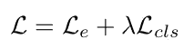

以不同的比例(0.25，0.5，1，2)评估主链，并将连接的结果输入种子和包埋头。

**解析**。这个过程非常简单，因为种子学会了。提出了一种为图像选择最佳种子集的方法。它一方面优化了高种子分数，另一方面优化了嵌入空间的多样性。

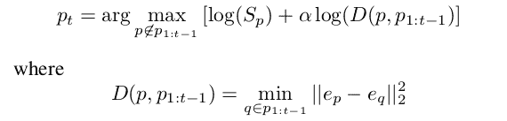

迭代地选择种子，每个新的种子被选择为在嵌入空间中远离先前选择的种子。选择的第一个种子是图像中种子性得分最高的像素。第二个将是一方面具有高种子性分数，另一方面在嵌入空间中不接近的种子。使用参数α来控制这两个要求之间的平衡。α是一个需要调整的参数，该参数的测试范围在 0.1 到 0.6 之间。与 NMS 不同，嵌入空间的多样性受到鼓励，而不是空间多样性。

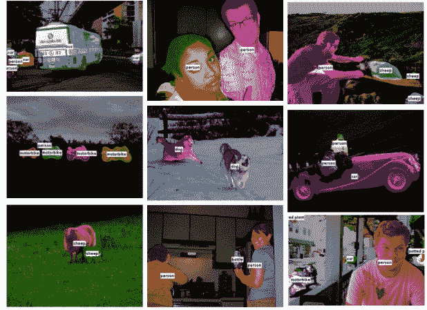

some results from Semantic Instance Segmentation via Deep Metric Learning

# 论文 3:用于实例分组的递归像素嵌入

[舒孔](https://arxiv.org/find/cs/1/au:+Kong_S/0/1/0/all/0/1)，[查尔斯·福尔克斯](https://arxiv.org/find/cs/1/au:+Fowlkes_C/0/1/0/all/0/1)
https://arxiv.org/abs/1712.08273
[https://github . com/aimerykong/Recurrent-Pixel-Embedding-for-Instance-Grouping](https://github.com/aimerykong/Recurrent-Pixel-Embedding-for-Instance-Grouping)

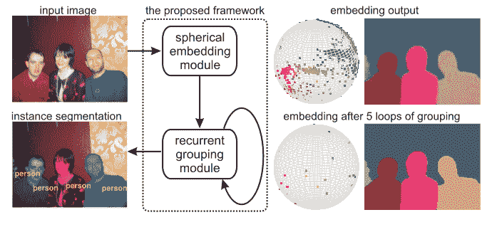

本文提出在 n-球面上进行嵌入，并使用余弦距离来测量像素的邻近性。然而，本文的主要贡献是基于高斯模糊均值漂移(GBMS)算法的改进版本的递归分组模型。

GBMS 是一种迭代算法，类似于第一篇论文中用于查找实例中心的简单均值漂移算法。在这个版本中，所有的像素都被认为是潜在的种子。所有像素在每次迭代时都相对于它们周围的密度进行更新。朝着一个“重心”移动，好像图像的嵌入空间是一个产生行星的星云。点与点之间的距离越远，它们之间的相互影响就越小。从下面的算法可以清楚地看出，距离是由高斯的带宽控制的，这是它的标准偏差。

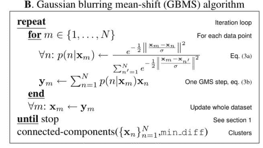

对于 GBMS 来说，有三次收敛保证，所以在应用几次变换后，我们最终应该得到非常密集的，几乎像点一样的簇。想了解更多关于 GBMS 的信息，请看这里。

为了将该算法结合到网络中，已经使用矩阵上的运算来表示该算法。

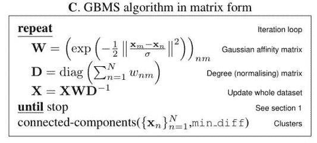

简单地应用上述算法是没有意义的，因为嵌入是在球体上，并且它们的接近度是使用余弦变换来测量的。描述所有点之间距离的相似性矩阵使用以下变换来计算:

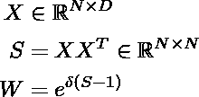

测量球体上的距离，而不是使用 L2 规范。此外，在应用 GBMS 步骤后，需要对生成的嵌入进行归一化，以便它们位于单位球面上。

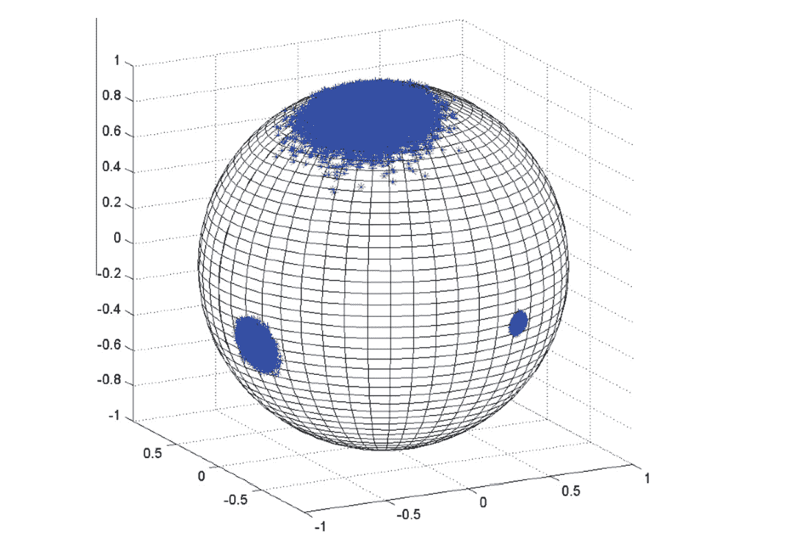

**训练。**使用成对像素损失，类似于之前的论文，对不同对所需的距离设置阈值(alpha)。使用范围为[0，1]而不是[-1，-1]的校准余弦距离来评估每一对。

calibrated cosine distance

损失通过递归分组模型的每个应用反向传播。应用的后期阶段只会出现非常困难的情况。例如，作者将这一特性与在 fast-RCNN 训练中使用的硬负挖掘进行了比较。

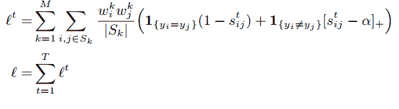

loss used in Recurrent Pixel Embedding for Instance Grouping

作者在论文中使用 0.5 作为α值。请注意，实例的大小用于重新平衡大小实例之间的损失。

**解析。**在分组模块的几次应用之后，簇应该非常密集，随机选取值应该产生足够好的种子。

出于实际目的，在 GBMS 步骤中仅使用一些像素是有意义的，因为计算相似性矩阵可能被证明是极其昂贵的。所取的像素数量是速度/精度的折衷考虑。

# 其他方法

实例嵌入不是基于建议的网络的唯一替代方案。以下是一些使用其他方法解决实例分割问题的论文

*   【https://arxiv.org/abs/1605.09410】端到端实例分割与递归关注

*   **深分水岭变换为例分割**
    [https://arxiv.org/abs/1611.08303](https://arxiv.org/abs/1611.08303)
*   **关联嵌入:用于联合检测和分组的端到端学习**
    [http://ttic . uchicago . edu/~ mmaire/papers/pdf/affinity _ CNN _ cvpr 2016 . pdf](http://ttic.uchicago.edu/~mmaire/papers/pdf/affinity_cnn_cvpr2016.pdf)
*   **序贯分组网络实例分割**
    [https://www . cs . Toronto . edu/~ urta sun/publications/Liu _ et al _ iccv 17 . pdf](https://www.cs.toronto.edu/~urtasun/publications/liu_etal_iccv17.pdf)

# 摘要

与基于建议书的解决方案相比，这些论文的结果没有竞争力。我们已经回顾了 3 篇论文，它们对丢失和解析提出了不同的解决方法。

(1) **使用区别损失函数的语义实例分割**
使用了非成对损失函数。使用图像中的所有像素产生丰富得多的渐变。

(2) **通过深度度量学习的语义实例分割**
引入了种子模型，帮助我们分类并同时挑选最佳种子，优化速度。

(3) **循环像素嵌入例如分组**
GBMS，均值偏移的一种变体，在训练和解析中被用于网络内部。产生非常密集的集群。

这些方法可能被结合和改进以产生更好的结果。它们比基于提议的方法更简单，可能更快，同时避免了本文介绍中提到的基本缺陷。

**联系人:**me@barvinograd.com

**幻灯片:**https://goo.gl/iTC9aS

results from “Semantic Instance Segmentation with a Discriminative Loss Function” on the CityScapes dataset