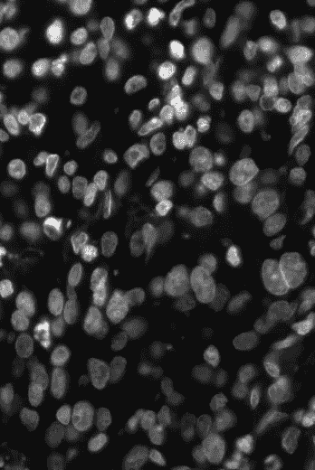
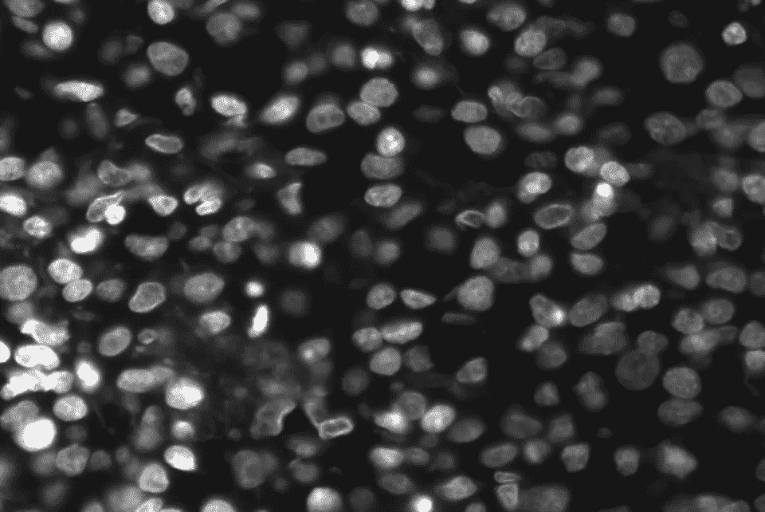
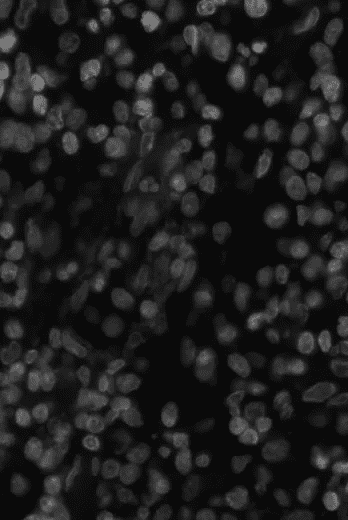
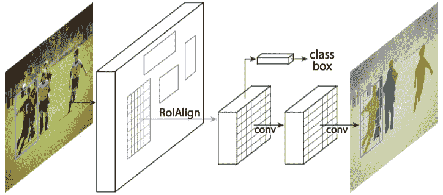
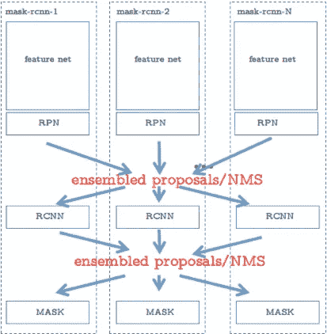
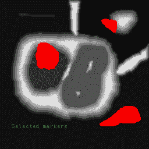
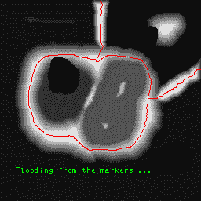
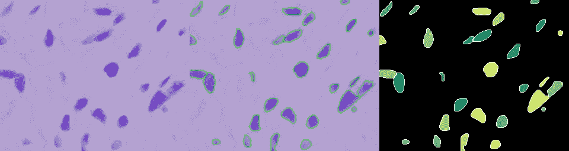
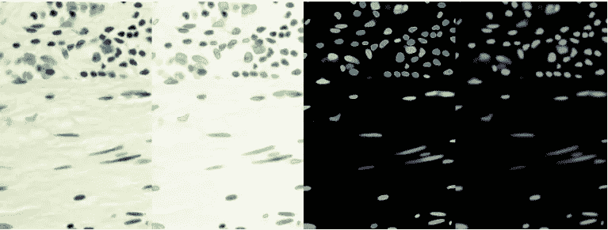
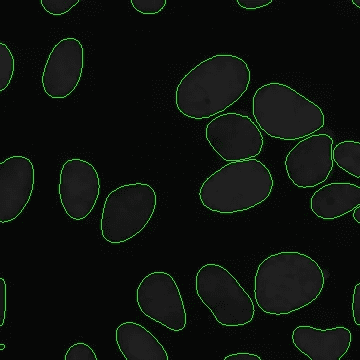

# 实例分割:自动细胞核检测。

> 原文：<https://towardsdatascience.com/instance-segmentation-automatic-nucleus-detection-a169b3a99477?source=collection_archive---------5----------------------->

**实例分割**成为医学图像处理的热门话题并非偶然。

识别细胞核是大多数分析的起点，因为人体的 30 万亿个细胞中，大多数都含有一个充满 DNA 的细胞核，DNA 是为每个细胞编程的遗传密码。识别细胞核使研究人员能够识别样本中的每个细胞，通过测量细胞对各种处理的反应，研究人员可以了解潜在的生物过程。

每年的[数据科学杯](https://www.kaggle.com/c/data-science-bowl-2018)比赛都会提出有趣的挑战，以获得洞察力、现有解决方案的增强和对问题的新观点，从而对医学发展产生前所未有的影响。
今年[数据科学杯](https://www.kaggle.com/c/data-science-bowl-2018)的任务是创建一个模型，可以识别各种条件下的一系列原子核。换句话说，这是一个实例分割任务，以检测不同类型的扫描细胞核。班级数量— 1。主持人提供了地面真相图片和面具。所有关于数据和指标的信息都可以在竞赛页面上找到。

下面我想简要描述两种最流行的解决这类竞争的策略和一些准确性增强实验。

# 屏蔽 RCNN

想到**实例分割首先想到的是**，当然是 Mask RCNN。

因此，一个基本的方法是使用掩模 RCNN 框架进行对象实例分割，它开箱即用，效果很好。之所以做出这样的选择，是因为模型给出了相当不错的现成结果，而且两阶段 RCNN 比一阶段解决方案更好。RCNN 有助于过滤 RPN 的错误结果。

但是，当然“相当好”并不是我们竞争所需要的，并且很难实现模型的进一步增强。

尽管如此，还是做了一些实验和修改来提高模型的准确性

*   对模型进行大量的扩充
*   不同类型的内部模型集合，例如具有不同尺寸参数的不同掩模头，以处理重叠情况，或者具有多个区域建议网络和多个 RCNN 的多个掩模头
*   当然**适当的**外部数据
*   不同的主干网 ResNet-50、SEResnext-50、ResNet-101
*   TTA 扩增
*   具有进一步 NMS 系综的基于 IOU 的聚类结果
*   使用后处理改进掩模边界
*   伪标记
*   在后处理阶段扩张然后腐蚀掩膜

一些合奏技巧看起来像

其中来自不同阶段的结果可以用 **NMS** 和联合集来集合。

改进:

*   resnet 152 主干，用于提高精确度和处理复杂图像
*   显著更多的增强来提高泛化能力

# 带分水岭后处理的 UNet

另一种解决问题的方法是使用带有 ResNet 编码器的编码器-解码器 Unet 风格架构。模型的掩模检测超过了 MaskRcnn 检测部分的结果。剩下未解决的问题是分离粘在一起的细胞核。

第一个想法是使用形态学后处理(基于标记的分水岭)来分离掩模。

在这里可以找到一个很好的分水岭工作原理的解释——[分水岭变换](http://cmm.ensmp.fr/~beucher/wtshed.html)。

基本上，它看起来像:

1.  预测两个通道，一个是二元掩模，另一个是原子核的质心。
2.  使用预测质心作为分水岭函数中的标记。

另一个想法是通过预测从最近的边界像素指向的中间单位矢量场，使用[深分水岭变换](https://arxiv.org/pdf/1611.08303.pdf)来预测分水岭能量水平(被不同偏移侵蚀的掩模)。能级图与像素和最近边界之间的距离有关。它可以通过使用相同的 Unet 模型来完成，而不需要训练新的模型，只需在多个通道中输入。

可以用来改进 pipeline 的改进与 Mask Rcnn 的相同。至于后处理-腐蚀操作分离掩模是有益的。还使用了来自多个检查站和 TTA 的集合结果。更深的编码器和更大数量的增强。

结果:

# **最终想法**

Mask Rcnn 是最适合此类问题的模型，并且易于使用。整个比赛表明，Unet 风格的建筑更轻，更灵活，最重要的是，它显示了核心探测任务的艺术成果。

## **链接**

*   第一名解-[https://www . ka ggle . com/c/data-science-bowl-2018/discussion/54741](https://www.kaggle.com/c/data-science-bowl-2018/discussion/54741)
*   比赛页面-[https://www.kaggle.com/c/data-science-bowl-2018](https://www.kaggle.com/c/data-science-bowl-2018)
*   竞赛中的文档化 DWT 解决方案和许多其他有用信息-[https://spark-in.me/post/playing-with-dwt-and-ds-bowl-2018](https://spark-in.me/post/playing-with-dwt-and-ds-bowl-2018)
*   https://github.com/matterport/Mask_RCNN
*   马斯克 cnn 论文-[https://arxiv.org/abs/1703.06870](https://arxiv.org/abs/1703.06870)
*   TernausNet - Unet 用于实例分割【https://github.com/ternaus/TernausNet T2
*   Unet 论文-【https://arxiv.org/abs/1505.04597 
*   分水岭变换-[http://cmm.ensmp.fr/~beucher/wtshed.html](http://cmm.ensmp.fr/~beucher/wtshed.html)
*   深分水岭变换-[https://arxiv.org/pdf/1611.08303.pdf](https://arxiv.org/pdf/1611.08303.pdf)
*   用于图像识别的深度残差学习-[https://arxiv.org/pdf/1512.03385.pdf](https://arxiv.org/pdf/1512.03385.pdf)