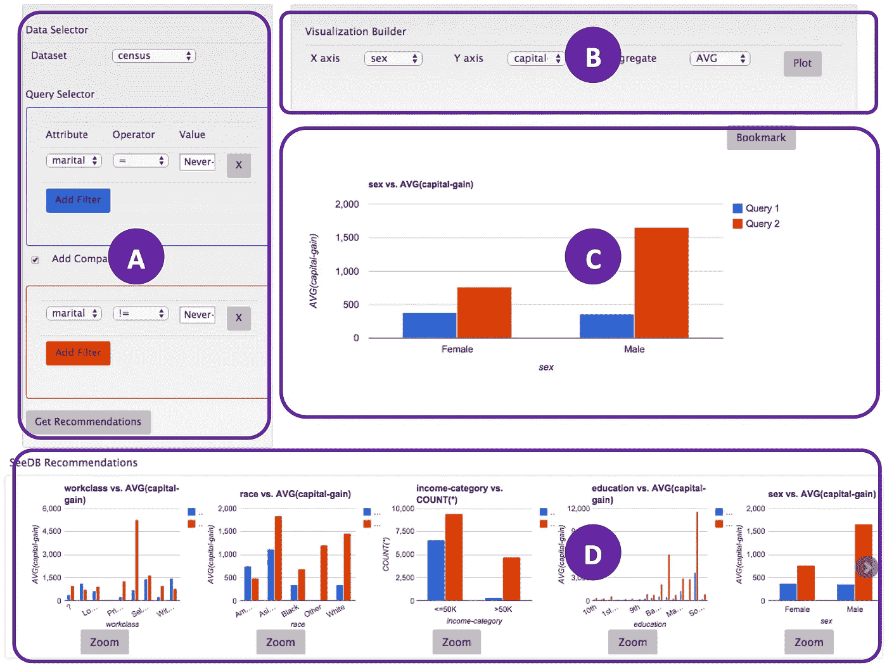
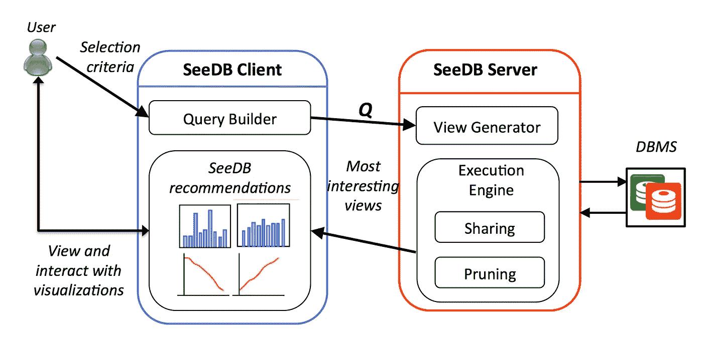

# 即时可视化什么是不同的

> 原文：<https://towardsdatascience.com/instantly-visualizing-whats-different-c842ccf44056?source=collection_archive---------8----------------------->

*这是一篇关于我们期待已久的 VLDB 2016* [*论文*](http://www.vldb.org/pvldb/vol8/p2182-vartak.pdf) *的简短博文，标题为“SeeDB:支持可视化分析的高效数据驱动可视化建议”，这是我们 SeeDB 系统上继 2013* [*愿景论文*](http://dl.acm.org/citation.cfm?id=2732250) *和 2014* [*演示论文*](http://dl.acm.org/citation.cfm?id=2733035) *之后的巅峰之作。合著者:* [*玛纳斯·瓦尔塔克*](http://people.csail.mit.edu/mvartak/) *，这位首席博士生完成了大部分工作。论文上的合著者包括绝世的* [*山姆·马登*](http://db.csail.mit.edu/madden/) *和才华横溢的* [*阿尔基斯·多佐蒂斯*](https://users.soe.ucsc.edu/~alkis/) *。*

A Tired Data Scientist

数据可视化通常是数据科学家探索新数据集的第一道“攻击线”。作为他们探索的一部分，数据科学家一个接一个地重复生成可视化，并检查每一个，以找到那些显示有趣或不寻常行为的可视化。根据数据集有多少属性，这种 ***基于试错的探索可能需要很长时间*** 。

> 示例时间！假设一名数据科学家对研究“悬浮滑板”产品感兴趣，该产品最近表现不佳。他们想将悬浮滑板与一直热销的产品“融合先生”相提并论。那么他们会怎么做呢？嗯，他们会生成一些可视化效果，并检查这些可视化效果对于悬浮滑板和 Fusion 先生是否不同。这样的可视化之一可能是各州的销售分布——也许悬浮滑板的分布与 Fusion 先生非常不同。另一个可视化可能是广告随着时间的推移——可能悬浮滑板的广告保持不变，而 Fusion 先生的广告随着时间的推移而增加。这两个都是“有趣”的可视化，突出了两个数据子集之间的差异——悬浮滑板数据和 Mr 融合数据。

# 目标和挑战

SeeDB 的目标是 ***自动搜索有趣的可视化*** 。我们现在描述用户使用 SeeDB 浏览数据集的体验。

SeeDB Frontend

用户选择他们想要比较的两个数据子集(窗格 A)，并立即获得推荐的可视化(窗格 D)，显示这两个数据子集在哪些可视化上*最不同*。可选地，用户也可以明确地选择他们想要创建可视化的属性(窗格 B)，然后接收生成的可视化(窗格 C)。

那么 SeeDB 是如何做到这一点的呢？构建 SeeDB 有两个挑战(即从窗格 A 到窗格 D):

1.  我们*如何判断* *某件事是否有趣*？
2.  我们如何*遍历候选可视化的大空间*来找到那些感兴趣的？

# 挑战 1:评估兴趣度

对于 1，我们使用分布差异作为*效用度量*。有许多方法可以评估分布差异，包括 K-L 散度、运土机距离(我们的特定选择)和欧几里德距离；关于评估这些*指标*的更多信息，请稍后讨论。

# 挑战 2:提高性能

对于 2，我们发现有两个主要原因导致我们浪费时间探索这个可视化的空间:

1.  我们对数据进行重复处理，以生成和评估每个候选可视化。
2.  我们在低效的可视化上浪费了大量时间。

对于 1，我们开发了许多基于共享的优化*，对于 2，我们开发了许多基于剪枝的优化*。**

**

*Architecture Diagram*

*这些优化以中间件层的形式实现，位于可视化客户端界面和常规关系数据库之间，如我们的架构图所示。*

*这种*共享+修剪*的组合允许我们将合理的大型数据集 ***上的可视化推荐从几十分钟缩短到几秒钟。****

# *用户反应*

*除了全面的性能评估之外，我们还进行了一项用户研究，以了解用户对可视化建议的总体反应，以及对基于我们的效用指标的可视化建议*，特别是*的反应。总的来说，从定量的角度来看，SeeDB 在帮助视觉数据探索方面非常有效。从定性的角度来看，以下是一些有说服力的引用:*

> *".。。快速确定相关的相关性”*
> 
> *".。。帮我【分析】。。。快速创建新数据集”*
> 
> *".。。为数据集提出一组初始查询的绝佳工具”*
> 
> *".。。潜在的负面影响可能是，它让我变得懒惰，所以我不会过多地考虑我真正可以学习或感兴趣的东西。”*

*因此，尽管 SeeDB 在帮助勘探方面很棒，但也有一个警告，即这种帮助可能会让分析师产生一种错误的自满感——然而，我们认为这种收益非常值得冒险。*

# *当前工作*

*SeeDB 在 2015 年初被接受出版，因此我们已经转向其他项目。一个这样的项目是一个成熟的“毫不费力”的视觉探索引擎， [ZenVisage](http://zenvisage.github.io) ，推广了 SeeDB 的工作；我们还有一篇关于可视化推荐系统的远景论文正在审阅中。*

# *承认*

*一个疲惫的数据科学家的形象来自 https://outkasty.wordpress.com/的。非常感谢美国国家科学基金会、英特尔和国家卫生研究院对这项工作的资助。*