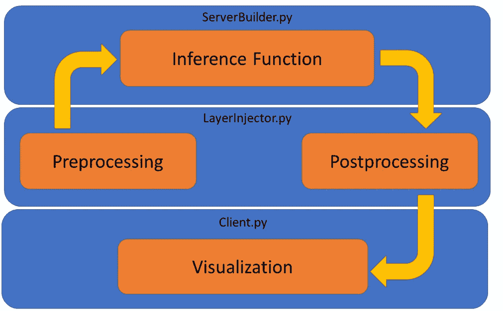

# 将 TensorFlow 分布式图像服务与 TensorFlow 对象检测 API 集成

> 原文：<https://towardsdatascience.com/integrating-tensorflow-distributed-image-serving-with-the-tensorflow-object-detection-api-5f62d80bce4c?source=collection_archive---------11----------------------->

## 通过网络为您的 TensorFlow 对象检测模型服务

这款笔记本是[使用 TensorFlow-Serving 的 RESTful API](https://medium.com/@tmlabonte/serving-image-based-deep-learning-models-with-tensorflow-servings-restful-api-d365c16a7dc4) 服务基于图像的深度学习模型的续集。请务必阅读该文章，以了解 TensorFlow 服务和 TensorFlow 分布式图像服务(Tendies)库的基础知识。强烈推荐克隆[Tendies 库](https://github.com/tmlabonte/tendies)来跟随本教程，因为我将关注重要的代码摘录而不是整个文件。如果你想在笔记本上查看这篇文章，点击[这里](https://github.com/tmlabonte/tendies/blob/master/full_functionality/tendies-extension-tutorial.ipynb)。

在这里，我们将扩展基本 Tendies 类的功能，以集成一个[更快的 R-CNN](https://arxiv.org/abs/1506.01497) 深度神经网络，它使用 [TensorFlow 对象检测 API](https://github.com/tensorflow/models/tree/master/research/object_detection) 。这将允许我们为符合 REST 的远程推理提供更快的 R-CNN，就像上一篇文章中的 CycleGAN 一样。

CycleGAN 相当简单，因为它接受图像并输出图像；然而，更快的 R-CNN 接受一个图像并输出张量的字典。此外，对象检测 API 迫使我们从 pipeline.config *构建我们的模型，并且*重新定义推理函数，使得服务更快的 R-CNN 成为更困难的任务。整合新模型和趋势的步骤如下:

1.  在 LayerInjector 中定义预处理和后处理功能。
2.  在 ServerBuilder 中创建或导入模型推理函数。
3.  创建或导入客户端。

虽然我将使用更快的 R-CNN 进行演示，但是这些步骤对于任何任意模型都是相同的，所以请按照您的特定用例随意操作。



# 分层注射

每个预处理函数必须将图像位串、图像大小和*args(其中*args 可用于表示任意数量的自定义位置参数)作为参数，然后将模型输入作为张量返回。相反，每个后处理函数必须将模型输出和*args 作为参数，然后返回输出节点名称列表以及输出是否应该作为图像传输。这些输出将在导出模型时在 ServerBuilder 中使用。

首先，我们将定义我们的预处理函数，它将把图像位串转换成适合推理的 uint8 张量。

```
import tensorflow as tf
def bitstring_to_uint8_tensor(self, input_bytes, image_size, *args):
    input_bytes = tf.reshape(input_bytes, [])# Transforms bitstring to uint8 tensor
    input_tensor = tf.image.decode_png(input_bytes, channels=3)# Ensures tensor has correct shape
    input_tensor = tf.reshape(input_tensor, [image_size, image_size, 3])# Expands the single tensor into a batch of 1
    input_tensor = tf.expand_dims(input_tensor, 0)
    return input_tensor
```

符合对象检测 API 的模型返回有用张量的字典，比如 num_detections、detection _ boxes 等等。在我们的后处理函数中，我们将遍历这些张量并给它们分配名称，这样我们就可以在 ServerBuilder 中提取它们。我们还必须考虑检测类张量的 1-索引。最后，我们返回一个输出节点名称列表，并将 output_as_image 设置为 False，因为我们将通过 JSON 将输出张量(不是可视化的图像)发送回客户机。

```
def object_detection_dict_to_tensor_dict(self, object_detection_tensor_dict, *args):
    # Sets output to a non-image
    OUTPUT_AS_IMAGE = False
    # Class labels are 1-indexed
    LABEL_ID_OFFSET = 1 # Assigns names to tensors and adds them to output list
    output_node_names = []
    for name, tensor in object_detection_tensor_dict.items():
        if name == "detection_classes":
            tensor += LABEL_ID_OFFSET
        tensor = tf.identity(tensor, name)
        output_node_names.append(name) # Returns output list and image boolean
    return output_node_names, OUTPUT_AS_IMAGE
```

如果您遵循您自己的模型，可以随意使用*args 来接受您需要的任意多个参数进行处理。Tendies 对张量的形状和类型相当挑剔，所以要确保你的预处理器的输出和后处理器的输入分别等价于你的模型的输入和输出。

# 推理功能

接下来，我们必须从 pipeline.config 构建更快的 R-CNN，并定义我们的推理函数。其代码在 example_usage()下的 ServerBuilder.py 中，这是我们的模型导出的地方。通过将配置文件读入对象检测 API model_builder，我们可以实例化一个更快的 R-CNN，而无需实际查看模型代码。接下来的几个单元格被认为在 example_usage()的范围内。

```
from object_detection.protos import pipeline_pb2
from object_detection.builders import model_builder
from google.protobuf import text_format# Builds object detection model from config file
pipeline_config = pipeline_pb2.TrainEvalPipelineConfig()
with tf.gfile.GFile(config_file_path, 'r') as config:
    text_format.Merge(config.read(), pipeline_config)detection_model = model_builder.build(pipeline_config.model, is_training=False)
```

由于 export_graph 期望单个推理函数，但是对象检测 API 有自己的前后处理要做，所以我们必须自己将它们组合起来。这是使用闭包的好地方，因为当我们传递推理函数时，我们希望保留实例化更快的 R-CNN 的范围。[闭包是最好的](https://i.imgflip.com/2en7d1.jpg)。

```
# Creates inference function, encapsulating object detection requirements
def object_detection_inference(input_tensors):
    # Converts uint8 inputs to float tensors
    inputs = tf.to_float(input_tensors) # Object detection preprocessing
    preprocessed_inputs, true_image_shapes = detection_model.preprocess(inputs)
    # Object detection inference
    output_tensors = detection_model.predict(preprocessed_inputs, true_image_shapes)
    # Object detection postprocessing
    postprocessed_tensors = detection_model.postprocess(output_tensors, true_image_shapes)
    return postprocessed_tensors
```

最后，我们将实例化一个 ServerBuilder 和 LayerInjector，然后导出模型。注意，我们将推理函数、预处理器和后处理器传递给 export_graph()。

```
# Instantiates a ServerBuilder
server_builder = ServerBuilder()# Instantiates a LayerInjector
layer_injector = LayerInjector()# Exports model
print("Exporting model to ProtoBuf...")
output_node_names, output_as_image = server_builder.export_graph(
                            object_detection_inference,
                            layer_injector.bitstring_to_uint8_tensor,
                            layer_injector.object_detection_dict_to_tensor_dict,
                            FLAGS.model_name,
                            FLAGS.model_version,
                            FLAGS.checkpoint_dir,
                            FLAGS.protobuf_dir,
                            FLAGS.image_size)
print("Wrapping ProtoBuf in SavedModel...")
server_builder.build_saved_model(output_node_names,
                                 output_as_image,
                                 FLAGS.model_name,
                                 FLAGS.model_version,
                                 FLAGS.protobuf_dir,
                                 FLAGS.serve_dir)
print("Exported successfully!")
```

# 客户

创建定制趋势客户端的最佳方式是从客户端继承，这为远程推理提供了一个框架。在这样的子类中，只需创建 visualize()和相关的 helper 函数，然后调用 client.inference()开始评估过程。

我们将需要几个这样的帮助函数；第一个函数与我们的预处理函数几乎完全相同，只是没有添加批处理。

```
def bitstring_to_uint8_tensor(self, input_bytes):
    input_bytes = tf.reshape(input_bytes, []) # Transforms bitstring to uint8 tensor
    input_tensor = tf.image.decode_jpeg(input_bytes, channels=3) # Ensures tensor has correct shape
    input_tensor = tf.reshape(input_tensor, [self.image_size, self.image_size, 3])
    return input_tensor
```

我们的第二个助手函数将用于从提供的标签映射中的对象检测 API 创建我们的类别索引字典；这个更快的 R-CNN 的具体实现只有一个类，所以很简单:

```
from object_detection.utils import label_map_util
def get_category_index(self):
    # Loads label map
    label_map = label_map_util.load_labelmap(self.label_path)

    # Builds category index from label map
    categories = label_map_util.convert_label_map_to_categories(label_map, max_num_classes=1, use_display_name=True)
    category_index = label_map_util.create_category_index(categories)
    return category_index
```

借助我们的助手，我们的可视化功能还不算太差。我们将解码 JSON 数据并将其转换为边界框，然后在对象检测 API visualization_utils 的帮助下将它们覆盖在输入图像上。请注意，我们将输入图像转换为张量，因此我们必须。在可视化之前对其进行 eval()。

```
from object_detection.utils import visualization_utils
def visualize(self, input_image, response, i):
    # Processes response for visualization
    detection_boxes = response["detection_boxes"]
    detection_classes = response["detection_classes"]
    detection_scores = response["detection_scores"]
    image = self.bitstring_to_uint8_tensor(input_image)
    with tf.Session() as sess:
        image = image.eval() # Overlays bounding boxes and labels on image
    visualization_utils.visualize_boxes_and_labels_on_image_array(
        image,
        np.asarray(detection_boxes, dtype=np.float32),
        np.asarray(detection_classes, dtype=np.uint8),
        scores=np.asarray(detection_scores, dtype=np.float32),
        category_index=self.get_category_index(),
        instance_masks=None,
        use_normalized_coordinates=True,
        line_thickness=2) # Saves image
    output_file = self.output_dir + "/images/" + self.output_filename + str(i) + self.output_extension
    visualization_utils.save_image_array_as_png(image, output_file)
```

# 使用服务器

既然我们已经完成了集成更快的 R-CNN 和 Tendies，让我们运行服务器。首先，我们必须导出我们的模型:

`python serverbuilder.py --checkpoint_dir $(path) --image_size 512`

截至 2018 年 7 月，Python 3 不支持 TensorFlow 服务，但[有人提出了解决方案](https://github.com/tensorflow/serving/issues/700)。安装 Python 3 TensorFlow 服务 API，包括:

`pip install tensorflow-serving-api-python3`

现在，我们可以用下面的命令从 bash 运行这个 TensorFlow 模型服务器:

`tensorflow_model_server --rest_api_port=8501 --model_name=saved_model --model_base_path=$(path)`

其中$(path)是服务器目录的路径。在我的例子中，它是/mnt/c/Users/Tyler/Desktop/tendies/full _ functional/serve。

最后，我们可以通过在输入图像的文件夹上调用我们的客户端来运行远程推理:

`python objectdetectionclient.py`

# 结论

感谢跟随本教程；希望对你有帮助！这个笔记本是用我的 TensorFlow 分布式图像服务库构建的，你可以在这里下载。更多关于我的博文和信息，请访问[我的网站](https://tmlabonte.github.io/)。