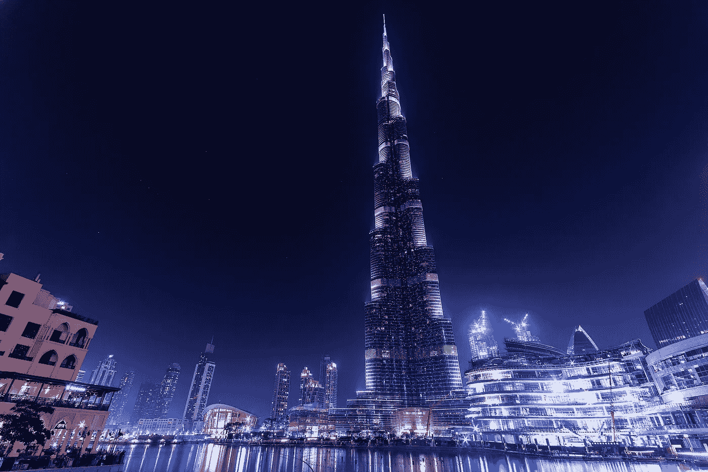

# 智能环境:从汽车到国家

> 原文：<https://towardsdatascience.com/intelligent-environment-from-cars-to-countries-2e74d1bc82c1?source=collection_archive---------9----------------------->

物联网正在改变我们周围的世界。我们从电脑、平板电脑和智能手机的普及开始。现在我们可以制造小而低成本的芯片，将它们嵌入电器、灯、门、窗甚至马桶中。让我们看看这项技术将如何在不同的尺度上改变我们的环境。

# 无人驾驶汽车

研究人员在 20 多年前推出了第一辆自动驾驶汽车，它们包含一套 100 多公斤的计算机。如今，一块 6 英尺大小的智能手机配一对摄像头就可以做同样的工作，价格不到 1000 美元。同样，软件驾驶比普通司机安全得多，尽管在特殊情况下会有一些问题。

MobilEye 是该领域的领先公司之一(最近被英特尔以 150 亿美元收购)。他们为沃尔沃、宝马、奥迪和许多其他公司提供技术。埃隆·马斯克创造的特斯拉将在今年年底实现完全自动化。数十家其他创业公司正在崛起，你可以在网上学习如何开发自动驾驶技术。

# 智能家居

知道哪些产品丢失或变质的冰箱。咖啡机，等待信号从你的智能手机，你醒了，开始做一杯。了解您的偏好并找到您可能喜欢的节目的电视。这种门可以识别你的指纹或声音，不用任何钥匙就能打开。根据您的需求不断调节的气候控制和照明。监控你健康和饮食的马桶。

你家的每一部分都可以适应创造你喜欢的环境。

# 自动化商店、诊所和学校

亚马逊将带着他们的新项目 [Amazon Go](https://www.amazon.com/b?node=16008589011) 走向现实世界。一般都是没有排队和结账的店。进来吧，带上你需要的东西，然后出去。周围的智能传感器系统会识别你拿了什么东西。在你离开商店后，它会自动从你的信用卡上扣钱。不再等待，24/7 简单购物。

在医院门口用一滴血诊断成千上万种疾病怎么样？或者，例如，MRI 扫描仪在没有任何服务人员的情况下检测肿瘤并将结果发送给医生？

对于学生，我们可以提供个性化和互动的教育。此外，我们可以自动记录孩子的出勤和进步情况。

# 适应性城市

每个大城市都有交通基础设施的问题。传感器可以提供关于交通、免费停车场和事故的信息。此外，结合自动驾驶汽车，这个网络将能够大大减少交通堵塞。

旧金山和洛杉矶电灯公司正在升级他们的室外照明。一项技术根据周围人的数量来控制亮度，而第二项技术可以检测并向警察部门报告枪声。结合起来，他们可能会减少犯罪和电费。

超过 100 个城市已经实施了智能垃圾箱，以减少容器数量和降低回收费用。

# 智能国家

今天可用的自然语言处理工具能够处理数百万个文档。机器人可以处理公共咨询服务。用于识别身份的智能应用程序可以简化投票过程，促进民主。Civiciti 正在开发一种类似的产品。看一看:

同时，人工智能技术可能被用于有问题的项目。中国政府正在开发一个系统，该系统将分析公民的公共和私人信息，并给他们打分。它可以用来作为信用评分，就业，禁止出境，抵制欺诈和许多其他目的。

我认为收集关于公民的数据是有用的，但是这样的项目应该完全透明。