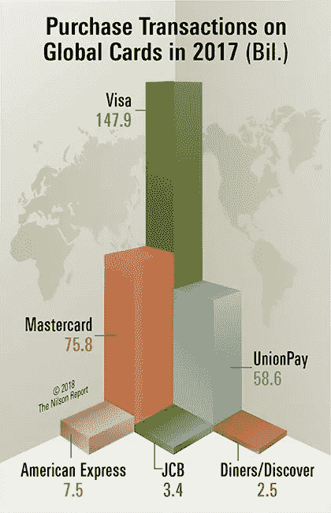
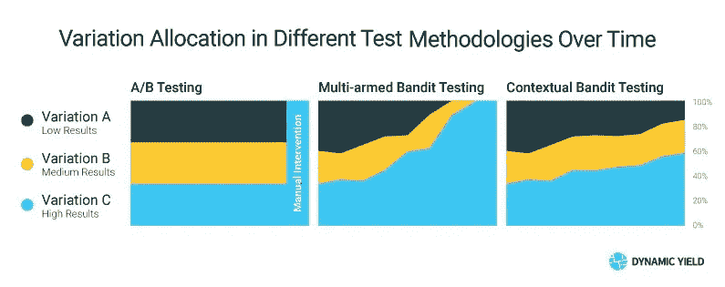

# 智能支付路由

> 原文：<https://towardsdatascience.com/intelligent-payment-routing-d6c4097720e?source=collection_archive---------12----------------------->

使用多臂 Bandit 算法优化支付性能

Multi-Armed Bandits a.k.a. Slot Machines

如果你有一个电子商务网站，你很可能会花无数的时间来寻找正确的产品组合，内容，按钮，颜色和其他变量，可以提高你的转化率，平均交易价值，最终你的收入。大多数商家止步于支付。

多年来，支付行业让我们相信，在优化结账流程的性能方面，我们几乎无能为力。大多数美国企业只要求能够接受信用卡，从标准的[万事达卡](https://www.mastercard.com)和[维萨卡](https://www.visa.com)，到增加[美国运通](https://www.amex.com)、 [JCB](https://www.jcb.com) 、 [Diners/Discover](https://www.dinersclub.com) 或[银联](http://www.unionpayintl.com/)。但纵观全球，本地支付方式已经能够捕捉到很大一部分交易，尤其是在线交易。荷兰有 iDeal，德国有 Sofort，法国有 Cart Bancaire，中国有支付宝，日本有 Konbini。全球现在有超过 250 种可供选择的支付方式，这使得商家更难决定他们应该提供什么样的支付方式，更不用说优化了。

The global brand general purpose cards — Visa, UnionPay, Mastercard, JCB, Diners Club/Discover, and American Express — generated 295.65 billion purchase transactions for goods and services in 2017, up 18.0%.

## **实验**

在金融服务行业工作超过 14 年后，我一直使用数据来帮助自己和他人做出更好的决策。通过描述性分析(发生了什么)、诊断性分析(为什么会发生)、预测性分析(可能会发生什么)或规定性分析(采取什么行动)。

作为一名数据科学家，我最喜欢最后阶段，因为那是我进行实验的地方。第一阶段对于弄清楚发生了什么，甚至为什么会发生什么是必要的，但是能够使用数学和算法来预测将要发生的事情，并开发技术来自动化需要采取的行动，这才是真正让我兴奋的。

因此，当我在 2015 年为一家大型全渠道零售商做项目时，他们很难决定使用哪种支付方式组合。在六个月的时间里，我研究了他们的业务、新的和已有的支付方式，以及客户从登陆网站到付款或决定不付款的行为。我创建了实验来测试不同的场景，并进行优化，直到我得到最佳的支付组合。事后看来，实验非常成功，我们将结账转化率(购物者点击支付按钮并实际输入和成功支付交易的转化率)从 91%提高到 95%。额外的收益是额外的 100 万欧元的收入，预计在接下来的 12 个月中会有 400 万欧元的收入。我没有留在公司，而是从处理商户交易的 PSP(他们是项目的发起人)那里得到了一个提议，用我的方法帮助其他更大的商户获得相同类型的结果。

加入一家注重结果而非完美执行的超高增长公司后，我能够在近两年的时间内运行超过 100 种不同的分析和实验，并得出描述性、诊断性、预测性和规范性的分析结果。从计算授权率，提高收单性能，弄清楚支付领域的哪些变量导致被授权的可能性更高。但在所有这些项目中，帮助商家找到最佳支付组合是最突出的。

考虑到这个问题和许多其他问题，运行多个实验是获得答案的唯一途径，我无意中发现了多臂强盗算法。

## **多臂强盗实验**

多臂强盗是一种实验类型，其中:

*   目标是找到最佳或最有利可图的行动
*   随机化分布可以随着实验的进行而更新

“多臂强盗”这个名字描述了一个假设的实验，在这个实验中，你面对几个吃角子老虎机(“单臂强盗”)，它们具有潜在的不同预期支付。你想找到具有最佳支付率的吃角子老虎机，但你也想最大化你的奖金。根本的矛盾在于“利用”过去表现良好的武器和“探索”新的或看似较差的武器，以防它们表现更好。

被谷歌用来运行内容实验，我开始思考支付服务提供商和更具体的收单连接是如何相似的。与大多数人可能认为的不同，PSP 或收购方可能对正在处理的交易的性能有很大影响。根据地区、声誉和数据质量等变量，信用卡交易平均有 80%的几率被批准。他们拒绝的原因可以从资金不足，交易不允许持卡人或广泛覆盖不兑现。通过拥有多个 PSP 或获取连接，多臂 Bandit 实验可以在没有人工干预的情况下产生最佳性能。

## **盗匪如何运作**

本质上，多臂 Bandit 算法从多个变量开始，基于输入产生输出。根据性能，每个变量的流量比例将自动调整。性能优于其他变体的变体将被分配更大部分的流量，而性能不佳的变体将看到流量减少。每次调整都基于一个统计公式，该公式同时使用样本大小和绩效指标，以确保变化是真实的绩效差异，而不仅仅是随机的。根据时间和流量，一个或多个变体将成为赢家，我们将奖励所有流量或决定运行一个新的实验。与传统的 A/B 实验不同，Multi-Armed Bandit 实验是在进行实验的同时获得并利用结果，而不是等到有了结果再决定哪种变化是最好的。

## **应用于商户支付**

与任何算法一样，将它应用于现实生活场景给了我们机会去了解结果是否可以改进。向旅游业中一家拥有多个 PSP 连接的大型商家提出这个想法，我们能够测试这个想法。

第一个实验侧重于授权率，这是支付行业内提供 PSP 性能反馈的一个指标。我们知道，在差异较小的地区，获得具有统计显著性的结果将具有挑战性，因此我们决定将重点放在授权率在 60%至 70%之间的国家和其他 PSP(未连接)上，他们表示能够获得 80%左右的授权率。现有的两个集成扩展为三个。开发了在每个 PSP 连接之间切换所需的逻辑以及跟踪性能的能力。

在我们测试该解决方案时，我们进行了不同的调整，以确保流量仅在结果具有统计学意义时才重新分配。在一个月的时间里，我们处理了超过 10 万笔交易，三个 PSP 的授权率分别为 74%、66%和 59%，其中本地 PSP 的性能最高。

## **尝试多臂强盗实验的其他场景**

除了将交易路由到多个 PSP 之外，当然还有许多其他方式来使用多臂 Bandit 算法。在支付领域，将交易路由到不同的收单机构是次佳选择，但也是测试不同的欺诈保护工具。支付之外的选择是无穷无尽的，从测试你的网站或电子邮件中的内容。每当你想比较两个以上的变量，等到最后再做决定代价太大，多臂土匪实验肯定应该考虑。

## 感谢阅读；)，如果你喜欢它，请点击下面的掌声按钮，这对我意义重大，也有助于其他人了解这个故事。通过在[推特](https://twitter.com/dwaynegefferie)或 [Linkedin](https://www.linkedin.com/in/dwaynegefferie/) 上联系让我知道你的想法。或者关注我，阅读我关于数据科学、支付和产品管理的每周帖子。