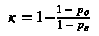
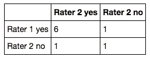
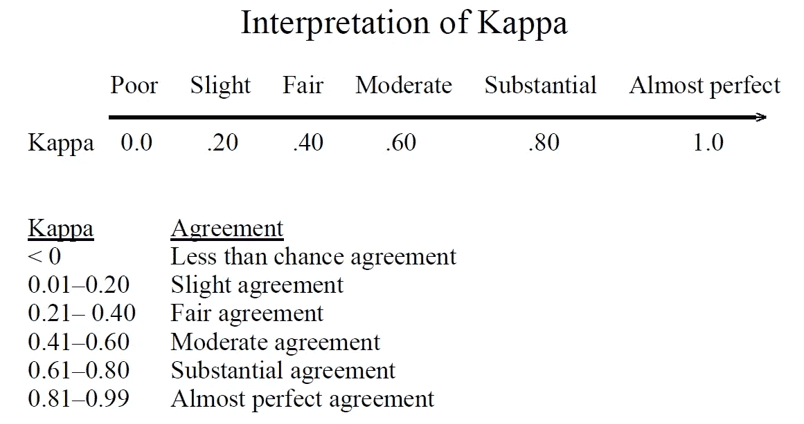
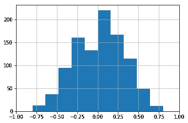
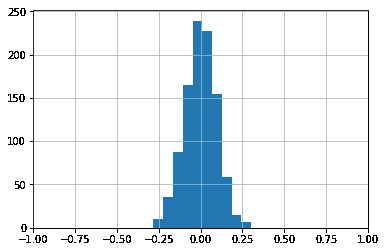
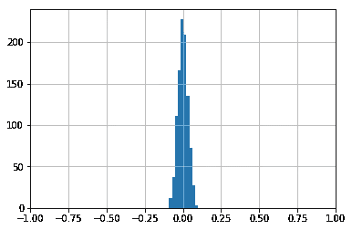
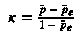
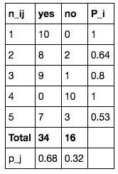

# 评分者间协议

> 原文：<https://towardsdatascience.com/inter-rater-agreement-kappas-69cd8b91ff75?source=collection_archive---------0----------------------->

又名评分者之间的可靠性或一致性

> 在统计学中，评分者之间的可靠性、评分者之间的一致性或一致性是评分者之间的一致程度。它给出了评委给出的评分中同质性或一致性的程度。

这里涵盖的 Kappas 最适合于**【名义】**数据。这些方法忽略了数据中的自然排序(如果有的话)。如果您要使用这些指标，请确保您了解[限制](https://www.wikiwand.com/en/Cohen%27s_kappa#/Limitations)。

# 科恩的卡帕



这有两个部分:

1.  计算观察到的一致
2.  偶然计算一致

假设我们正在处理“是”和“否”的答案以及 2 名评定者。以下是收视率:

```
rater1 = ['yes', 'no', 'yes', 'yes', 'yes', 'yes', 'no', 'yes', 'yes']
rater2 = ['yes', 'no', 'no', 'yes', 'yes', 'yes', 'yes', 'yes', 'yes']
```

将这些评级转化为混乱矩阵:



```
Observed agreement = (6 + 1) / 10 = 0.7
Chance agreement   = probability of randomly saying yes (P_yes) + probability of randomly saying no (P_no)
P_yes              = (6 + 1) / 10 * (6 + 1) / 10 = 0.49
P_no               = (1 + 1) / 10 * (1 + 1) / 10 = 0.04
Chance agreement   = 0.49 + 0.04 = 0.53
```

因为观察一致大于偶然一致，我们会得到一个正的 Kappa。

```
kappa = 1 - (1 - 0.7) / (1 - 0.53) = 0.36
```

或者直接用`sklearn`的实现

```
**from** **sklearn.metrics** **import** cohen_kappa_scorecohen_kappa_score(rater1, rater2)
```

它返回 0.35714。

**卡巴的解释**



**特殊情况**

## 小于机会协议

```
rater1 = ['no', 'no', 'no', 'no', 'no', 'yes', 'no', 'no', 'no', 'no']
rater2 = ['yes', 'no', 'no', 'yes', 'yes', 'no', 'yes', 'yes', 'yes', 'yes']
cohen_kappa_score(rater1, rater2)
-0.2121
```

## 如果所有的评级都是相同和相反的

这种情况可靠地产生 0 的`kappa`

```
rater1 = ['yes'] * 10
rater2 = ['no'] * 10
cohen_kappa_score(rater1, rater2)
0.0
```

## 随机评级

对于随机评分，`Kappa`遵循平均值约为零的正态分布。

随着评级数量的增加，Kappa 值在分布中的可变性更小。



10 random ratings for each rater (random sample of 1,000 inter-rater Kappa calculations)



100 random ratings for each rater (random sample of 1,000 inter-rater Kappa calculations)



您可以在此找到更多详情

**请注意，Cohen 的 Kappa 仅适用于对完全相同的项目进行评分的 2 名评分者。**

# 弗莱斯

将 Cohen 的 Kappa 扩展到 2 名以上的评定者。

解释

> *它可以被解释为表达评价人之间观察到的一致程度超过了所有评价人完全随机进行评价时的预期程度。*

评分者可以对不同的项目进行评分，而对于 Cohen，他们需要对完全相同的项目进行评分

> *Fleiss’kappa 特别允许，尽管有固定数量的评定者(例如，三个)，不同的项目可以由不同的个人进行评定*

例如，假设我们有 10 名评定者，每人对 5 个项目进行“是”或“否”评定:



例如，假设我们有 10 名评定者，每人对 5 个项目进行“是”或“否”评定:



例如第一行(P_1):

```
P_1 = (10 ** 2 + 0 ** 2 - 10) / (10 * 9) = 1
```

第一列(p_1):

```
p_1 = 34 / (5 * 10) = 0.68
```

如果不清楚的话，在这里看一下这个例子。

现在你可以计算 Kappa:

```
P_bar = (1 / 5) * (1 + 0.64 + 0.8 + 1 + 0.53) = 0.794
P_bar_e = 0.68 ** 2 + 0.32 ** 2 = 0.5648
```

在这一点上，我们已经得到了我们需要的一切，而`kappa`的计算就像我们计算科恩的:

```
kappa = (0.794 - 0.5648) / (1 - 0.5648) = 0.53
```

你可以在这里找到这篇文章附带的 Jupyter 笔记本。

**参考文献**

*   【https://www.wikiwand.com/en/Inter-rater_reliability 
*   [https://www.wikiwand.com/en/Fleiss%27_kappa](https://www.wikiwand.com/en/Fleiss%27_kappa)