# 使用 Jupyter 笔记本的交互式数据科学

> 原文：<https://towardsdatascience.com/interactive-data-science-with-jupyter-notebooks-457ab4928b08?source=collection_archive---------3----------------------->

在[我的视频](https://www.youtube.com/playlist?list=PLIivdWyY5sqJxnwJhe3etaK7utrBiPBQ2)中，你已经看到我在屏幕上实时运行 Python 代码并显示结果。今天，我想和你分享我是如何做到这一点的，并告诉你如何利用它！

我在屏幕上实时运行 python 代码的方式是使用一个名为 [Jupyter](http://jupyter.org/) 的 Python 包。Jupyter 构建于 IPython 项目之上，允许在浏览器中运行交互式 Python。但远不止如此。从 bash 命令到特殊的“魔法”和插件，Jupyter 极大地增强了 Python 编码体验。

如果你已经在使用 Jupyter，我希望我能改进你的工作流程，并向你展示一些新的技巧。如果您还没有使用 Jupyter，那么让我们开始吧。

# 安装和启动

安装 Jupyter 最简单的方法是运行`pip install jupyter`，尽管如果您使用打包的 python 发行版，比如 Anaconda，您可能已经安装了它。确保首先激活您的 Python 环境。让我们开始吧。

在本地运行 Jupyter 时，您将通过浏览器连接到本地运行的 web 服务器，通常是在端口 8888 上。在你的工作目录中运行`jupyter notebook`来启动你的笔记本。通常 Jupyter 启动后会自动打开，但如果没有，请将你的浏览器指向`localhost:8888`。

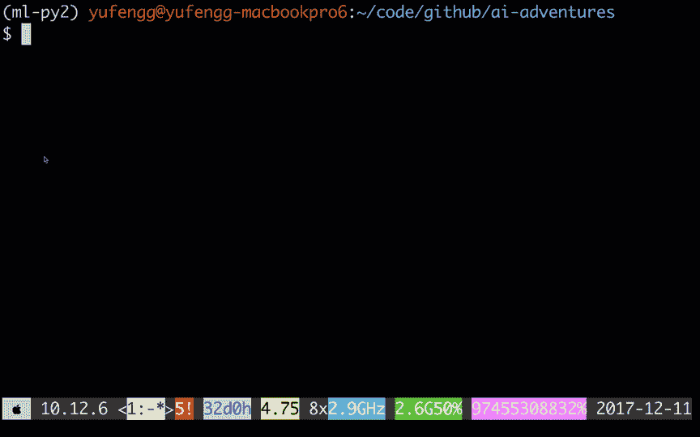

如果您还没有想要打开的笔记本，您可以通过单击“新建”并选择 Python 2 或 3 来创建一个，具体取决于您环境中运行的 Python 版本。Jupyter 非常灵活，实际上可以处理许多语言和文件类型，尽管我们现在只坚持使用 Python。

## 在 Jupyter 笔记本中运行代码

一旦你有一个新的笔记本在运行，你可以在空的单元格中写一些 python 代码，然后按 ctrl+enter 来运行它。我们可以在这里运行所有典型的 Python 代码，就像您可能用 Python 脚本编写一样。不同的是，我们可以运行它，并立即看到结果！

注意当我们用 ctrl+enter 运行一个单元格时会发生什么。当单元正在运行或排队等待运行时，单元左侧的括号中会显示一个星号，然后在运行完成后会显示一个数字，代表单元在给定会话中的运行顺序，从“1”开始。

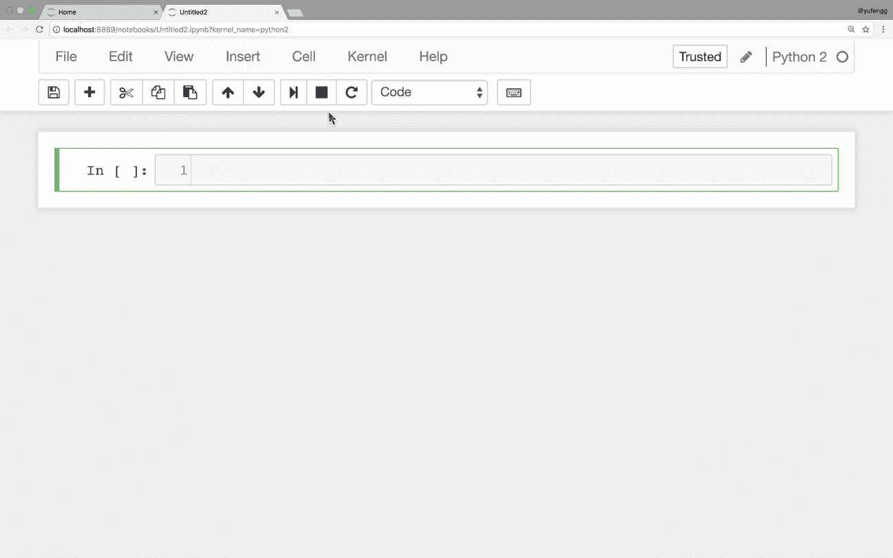

代码单元格最后一行的结果将作为该单元格的输出打印出来，但前提是该值没有存储到变量中。例如，如果我导入 tensorflow，然后用一个字符串连接它，输出如下所示，即使我没有使用 print 命令。

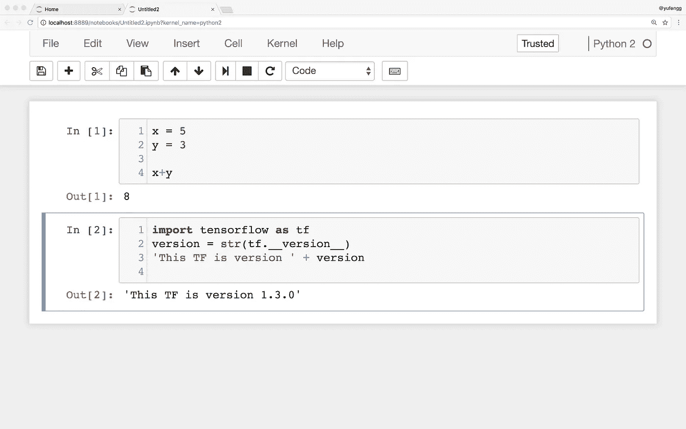

当然，我也可以使用 print()。这对于修补和观察事物的行为非常有用。

## Shift-Tab

Jupyter 笔记本的另一个奇妙的特性是能够通过按`shift-tab`显示你正在调用的函数的文档字符串。这允许您使用正确的参数调用函数，而不需要每次都查阅完整的文档。

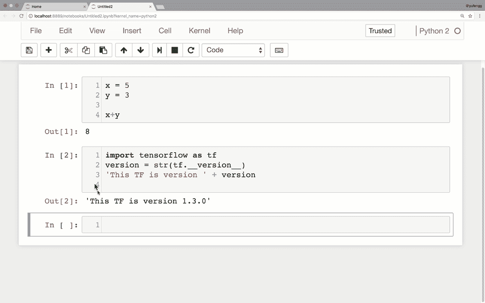

这个特性也可以和你自己的本地自定义函数一起工作，所以如果你写了好的 docstrings，你会得到回报的！

## 输出

当您有大量输出时，您可以通过单击输出的左侧面板来减少它占用的空间，这将使它变成一个滚动窗口。如果双击，输出将完全折叠。

## 更多细胞！

一个细胞是有用的，但实际上我们希望有许多细胞。要添加单元格，请单击工具栏上的“加号”图标。还有一些单元执行命令可以创建新的单元。

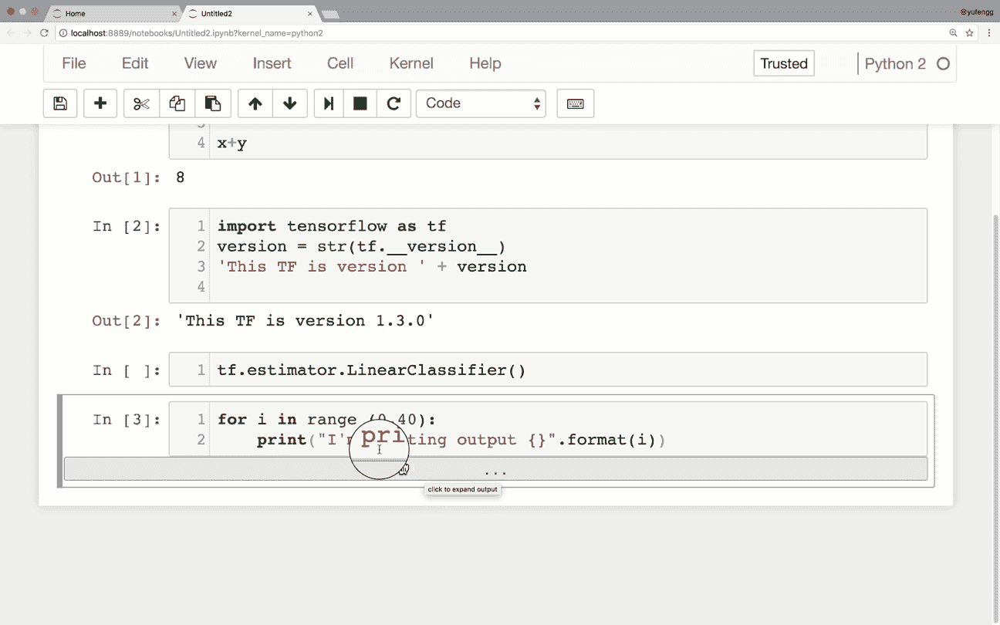

如果您按下`shift+enter`，它将运行当前单元格，然后高亮显示下一个单元格。如果没有新单元，则创建一个新单元。另一方面，如果您想在给定的单元格之后立即创建一个新的单元格，您可以使用`alt-enter`来执行该单元格，然后在它之后直接插入一个新的单元格。

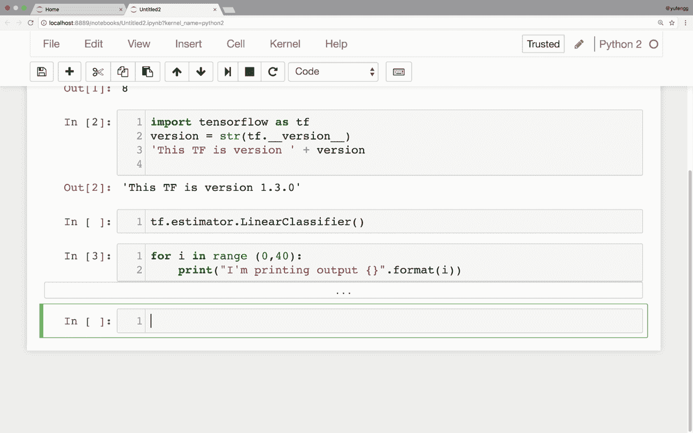

## 有人说降价了吗？

也许到目前为止，我遗漏的最大特性是降价支持。我对 Jupyter 笔记本的第一印象是它能够提供一种很好的方式来编写代码和描述我正在编写的代码。markdown 丰富的语义允许研究人员和教育工作者简单明了地交流思想和观点。

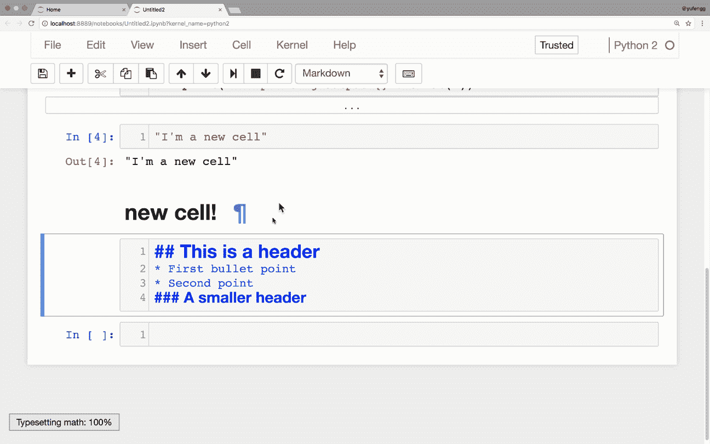

也许最重要的是，它允许过去的你告诉未来的你一个给定的代码单元应该做什么，以一种比使用注释块更有表现力的方式！

# 朱庇特魔术

有时我只想快速检查一下一个培训或评估周期需要多长时间。一个简单的方法来计时你的代码，用%%time 开始一个单元，一旦这个单元完成执行，它将打印出运行这个单元花了多长时间。这不是精确的原子计时，但这是一个很好的方式，可以用最小的努力获得一些可靠的第一印象。

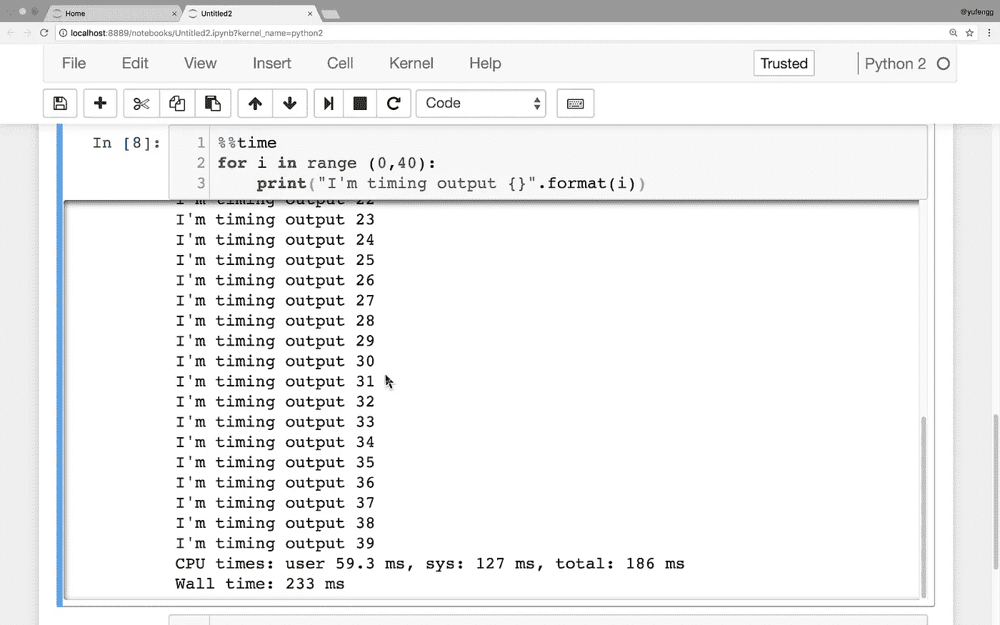

如果要在笔记本中运行命令行命令，最简单的方法就是在命令前面加一个感叹号。这对于一次性命令非常有用。

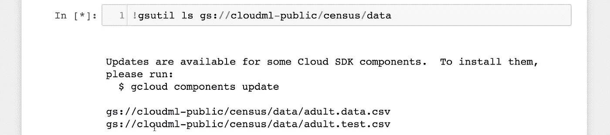

如果您想运行一组命令，用“%%bash”开始一个单元，使整个单元被解释为一个 bash 脚本。

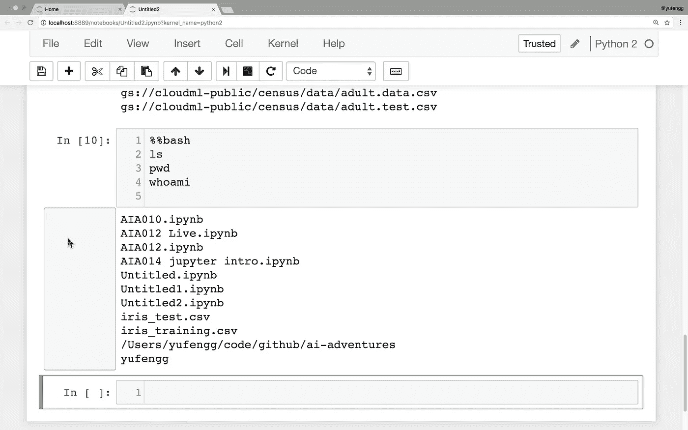

这个的一个很大的用途是启动[张量板](/visualizing-your-model-using-tensorboard-796ebb73e98d)。通常，运行 TensorBoard 可能需要启动一个新的终端窗口，并在命令行上运行它，如果您想运行一段时间，我们通常会这么做。但是，如果你只是想旋转它，看一眼，然后关闭它，把它放在 Jupyter 笔记本电池里也不是一个坏主意。

此外，您将永远不会忘记运行它，因为它嵌入到您的笔记本电脑单元的工作流程中！请注意，它将占用您的笔记本。因此，在 Tensorboard 运行时，您将无法运行任何其他内容。要停止它，点击中断内核，星号会消失，你会得到控制流。

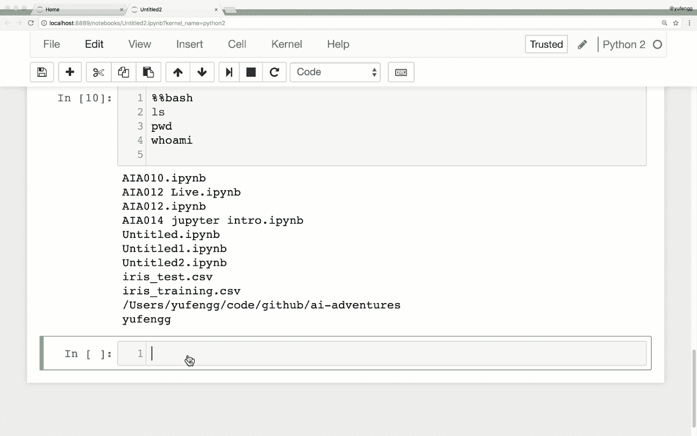

这就是我最喜欢的 Jupyter 特性和功能。这当然不是对 Jupyter 特性的全面讨论。我刚刚在这里介绍了一些我最喜欢和最常用的。还有很多很多等着你去[探索](http://jupyter.org/)。

感谢阅读这一集的[云人工智能冒险](https://goo.gl/UC5usG)。如果你喜欢这个系列，请为这篇文章鼓掌让我知道。如果你想要更多的机器学习动作，一定要关注媒体上的[我](https://medium.com/@yufengg)或[订阅 YouTube 频道](https://goo.gl/S0AS51)以观看未来的剧集。更多剧集即将推出！

附:如果你还在读:这篇文章的 gif 怎么样？他们有帮助吗？分散注意力？俏皮？迷惑？让我知道！