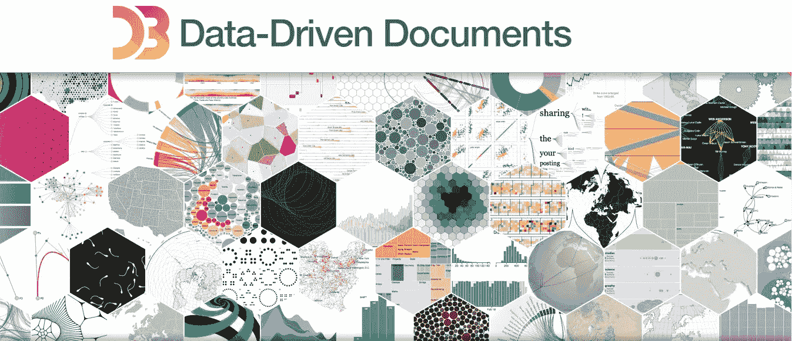
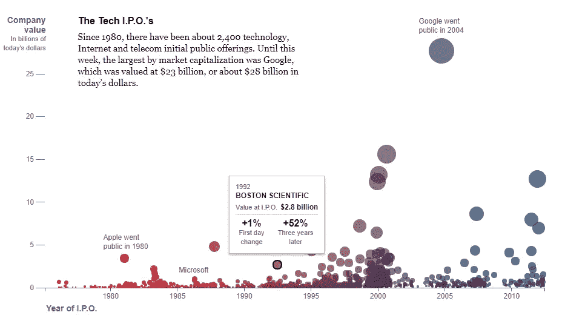
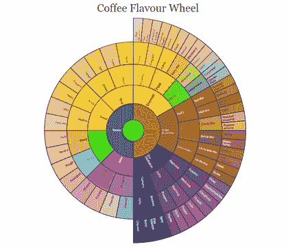
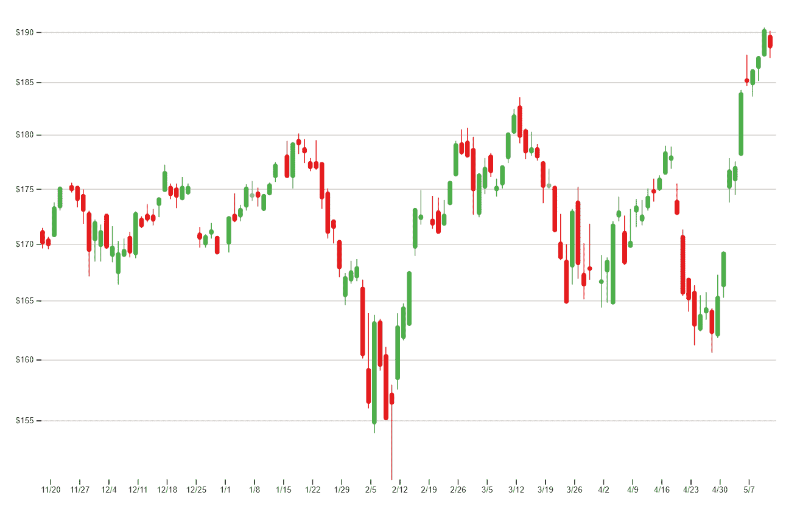
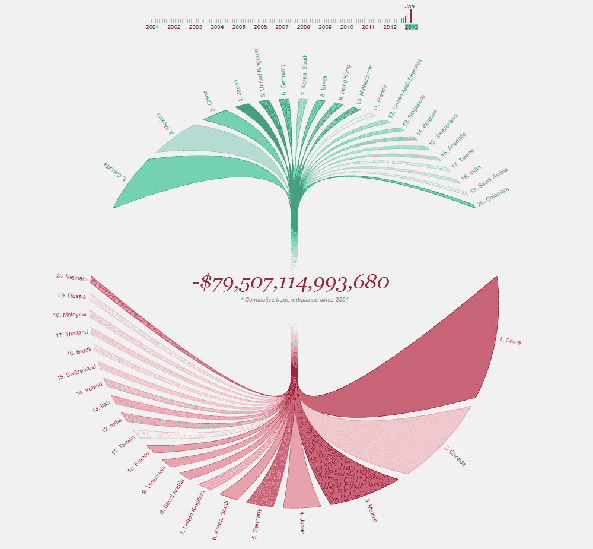

# 用 D3.js 实现交互式数据可视化

> 原文：<https://towardsdatascience.com/interactive-data-visualization-with-d3-js-43fc3428a27e?source=collection_archive---------2----------------------->

## 开启数据驱动的可视化之路

> 本文内容由 [**昆西·史密斯**](https://www.linkedin.com/in/qlsmith) 供稿，昆西·史密斯是 [**跳板**](http://springboard.com/?utm_source=towardsdatascience&utm_medium=post&utm_campaign=Home&utm_term=springboard&utm_content=d3) 在线培训公司营销团队的一员，该公司致力于弥合世界各领域的技能差距。他们开设以行业为重点、由导师指导的课程，如[数据科学训练营](https://www.springboard.com/workshops/data-science-career-track/?utm_source=towardsdatascience&utm_medium=post&utm_campaign=DS1&utm_term=data_science_bootcamp&utm_content=d3)和[网络安全职业跟踪](https://www.springboard.com/workshops/cybersecurity-career-track/?utm_source=towardsdatascience&utm_medium=post&utm_campaign=CS1&utm_term=cybersecurity_career_track&utm_content=d3)。

Credit: [https://d3js.org/](https://d3js.org/)

交互式可视化可以给平淡乏味的数据集增添令人印象深刻的魅力。交互数据的主要特征在于它本身作为一个应用程序使用。它允许用户选择特定的数据点，以他们选择的方式将故事可视化。实现这一点的最强大的方法之一是通过 [JavaScript](https://towardsdatascience.com/tagged/javascript) ，或者更具体地说，D3.js 框架。

由 Mike Bostock 开发的 D3 (data-driven documents)是一个开源的 JavaScript 库，它利用 SVG、HTML 和 CSS 来创建强大的数据可视化表示，从而赋予数据以生命。让我们看一个由 D3.js 支持的有趣的交互式可视化的例子！

Tech Company IPOs vs. Company Value

*在上述示例中，将鼠标悬停在特定数据点上会弹出一个弹出窗口，显示关于该特定数据的更多信息。图表本身可以进一步动画化，创建一个令人兴奋的用户数据视图。请看它在* [*这里的*](https://archive.nytimes.com/www.nytimes.com/interactive/2012/05/17/business/dealbook/how-the-facebook-offering-compares.html) *。*

 [## 脸书产品:如何比较

### 在 2400 次科技、互联网和电信的首次公开募股之后发生了什么

archive.nytimes.com](https://archive.nytimes.com/www.nytimes.com/interactive/2012/05/17/business/dealbook/how-the-facebook-offering-compares.html) 

# **D3 . js 的主要特性**

1.  **它使用预先存在的约定:** D3.js 使用 web 标准，比如前面提到的 SVG、HTML 和 CSS。就其本身而言，这一特殊特征可能并不显著。然而，这允许跨平台的脚本的容易实现，而不需要除了浏览器之外的其他技术或插件。它还允许数据可视化与其他脚本和 JS 框架统一应用，如 Angular.js、Ember.js 或 React.js。换句话说，它可以顺利地放入您的网站中，而不会干扰其余的代码。最好的部分:D3 是轻量级的。它适用于任何网络标准，因此速度很快，不管你的数据集有多大。
2.  **数据驱动:** D3 完全由数据驱动，通过输入静态数据或从远程服务器获取数据。这可以通过多种格式实现，从数组和对象到 CSV、JSON 和 XML 等等。通过这个专门的工具，可以很容易地创建不同类型的图表。D3 大量使用数据驱动元素也增强了您的数据，允许动态生成不同的元素和图表样式，无论是表格、图形还是任何其他类型的元素分组。
3.  **它是动态的:**凭借其灵活性，D3 可以成为一个非常强大的工具，因为它为几乎所有的功能提供了最大的动态属性。然后，您输入到脚本中的数据可以很容易地形成特定数据集可视化所需的样式和属性类型。

*点击这个咖啡风味转盘上的任何地方，它就会以一种流畅、动态的动作缩放。查看* [*这里*](https://www.jasondavies.com/coffee-wheel/) *。*

 [## 咖啡调味轮

### 咖啡味道的形象化。

www.jasondavies.com](https://www.jasondavies.com/coffee-wheel/) 

如果您真的想深入了解技术细节，这是一个使用`[d3.layout.partition](http://github.com/mbostock/d3/wiki/Partition-Layout)`布局从分层数据生成可缩放旭日树的例子。[旭日树](http://www.cc.gatech.edu/gvu/ii/sunburst/)是一种特殊的放射状空间填充可视化，类似于冰柱树。

总而言之，D3 允许用户创建基本上任何类型的可视化，纯粹基于数据，而不是来自个人对数据的理解。无论是表格还是饼图、图形还是条形图，D3 都通过简化数据可视化过程来避免人为错误，同时为用户提供了进行调整和控制可视化功能的所有机会。

不仅如此，D3 通过像`**duration()**`、`**delay()**`和`**ease()**`这样的功能为交互和动画提供了足够的空间，这些功能允许用户制作数据动画，就像在你的网站上添加视频一样——除了在 D3 的情况下，它被简化并直接在你的网站上实现。这些动画也很快，对用户交互反应灵敏，使它们更有吸引力。

# **如何入门？**

D3.js 实现起来非常简单，只要你已经掌握了一些 JavaScript 的基础知识。这里有一个简化的分步指南，帮助您开始交互式数据之旅。

## **步骤 1:设置**

D3 的第一步是建立 D3 库，它作为 D3 代码的信息和指令的存储库。它构成了数据可视化的基础，所以把这一步做好很重要。

有两种方法可以做到这一点:

1.  **将 D3 库引入您的项目文件夹:**由于 D3 是开源的，源代码可以在 [D3 网站](https://d3js.org/)上下载。你要做的就是解压下载的文件夹，寻找`**d3.min.js**`，直接复制到你项目的根文件夹。然后，使用`**<script src =…>**`将`**d3.min.js**`文件包含在 HTML 页面中。有了这个，你的 HTML 网页现在可以访问 D3 库中的代码和 DOM 元素。
2.  **介绍来自内容交付网络(CDN)的 D3 库:** CDN 是一个由不同服务器组成的网络，这些服务器托管根据用户的地理位置交付给他们的文件。使用 CDN，您甚至不需要源代码(就像使用第一种方法一样)。只需使用`**<script src=…>**`包含 CDN [URL](https://d3js.org/d3.v4.min.js)

## 第二步:DOM 元素

有了开源代码库，就可以根据样式和操作其他 DOM 元素来设置网页本身了。使用`**d3.select**` (css-selector)或`**d3.selectAll**` (css-selector)获取 DOM 元素的引用是很重要的。之后，应用众所周知的 HTML 和 CSS 约定，并且可以相应地实现这些元素。

DOM 元素也可以由一系列方法[操作，比如`**text(“content”)**`或`**remove()**`。这些与现有的约定非常相似，因此从编码的角度来看很容易使用。您可以使用不同的脚本以类似的方式添加动画和其他功能，这些脚本可以在官方网站的 API 参考中找到。](https://github.com/d3/d3/blob/master/API.md)

> 开发这段代码的关键点在于“链语法”，如果您使用过 JQuery，可能会对它很熟悉。D3 的链接技术是通过使用句点将方法放在一起实现的。这样，第一个方法的输出作为输入传递给下一个方法，从而简化了代码。

Standard Candlestick Chart for Stock Prices

*凭借其数据驱动的焦点，D3 可以轻松创建烛台图，如*[*this*](https://beta.observablehq.com/@mbostock/d3-candlestick-chart)*。*

 [## D3 蜡烛图

### 绘制股票数据的一个微妙之处是市场只在工作日开放:如果你…

beta.observablehq.com](https://beta.observablehq.com/@mbostock/d3-candlestick-chart) 

## **第三步:加载您的数据**

下一步是加载数据集并将它们绑定到 DOM 元素。D3 可以处理不同类型的文件，本地的和外部的。数据的上传类似于 HTML 和 CSS 的传统数据加载，通过`**.csv**`文件的`**d3.csv()**`、`**.json**`文件的`**d3.json()**`等方法。

## **第四步:可视化数据**

数据成功加载到 D3 后，用户可以创建数据可视化最重要的部分:可视化本身。

这可以以 SVG 的形式出现，它允许您的图表显示不同的形状，从线条到圆形到椭圆形，并允许您完全控制以实现数据的理想可视化。本质上，SVG 值的操作与 DOM 元素的操作非常相似。

通过采取这些步骤，用户可以轻松地创建图像和形状，帮助构建完整的图表和图形。然而，这实际上并没有形成真正的数据可视化。相反，需要通过 D3 对几何图形和样式进行操作，以获得想要的结果。这也包括从图表的刻度到它的轴到图表的动画。

然而，一旦掌握了 D3.js 技术，从移动饼图到响应条形图，制作任何东西都很容易。

US Trade Deficit

上图显示了一段时间以来美国的贸易逆差。第一次打开时，图表会根据时间线从 2001 年移动到 2013 年。单击时间线的任何部分都会导致图表相应移动，显示特定时间段的贸易逆差。仔细看看这里的**。**

* [## 美国贸易赤字-亮点

### 美国在贸易逆差下运作，这意味着美国从国外购买的商品多于其销售的商品。这个…

www.brightpointinc.com](http://www.brightpointinc.com/united-states-trade-deficit/) 

# **简单地说**

总的来说，D3.js 是一个极其强大和通用的工具。

它包含大量的功能，让[数据科学家(有经验的&新)](https://www.springboard.com/workshops/data-science-career-track)完全控制图表或图形的外观和感觉，使其成为任何希望掌握数据可视化的人最有影响力的工具之一。* 

*感谢 [***昆西史密斯***](https://www.linkedin.com/in/qlsmith/)*从 [**跳板**](http://springboard.com/?utm_source=towardsdatascience&utm_medium=post&utm_campaign=Home&utm_term=springboard&utm_content=d3) 为迈向数据科学贡献此贴。**

** [## 昆西·史密斯-营销-跳板| LinkedIn

### 查看昆西·史密斯在全球最大的职业社区 LinkedIn 上的个人资料。昆西有 9 份工作列在他们的…

www.linkedin.com](https://www.linkedin.com/in/qlsmith/) 

如果你对我的文章或数据科学有任何反馈、评论或有趣的见解要分享，请随时通过我的 LinkedIn 社交媒体频道联系我。

 [## Dipanjan Sarkar -数据科学家-英特尔公司| LinkedIn

### 查看 Dipanjan Sarkar 在世界最大的职业社区 LinkedIn 上的个人资料。Dipanjan 有 6 份工作列在…

www.linkedin.com](https://www.linkedin.com/in/dipanzan/)**