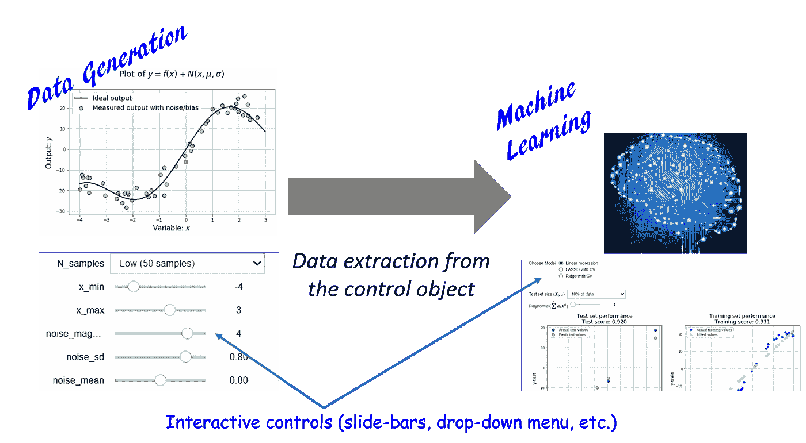

# 交互式机器学习:让 Python 再次“活跃”

> 原文：<https://towardsdatascience.com/interactive-machine-learning-make-python-lively-again-a96aec7e1627?source=collection_archive---------3----------------------->

## 当使用交互式小工具时，笔记本变得活跃起来。用户可以可视化和控制数据和模型的变化。学习变成了一种身临其境的、有趣的体验。

你已经用 Jupyter 编写了代码，Jupyter 是一个无处不在的笔记本平台，用于用几乎所有主流编程语言编写和测试很酷的想法。你喜欢它，你经常使用它。

> 但是你想要更多的控制，**你想要通过简单的点击鼠标来改变变量，而不是通过编写 for 循环**。你该怎么办？您可以使用 IPython 小部件。请继续阅读…

## 什么是 Python Widget？

Project Jupyter 诞生于 2014 年的 [IPython 项目](https://ipython.org)，并迅速发展到支持跨所有主要编程语言的交互式数据科学和科学计算。毫无疑问，它对数据科学家如何快速测试和原型化他/她的想法并向同行和开源社区展示工作产生了最大程度的影响。

然而，当用户可以交互地控制模型的参数并(几乎)实时地看到效果时，学习和实验数据就变得真正身临其境了。Jupyter 中大多数常见的渲染都是静态的。不过有一个[很大的努力，引入了名为 ***ipywidgets***](http://jupyter.org/widgets.html) 的元素，在 Jupyter 笔记本上渲染出有趣的交互控件。

> 小部件是多事件的 python 对象，在浏览器中有一个表示，通常是像滑块、文本框等控件。，通过前端(HTML/Javascript)呈现通道。

在之前的一篇文章[中，我使用基本的小部件控件演示了一个简单的曲线拟合练习。**请阅读那篇文章，了解关于安装这个小部件包**的说明。在本文中，这在交互式机器学习技术领域得到了进一步的扩展。](/a-very-simple-demo-of-interactive-controls-on-jupyter-notebook-4429cf46aabd)

## 交互式线性回归

我们使用交互控制元素演示单变量的简单线性回归。注意，该思想可以容易地扩展到复杂的多变量、非线性、基于核的回归。然而，为了简化可视化，我们在这个演示中坚持使用单变量的情况。

我的 Github 库 中有锅炉板块代码 [**。我们分两个阶段展示交互性。首先，我们将数据生成过程显示为输入变量和相关噪声统计属性的函数。这是一个视频，展示了用户使用简单的滑动条控件动态生成和绘制非线性函数的过程。**](https://github.com/tirthajyoti/Widgets)

这里，生成函数(又名“*地面真相*”)是四次多项式，噪声来自高斯分布。接下来，我们使用 [scikit-learn 的](http://scikit-learn.org/stable/) ***多项式特征生成*** 和 ***流水线方法*** 编写一个线性回归函数。此处 **给出了这样一个机器学习流水线过程的详细 [**分步指南。**在这里，我们将整个功能封装在另一个交互式控件中，以便能够动态地改变线性模型的各种参数。](/machine-learning-with-python-easy-and-robust-method-to-fit-nonlinear-data-19e8a1ddbd49)**

我们为以下超参数引入交互控制。

*   模型复杂性(多项式的次数)
*   规则化类型— [套索或山脊](https://www.analyticsvidhya.com/blog/2017/06/a-comprehensive-guide-for-linear-ridge-and-lasso-regression/)
*   测试集的大小(测试中使用的总样本数据的一部分)

以下视频显示了用户与线性回归模型的交互。请注意，测试和训练分数也是如何随着模型复杂性的变化而动态更新，以显示过度拟合或欠拟合的趋势。可以返回到数据生成控制，增加或减少噪声幅度，以查看其对拟合质量和偏差/方差权衡的影响。

## 摘要

我们简要介绍了一个 Jupyter 笔记本，它具有嵌入式交互控制对象，允许用户/程序员动态地处理数据集的生成和建模。当前演示允许用户引入噪声，改变模型复杂性，并检查正则化的影响，所有这些都在运行中，并立即看到最终的模型和预测。但整个想法在笔记本中以一步一步的方式进行了解释，这应该有助于感兴趣的读者试验这些小部件，并提出生动、交互式的机器学习或统计建模项目。

如果您有任何问题或想法要分享，请通过[**tirthajyoti【AT】Gmail[DOT]com**](mailto:tirthajyoti@gmail.com)联系作者。你可以查看作者的 [**GitHub 资源库**](https://github.com/tirthajyoti) 中其他有趣的 Python、R 或 MATLAB 代码片段和机器学习资源。此外，如果你像我一样对机器学习/数据科学/半导体充满热情，请随时[在 LinkedIn 上添加我](https://www.linkedin.com/in/tirthajyoti-sarkar-2127aa7/)或[在 Twitter 上关注我](https://twitter.com/tirthajyotiS)。