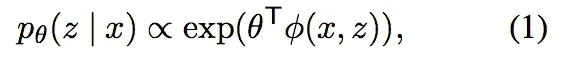
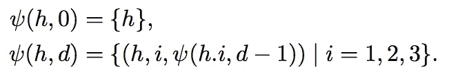
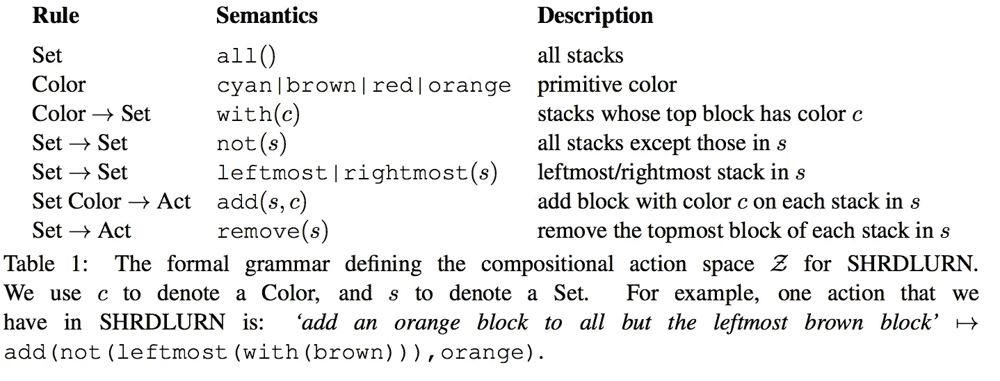
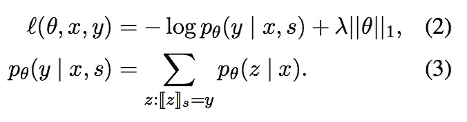
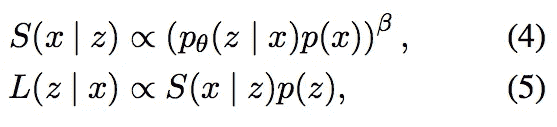
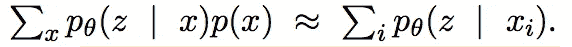
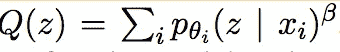

# 交互式(自然)语言学习

> 原文：<https://towardsdatascience.com/interactive-natural-language-learning-199b2c6bfa46?source=collection_archive---------7----------------------->

# 设置和模型/算法核心

## 设置

*游戏*中的两个玩家:*人类*和*电脑*。

游戏:通过固定数量的关卡进行。

对于人机之间的每一个层次:在 **Y** 中，人类和计算机都有一个起始状态 **s** ，但在 **Y** 中，只有人类知道目标状态 **t** 。

*   人类给计算机说话 **x**
*   计算机在 **Z** 中构造动作 **z** 的排序列表，然后对于给定当前状态 **s** 的 **z** 中的每个**子**，它计算排序后的后继状态 **yi** 并返回给人类。
*   然后，人类根据他/她的发言 **x** 选择后继状态**易**(如果 i ==1，则计算机是正确的)
*   状态更新为 s = yi
*   如果 s==t，则该级别结束

玩家进入下一关

## 模型和算法核心

## 语义分析

逻辑形式(动作)上的对数线性模型 **z** 给定话语 **x**

其中φ(x，z) ∈ R^d 是特征向量，θ ∈ R^d 是要学习的参数向量。

## 特征

n-grams(包括跳格)在逻辑形式方面与树-gram 连接

*   话语方:(' stack red on orange ')、一元语法(' stack '、∑、∑)、二元语法(' red '、' on '、∑)、三元语法(' red '、' on '、' orange ')和跳过三元语法(' stack '、∑、' on ')。
*   逻辑形式方面:特性对应于逻辑形式中的谓词及其参数。

*   特性对应于逻辑形式中的谓词及其参数。

## 生成/解析

在生成逻辑形式中使用波束搜索:对于每个大小 n = 1，.。。，8，通过根据语法规则组合较小大小的逻辑形式，构造一组大小为 n 的逻辑形式(正好有 n 个谓词)。

对于每个 n，保留 100 个逻辑形式 **z** 具有最高得分θ^Tφ(x，z)。

但是， **Z** 不保证包含获得观察状态 **y** 的逻辑形式。所以在训练中**使用一个课程，这样在初级阶段只需要简单的动作**，给人类一个机会，在移动到更大的复合动作之前，先教计算机一些基本的术语，比如颜色

## 学问

使用 AdaGrad 和以下损失函数进行单一梯度更新:

## 建模语用学

通过对上述语义解析模型的初步体验，他们发现它能够很好地学习，但**缺乏人类学习者所具有的推理能力**。

## 想法

把语言游戏当成说话者(人)和听话者(计算机)之间的**合作**游戏。

形式上，让 S(x | z)是说话者的策略，L(z | x)是听话者的策略。说话者考虑字面语义分析模型 pθ (z | x)以及话语上的先验 p(x ),而听者考虑说话者 S(x | z)和先验 p(z ):

然后，计算机将使用 L(z | x)而不是 pθ对候选人进行排名

务实的倾听者将说话者塑造成一个合作的代理人，他以一种**的方式最大限度地成功交际。**

## 在线学习

使用了两种近似技巧:

1.  近似所有话语 x 上的难以处理的和，我们仅使用看到的例子来计算归一化常数

1.  为了避免使用每个新示例存储的当前参数再次解析所有以前的示例

关于在线学习算法的详细解释，请参考[论文](https://arxiv.org/pdf/1606.02447.pdf)中的**语用在线学习**。

# 相关研究

1.  透过互动学习让程式语言自然化。(2017).**来自同一组**
2.  [项目链接在这里](http://www.voxelurn.com/#/about)。
3.  [一个视频链接](https://www.youtube.com/watch?v=7clXX0g3Znw&feature=youtu.be)
4.  本文从一种核心编程语言开始，允许用户通过定义替代的、更自然的语法和越来越复杂的概念来逐渐“适应”核心语言。
5.  高迪尔，乔恩和伊戈尔·莫达奇。"情境和目标驱动的语言学习模式."更正 abs/1610.03585 (2016 年):n. pag。
6.  本文提出了一种通用的情境语言学习范式，旨在产生能够与人类有效合作的健壮的语言主体。这种对话模式是建立在语言理解的功利主义定义之上的。功利主义的定义是由最近**强化学习**方法的成功所激发的。在强化学习环境中，代理最大化现实世界任务的成功度量，而不需要直接监督语言行为。
7.  李，纪伟等，《在对话互动中学习》更正 abs/1612.04936 (2016 年):n. pag。[代码](https://github.com/facebook/MemNN/tree/master/AskingQuestions)
8.  本文通过设计一个模拟器和一组电影领域的综合任务来探索(一般)学习，这些任务允许学习者和教师之间进行**互动**。
9.  他们认为一个好的对话代理应该有能力通过回答问题和提问与用户互动，重要的是从两种互动中学习。

# 参考

1.  [王，司大一等:“在互动中学习语言游戏”更正 abs/1606.02447 (2016): n. pag。](https://arxiv.org/abs/1606.02447)
2.  [shrdurn web 演示](http://shrdlurn.sidaw.xyz)、[日历应用演示](https://www.youtube.com/watch?v=PfW4%5C_3tCiw0&feature=youtu.be)
3.  [shrd 返回代码，数据，并在 CodaLab 上进行实验](https://worksheets.codalab.org/worksheets/0x9fe4d080bac944e9a6bd58478cb05e5e)，[shrd 返回客户端代码](https://github.com/sidaw/shrdlurn/tree/acl16-demo)
4.  王，四大一等，“通过交互学习自然化程序设计语言”(2017).
5.  高捷、乔恩和伊戈尔·莫尔达奇。"情境和目标驱动的语言学习模式."更正 abs/1610.03585 (2016 年):n. pag。
6.  [李，纪伟等.“在对话互动中学习”更正 abs/1612.04936 (2016 年):n. pag。](https://www.semanticscholar.org/paper/Learning-Through-Dialogue-Interactions-Li-Miller/2685cab753e4c1e9ac6e68b28ad8e2e1f3673f73)