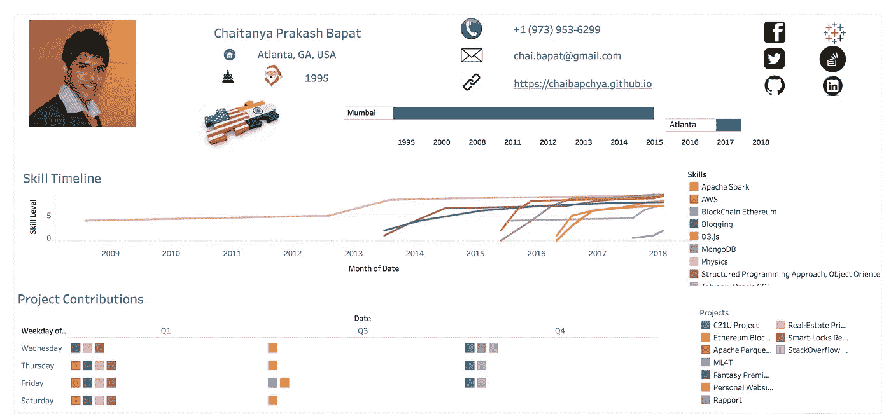

# 使用 Tableau 的交互式简历

> 原文：<https://towardsdatascience.com/interactive-resume-tableau-a1a1bbf86c85?source=collection_archive---------7----------------------->

Static version of my Tableau Resume

对于 2018 年春季学期，我参加了由*教授 Rahul Basole* 讲授的 **MGT CS 8803 数据可视化原理和应用课程**，在那里我了解了#datavisualization (#dataviz)的方方面面。

几个课程目标是:-

*   了解人类感知和认知能力，以设计有效的数据可视化。
*   根据最终用户的目标和目的，评论不同的可视化技术
*   了解如何使用商业和开源软件工具设计和实现数据可视化。

作为作业的一部分，我们被要求将专业简历转换成数据可视化。因此，在这里我开始思考如何用素描来完成它，这对于其他人来说可能更容易，但对我来说要复杂得多。有时，灵活性会成为障碍。

Tableau 作为一种数据可视化工具，在演示文稿、仪表盘、统计(定量和定性分析)中经常使用。但是在我看来，把它用于交互式简历是一种严重利用不足的应用。做完这个练习后，如果有人问我你更喜欢哪份简历，我会左右为难。不是因为我做了这两项，而是因为可视化有效地将观点传达给了用户(在这种情况下是读者)。

## **数据**

这种可视化的数据既不容易在网上获得，简历也不能以其原始形式使用。Tableau 足够健壮，可以接受来自各种数据源(JSON、PDF、MySQL、Excel 等)的数据，但它需要大量的数据管理才能使其可用。对于这个任务，我专注于使用数据来揭示我的技能和项目贡献。虽然我的 LinkedIn 和 Github 个人资料上有这些内容，但 Tableau 不一定能马上导入和使用这些内容(至少我还没有找到一种方法来导入网站链接并即时使用这些信息)。

## 形象化

## 1.项目捐款

目的是更好地可视化 Github 的贡献。我使用了简单的文本表格，但是以 Github 的方式。不同于通常在一个轴上分配时间，在另一个轴上分配数量特征，我在两个轴上都使用了时间(日期)。工作日在行，季度为列。Github 将其进一步细化到每月，给出全年的概况。由于空间的限制，我不得不满足于四分之一。人们可以看到我对 Github 的贡献并与 Tableau 进行比较。

## **2。技能时间表**

我希望它是一个垂直的时间线(像传统的简历)，但 Tableau 不允许垂直的时间线(到目前为止)。我将技能时间线显示为多年来技能水平总和的趋势。颜色显示技能的细节。该视图根据技能进行筛选，保留 10 个成员中的 9 个。组织和工作等附加信息已被编码为标签。

## Tableau 仪表板

Tableau 上的仪表板帮助用户将不同的工作表缝合在一起。它有助于统一所有数据，并利用链接特性来触发跨多个工作表的交互。此外，Tableau Public 允许用户在他们的平台上发布他们的 Tableau 仪表盘，以便轻松分享他们的工作。这是一个非常方便的工具，可以让你的可视化快速启动和运行。

这是我的期末成绩，可以和我在[网站](https://chaibapchya.github.io/about)上找到的[简历](https://chaibapchya.github.io/cv.pdf)相比较。