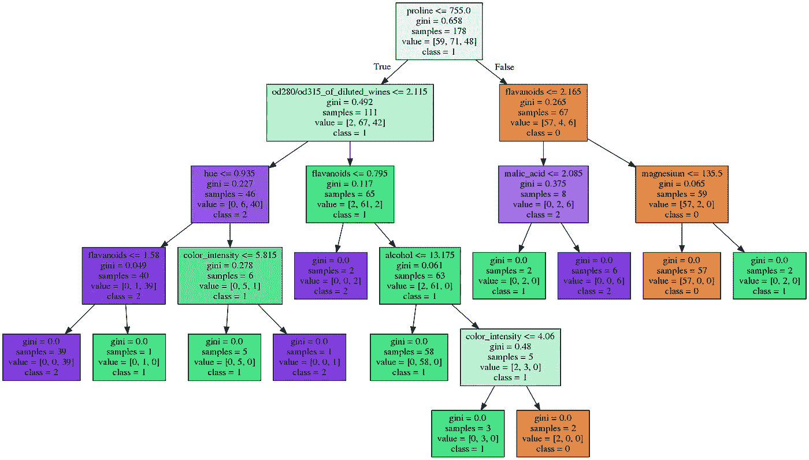
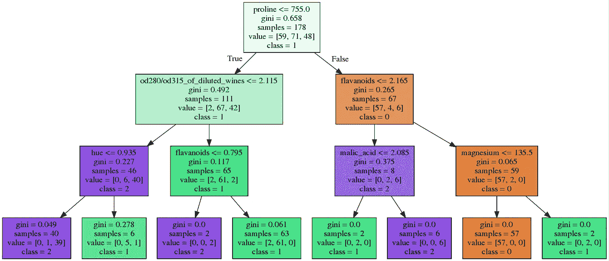
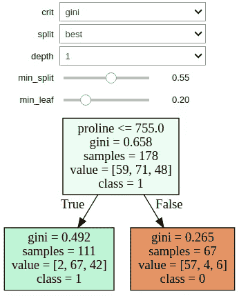

# 用 Jupyter 窗口小部件实现决策树的交互式可视化

> 原文：<https://towardsdatascience.com/interactive-visualization-of-decision-trees-with-jupyter-widgets-ca15dd312084?source=collection_archive---------2----------------------->


Photo by [Aaron Burden](https://unsplash.com/photos/Qy-CBKUg_X8?utm_source=unsplash&utm_medium=referral&utm_content=creditCopyText) on [Unsplash](https://unsplash.com/search/photos/trees?utm_source=unsplash&utm_medium=referral&utm_content=creditCopyText)

决策树是广泛用于分类和回归任务的监督模型。在本文中，我们将讨论决策树分类器，以及如何动态地可视化它们。这些分类器在训练数据上建立一系列简单的 if/else 规则，通过它们来预测目标值。决策树很容易解释，因为它们的结构和我们可视化建模树的能力。

使用 sk learn[*export _ graphviz*](http://scikit-learn.org/stable/modules/generated/sklearn.tree.export_graphviz.html)函数，我们可以在 Jupyter 笔记本中显示该树。在这个演示中，我们将使用 sklearn [葡萄酒数据集](http://scikit-learn.org/stable/modules/generated/sklearn.datasets.load_wine.html)。

```
from sklearn.tree import DecisionTreeClassifier, export_graphviz
from sklearn import tree
from sklearn.datasets import load_wine
from IPython.display import SVG
from graphviz import Source
from IPython.display import display# load dataset
data = load_wine()

# feature matrix
X = data.data

# target vector
y = data.target

# class labels
labels = data.feature_names

# print dataset description
print(data.DESCR)estimator = DecisionTreeClassifier()
estimator.fit(X, y)

graph = Source(tree.export_graphviz(estimator, out_file=None
   , feature_names=labels, class_names=['0', '1', '2'] 
   , filled = True))display(SVG(graph.pipe(format='svg')))
```



Decision Tree with default parameters

在树形图中，每个节点都包含分割数据的条件(if/else 规则)，以及该节点的一系列其他指标。Gini 指的是 Gini 杂质，节点杂质的度量，即节点内样本的同质程度。当一个节点的所有样本都属于同一个类时，我们说这个节点是纯的。在这种情况下，没有必要进一步分裂，这个节点被称为叶。Samples 是节点中实例的数量，而 value 数组显示每个类中这些实例的分布。在底部，我们可以看到节点的多数类。当 *export_graphviz 的 *filled* 选项*设置为 *True* 时，每个节点根据多数类进行着色。

虽然很容易理解，但决策树往往会通过构建复杂的模型来过度拟合数据。过度拟合的模型很可能不能很好地概括“看不见的”数据。防止过拟合的两种主要方法是预修剪和后修剪。预修剪是指在创建树之前限制树的深度，而后修剪是指在构建树之后移除无信息的节点。

Sklearn 学习决策树分类器只实现预剪枝。预修剪可以通过几个参数来控制，例如树的最大深度、节点保持分裂所需的最小样本数以及叶子所需的最小实例数。下面，我们在相同的数据上绘制一个决策树，这次设置 max_depth = 3。



Decision Tree with max_depth = 3

这个模型没有我们最初训练和绘制的模型那么深入，因此也没有那么复杂。

除了预修剪参数，决策树还有一系列其他参数，我们在构建分类模型时会尝试优化这些参数。我们通常通过查看准确性度量来评估这些参数的效果。为了掌握参数的变化如何影响树的结构，我们可以再次在每个阶段可视化树。我们可以利用[Jupyter Widgets](http://jupyter.org/widgets)(ipywidgets)来构建我们的树的交互式绘图，而不是每次做出改变时都绘制一个树。

Jupyter 小部件是交互式元素，允许我们在笔记本中呈现控件。安装 ipywidgets 有两个选项，通过 pip 和 conda。

和皮普一起

```
pip install ipywidgets
jupyter nbextension enable --py widgetsnbextension
```

与康达

```
conda install -c conda-forge ipywidgets 
```

对于这个应用程序，我们将使用[交互](http://ipywidgets.readthedocs.io/en/latest/examples/Using%20Interact.html#interactive)功能。首先，我们定义一个训练和绘制决策树的函数。然后，我们将这个函数以及每个感兴趣的参数的一组值传递给交互函数。后者返回一个我们用 display 显示的小部件实例。

```
from sklearn.tree import DecisionTreeClassifier, export_graphviz
from sklearn import tree
from sklearn.datasets import load_wine
from IPython.display import SVG
from graphviz import Source
from IPython.display import display                               
from ipywidgets import interactive# load dataset
data = load_wine()# feature matrix
X = data.data# target vector
y = data.target# class labels
labels = data.feature_names
def plot_tree(crit, split, depth, min_split, min_leaf=0.2):estimator = DecisionTreeClassifier(random_state = 0 
      , criterion = crit
      , splitter = split
      , max_depth = depth
      , min_samples_split=min_split
      , min_samples_leaf=min_leaf)
    estimator.fit(X, y)graph = Source(tree.export_graphviz(estimator
      , out_file=None
      , feature_names=labels
      , class_names=['0', '1', '2']
      , filled = True))

    display(SVG(graph.pipe(format='svg')))return estimatorinter=interactive(plot_tree 
   , crit = ["gini", "entropy"]
   , split = ["best", "random"]
   , depth=[1,2,3,4]
   , min_split=(0.1,1)
   , min_leaf=(0.1,0.5))display(inter)
```



Initial view of widget

在本例中，我们公开了以下参数:

*   标准:节点处分割质量的度量
*   拆分器:每个节点的拆分策略
*   max_depth:树的最大深度
*   min_samples_split:节点中所需的最小实例数
*   min_samples_leaf:一个叶节点所需的最小实例数

最后两个参数可以设置为整数或浮点数。浮动被解释为实例总数的百分比。关于参数的更多细节，你可以阅读 sklearn 类[文档](http://scikit-learn.org/stable/modules/generated/sklearn.tree.DecisionTreeClassifier.html#sklearn.tree.DecisionTreeClassifier)。

Widget demonstration

这个交互式小部件允许我们修改树参数，并动态地查看图形变化。通过这种相互作用，我们能够通过揭示每一步产生的变化来掌握每个参数的影响。

虽然这不是模型性能评估或参数调整的工具，但它有几个好处。通过检查深度、节点数量和叶子的纯度，它可以作为评估模型复杂性的一种手段。另一方面，它可以给我们关于数据的有用见解，因为我们可以看到树使用了多少和哪些特性。此外，我们也许能够发现清楚地将我们的样品区分到不同类别的条件。

总之，我发现这种交互式可视化是一种有趣的工具，可以更深入地理解构建决策树的抽象过程，脱离特定的数据集，这将为我们下次为我们的一个项目构建决策树提供一个良好的开端！