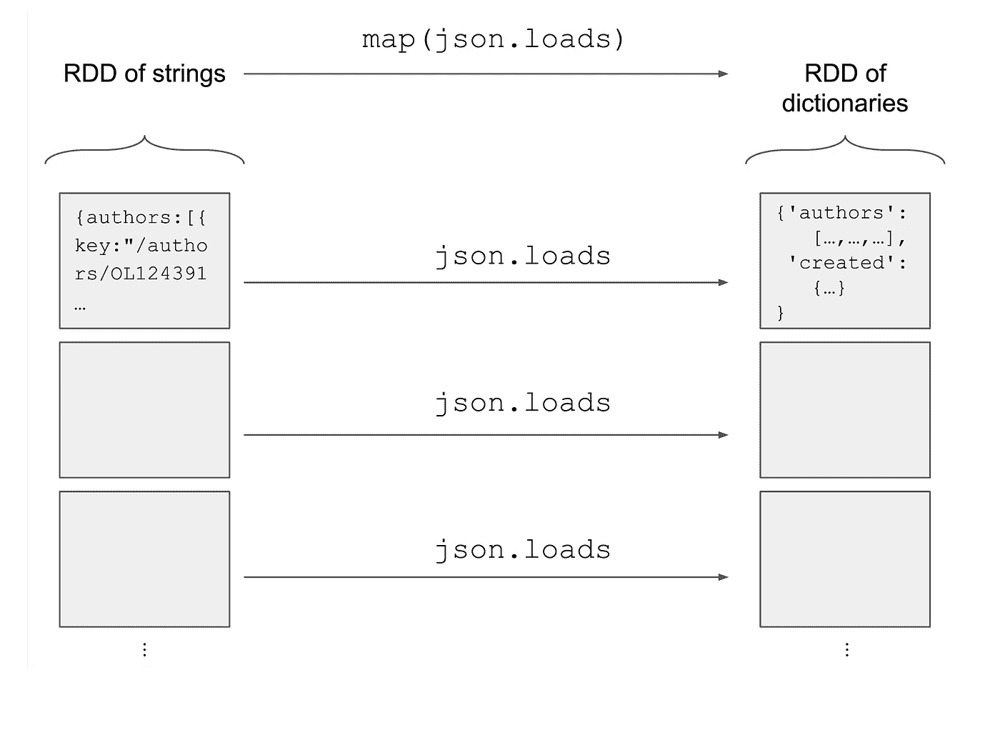
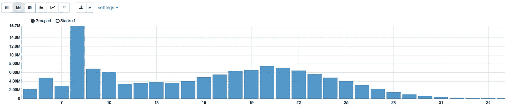
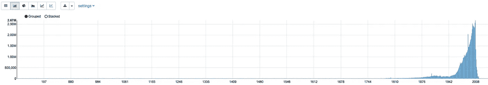

# 使用 Spark 交互式分析 100 GB JSON 数据

> 原文：<https://towardsdatascience.com/interactively-analyse-100gb-of-json-data-with-spark-e018f9436e76?source=collection_archive---------2----------------------->

你知道有史以来印刷的最重的书是什么吗？让我们通过使用 Python 中的 [Spark](https://spark.apache.org/) 探索[开放库](https://openlibrary.org/)数据集来找出答案。

本教程的目的是教育，最初由**Valentin Dali bard 博士**和**Raoul-Gabriel Urma 博士**:[https://Cambridge Spark . com/content/tutorials/interactive-analyze-100 GB-of-JSON-data-with-Spark/index . html](https://cambridgespark.com/content/tutorials/interactively-analyse-100GB-of-JSON-data-with-Spark/index.html)

您将初步了解 Spark 中的一些可用操作，以及如何使用这些操作来交互式地探索在 Excel 等简单工具中不方便使用(由于大小和结构)的数据集。您还将看到如何在 Spark 中轻松表达 MapReduce 操作。注意，我们使用 Spark 以一种方便的方式运行一个特别的分析。还有其他方法可以分析这个数据集，比如使用 [Impala](http://impala.apache.org/) 。

在本教程中，您将学习:

*   如何开始使用 Spark，
*   如何使用`map`、`flatMap`、`filter`和`reduce`模式，以及
*   如何使用`groupByKey`和`reduceByKey`功能。

# 数据集

开放图书馆是一项旨在为“每本已出版的书创建一个网页”的倡议您可以在终端中使用以下命令下载他们的数据集，该数据集大约有 20GB 的压缩数据。`--continue`标志让您可以分几次下载数据。

```
wget --continue [http://openlibrary.org/data/ol_cdump_latest.txt.gz](http://openlibrary.org/data/ol_cdump_latest.txt.gz)
```

然后，您可以使用以下命令提取数据—您需要大约 100GB 的可用空间:

```
gunzip -k ol_cdump_latest.txt.gz | cut -f 5 > ol_cdump.json
```

要使用 EC2 上的数据集，请将其上传到亚马逊 S3。使用以下命令，使用您的 S3 存储段名称，将数据上传到 S3。像前三步一样，这一步需要时间来完成。

```
aws s3 cp ol_cdump.json s3://my_bucket
```

或者，如果你想处理更小的数据集以节省时间，你可以从 https://s3-eu-west-1.amazonaws.com/csparkdata/ol_cdump.json 的[下载一个数据样本。下面的技术是可行的，但是结果会有所不同。](https://s3-eu-west-1.amazonaws.com/csparkdata/ol_cdump.json)

如果你想在本地分析数据，你可以在你自己的机器上安装 PySpark，忽略 Amazon 的设置，直接跳到数据分析。

# 启动亚马逊 EMR

如果您想在集群上开始使用 Spark，一个简单的选项是[Amazon Elastic MapReduce(EMR)](https://aws.amazon.com/emr/)。它为您提供了一个包含几台预配置了 Spark 的机器的集群。如果您需要快速处理存储在 S3 上的大型文件，这将非常有用。

这里有一个 youtube 视频向你展示如何开始:

# 开始一本齐柏林飞船笔记本

亚马逊 EMR Spark 实例与 [Zeppelin 笔记本](http://zeppelin-project.org/)一起提供:jupyter 笔记本的替代品，直接运行在 Spark 之上。点击亚马逊 EMR 上的 Zeppelin 链接，打开 Zeppelin 笔记本。

Zeppelin 允许在同一个笔记本中使用多种语言。使用单元格顶部的`%pyspark`来运行 Python 命令。

```
%pyspark
print("Hello")
```

或者，您可以执行 shell 指令:

```
%sh
echo "World !"
```

# 导入数据集

第一步是在一个 *Spark RDD* 中加载数据集:一个抽象数据处理方式的数据结构——在分布式模式下，数据在机器之间分割——并允许您应用不同的数据处理模式，如过滤、映射和简化。要了解更多关于 rdd 以及本教程其余主题的信息，请查看[我们的大数据训练营](https://cambridgespark.com/courses/bigdata)。

您可以读取文件，并使用操作`textFile`将每一行转换成 RDD 的一个元素。

```
path = "s3://my_bucket/ol_cdump.json"
raw_data = sc.textFile(path)
```

请注意，如果您正在使用文件的本地副本，您可以将一个标准文件路径(例如，`ol_cdump.json`)传递给该函数。

RDD 中的每个元素都是代表一个 json 值的单个字符串。因此，第二步是在 Python 字典中转化这些元素，以便更容易地分析它们。`json.loads`函数将一个 JSON 值解析成一个 Python 字典。方法`.map(f)`返回一个新的 RDD，其中`f`已经应用于原始 RDD 中的每个元素。将两者结合起来解析 RDD 的所有行。

```
import json
dataset = raw_data.map(json.loads)
dataset.persist()
```

注意，代码还调用了方法`.persist()`来缓存内存中的 RDD，以便以后可以直接重用。

RDD 数据集中的每个元素现在都是一个将键映射到值的字典。



# 探索性数据分析

您可以从找出条目的数量开始:

```
dataset.count()
```

这将返回 *126，107，177* 。还不错，书挺多的！

您可以使用`first`操作偷偷查看数据，返回第一个元素。或者，`take(k)`返回第一个`k`元素的列表

```
dataset.take(10)
```

输出相当长。但是你会看到返回的条目包含了`number_of_pages`、`title`、`weight`、`isbn_10`等书籍属性。

为了理解您所拥有的数据的形状，您可以提取字典中所有可用的不同键。你可能想再次使用`map`操作，但是你必须使用`flatMap`来代替。实际上，对于每一个字典，您提取一个键列表，所以`map`将产生一个键列表的 RDD。使用`flatMap`，所有的键都被折叠成一个单一的平面 RDD。考虑`flatMap`的一种方式是，它允许您对每个元素应用一对多的转换，而不是像`map`那样一对一。

在这个 RDD 键上，您可以使用`distinct`删除重复的键。最后，使用`collect`操作将惟一键的 RDD 提取到一个 Python 列表中。

```
keys = dataset.flatMap(**lambda** d: d.keys()).distinct().collect()
len(keys)
```

有 *504* 唯一键！一本书有很多不同的属性。

实际上，并不是所有的 JSON 对象都有相同的属性:经常会缺少属性。例如，数据库可能提到一本书的页数，但不一定提到它的印刷尺寸。这就是你从真实世界的数据中得到的。在开放图书馆数据集中，你会发现很多多样性！为了探索这种多样性，您可以使用`groupByKey`对每个元素的属性数量进行分组:

```
groups = dataset.map(**lambda** e: (len(e.keys()), e)).groupByKey()
```

但是坚持住！这实际上根本不是好的做法！您可以拥有一个最常见的键数，其中包含大量与该键相关联的数据，比如 20GB。在这种情况下，您将创建一个 20GB 的 Python 列表，这会使您的机器崩溃或导致交换。

计算相同结果的更好方法是使用`reduceByKey`:

```
count_per_key = (
    dataset
    .map(**lambda** e: (len(e.keys()), 1))
    .reduceByKey(**lambda** x, y: x + y)
    .collect()
  )
```

`reduceByKey`操作将为每个键生成的`1`相加，最终返回每个属性的计数。Zeppelin 在这里非常有用，因为它让您可以通过其界面直接可视化结果:

```
print("%table")
**for** e in count_per_key:
  print("%d\t%d" % (e[0], e[1]))
```



# 告诉我重量

你设法获得了一些关于数据的见解。不如来点更有趣的东西，你可以在高级晚宴上提出来？你很幸运。JSON 的一个属性是每本书的重量。你好奇想知道最重的书是什么吗？让我们希望这至少是一本有趣的书。当您浏览数据集时，您会注意到`weight`属性有不同的单位:kg、g、盎司、磅等。一切都很乱！你将需要一个函数，可以正常化的重量，所以你可以比较每本书:

```
**def** sanitizedWeight(weight_str):
  w = convertToKilograms(weight_str)
  **if** w > 1e6:  *#books above 1e6 kg are errors*
    **return** 0.0
  **else**:
    **return** w**def** convertToKilograms(weight_str):
  result = weight_str.split()
  **if**(len(result)) != 2:
    **return** 0
  **try**:
    number = float(result[0])
  **except** ValueError:
    **return** 0
  **if**(result[1] == 'pounds' or result[1] == 'lb' or result[1] == 'lbs'):
    **return** number * 453.592 * 1e-3
  **elif**(result[1] == 'ounces' or result[1] == 'oz' or result[1] == 'oz.'):
    **return** number * 28.35 * 1e-3
  **elif**(result[1] == 'grams' or result[1] == 'gms' or result[1] == 'g'):
    **return** number * 1e-3
  **elif**(result[1] == 'kilograms' or result[1] == 'kilo' or result[1] == 'kg'):
    **return** number
  **else**:
    **return** 0
```

注意，仍有少数带有权重属性的书籍被该函数忽略。有些重量的数字和单位之间没有空格，有些是不寻常的大写字母(GM，KGms)，有些是错别字(ounds)，有些是其他奇怪的符号。让我们把重点放在分析数据集上——但是如果您愿意，可以随意改进这个解析器。

要找到最重的书，你只需要迭代数据并减少它，每次选择最重的书。

```
heaviest_book = (
    dataset
    .filter(**lambda** e: "weight" in e and "title" in e)
    .map(**lambda** e: (e, sanitizedWeight(e["weight"])))
    .reduce(**lambda** x, y: x **if** x[1]>y[1] **else** y)
  )
```

那么答案是什么呢？不幸的是，这是一个有点失望，输出是一本书的 *200，000 磅*(刚刚超过 90 公吨)与扼杀标题！

```
({… u'weight': u'200000 pounds', …,  u'title': u'u fool,stupid', …}, 90718.40000000001)
```

显然有人在数据库中插入了一个虚拟条目！这有点令人失望。

想象一下书是什么时候出版的怎么样？您可以使用所学的操作生成以下查询:

```
booksWithDate = (
    dataset
    .filter(**lambda** e: "publish_date" in e)
    .map(**lambda** e: (e["publish_date"], 1))
    .reduceByKey(**lambda** x, y: x + y)
    .collect()
  )**def** is_int(s):
  **try**:
    t = int(s)
    **return** True
  **except** ValueError:
    **return** FalsebooksWithDate = (
    dataset
    .filter(**lambda** e: "publish_date" in e)
    .filter(**lambda** e: len(e["publish_date"]) >=4)
    .filter(**lambda** e: is_int(e["publish_date"][-4:]))
    .map(**lambda** e: (int(e["publish_date"][-4:]), 1))
    .reduceByKey(**lambda** x, y: x+y)
    .collect()
  )
```

同样，在处理真实年份之前，您需要处理和清理数据。您现在可以使用 Zeppelin 中的可视化功能来获得一个不错的分布:

```
print("%table")
**for** r in d:
  print("%d\t%d" % (r[0], r[1]))
```



**如果您对 Spark 和大数据系统更感兴趣，请查看我们即将举办的网络研讨会系列:**

[](https://cambridgespark.com/webinar) [## 数据科学网络研讨会系列

### 在世界各地加入我们，了解数据科学、大数据分析和在以下领域使用的先进技术…

cambridgespark.com](https://cambridgespark.com/webinar) 

**与此同时，你可以测试你的星火技能，尝试找到这些问题的答案:**

*   数据集里哪个作者写的或者合著的书最多？
*   数据集中哪一类书最受欢迎？