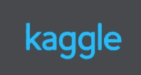
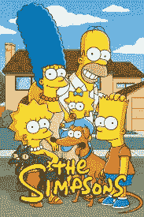
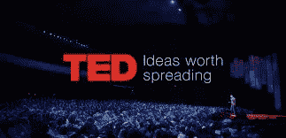

# Kaggle.com 有趣的数据集

> 原文：<https://towardsdatascience.com/interesting-datasets-on-kaggle-com-3a4a250b0b85?source=collection_archive---------6----------------------->

Kaggle.com 是数据科学家和机器学习工程师中最受欢迎的网站之一。虽然 Kaggle 还没有 GitHub 受欢迎，但它是一个正在崛起的社交教育平台。

这是一个数据科学家寻找有趣数据集的好地方，他们已经做了一些预处理。你可以找到图像数据集，CSV，金融时间序列，电影评论等。此外，所有这些数据集都可以从 kaggle.com 完全免费下载。

55，000 首歌词— CSV

这个数据集是一个矩阵，由每首歌曲的快速描述和文本挖掘中的整首歌组成。需要做一些预处理，将这个数据集导入字符级递归神经网络。然而，对于这项任务来说，这是一个非常大的数据集，使用 RNN 来学习生成歌词的结果非常令人印象深刻。如果在本地笔记本电脑上运行，预计这个模型需要一点时间来训练，训练这个模型是开始在 Jupyter 笔记本电脑中使用 EC2 实例进行数据科学项目的一个很好的练习。

[获取数据集](https://www.kaggle.com/mousehead/songlyrics)

辛普森一家人物数据-图像

对于神经网络风格转换算法来说，这是一个非常有趣的数据集。这些算法可能很难构建，但尝试将真实人脸映射到辛普森一家角色的风格将是一个非常有趣的项目。这项技术可能会为电视节目的动画软件带来重大变革，如《瑞克和莫蒂》、《一家人》、《F 代表家庭》、《杰克骑士》等。

[获取数据集](https://www.kaggle.com/alexattia/the-simpsons-characters-dataset)

SF 工资— csv

开始使用 RNN/序列模型的绝佳数据集。

水果 360 数据集—图像

难以置信的图像数据集，轻量级文件，(只有 386 MB 的图像数据集)。非常适合对不同类型的水果进行分层，这些水果有可能被用于改善工业化农业。这也是一个有趣的数据集，可以用来玩生成对立网络，生成独特的水果设计。

[获取数据集](https://www.kaggle.com/moltean/fruits)

通过声音识别性别—带音频统计的 csv

我希望看到这个数据集作为原始音频文件，但是，仍然有可能建立一个神经网络分类器，将能够把语音数据分为男性和女性。这些模型有一些有趣的应用程序，如 Siri 和 Alexa。

[获取数据集](https://www.kaggle.com/primaryobjects/voicegender/version/1#)

南方公园对话—包含对话句子的文本 csv

对于单词级递归神经网络来说，这可能是一个非常有趣的测试。想象神经网络算法在《南方公园》等喜剧节目中写笑话或台词，是一件很迷人的事情。这个软件对于许多不同媒介的小说作者来说非常有用。

[获取数据集](https://www.kaggle.com/tovarischsukhov/southparklines)

TED 演讲— csv

非常有趣的文本挖掘数据集。使用诸如 TED 演讲的描述、持续时间、时间和地点作为 TED 演讲视频在线评论数量的预测指标。

[获取数据集](https://www.kaggle.com/rounakbanik/ted-talks)

各国幸福报告— csv

参与社会科学研究的人将他们的快乐程度从 0 到 10 分不等。这些参与者按照他们的国家和地区进行地理排序。对于 Google Maps API 或 D3.js 可视化库来说，这是一个很大的地图可视化问题。

关于使用谷歌地图的更多信息，请查看他们的 API 文档页面:

【https://developers.google.com/maps/documentation/ 

当我完成上传我的 Keras 项目，在耐克和阿迪达斯篮球鞋上建立一个图像识别分类器时。创建我自己的数据集帮助我更加欣赏 Python 中的 web 管理数据集和 web 抓取 html 解析工具。如果您对使用这些数据集之一构建图像识别模型感兴趣，请查看该项目。

 [## 如何构建卷积网络分类器:耐克 vs 阿迪达斯鞋

### 我为#100DaysOfMLCode 做的一个实验是建立一个图像分类器，它可以区分 Nike…

blog.usejournal.com](https://blog.usejournal.com/how-to-build-a-convolutional-network-classifier-81eef880715e) 

# [CShorten](https://medium.com/@connorshorten300)

Connor Shorten 是佛罗里达大西洋大学计算机科学专业的学生。对数据科学、深度学习和软件工程感兴趣。主要用 Python，JavaScript，C++编码。请关注更多关于这些主题的文章。