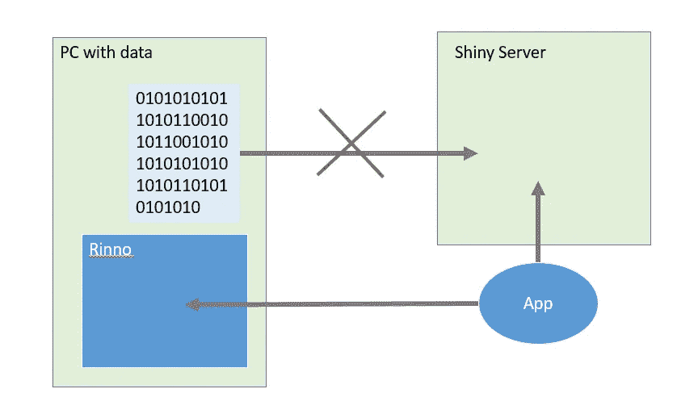

# 来自 R/Pharma 的有趣包装

> 原文：<https://towardsdatascience.com/interesting-packages-taken-from-r-pharma-e89639788180?source=collection_archive---------12----------------------->

几个月前，我参加了马萨诸塞州剑桥的 R/Pharma 会议。


作为一个收获，我想到了我的项目，以及如何利用别人提供的解决方案进行改进。 *R* 中的解决方案主要是 *R 包。*我是一名在监管环境下的优秀程序员，所以我列出的解决方案主要是为了帮助你，如果你提供 a)优秀的应用程序 b)统计软件包 c)经过验证的解决方案。让我们来看看哪些 R 包我以前不知道，现在发现确实有用:

# 个人信息管理程序

我的大多数同事制作的是报告。实际上是大量的统计报告。由于我们在受监管的环境中工作，所有报告都要经过双重检查。意思是你给它编程，别人也给它编程。你不想浪费时间，因为有一个数学包的更新导致了数字的差异。有一个非常好的解决方案。

Packrat 允许您存储在某个会话/项目中使用的所有包。packrat 的主要指南可以在描述 it 的 [RStudio 博客中找到。](https://rstudio.github.io/packrat/commands.html)

Packrat 不仅会存储所有的包，还会存储所有的项目文件。它集成在 RStudio 的用户界面中。它让你可以很快地与不同的同事分享项目。

我认为主要的不足是需要一个服务器，在那里你存储所有这些包。这个应该可以用 RStudio 新的[包管理器](https://www.rstudio.com/products/package-manager/)解决。另一个缺点是与一些软件包不兼容。我注意到我不能用 packrat 使用 R-3.4.2 下的 BH 包，必须找到一个解决办法。

# Diffdf

我必须告诉你，我浪费了将近 30%的时间来比较数据。这是测试统计结果或用你编写的统计应用程序进行计算的一项重要任务。在制药和诊断应用中，最相关的方面之一是数据的有效性。确保我们在临床研究、质量保证或日常工作中使用的数据来自同事。对我来说，这个任务不仅很难，而且更难记录。

基兰·马丁的 [diffdf](https://cran.r-project.org/web/packages/diffdf/index.html) 包真正解决了这个任务。它不仅为你提供了一个整洁的界面，还提供了精心安排的结果。

基本的 diffdf 示例如下所示:

```
library(diffdf)
iris2 <- iris
for (i in 1:3) iris2[i,i] <- i^2
iris2$new_var <- "hello"
class(iris2$Species) <- "some class"
diffdf(iris, iris2)
```

您可以看到，基本上新引入了一个列，在 3 个不同的数字列中更改了三个值，并且更改了一个列的类型。所有这三个变化都显示在单独的输出中。此外，还提到了没有变化的内容，如果您没有检查正在比较的数据帧是否完全相等，这可能会非常有帮助。

```
Differences found between the objects!

A summary is given below.

There are columns in BASE and COMPARE with different classes !!
All rows are shown in table below

  ==================================
   VARIABLE  CLASS.BASE  CLASS.COMP 
  ----------------------------------
   Species     factor    some class 
  ----------------------------------

There are columns in COMPARE that are not in BASE !!
All rows are shown in table below

  =========
   COLUMNS 
  ---------
   new_var 
  ---------

Not all Values Compared Equal
All rows are shown in table below

  =================================
     Variable    No of Differences 
  ---------------------------------
   Sepal.Length          1         
   Sepal.Width           1         
   Petal.Length          1         
  ---------------------------------

All rows are shown in table below

  ============================================
     VARIABLE    ..ROWNUMBER..  BASE  COMPARE 
  --------------------------------------------
   Sepal.Length        1        5.1      1    
  --------------------------------------------

All rows are shown in table below

  ===========================================
    VARIABLE    ..ROWNUMBER..  BASE  COMPARE 
  -------------------------------------------
   Sepal.Width        2         3       4    
  -------------------------------------------

All rows are shown in table below

  ============================================
     VARIABLE    ..ROWNUMBER..  BASE  COMPARE 
  --------------------------------------------
   Petal.Length        3        1.3      9    
  --------------------------------------------
```

输出易于阅读，并且包含了完成预期任务所需的所有信息:比较两个数据帧。我真正喜欢的是关于观察到多少差异的快速反馈。如果您有很多不同之处，除了您给列的每个值加了+1，您可以立即在摘要中看到这一点。

此外，详细信息不仅给出了值的差异，还给出值在表中的位置，这是一个巨大的优势。有时，分析大型患者群组，可以揭示测量值 99，880 的差异，并且您不希望在找到这一差异之前滚动“匹配”表。因此，这个详细视图相对于其他包来说是一个巨大的优势。

# 档案保管员

旨在改进数据分析结果管理的 R 包。该软件包的主要功能包括:

(I)管理包含 R 对象及其元数据(对象的属性和它们之间的关系)的本地和远程储存库；

㈡将 R 对象存档到储存库；

(iii)通过其独特的挂钩共享和检索对象(及其谱系);

㈣搜索具有特定属性或与其他对象有关系的对象；

㈤核实物品的身份及其创造背景。

这在可再生数据分析中非常重要。在药理学项目中，你经常需要在很长时间后重现病例。档案包允许在文件中存储模型、数据集和整个 R 对象，这些对象也可以是函数或表达式。现在，您可以将文件存储在长期数据存储器中，甚至在 10 年后，使用 packrat + archivist，您将能够重现您的研究。

## 任务(ii)示例—恢复模型

此示例给出了存储在包中的模型列表

```
library(archivist)
models <- asearch("pbiecek/graphGallery", patterns = "class:lm")
modelsBIC <- sapply(models, BIC)sort(modelsBIC)
```

## 任务(I)示例—本地存储对象

我在 https://github.com/zappingseb/RPharma2018packages[的](https://github.com/zappingseb/RPharma2018packages#archivist)文件夹里有一个 data.frame。您的任务是创建一个新的 data.frame，将其存储在`arepo_new`文件夹中，并将其添加到恢复的 data.frame 中。如果一切顺利，data.frames 的总和显示为位置(1，1)的 2。

```
library(archivist)repo <- "arepo_new"
createLocalRepo(repoDir = repo, default = TRUE)df <- data.frame(x=c(1,2),y=c(2,3))
saveToRepo(df)setLocalRepo("arepo")
df2 <- loadFromLocalRepo("4a7369a8c51cb1e7efda0b46dad8195e",value = TRUE)df_test <- df + df2print(df_test[1,1]==2)
```

在此任务中，您可以看到，我的旧 data.frame 不仅存储为 data.frame，而且还具有独特的可复制 md5 哈希。这使得在几年后再次找到东西并展示它正是你所需要的东西变得非常容易。

# logR

logR 包可以用来记录你的分析步骤。如果您在分析中有很多步骤，并且需要知道这些步骤需要多长时间，状态是什么(错误、警告)以及确切的调用是什么，那么您可以使用 logR 来存储所做的一切。因此，logR 连接到 PostGres 数据库，并在那里记录您分析的所有步骤。我强烈推荐使用 logR，以防您不确定您的分析是否会再次运行它。logR 将检查你的每一个步骤，因此任何失败都会被存储。如果您的下一步运行只是因为设置了任何环境变量，您肯定会看到这一点。下面是来自[作者](https://github.com/jangorecki)的 logR 的基本示例:

```
library(logR)

# setup connection, default to env vars: `POSTGRES_DB`, etc.
# if you have docker then: docker run --rm -p 127.0.0.1:5432:5432 -e POSTGRES_PASSWORD=postgres --name pg-logr postgres:9.5
logR_connect()
# [1] TRUE

# create logr table
logR_schema()

# make some logging and calls

logR(1+2) # OK
#[1] 3
logR(log(-1)) # warning
#[1] NaN
f = function() stop("an error")
logR(r <- f()) # stop
#NULL
g = function(n) data.frame(a=sample(letters, n, TRUE))
logR(df <- g(4)) # out rows
#  a
#1 u
#2 c
#3 w
#4 p

# try CTRL+C / 'stop' button to interrupt
logR(Sys.sleep(15))

# wrapper to: dbReadTable(conn = getOption("logR.conn"), name = "logr")
logR_dump()
#   logr_id              logr_start          expr    status alert                logr_end      timing in_rows out_rows  mail message cond_call  cond_message
#1:       1 2016-02-08 16:35:00.148         1 + 2   success FALSE 2016-02-08 16:35:00.157 0.000049163      NA       NA FALSE      NA        NA            NA
#2:       2 2016-02-08 16:35:00.164       log(-1)   warning  TRUE 2016-02-08 16:35:00.171 0.000170801      NA       NA FALSE      NA   log(-1) NaNs produced
#3:       3 2016-02-08 16:35:00.180      r <- f()     error  TRUE 2016-02-08 16:35:00.187 0.000136896      NA       NA FALSE      NA       f()      an error
#4:       4 2016-02-08 16:35:00.197    df <- g(4)   success FALSE 2016-02-08 16:35:00.213 0.000696145      NA        4 FALSE      NA        NA            NA
#5:       5 2016-02-08 16:35:00.223 Sys.sleep(15) interrupt  TRUE 2016-02-08 16:35:05.434 5.202319000      NA       NA FALSE      NA        NA            NA
```

# RInno——像 Windows 应用程序一样闪亮的应用程序

我们经常构建闪亮的应用程序，需要本地 PC 设置才能运行良好。例如，我们是否构建了一个闪亮的应用程序，通过用户的活动目录登录来访问 MySQL 数据库。为了在没有登录窗口的情况下获取 Active Directory 凭证，我们只需在本地运行这个闪亮的应用程序。由于部门中并非所有用户都知道如何运行 R + `runApp()`，RInno 对我来说听起来是一个很好的解决方案。



RInno 将你闪亮的应用打包成一个`.exe`文件，你的用户可以直接在他们的 PC 上运行。这也将允许他们在本地存储的 Excel 文件上使用奇特的 ggplot 功能。这在数据受到安全保护而无法上传到服务器的情况下非常重要。开发者给出的[教程](https://github.com/ficonsulting/RInno)可以帮助你很好的理解这个问题以及如何解决。

# 码尺


Photo by [patricia serna](https://unsplash.com/@sernarial?utm_source=medium&utm_medium=referral) on [Unsplash](https://unsplash.com?utm_source=medium&utm_medium=referral)

包含评估统计模型预测能力所需的所有度量的软件包。我在第一次治疗中看到了这个包裹。每当我们想到一种恰当的方法来衡量我们的模型和数据之间的差异时，我们会讨论很多不同的方法。当然写`sqrt(sum((x-y)**2))`很简单，但是用标尺`two_class_example %>% rmse(x, y)`看起来更好。在码尺中，你知道你的数据来自哪里，你可以很容易地交换函数`rmse`，而在我展示的例子中，你需要重新编码整个功能。码尺以后会省去我们团队很多讨论。很高兴它出来了。