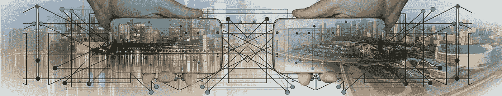
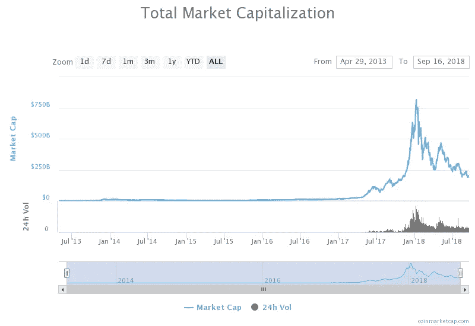
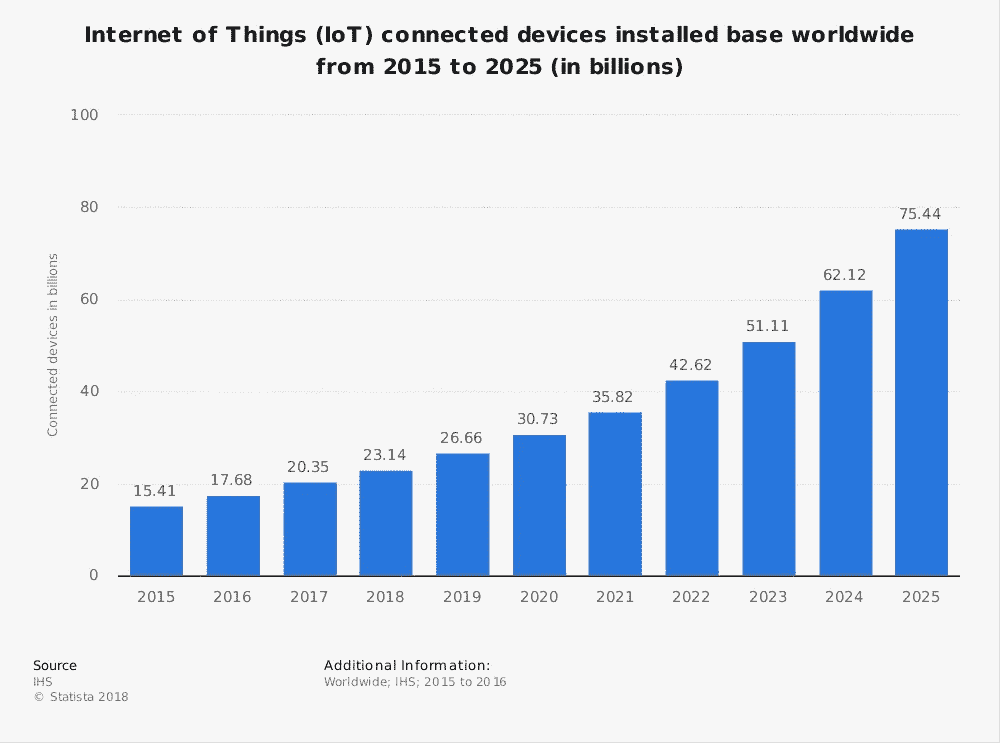
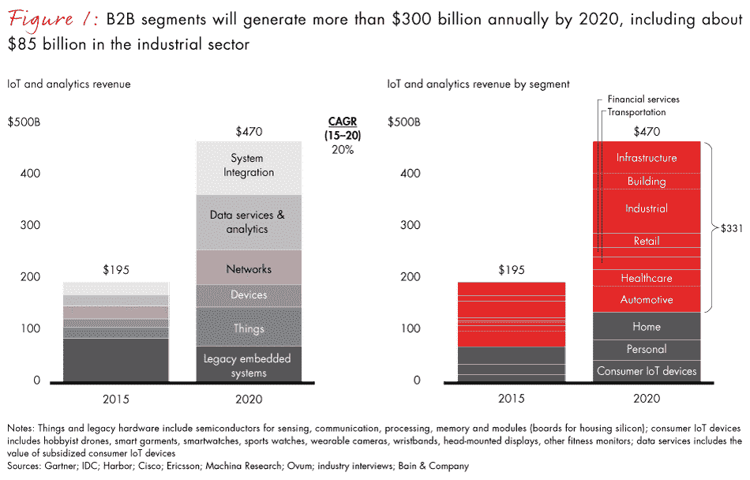
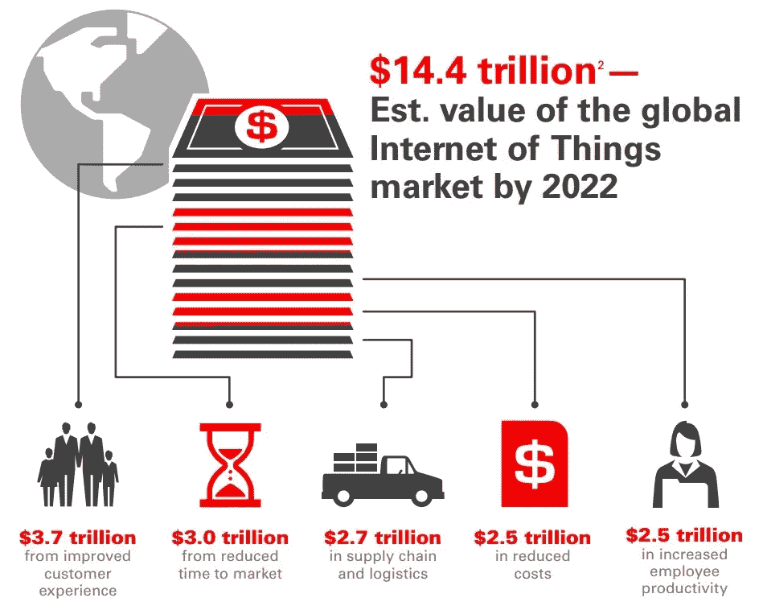

# 物联网蓬勃发展 15 万亿市场

> 原文：<https://towardsdatascience.com/internet-of-things-booming-15-trillion-market-88fde1da2113?source=collection_archive---------12----------------------->

## 物联网、人工智能和区块链等智能技术具有颠覆性的前景。这对市场意味着什么？

**物联网**是区块链、人工智能和智能技术中蓬勃发展的技术之一。新的令人兴奋的解决方案正以越来越快的速度出现，旨在解决我们这个时代的问题，如气候变化，以及缓解地球上的日常生活。

在开始讨论物联网之前，我们先来看看区块链、加密货币和人工智能市场。技术的结合带来了颠覆性的希望。颠覆三重奏。

T2 的加密货币 T3 市场去年蓬勃发展。在今年的下跌趋势之前，它已经接近 1 万亿美元，这导致加密货币市场下降到 2000 亿美元。尽管大幅下跌超过 70%，加密货币市场仍比去年的最低水平高出 5 倍。

随着首次发行硬币，区块链行业的规模不断增长，ICO 从市场上筹集了数百万美元的资金。与去年的 60 亿美元相比，今年总共筹集了 200 亿美元[。](https://www.coindesk.com/ico-tracker/)

[世界经济论坛](https://www.weforum.org/)估计，到 2027 年，全球 GDB 100 万亿美元中，将有 10 万亿美元来自与区块链相关的技术。

人工智能 AI 正在让机器像人类一样工作，这最终将把人们从日常工作中解放出来，从事更具生产力和创造性的工作。通过提供答案和完成简单的操作，AI 已经在让我们的日常生活变得更加简单。你需要记住，机器仍然会保持逻辑，这使得它们如此令人敬畏。人类也将在未来完成创造性的任务。它需要我们训练创造力和想象力。

**人工智能市场**

人工智能即将创造超过 1000 亿美元的收入。

此外，麦肯锡[预测，到 2025 年，人工智能将在 19 个行业的 9 项业务职能中每年创造 3.5 至 5.8 万亿美元的收入。](https://www.mckinsey.com/)

**物联网**

凯文·阿什顿(Kevin Ashton)有一句名言，他将物联网概念化，被许多人誉为物联网之父:

> “如果我们有知道所有事情的计算机——在没有我们任何帮助的情况下使用它们收集的数据——我们将能够跟踪和计算所有事情，并大大减少浪费、损失和成本。我们会知道什么时候东西需要更换、修理或召回，它们是新鲜的还是已经过了最佳状态。我们需要让计算机拥有自己收集信息的手段，这样它们就可以自己看到、听到和闻到这个世界的所有随机荣耀。RFID 和传感器技术使计算机能够观察、识别和理解世界，而不受人类输入数据的限制。”—物联网之父凯文·阿什顿

我们每天都离阿什顿的梦想越来越近。物联网设备的数量正以前所未有的速度增长。汽车、衣服、手表等等都与互联网相连。据统计数据显示，到 2025 年，物联网设备将超过 700 亿台。(下图)

我们可以看到来自 IBM、微软、英特尔、甲骨文等大公司的物联网解决方案的不断发展……新的创新解决方案正在获得宣传，并已经解决了我们在日常生活中面临的实际问题。物联网与其他智能技术相结合，将在拯救我们的星球和建设地球可持续性方面发挥重要作用。因此，物联网市场正在经历高速增长，并吸引了大量投资。每年有近 1000 亿美元流向物联网市场，预计到 2020 年，物联网公司的年收入将超过 4500 亿美元([贝恩](https://www.bain.com/)

以下是[贝恩公司](https://www.bain.com)对不同行业年收入的划分:

**幸运的是，当我们看到物联网的市场潜力时，这些投资有望带来一些高回报。**

根据麦肯锡的报告，到 2025 年，通过连接物理世界和数字世界，每年可以产生 11.1 万亿美元的收入。与全球 100 万亿美元的 GDP 相比，这是一个相当大的数字。此外，根据[商业内幕情报](https://intelligence.businessinsider.com/)报告[物联网 2018](https://www.businessinsider.com/intelligence/research-store/?IR=T&utm_source=businessinsider&utm_medium=content_marketing&utm_term=content_marketing_subscription_text_link_iot-ecosystem-internet-of-things-forecasts-and-business-opportunities-2016-2&utm_content=subscription_content_marketing_text_link&utm_campaign=content_marketing_subscription_link&vertical=iot#!/The-Internet-of-Things-Report/p/46301489/category=11987294&forcescroll=true) ，到 2025 年可能会有近 15 万亿的物联网总投资。

*物联网支出也在增长。这份名为* [*的半年度全球物联网支出指南*](https://www.idc.com/getdoc.jsp?containerId=IDC_P29475) *的报告估计，到 2021 年，支出将每年增长 1 万亿美元。*

令人印象深刻的数字，但我们已经看到来自大公司和新创业公司的创新。解决现实生活问题并为所有人提供舒适生活的解决方案。