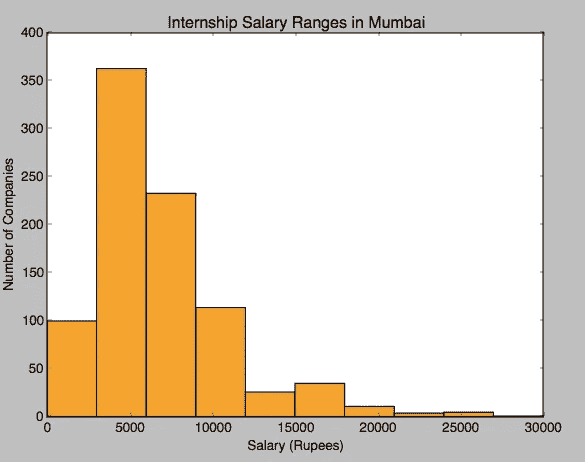
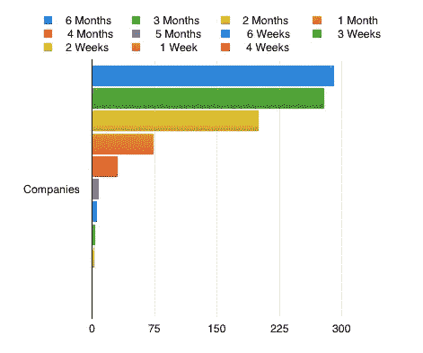
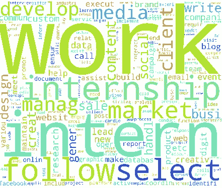

# 孟买的实习:事实与数据

> 原文：<https://towardsdatascience.com/internships-in-mumbai-facts-and-figures-34064ac7d1c7?source=collection_archive---------1----------------------->

在过去的几个月里，我已经养成了通过各种方式获取数据的习惯，并试图从中找出规律或任何有用的见解。我的一次恶作剧是寻找实习数据，在一个风雨交加的圣诞节，我把这些数据拆开，试图找到可能对我或任何涉足企业界的用户有用的信息。

先说数据集。该数据集包含孟买市的 894 个实习机会，范围从全职职位到几周的短期工作。该数据集包含以下特征:

1.标题

2.组织

3.持续时间

4.定期津贴

5.组织详细信息

6.实习详情

至于是怎么获得的。我只能说它包括一个相当漂亮的图书馆。

**调查结果:**

我试图回答的第一个问题是找出支付给实习生的平均工资。这是一个小问题，因为它涉及到将每周和每件产品的销售额转换为每月付款。但是一旦这样做了，就很容易发现平均实习月薪是 ***卢比。6655***。

有趣的是，实习工资最高是 ***卢比。联邦快递的一个网络开发职位 3 万英镑。数据科学在薪酬方面排名第四，薪酬为 11 卢比。25000***在[想分析](https://www.facebook.com/ThinkAnalyticsOfficial/)。

除了薪水，我也很好奇什么职位有最大的机会。这个结果并不令人惊讶。业务发展(又称销售)的机会最多，为 192 个。紧随其后的是社交媒体营销，81。平面设计、内容写作和人力资源也相当受欢迎。尽管 Web 开发比移动应用程序开发有更多的机会。数据录入的机会最少。

数据集包含 ***694 个唯一的雇主*** 。在 694 个机会中，[计划我的健康](https://www.facebook.com/Planmyhealth2/)机会最多(9)。他们的机会涵盖了相当广泛的范围，从营养师/营养学家到法律/法律职位。紧随他们之后的是股权风险金融公司，他们也有很多机会，包括网络开发、商业联盟和其他职位，如内容写作。有趣的是，一般来说，机会最多的地方都是初创企业。

撇开薪水、角色和公司类型不谈，实习求职者脑海中闪现的下一个问题是承诺。数据集中的大多数机会寻求 2-3 个月的最低承诺。

实习期限

我还试图找出组织喜欢使用的“流行语”。因此，在对每个实习描述进行分词和词干化之后，我开始根据 tf-idf 分数提取关键词。现在这种方法并不完美，在每次机会提取的 20 多个关键词中有一些噪音，但它确实非常接近。此外，由于输入源的标准化语言的性质，结果也偏向某些单词。

Internship Buzzwords

这篇文章仅仅是一些探索性的数据分析，可以帮助一些大学生更好地规划他们的实习和获得高价值技能的方法。当我想到新的问题来询问数据或者当我得到新的数据时，我打算更新这篇文章。请随意分享这篇文章，这样更多的人可以了解这些趋势，并可能从他们的实习经历中获得更多。此外，如果你有任何问题，请在评论中留下，我会尽我所能用我掌握的数据来回答。