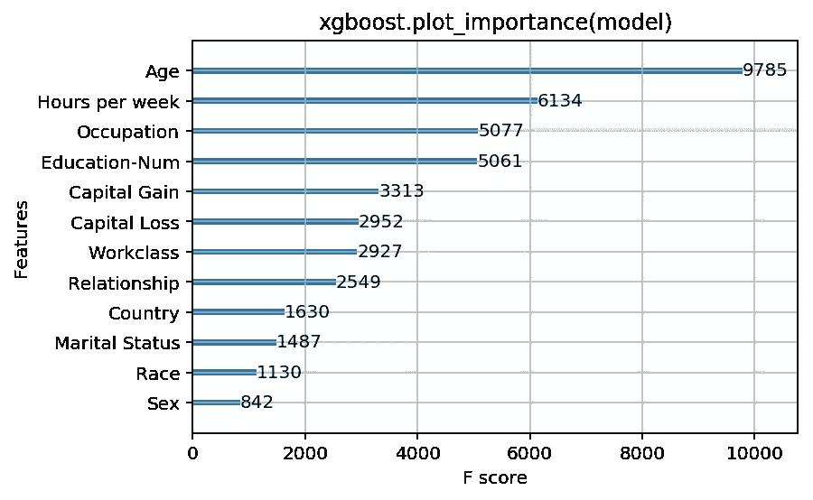
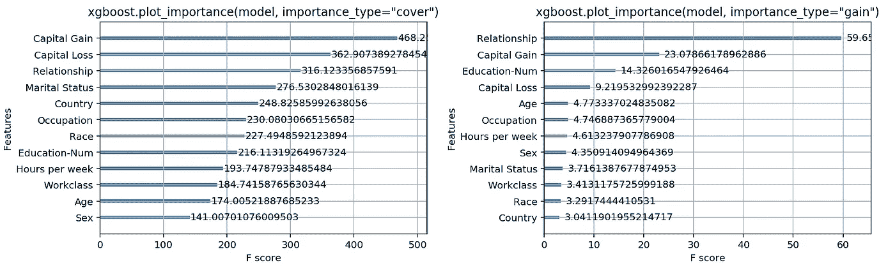
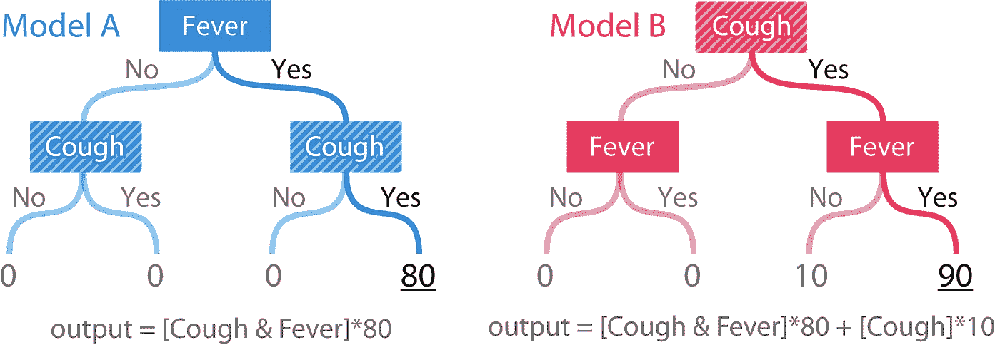
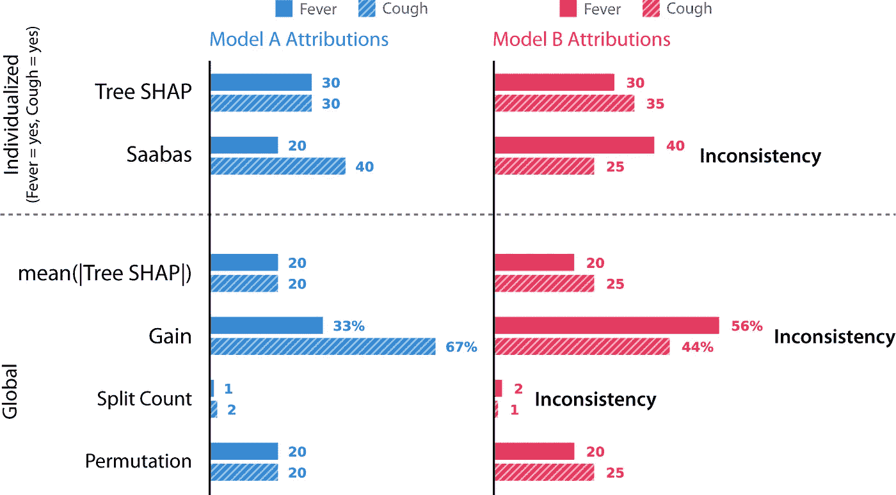
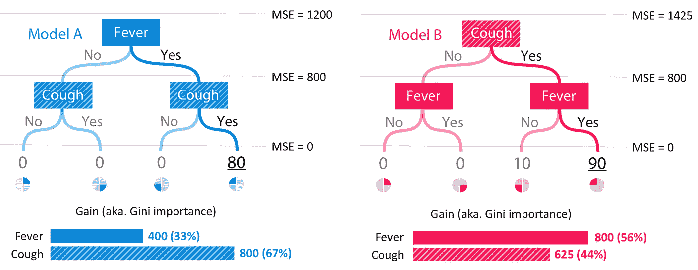
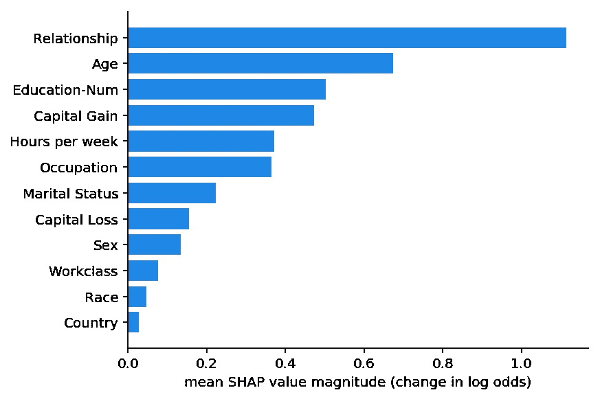
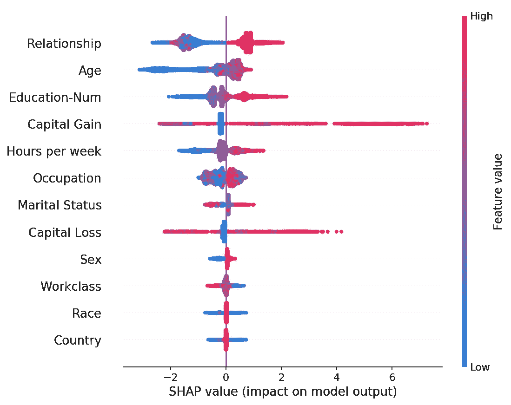
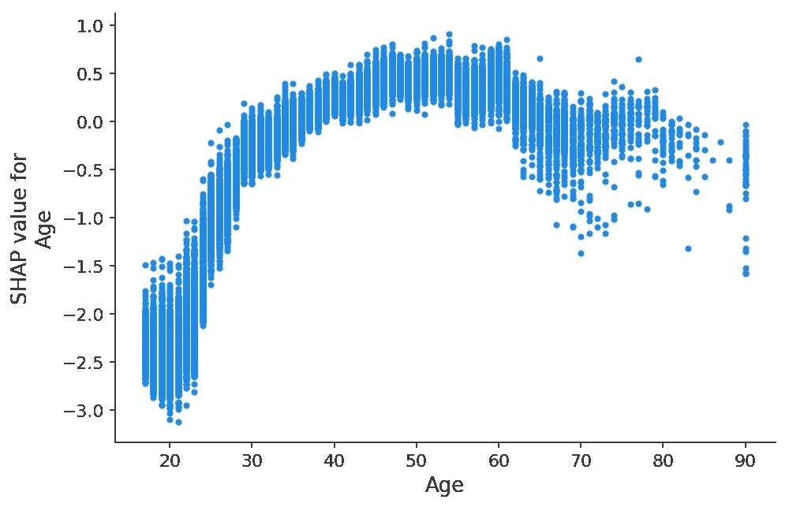
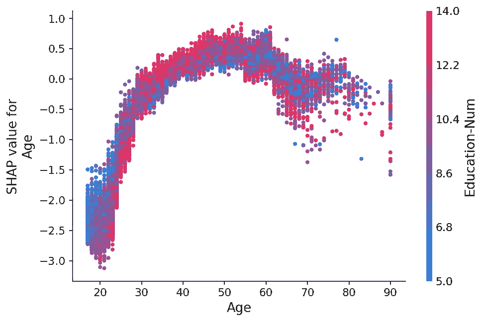
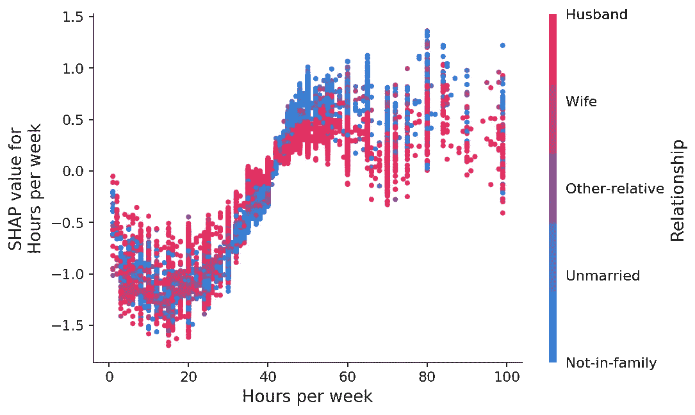

# 使用 XGBoost 的可解释机器学习

> 原文：<https://towardsdatascience.com/interpretable-machine-learning-with-xgboost-9ec80d148d27?source=collection_archive---------0----------------------->

## [模型可解释性](https://towardsdatascience.com/tagged/Model-Interpretability)

这是一个关于错误解释你的机器学习模型的危险，以及正确解释它的价值的故事。如果您发现集合树模型(如梯度推进机器或随机森林)的稳健准确性很有吸引力，但也需要解释它们，那么我希望您会发现这是有益的。

假设我们的任务是为一家银行预测一个人的财务状况。我们的模型越准确，银行赚的钱就越多，但是由于这种预测用于贷款申请，我们也需要在法律上对为什么做出预测做出解释。在对几种模型类型进行实验后，我们发现 XGBoost 中实现的梯度提升树具有最好的准确性。不幸的是，解释 XGBoost 为什么做出预测似乎很难，所以我们只能选择退回到线性模型，或者弄清楚如何解释我们的 XGBoost 模型。没有数据科学家愿意放弃准确性…所以我们决定尝试后者，并解释复杂的 XGBoost 模型(恰好有 1，247 棵深度为 6 的树)。

# **经典的全球特征重要性度量**

第一个显而易见的选择是在 Python XGBoost 接口中使用 plot_importance()方法。它给出了一个非常简单的条形图，代表了我们数据集中每个特性的重要性:(复制这篇文章的代码在 [Jupyter 笔记本](https://slundberg.github.io/shap/notebooks/Census%20income%20classification%20with%20XGBoost.html)中)

Results of running xgboost.plot_importance(model) for a model trained to predict if people will report over $50k of income from the classic “adult” census dataset (using a logistic loss).

如果我们查看 XGBoost 返回的特征重要性，我们会发现*年龄*支配着其他特征，显然是收入的最重要预测因素。我们可以在这里停下来，向我们的经理报告直观上令人满意的答案:年龄是最重要的特征，其次是每周工作时间和受教育程度。但是作为优秀的数据科学家……我们看了一下文档，发现在 XGBoost 中有三个度量特性重要性的选项:

1.  **体重。**一个特征被用于跨所有树分割数据的次数。
2.  **封面。**使用某个特征在所有树之间分割数据的次数，这些树由经过这些分割的训练数据点的数量加权。
3.  **增益。**使用特征进行分割时获得的平均训练损失减少量。

这些是我们可能在任何基于树的建模包中找到的典型的重要性度量。重量是默认选项，因此我们决定尝试其他两种方法，看看它们是否有所不同:

Results of running xgboost.plot_importance with both importance_type=”cover” and importance_type=”gain”.

令我们沮丧的是，我们发现 XGBoost 提供的三个选项中的每一个的特性重要性排序都非常不同！对于覆盖法来说，*资本收益*特征似乎是最能预测收入的，而对于收益法来说，*关系状态*特征支配了所有其他特征。这应该会让我们在不知道哪种方法是最好的情况下，依赖这些方法来报告特性重要性时感到非常不舒服。

# 是什么决定了特性重要性的好坏？

如何比较一种特征归属方法和另一种特征归属方法并不明显。我们可以测量每种方法在数据清理、偏差检测等任务上的最终用户性能。但是这些任务只是对特征归属方法质量的间接测量。这里，我们将定义两个我们认为任何好的特征归属方法都应该遵循的属性:

1.  **一致性。**每当我们改变一个模型，使它更加依赖于一个特性，那么这个特性的重要性就不会降低。
2.  **准确度。**所有特征重要性的总和应等于模型的总重要性。(例如，如果重要性是通过 R 值来衡量的，那么每个特征的属性总和应该是整个模型的 R 值)

如果一致性不成立，那么我们不能比较任何两个模型之间的属性特征重要性，因为*然后* *具有更高的分配属性并不意味着模型实际上更依赖于那个特征*。

如果准确性不成立，那么我们不知道每个特征的属性如何组合来表示整个模型的输出。我们不能在方法完成后就规范化属性，因为这可能会破坏方法的一致性。

# 当前的归因方法是否一致和准确？

回到我们作为银行数据科学家的工作…我们意识到一致性和准确性对我们很重要。事实上，如果一个方法不一致，我们不能保证具有最高属性的特性实际上是最重要的。因此，我们决定使用两个非常简单的树模型来检查每种方法的一致性，这两个树模型与我们在银行的任务无关:

Simple tree models over two features. Cough is clearly more important in model B than model A.

模型的输出是基于个人症状的风险评分。模型 A 只是二元特征*发烧*和*咳嗽*的简单“与”函数。模型 B 具有相同的功能，但是每当*咳嗽*为是时，具有+10。为了检查一致性，我们必须定义“重要性”。这里我们将从两个方面定义重要性:1)当我们删除一组特征时，模型的预期精度*T21 的变化。2)当我们移除一组特征时，模型的预期*输出*的变化。*

重要性的第一个定义度量了特征对模型的全局影响。而第二个定义测量特征对单个预测的个性化影响。在我们的简单树模型中，*咳嗽*特征在模型 B 中显然更重要，当*发烧*和*咳嗽*都为是时，对于全球重要性和个体预测的重要性都是如此。

上面的*权重*、*覆盖*、*增益*方法都是全局特征归属方法。但是，当我们在银行部署我们的模型时，我们还需要为每个客户提供个性化的解释。为了检查一致性，我们在简单的树模型上运行了五种不同的特征归属方法:

1.  **树 SHAP。**我们提出了一种新的个性化方法。
2.  **萨巴斯。**一种个性化启发式特征归因方法。
3.  **意思是(|树 SHAP|)。**基于个体化树 SHAP 属性平均大小的全局属性方法。
4.  **增益。**与上述 XGBoost 中使用的方法相同，也等同于 scikit-learn 树模型中使用的基尼系数。
5.  **拆分计数。**表示 XGBoost 中密切相关的“权重”和“覆盖”方法，但使用“权重”方法进行计算。
6.  **排列。**当单个特征在测试数据集中被随机置换时，模型精度的下降。

Feature attributions for model A and model B using six different methods. As far we can tell, these methods represent all the tree-specific feature attribution methods in the literature.

**之前除了特征置换的方法都不一致！**这是因为与模型 a 相比，它们在模型 B 中对咳嗽的重视程度较低。不一致的方法无法正确地对最有影响的特征给予更多的重视。敏锐的读者会注意到，这种不一致性早在我们研究的经典特征归因方法在同一模型上相互矛盾时就已经出现了。精度属性呢？事实证明，树 SHAP、Sabaas 和 Gain 都与前面定义的一样准确，而特征置换和分裂计数则不准确。

或许令人惊讶的是，像 gain(基尼系数)这样广泛使用的方法会导致如此明显的不一致结果。为了更好地理解为什么会发生这种情况，我们来看看模型 A 和模型 b 的增益是如何计算的。为了简单起见，我们假设数据集的 25%落在每个叶中，并且每个模型的数据集都有与模型输出完全匹配的标签。

如果我们将均方误差(MSE)视为我们的损失函数，那么在模型 a 中进行任何分割之前，我们从 1200 的 MSE 开始，这是来自 20 的恒定均值预测的误差。在模型 A 中拆分了*发烧*之后，MSE 下降到 800，因此 gain 方法将这 400 的下降归因于*发烧*特性。在*咳嗽*特征上再次分裂导致 MSE 为 0，增益方法将这 800 的下降归因于*咳嗽*特征。在模型 B 中，同样的过程导致发烧特征的重要性为 800，咳嗽特征的重要性为 625:

Computation of the gain (aka. Gini importance) scores for model A and model B.

通常，我们认为靠近树根的特征比靠近树叶的特征更重要(因为树是贪婪地构建的)。然而，增益方法偏向于将更多的重要性归于较低的分裂。这种偏见导致了不一致，当*咳嗽*变得更重要时(因此它在根上分裂了)，它的归属重要性实际上下降了。个性化的 Saabas 方法(由 [treeinterpreter](https://github.com/andosa/treeinterpreter) 包使用)在我们沿着树向下时计算预测的差异，因此它也遭受了同样的偏向于树中较低位置的分裂。随着树木越来越深，这种偏见只会越来越大。相比之下，树 SHAP 方法在数学上等同于对所有可能的特征排序的预测差异进行平均，而不仅仅是由它们在树中的位置指定的排序。

这不是一个巧合，只有树 SHAP 是一致和准确的。假设我们想要一个既一致又准确的方法，那么只有一种方法来分配特性的重要性。详细内容在我们最近的 [NIPS 论文](http://papers.nips.cc/paper/7062-a-unified-approach-to-interpreting-model-predictions)中，但总结是，来自博弈论的关于利润公平分配的证明导致了机器学习中特征归属方法的唯一性结果。这些独特的值被称为 Shapley 值，以 Lloyd Shapley 在 20 世纪 50 年代得出的值命名。我们这里使用的 SHAP 值是与 Shapley 值相关的几种个性化模型解释方法的统一。树 SHAP 是一种快速算法，可以在多项式时间内准确计算树的 SHAP 值，而不是传统的指数运行时间(见 [arXiv](https://arxiv.org/abs/1802.03888) )。

# 自信地诠释我们的模型

坚实的理论证明和快速实用的算法相结合，使 SHAP 价值观成为一个强有力的工具，自信地解释树木模型，如 XGBoost 的梯度推进机。有了这个新方法，我们回到解释我们的银行 XGBoost 模型的任务:

The global mean(|Tree SHAP|) method applied to the income prediction model. The x-axis is essentially the average magnitude change in model output when a feature is “hidden” from the model (for this model the output has log-odds units). See [papers](https://github.com/slundberg/shap) for details, but “hidden” means integrating the variable out of the model. Since the impact of hiding a feature changes depending on what other features are also hidden, Shapley values are used to enforce consistency and accuracy.

我们可以看到，*关系*特征实际上是最重要的，其次是*年龄*特征。由于 SHAP 值保证了一致性，我们不需要担心在使用增益或分割计数方法之前发现的矛盾。然而，由于我们现在对每个人都有个性化的解释，我们可以做的不仅仅是做一个条形图。我们可以为数据集中的每个客户绘制特征重要性图。 [shap Python 包](https://github.com/slundberg/shap)让这变得简单。我们先叫 shap。TreeExplainer(模型)。shap_values(X)来解释每个预测，然后调用 shap.summary_plot(shap_values，X)来绘制这些解释:

Every customer has one dot on each row. The x position of the dot is the impact of that feature on the model’s prediction for the customer, and the color of the dot represents the value of that feature for the customer. Dots that don’t fit on the row pile up to show density (there are 32,561 customers in this example). Since the XGBoost model has a logistic loss the x-axis has units of log-odds (Tree SHAP explains the change in the margin output of the model).

这些特征按平均值(| SHAP 树|)排序，因此我们再次将*关系*特征视为年收入超过 5 万美元的最强预测因素。通过绘制特征对每个样本的影响，我们还可以看到重要的异常影响。例如，虽然资本收益在全球范围内并不是最重要的特征，但对一部分客户来说却是最重要的特征。按特征值着色向我们展示了一些模式，比如年轻会降低你挣 5 万美元以上的机会，而高等教育会增加你挣 5 万美元以上的机会。

我们可以在这里停下来向我们的老板展示这个图，但是让我们更深入地挖掘其中的一些特性。对于*年龄*特征，我们可以通过绘制年龄 SHAP 值(对数几率的变化)与年龄特征值的关系来实现:

The y-axis is how much the *age* feature changes the log odds of making over $50K annually. The x-axis is the age of the customer. Each dot represents a single customer from the data set.

在这里，我们看到了年龄对收入潜力的明显影响，正如 XGBoost 模型所捕捉到的那样。请注意，与传统的部分相关图(显示更改特征值时的平均模型输出)不同，这些 SHAP 相关图显示了交互影响。尽管数据集中的许多人都是 20 岁，但是他们的年龄对他们预测的影响程度是不同的，正如 20 岁时点的垂直分布所示。这意味着其他特征正在影响年龄的重要性。为了了解这种影响的部分特征，我们用受教育的年数来给这些点着色，结果发现，在 20 多岁时，高教育水平会降低年龄的影响，但在 30 多岁时会提高这种影响:

The y-axis is how much the *age* feature changes the log odds of making over $50K annually. The x-axis is the age of the customer. Education-Num is the number of years of education the customer has completed.

如果我们绘制另一张每周工作小时数的依赖关系图，我们会看到，每周工作 50 小时左右会有更多的好处，如果你已婚，额外工作不太可能意味着高收入:

Hours worked per week vs. the impact of the number of hours worked on earning potential.

# 解释你自己的模型

这个简单的演练旨在反映您在设计和部署自己的模型时可能会经历的过程。 [shap 包](https://github.com/slundberg/shap)很容易通过 pip 安装，我们希望它能帮助你满怀信心地探索你的模型。它包含了比本文更多的内容，包括 SHAP 相互作用值，模型不可知的 SHAP 值估计，以及其他可视化。笔记本可以在各种有趣的数据集上展示所有这些特征。例如，你可以在一个解释 XGBoost 死亡率模型的[笔记本](https://slundberg.github.io/shap/notebooks/NHANES%20I%20Survival%20Model.html)中，根据你的健康检查，找出你将死的主要原因。对于 Python 以外的语言，树 SHAP 也被直接合并到核心的 XGBoost 和 LightGBM 包中。