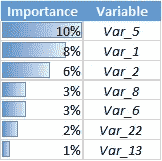
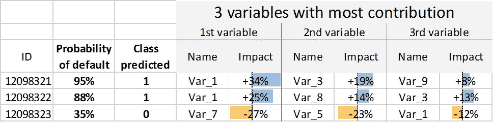
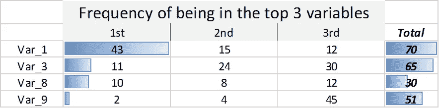

# 解释随机森林和其他黑盒模型，如 XGBoost

> 原文：<https://towardsdatascience.com/interpreting-random-forest-and-other-black-box-models-like-xgboost-80f9cc4a3c38?source=collection_archive---------1----------------------->

在机器学习中，在**表现**和**解释**之间有一个反复出现的困境。通常，模型越好，越复杂，越难理解。

一般来说，有两种方式来解释一个模型:

1.  *总体解读*:确定哪些变量(或变量组合)最有预测力，哪些最没有预测力
2.  *局部解释*:对于一个给定的数据点和相关的预测，确定哪些变量(或变量组合)可以解释这个特定的预测

根据您使用的模型类型，可能会有特定的方式来解释您的模型。例如，决策树模型可以简单地通过绘制树并观察分裂是如何进行的以及叶子的组成来解释。

然而，RandomForest 或 XGBoost 没有具体的方法来做到这一点，它们通常更擅长进行预测。

# 整体解读

在 Python 的大多数模型中，整体解释已经开箱即用，具有“feature_importances_”属性。下面的例子:

Example of feature importances for a given model, what I call “feature importances table” in this article (sorted by feature importance in descending order)

解释这个输出非常简单:根据模型，变量*越重要，就越相关。这是一个很好的方式*

1.  **确定具有最佳预测能力的变量**
2.  **提出问题/纠正错误**:相对于其他变量来说太重要的变量。
    示例:在之前的项目中，我们处理有偏差的数据:类 1 的数据在变量中有许多缺失值，而类 0 的数据没有。我们直到看了特性重要性表才意识到这一点。该模型了解到，如果数据丢失，则它属于类别 1。我们通过从类 0 的数据中抽取缺失值来解决这个问题
3.  **用新变量更新您的模型。**要查看新变量是否与您的模型相关，计算之前的模型*(无新变量)和*之后的模型*(有新变量)的特征重要性。分析新变量在要素重要性表中产生的变化。
    举例:在进行特征工程时，你可以提出一个更相关的特征，但是在你的数据中引入它可能会降低与新特征直接相关的特征的重要性。*
4.  **比较不同的模型**:通过比较变量的重要性来比较两个不同模型(例如 RandomForest 和 XGBoost)的特性重要性。它有助于了解模型是否掌握了变量的预测能力。
    例:比较不同深度的 XGBoost 模型，可以帮助你理解当你使用特定深度时，特定变量变得有用。

到目前为止，对模型的整体理解还不错。

> 现在你如何解释一个给定数据点的预测？

# 本地解释

在这里，我将定义什么是*本地解释*,并提出一个解决方法来处理您拥有的任何模型。

## 如何定义地方解读？

这里启发我的是我从[数据机器人](https://www.datarobot.com/)那里得到的一个演示，他们想预测贷款违约。在他们的演示中，对于每个单独的预测，他们还输出了增加违约概率最多的前 3 个变量，以及减少违约概率最多的前 3 个变量。

让我们保留这个例子(用模拟数据)，为了更好的可读性，让我们仅用 3 个变量来表示局部解释，如下所示:

Illustration of local interpretation: for each data point, we identify the 3 variables with the most impact on the prediction of default. Variable Var_1 increases the probability of default in the first 2 predictions (resp. +34% and +25%), but decreases it in the 3rd (-12%)

## 从这个解释中最有趣的收获是

解释每个单独的预测可用于:

1.  理解个别情况下预测的原因。
    例如:两个人有很高的违约概率，但原因完全不同(即变量不同)
2.  了解被过滤人群最常见的预测原因。*这和特性重要性是不一样的！*
    举例:考虑一个欺诈检测用例。这是一个典型的多数类问题(0.1%的 1 类数据 vs 99.9%的 0 类数据)，特征重要性偏向 0 类。因此，查看第 1 类的每个单独预测，并对最能解释第 1 类的前 3 个变量进行分组，将非常有助于了解哪些特征会导致最大的风险。

For all predictions of defaults (probability > 50%), we rank the variables that are the most frequent in the top 3 variables, to understand which variables explain the most the default. Variable Var_1 is in 43 cases the most contributing variable for the prediction of default, in 15 cases the second, in 12 cases the 3rd

## 用 Python 实现

Python 中的[*tree interpreter*](https://github.com/andosa/treeinterpreter)*库允许我们精确地**计算每个特性对随机森林模型的影响。我让好奇的读者查看了包作者的两篇惊艳文章( [1](http://blog.datadive.net/interpreting-random-forests/) 和 [2](http://blog.datadive.net/random-forest-interpretation-conditional-feature-contributions/) )。***

*对于其他模型，我们将做一个快速的解决方案:运行一个随机森林模型，并在您的模型和随机森林模型之间的预测匹配时进行局部解释(当它们同时预测违约或非违约时)。这是我在一个客户项目中选择的解决方案，在这个项目中我有一个 XGBoost 模型。在这种情况下，Random Forest 的本地解释很有意义，但是没有专门针对 XGBoost 的框架仍然是一个令人沮丧的解决方法。*

*由于计算需要一些时间(取决于随机森林模型中的树的数量)，我建议在本练习中使用您的预测的子集。例如，根据模型，最有可能违约的 10 个人。*

*For each individual prediction, we compute the individual contribution of each variable in the prediction with the treeinterpreter package*

*注意，treeinterpreter 既有可变贡献，也有整体偏差。更深入的了解，推荐[原创博文](http://blog.datadive.net/interpreting-random-forests/)。*

## *有一点要记住*

*假设您有一个变量“年龄”，它的贡献足够高，可以位于前 3 个变量中，从而有助于特定的预测。你可能会对年龄感兴趣，因为你(或专家)会对 18 岁或 35 岁有不同的解释。因此，查看变量的贡献及其值是一个好习惯(就像上面的代码，其中有两列“value_variable”和“contribution_variable”)*

# *超越 treeinterpreter*

*解释黑盒模型一直是许多研究论文的主题，目前也是，特别是当涉及到[深度学习解释](https://deepmind.com/blog/understanding-deep-learning-through-neuron-deletion/)时。试验并采用了不同的方法:[石灰](https://github.com/marcotcr/lime)、[偏相关图](http://scikit-learn.org/stable/auto_examples/ensemble/plot_partial_dependence.html)、 [defragTrees](https://github.com/sato9hara/defragTrees) …*

*对于 treeinterpreter，如果有其他基于树的模型，比如 XGBoost、LightGBM、CatBoost 或其他梯度提升方法，那就太好了。*

*最近偶然发现一篇很棒的关于随机森林模型解读的文章:[https://medium . com/usf-MSDS/intuitive-interpretation-of-random-forest-2238687 CAE 45](https://medium.com/usf-msds/intuitive-interpretation-of-random-forest-2238687cae45)，有瀑布图和部分依赖图。*

*感谢阅读，如果你觉得这篇文章有用，请考虑给它至少 50 个掌声:)*