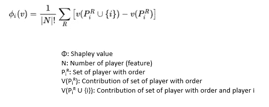
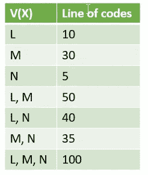
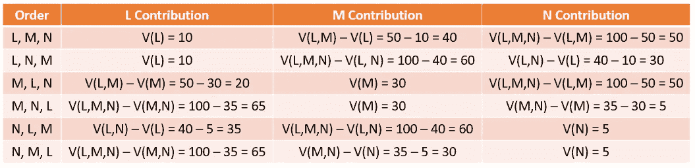
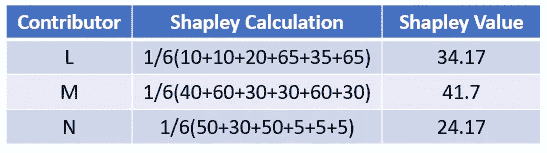
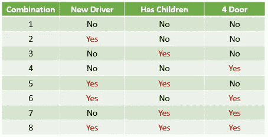
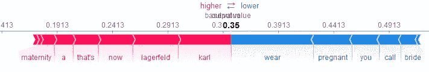
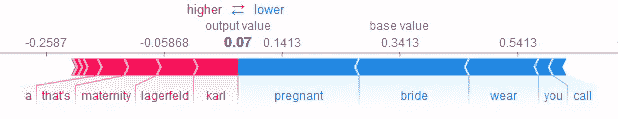

# 解读 SHAP 的深度学习模型

> 原文：<https://towardsdatascience.com/interpreting-your-deep-learning-model-by-shap-e69be2b47893?source=collection_archive---------0----------------------->


Photo by [JESHOOTS.COM](https://unsplash.com/@jeshoots?utm_source=medium&utm_medium=referral) on [Unsplash](https://unsplash.com?utm_source=medium&utm_medium=referral)

前面的[篇](/3-ways-to-interpretate-your-nlp-model-to-management-and-customer-5428bc07ce15)提到过，模型解释非常重要。这篇文章继续这个话题，但分享另一个著名的库是夏普利附加解释(SHAP)[1]。Lundberg 等人提出了解释模型预测的统一方法。

看完这篇文章，你会明白:

*   什么是沙普利值
*   沙普利添加剂解释(SHAP)
*   用例
*   外卖食品

# 沙普利值

在介绍 SHAP 之前，我们先来看看合作博弈理论中的解概念——沙普利值。



让我们以一个开发团队为例。我们的目标是交付一个深度学习模型，它需要完成 100 行代码，而我们有 3 个数据科学家(L，M，N)。他们中的 3 个人必须一起工作来完成这个项目。鉴于:



Contribution among coalition



Marginal Contribution by different orders

我们有 3 名球员，所以总组合是 3！也就是 6。上表显示了不同联盟顺序的贡献。



根据 Sherley 值公式，我们有上表。虽然 M 的能力比 N 大 6 倍(30 比 5)，但是 M 应该得到 41.7%的奖励，而 N 应该得到 24.17%的奖励。

# 沙普利添加剂解释(SHAP)

这个想法是用博弈论来解释目标模型。所有特征都是“贡献者”,并试图预测“游戏”任务，而“回报”是实际预测减去解释模型的结果。

在 SHAP，特征重要性被分配给每个特征，其等同于所提到的贡献。让我们以汽车贷款(车贷)为例。我们有“新司机”、“有孩子”、“4 门”、“年龄”。

理论上，组合数是 2^n，其中 n 是特征数。鉴于我们想知道“年龄”的 Shapley 值。我们将预测以下所有带有和不带有“年龄”特征的组合。提到了一些优化



All possible combinations

通过使用沙普利公式，SHAP 将计算所有上述情况，并返回平均贡献和。换句话说，当特定功能错过了时，**没有谈论差异。**

# 用例

SHAP 为不同类型的模型提供了多种解释者。

*   TreeExplainer:支持 XGBoost、LightGBM、CatBoost 和 scikit-learn 模型，由 Tree SHAP 开发。
*   DeepExplainer(深度 SHAP):通过使用 DeepLIFT 和 Shapley 值支持 TensorFlow 和 Keras 模型。
*   GradientExplainer:支持 TensorFlow 和 Keras 模型。
*   KernelExplainer(内核 SHAP):通过使用 LIME 和 Shapley 值应用于任何模型。

下面的示例代码将展示我们如何使用 DeepExplainer 和 KernelExplainer 来解释文本分类问题。

**深度解说**

```
explainer = shap.DeepExplainer(pipeline.model, encoded_x_train[:10])
shap_values = explainer.shap_values(encoded_x_test[:1])x_test_words = prepare_explanation_words(pipeline, encoded_x_test)
y_pred = pipeline.predict(x_test[:1])
print('Actual Category: %s, Predict Category: %s' % (y_test[0], y_pred[0]))shap.force_plot(explainer.expected_value[0], shap_values[0][0], x_test_words[0])
```



**内核解释器**

```
kernel_explainer = shap.KernelExplainer(pipeline.model.predict, encoded_x_train[:10])
kernel_shap_values = kernel_explainer.shap_values(encoded_x_test[:1])x_test_words = prepare_explanation_words(pipeline, encoded_x_test)
y_pred = pipeline.predict(x_test[:1])
print('Actual Category: %s, Predict Category: %s' % (y_test[0], y_pred[0]))shap.force_plot(kernel_explainer.expected_value[0], kernel_shap_values[0][0], x_test_words[0])
```



# 外卖食品

要访问所有代码，你可以访问我的 github repo。

*   当你阅读 [**Christoph 的博客**](https://christophm.github.io/interpretable-ml-book/) 时，你可以参考上面代码的 [Shapley 值解释](https://christophm.github.io/interpretable-ml-book/shapley.html)部分。
*   Shapley 值是在不同情况下预测的特征的平均贡献。换句话说，当特定功能错过了时，这就是**没有谈论差异。**
*   SHAP 包括**多种算法**。你可以查看关于石灰、深度提升、夏普利值计算的更多细节。
*   有可能 DeepExplainer 和 KernelExplainer **引入了不同的结果**。

# 延伸阅读

*   [SHAP 值的高级用途](https://www.kaggle.com/dansbecker/advanced-uses-of-shap-values)

# 关于我

我是湾区的数据科学家。专注于数据科学、人工智能，尤其是 NLP 和平台相关领域的最新发展。你可以通过[媒体](http://medium.com/@makcedward/)或者 [Github](https://github.com/makcedward) 联系到我。

# 参考

[1]伦德伯格 S. M .，李素英。解释模型预测的统一方法。2017.[http://papers . nips . cc/paper/7062-a-unified-approach-to-interpretation-model-predictions . pdf](http://papers.nips.cc/paper/7062-a-unified-approach-to-interpreting-model-predictions.pdf)

[2] Lundberg S. M .，Erion G. G .，Lee Su-In .树集成的一致个性化特征属性。2017.[https://arxiv.org/pdf/1802.03888.pdf](https://arxiv.org/pdf/1802.03888.pdf)