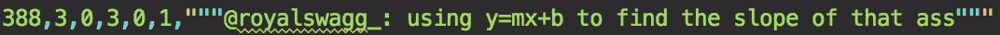
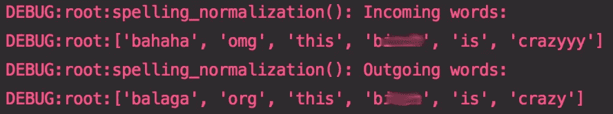
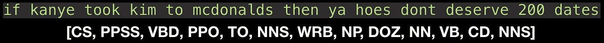
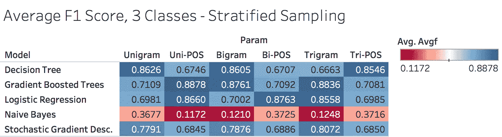
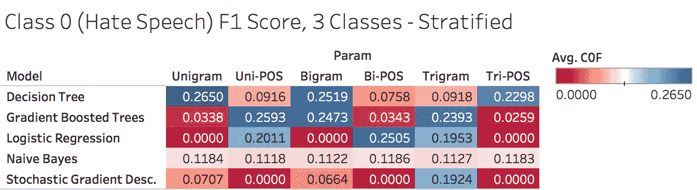
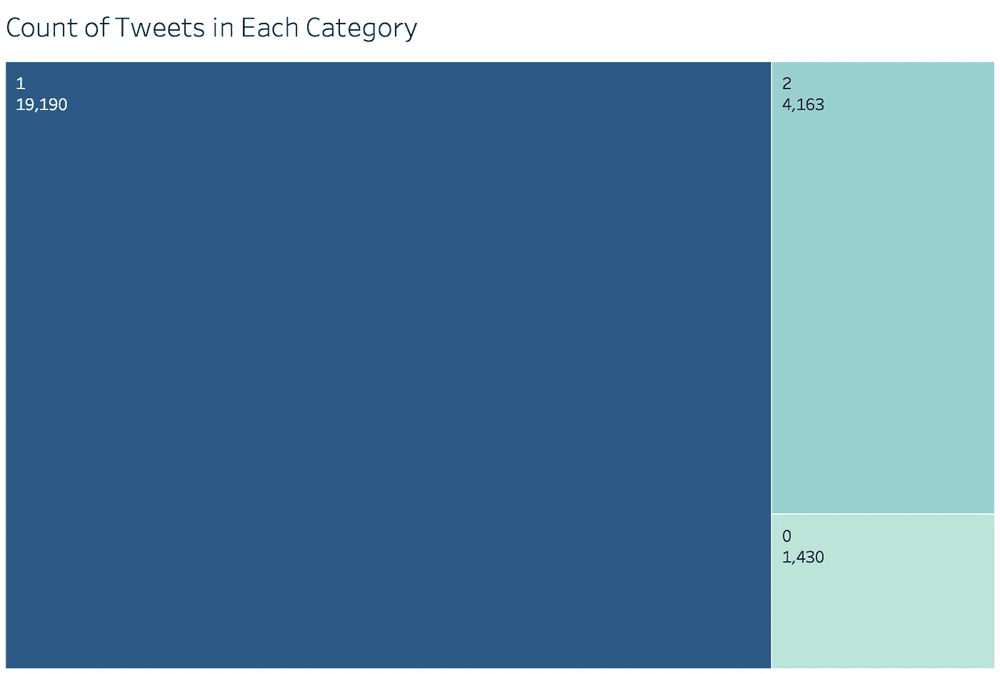
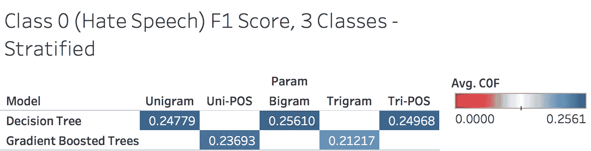

# 进入黑暗的文本中心

> 原文：<https://towardsdatascience.com/into-a-textual-heart-of-darkness-39b3895ce21e?source=collection_archive---------5----------------------->

## 通过仇恨言论分类在 NLP 中从零到不太英雄

Image courtesy of Peggy and Marco Lachmann-Anke, CC0 license.

互联网是一个丛林。在这里，丰富的多样性和奇妙的色彩结合起来，创造了一个独特的生态系统，使新的技术和通信方法。但是在这个明亮的树冠下是不受控制的互联网的黑暗下层——在这个地方，匿名的安全性模糊了公民话语的界限。

在这里，你会发现侮辱和侮辱，辱骂和嘲笑。在这个勇敢的新世界里，人仅仅是一个抽象概念，与他或她所说的事情无关。在这里，整批的人被妖魔化和诋毁，而不是因为他们自己的过错。值得庆幸的是，其中一些是网络钓鱼者的结果——精心构建的评论假装无知并激起愤怒。

一些。但是，不是全部。

其中一些评论是真正的偏见和恶意的产物。我想看看我是否能找到一种方法来构建一个模型，能够检测和分类这些评论，并将它们从其他评论中分离出来。作为一个对自然语言处理技术知之甚少的人，我很想看看自己在两周内能走多远。

## “太恐怖了！恐怖！”

为了限制我的调查范围，我想专注于令人反感的评论的一个特定类别——**仇恨言论**。虽然这个词越来越多地被使用，但它也越来越多地被误解。Alito 法官在他对 Matal 诉 Tam 案的书面意见中对仇恨言论以及我们与仇恨言论的关系做了如下定义:

> 基于种族、民族、性别、宗教、年龄、残疾或任何其他类似理由贬低他人的言论是令人憎恶的；但我们言论自由法理最值得骄傲的是，我们保护表达“我们讨厌的思想”的自由。

令人惊讶的是，在美国，仇恨言论在联邦一级不受管制，并一直受到第一修正案的保护。然而，像大学这样的机构经常定义行为和礼仪规范，对言论加以限制，但效果有限。

随着互联网提供的匿名性，以及它提供的与后果的隔离，[仇恨言论肯定在增加](http://www.inach.net/fileadmin/user_upload/Manifestations_of_online_hate_speech.pdf)，并且越来越受到寻求保持文明的社区和平台的关注。

# **数据**

首先，我需要一些仇恨言论。快速的网络搜索让我找到了一个由人类标注的推文集合。这些数据构成了论文“[自动化仇恨言论检测和攻击性语言问题](https://aaai.org/ocs/index.php/ICWSM/ICWSM17/paper/view/15665)”的基础。对数据的粗略浏览揭示了我所面临的问题:

A sample tweet from the data, classified as offensive, but not hateful.

数字列从左至右对应于:

*   tweet 的索引或条目编号
*   查看该推文的人类读者数量
*   认为推特上有仇恨言论的人类读者数量
*   认为这条推文令人不快的读者人数
*   认为推文不属于以上两种情况的读者人数
*   最终分类，即多数意见

每条推文至少有三名读者阅读，对于更模糊的陈述，阅读人数会增加一倍。

由于我的挑战是只根据推文的文本对推文**进行分类，所以除了最终的分类决定，我忽略了所有的数字列。**

## 倒垃圾

推文本来就乱；互联网交流是非正式的，不固定的——重复的强调字母、非常规的缩写和不断演变的俚语只是其中的一些东西，它们既给平台带来了活力，也让文本变得更加难以处理。为了对我的数据中的单词进行任何形式的准确阅读，我需要标准化和规范化。

为了做到这一点，我从一些关于古腾堡项目的书籍中生成了一个单词列表。不幸的是(也是可以理解的)，互联网上的许多脏话和行话不是这些经典文学作品的一部分，需要手动添加。这是一个非常不完美的系统，因为对我来说不可能解释所有的事情，但是它保留了我需要的脏话，并规范了我的大部分文本。

An example from my normalization workflow. Note the repeated ‘yyy’ in ‘crazy’ is corrected, though ‘bahaha’ is interpreted as an unrelated word.

我希望大多数遗漏的内容至少会以一致的方式被错误地规范化，从而限制潜在的影响。

## 分解它

有了(大部分)修改过的文字，我就可以把我的推文转换成机器可读的东西了。处理文本的一种常见方法是将文本分成单个单词或单词组，称为**。**

**

*Partial n-grams for a normalized tweet, with corresponding part-of-speech tags (discussed later).*

*这些 n-gram 然后被转换成机器可读的数字向量，数字对应于每个 n-gram 的 [*tf-idf*](https://en.wikipedia.org/wiki/Tf%E2%80%93idf) 权重。*

*术语频率-逆文档频率( **tf-idf** )可以被认为是一个单词对于一类文档的独特性或独特性的度量。确定一个单词有多重要的一种方法是简单地计算它出现的次数(术语频率)。*

*不过，我们有个问题。有些词只是在所有文档中更频繁地出现，例如“and”、“the”或“a”。如果不删除这些词，简单的术语频率将被这些不可区分的词所支配，从而隐藏真正的信息。*

*tf-idf 的构想是通过惩罚出现在多个文档中的单词来纠正这一点。虽然“the”可能有很高的术语频率，因为它出现在几乎每个文档中，但它的 tf-idf 得分将受到影响，从而使真正独特的描述性单词浮出水面。*

*在我的例子中,“冒犯”和“憎恨”类共享了很多词汇，比如骂人的话。我的希望是，tf-idf 将允许独特的诋毁，使仇恨言论是什么出现。*

# *保持优雅*

*我执行了两个主要的分类步骤——词性标注，以及最终的分类，即仇恨、冒犯或两者都不是。*

## *最高级，不定式和分词，天啊！*

*现在我坦率地承认我不是语法迷。直到五分钟前，我才知道什么是“语义最高级形容词”。但是词性可能会帮助我从现有的数据中收集一些额外的信息，所以我开始认真准备一些核心的语言学指导。*

*现在，[更聪明的人已经在](https://www.nltk.org/)之前走过这条路，并且[优秀的代码已经存在](https://www.nltk.org/api/nltk.tag.html)以最小的努力标记文本。但是以学习的名义，我决定自己造一个低劣的模型来做同样的工作。以一个[预先标记的语料库为例，](https://en.wikipedia.org/wiki/Brown_Corpus)我使用了一个简单快速的算法，一个**朴素贝叶斯分类器**来完成这项工作。*

**

*The result of my part-of-speech classifier.*

*正如“天真”可能暗示的那样，这种类型的分类器头脑简单，做出假设，用准确性换取简单性和速度。简单而迅速；在几行代码中，我启动并运行了我的 tagger，准确率为 85%。当然还有改进的空间，但已经足够了:我渴望进入问题的核心——检测仇恨言论本身。*

***回顾:**现在，我已经清理了我的原始推文，附加了词性标签，将我的文本分解成小块的单词，并将它们转换成一大堆数字。我已经准备好迎接重头戏了。*

## *Off-平衡*

*我第一次浏览数据时，针对我的六种类型的特征中的每一种，我训练了五种不同类型的模型:一个、两个或三个单词的组块及其相应的词性标签。*

**

*Average F1-Score. Each number corresponds to a distinctly trained model.*

*第一遍看起来不错，对吧？我的最高 [F1 分](https://en.wikipedia.org/wiki/F1_score)已经在 80 多分，通过优化，我有信心可以推得更高。*

*不幸的是，我的数据没有这么好。当我试图构建一个仇恨言论分类器时，我最感兴趣的指标是针对仇恨言论的 F1 分数**；只显示数据描绘了一幅完全不同的画面。***

******

***F1-Score for “hate speech” classification of tweets.***

***这是怎么回事？可悲的是，在我的兴奋和匆忙中，我没有勤奋地执行我的探索性数据分析。如果我做得更彻底，我可能会注意到我的数据有些不太对劲。***

******

***Class 0: hate speech. Class 1: offensive speech. Class 2: neither offensive nor hateful.***

***我的班级比例严重失衡。第 0 类，仇恨言论——我最感兴趣的一类——只占我总数据的 7%多一点。由于“仇恨”和“冒犯”类在语言上的相似性，我的模型很难看出仇恨和冒犯的界限在哪里。***

## ***团队里没有“我”***

***我最好的模型只有 25%左右的表现，显然我的方法不起作用。因为我的独立模型不能胜任这项任务，所以我考虑结合我最好的——一个穷人的随机森林。***

******

***The five models I selected for my ensemble approach.***

***我最终选择的五个模型都是决策树或其变种。对于每一条推文，我把多数决定作为我的分类；如果三个模型预测为 0 级，这将是我对该推文的分类决定。这种方法让我的 0 级 F1 分数达到了 21%。这比我以前所取得的成就要少。***

***时间不多了，我开始担心。即使是多数决定，我的模型也不能得出正确的结论。但是这给了我第二个想法——如果我的大多数模型都把仇恨言论分类错了，也许他们一直都错了。如果有某种模式的话，我可以把这五个决定输入到一个新的分类器中，这个分类器能够理解这一切。***

***我的策略得到了回报:将我的模型输入输入到一个新的朴素贝叶斯分类器中，做出最终决策，这让我的 F1 分数达到了 **31%** ，当然，这不是一个非常显著的改进，但仍然是一个改进。***

# ***结束语***

***虽然我对仇恨言论的成功分类并不令人印象深刻，但它提供了一个良好的开端。虽然这可能有些老生常谈，但比我的准确性或精确性更重要的是，我对良好的代码和数据分析的理解增加了，这只能来自于犯错误和拥有愚蠢的代码架构。***

***至于模型本身，我当然可以做得更多，尤其是以我现在所知道的。从优雅地处理类不平衡到探索更高级的算法或单词嵌入，唯一可走的路就是 up。***