# 为大家介绍数据分析；第三部分！

> 原文：<https://towardsdatascience.com/intro-to-data-analysis-for-everyone-part-3-d8f02690fba0?source=collection_archive---------7----------------------->

我们希望你已经喜欢这个数据分析和数据科学介绍的前两部分([第一部分](https://medium.com/towards-data-science/intro-to-data-analysis-for-everyone-part-1-ff252c3a38b5)、[第二部分](https://medium.com/towards-data-science/data-analysis-for-everyone-part-2-cf1c79441940))。

在接下来的几节中，我们将查看不同的数据集，提出问题并提出可能的停止点，您可以尝试思考您可能会从数据和可视化等中做些什么或得出什么结论。

*我们一直忙于最近的一些项目，所以我们有点落后于这个职位！*

在第一部分。我们将使用来自 Kaggle.com 的这个[人力资源数据集。它已经聚合并且干净…](https://www.kaggle.com/rhuebner/human-resources-data-set)

任何一个数据工程师或数据科学家都知道数据不会整齐地打包。相反，通常会有无数的问题，如丢失数据、重复数据、垃圾数据等。

获得一个干净的数据源并不容易。它需要主题专家和数据团队一起工作，以确保每个人都使用同一种语言。

有大量的标准化、测试和记录来确保项目启动时数据馈送保持一致。

清理数据仍然是数据专业人员工作的一大部分。下面的图 1 汇总了我们团队成员在过去工作中的几天。有新的工具使这些工作的某些部分变得更容易。然而，有些是不可避免的。

## 典型的数据科学家工作日

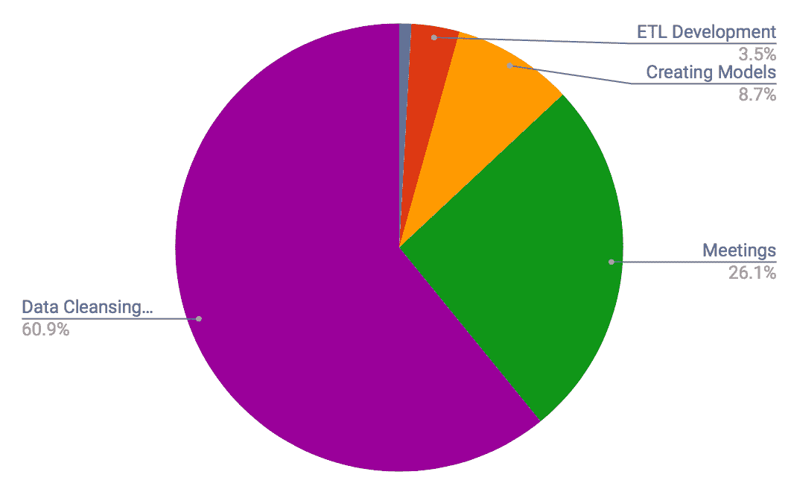

figure 1 A Data Scientists Average Day

**聊够了，回到数据分析**

如果你还记得我们之前的部分。我们展示了满意度和员工离职之间已经存在某种关联。这是影响员工离职的唯一因素吗？

## 人力资源数据集的相关矩阵

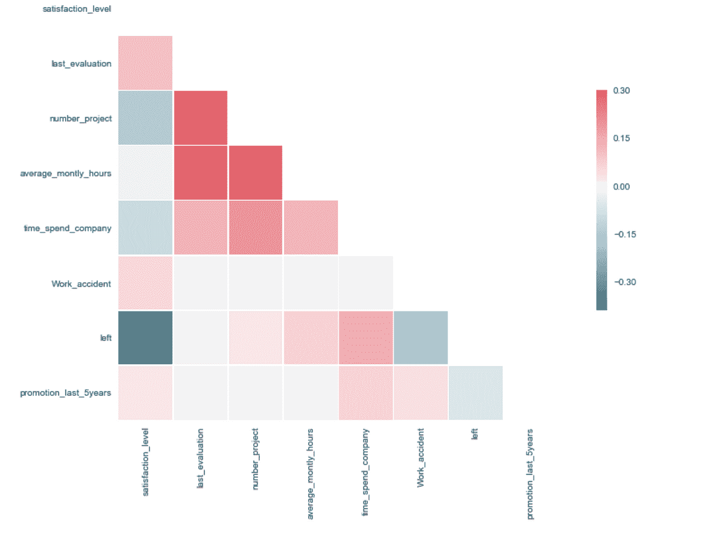

figure 2 Correlation Matrix Of HR Data Data Set

如果这就是分析的结束，那么数据分析师可以去找他们的老板，简单地说:“满意度在你的员工离职中起着重要作用！你应该去鼓舞士气。那会解决你所有的问题！

现在给我升职？

也许…但这并不能真正告诉数据分析师的老板为什么员工要离开。

[好的数据科学家](https://datascopeanalytics.com/blog/six-qualities-of-a-great-data-scientist/)要多提问！而且很多时候，那些问题不会横向移动。参见下面的图 3。

## 问为什么！

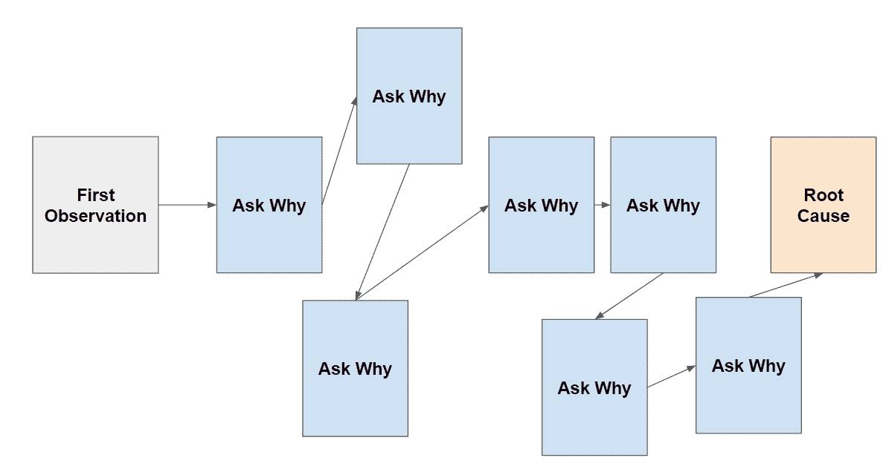

figure 3 A Data Scientists Daily Struggle

## 标准化数据

首先，我们获取所有数值数据点，并对它们进行归一化。这是获取一系列数字并在数据集中的最小值和最大值之间创建线性关系的过程。

我们是什么意思？图像有一组介于 1–1000 之间的数据和另一组介于 0–10 之间的数据。现在，这些数字之间的贬低可能会混淆算法。因此，我们将它们规范化。

而不是 1–1000 和 1–10。我们希望将范围限制在 0-1。这意味着您将使最大值=1，最小值= 0，然后在两者之间创建一条线，其中每个数字都适合。因此，对于 1-10，5 大约是 0.5，对于 1-1000，500 大约是 0.5。这样可以减少噪音。

你如何使数据正常化？

这里有一个快捷的函数，它将在 python 中规范化您的数据

```
normalized = (x-min(x))/(max(x)-min(x))
```

从数学上讲，它看起来像下面这样:

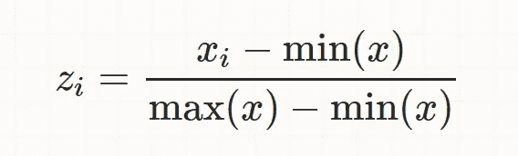

**加载数据分析库**

当使用 python 执行数据分析时，这些是您将需要的典型 python 库。

```
import pandas as pd
import numpy as np
import matplotlib.pyplot as plt
import seaborn as sns
```

**标记离开的员工**

我们决定根据谁走谁留来寻找聚类。下面是我们使用其中两个字段输出的数字之一。在图 4 中，红色代表离开的员工，蓝色代表留下的员工。

你看到了什么？似乎有 3 个集群，对吗？

有一群员工满意度很高，平均每月工作时间也很长。这可能是高绩效者，但他们为什么离开？如果不是他们离开。大多数离开的员工都是那些满意度低的人。这很有道理。

这也将使早先简单地提高士气的结论变得正确。

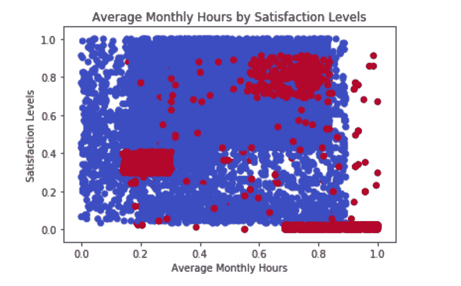

figure 4 Red = Employees That Have Left ; Blue = Employees That Haven’t Left

**用颜色创建基本散点图**

```
X = hr_data_s[['average_monthly_hours','satisfaction_level']]  # we only take the first two features.
y = hr_data_s.left
plt.scatter(X['average_monthly_hours'], X['satisfaction_level'], c=y, cmap=plt.cm.coolwarm)
plt.xlabel('Average Monthly Hours')
plt.ylabel('Satisfaction Levels')
plt.title('Average Monthly Hours by Satisfaction Levels')
plt.legend()
plt.show()
```

作为这家公司的一部分，分析师还应该问，留住每一类员工的投资回报率是多少。

我们没有足够的信息来判断哪些离职的员工是最有价值的。然而，常识告诉我们，图 4 右上角的组可能是。纯粹从我们目前所关注的指标来看，他们似乎是非常有价值的员工。

那是真的吗？

在本文中，我们将敦促您回头看看图 3。记住“问为什么”这个数字！

单从这个数据来看，很难说哪个群体最有价值。看起来有很高价值的群体可能是那些被要求完成适量工作从而表现出色的员工。他们也可能是工资最低、替换成本最低的员工。

这就是为什么，重要的是在分析中，继续问为什么！为什么有 3 个独立的组？他们每个人都不一样吗？怎么做，为什么？

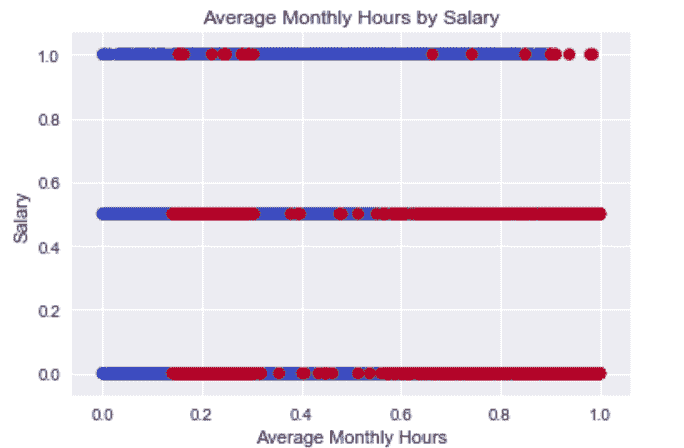

figure 5 figure 4 Red = Employees That Have Left ; Blue = Employees That Haven’t Left

看一下图 5，似乎也很少有高薪员工离职。图中离职的员工都是中低薪员工。这个，更有道理一点。

**员工为什么会离职？**

下一节将分析上面列出的各组之间的一些差异。

让我们从计算“已经离开的员工”组中的员工总数开始。

14999 名员工中离职的总人数为 3571 人。

从这里开始，我们将在下表中检查每个组的大小。我们已经根据迄今为止所看到的特征对每个组进行了标记。

下面的组只是我们个人的假设，为什么我们会看到这些不同的组。简单地将它们标记为组 1、2、3 等以避免确认偏差可能不是一个坏主意。

因此，评估分数高、工作时间长的那一组人就是“高绩效者”

小时数低、评价分数低的那一组是“低绩效者”

小时数高、评价分数低的群体“过劳”

然后，有一个离群组，针对的是没有完全融入这些集群的每个人。

## 离职员工明细

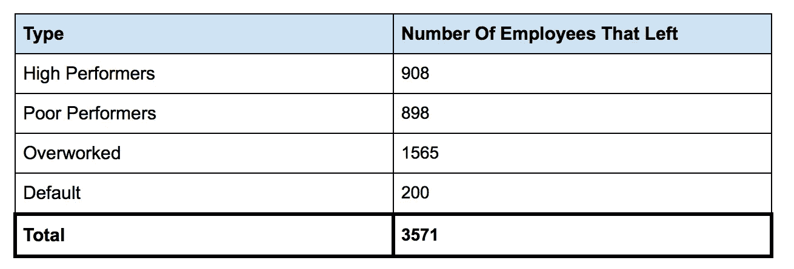

figure 6 Breaking down the employees that have left

细分下来，各组加起来就是 3571。这太棒了！

任何类型的数据专家。这应该是一个目标，在这个过程中创建这样的检查，以确保您的数字继续增加。数据总是有可能突然消失或增长。尤其是在 SQL 中。

[**数据分析**](https://en.wikipedia.org/wiki/Data_analysis) **讲的是为什么**

请记住，这不仅是数据科学，也是数据分析。我们可以很容易地将这个数据集放入算法中，让计算机替我们思考。python 和 R 中有很多库会很乐意为你做这些。

重要的是培养对数据的直觉，不要完全依赖预先制定的算法。

因此，让我们只看看那些离开的人，并尝试看看我们是否可以创造一个故事来告诉经理。

我们接下来的几个数字将是项目数量、平均每月小时数和评估分数的分布。

这很好，因为不像平均可以隐藏实际的传播，我们将能够可视化的雇员。

## 项目分布数量

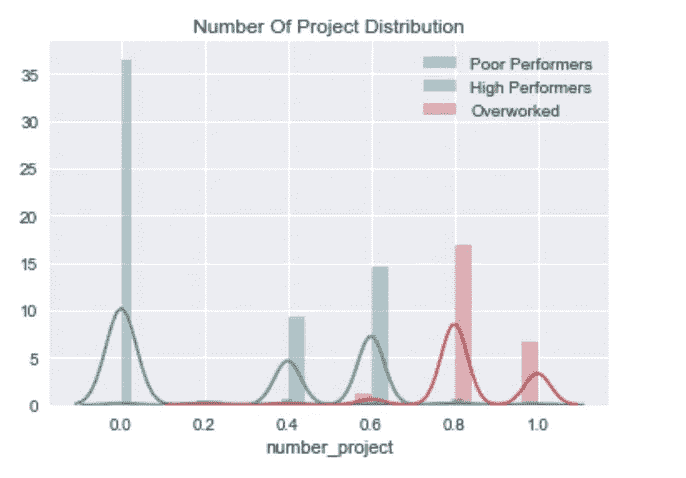

figure 7 Distribution Of Number Of Projects Per Group

**创建分布图**

```
sns.distplot(hr_data_s[‘last_evaluation’][hr_data_s.clutser == ‘Poor Performers’], label=’Poor Performers’);
sns.distplot(hr_data_s[‘last_evaluation’][hr_data_s.clutser == ‘High Performers’], label=’High Performers’);
sns.distplot(hr_data_s[‘last_evaluation’][hr_data_s.clutser == ‘Overworked’], label=’Overworked’);
plt.title(‘Last Evaluation Distribution’)
plt.legend()
plt.show()
```

请看图 7，我们看到超负荷工作的员工承担了大量的项目。这很奇怪吗？为什么工作过度、满意度较低的员工会得到更多的项目？那没有意义…是吗？

## 上次评估分布

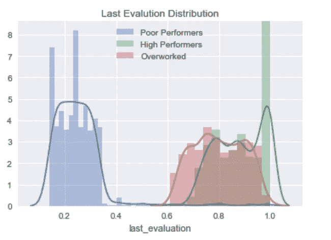

figure 8 Last Evaluation Distribution

然后我们看一下图 8，可以看到有很大一部分高绩效者有着惊人的评价。如果我们找到曲线下的区域(积分…哦，不),从那里，表现较好的人的最终峰值开始于 0.9 左右，结束于 1，我确信大约有 20%的人比“过度工作”的人得分更高。

当然，在这一点上表现不佳的人既不能在评估中得分，也不能得到很多项目。

## 平均月小时分布

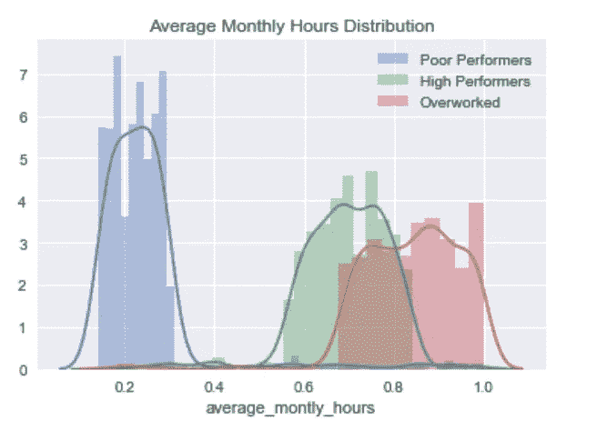

figure 9 Distribution Of Monthly Hours

现在，为了使其完整，我们在图 9 中再次引入了小时。根据图 1，我们已经知道平均每月工作时间和项目是正相关的。所以图 9 不应该是一个惊喜

这仍然是很好的检查，因为也许“高绩效者”和“过度工作者”仍然具有与图 9 中相同的分布，但是转换了图 7 中的分布。

然后，人们可能会假设“过度工作”的那一组之所以慢，是因为他们每小时做的项目比“高绩效者”少。

事实并非如此！

## 组和职务类型分解透视

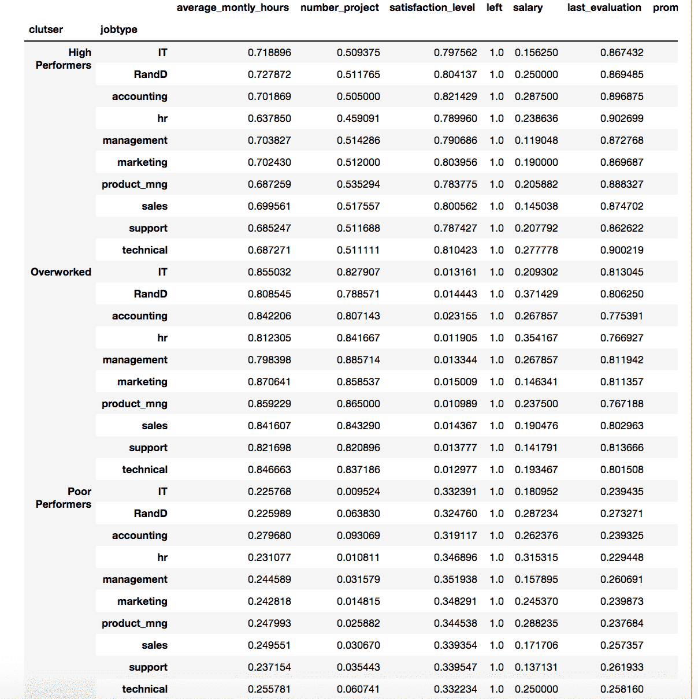

figure 10 Pivot Table Breakdown Of Groups to Job Type

最后，对于这一部分，我们有图 10。这并不优雅，但目的是展示每种工作类型在每组中是如何分解的。

这很奇怪，如果你真的看薪水的话。“高绩效者”的平均工资比“低绩效者”和“过度工作者”都低。

此外，现在我们已经找出了所有这些组，我们可以看到每个组的满意度有多低。

“过度工作”通常接近 0.01(正常)…这与“表现不佳”的人相比非常不同

怎么回事！

[**小学亲爱的沃森**](https://en.wikipedia.org/wiki/Deductive_reasoning)

基于这些信息，现在。到目前为止，你的结论是什么？

到目前为止，你已经注意到了哪些事实？

假设你是夏洛克·福尔摩斯。看目前的线索？

*   我们看到三个不同的群体
*   每一组都有不同的工作时间
*   两组好像满意度都很低？
*   一个评估分数比高绩效者低的群体也有高项目量？他们为什么被信任？
*   你还注意到了什么其他特征

作为一名分析师或数据科学家。得出结论是你的工作！和可操作的步骤！

同样，我们希望你想出一个结论。请在下面随意回答你现在的想法。继续之前。您的结论应该能够为经理或您的团队创建可操作的步骤。这是关键。

你越深入问题，你就越能找到根本原因。你就越有可能想出一个清晰的解决方案，并向经理解释为什么你会看到你所看到的趋势。

**为什么不直接把这个扔进算法里呢？**

如果你把这个数据集扔进一个像决策树这样的算法里。它实际上会给你一个相当精确的输出。然而，现在向你的经理解释一下？

我们认为，告诉一位经理“算法”证明了这一点，从来都不太管用。

**做一个讲故事的人**

作为一名分析师，能够讲述数据的故事是很重要的。上面的一些数字可以开始讲述这个故事！然后你可以把它和决策树或者逻辑回归算法结合起来。

那就不仅仅是一堆你甚至不理解的抽象数学了…

我们在第 1 部分中讨论过这个问题。你必须是一个好的沟通者，一个“数据故事讲述者”。不要隐瞒为什么！

一些机构让人们觉得，你需要做的只是通过算法运行数据，然后把结果当作福音来宣扬。

我们相信为了让真正的经理们接受。需要一份可靠的报告，让他们了解你是如何得出最终结论的。单纯的从数据探索到结论并不能证明你的观点，也不科学。

科学领域的理论需要多份研究论文一遍又一遍地证明同一个结论！

数据分析师也应该有证据证明他们超越了某种算法。这样，当你的经理问他们如何知道原因时，他们就可以回答了！

**为了进一步阅读数据科学和分析，这里有一些很棒的文章**

[人人数据分析简介第 1 部分](https://www.theseattledataguy.com/intro-data-analysis-everyone-part-1/)

[使用 Kafka 流分析预测预算](https://medium.com/@Pinterest_Engineering/using-kafka-streams-api-for-predictive-budgeting-9f58d206c996)

[如何将数据科学应用于实际业务问题](https://www.theseattledataguy.com/data-science-case-studies/)

[数据科学家的统计回顾](https://www.theseattledataguy.com/statistics-data-scientist-review/)

[伦理机器学习](http://www.acheronanalytics.com/acheron-blog/how-do-machines-learn-bias-data-science)

[为什么使用数据科学](http://www.acheronanalytics.com/acheron-blog/why-use-data-science-and-machine-learning)