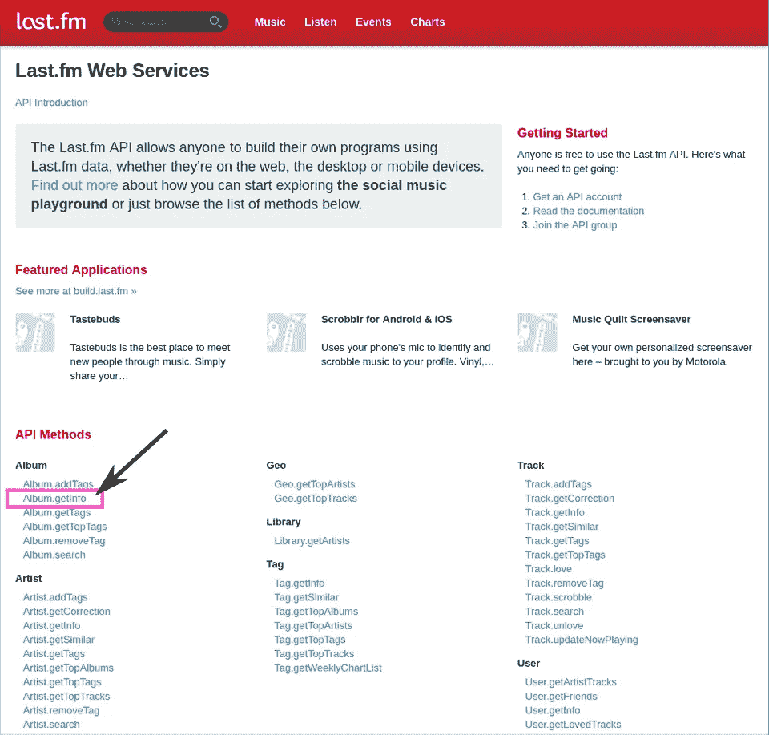
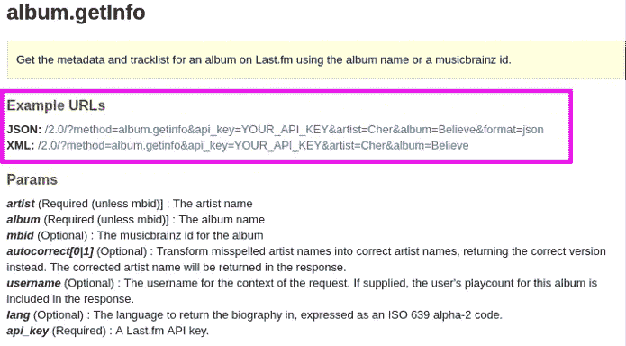
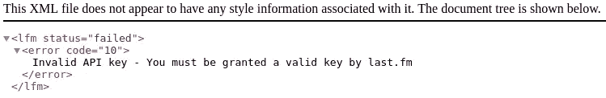
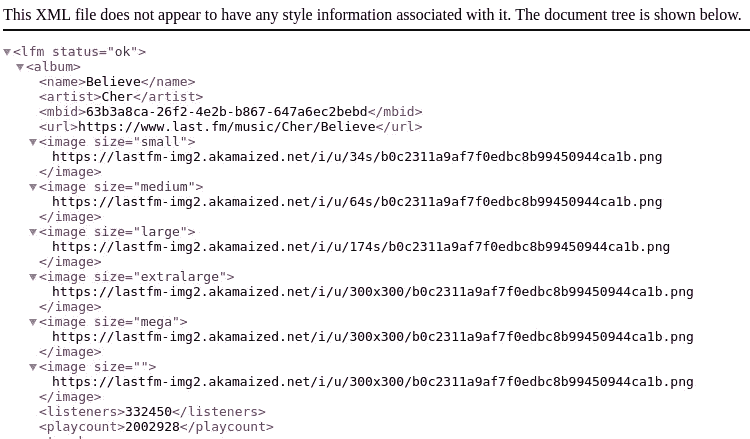

# 数据科学简介

> 原文：<https://towardsdatascience.com/intro-to-data-science-part-2-data-wrangling-75835b9129b4?source=collection_archive---------6----------------------->

# 第 2 部分:数据争论

*   第一部分:熊猫和熊猫
*   [第三部分:数据分析](/intro-to-data-science-part-3-data-analysis-71a566c3a8c3)


Photo by [Markus Spiske](https://unsplash.com/photos/xekxE_VR0Ec?utm_source=unsplash&utm_medium=referral&utm_content=creditCopyText) on [Unsplash](https://unsplash.com/search/photos/wrangling?utm_source=unsplash&utm_medium=referral&utm_content=creditCopyText)

真实世界的数据通常是杂乱无章的。数据科学家应该具备的最重要的技能之一是提取和清理数据的能力。这通常被称为数据争论或数据咀嚼。

我们获取数据的三个最常见的来源是文件、数据库或通过 web APIs 从网站获取数据。

如果我们想要处理和分析我们的数据，理解数据本身的结构是至关重要的。

在第 2 部分中，我们将学习:

*   我们可以在线获取的数据格式及其结构(csv、xml、json)
*   如何将 csv 文件加载到熊猫数据框中(pd.csv_read())
*   为什么关系数据库有用？(复杂查询、可伸缩性、模式)
*   如何制定简单和复杂的查询(SELECT、FROM、LIMIT、WHERE、GROUP BY、聚合函数、pandasql.sqldf())
*   什么是 API 以及如何从 API 获取数据(request.get()、json.loads())
*   健全性检查数据(描述()、部分删除、插补、fillna())

# 获取数据

网上的很多数据都存储在文本文件中，尤其是在政府网站上，往往只是从网站上下载文件的问题。例如，让我们得到所有美国职业棒球大联盟统计数据的数据库，我们可以在这里找到。在页面上，我们可以看到数据有多种格式。三种最常见的格式是 csv、xml 和 json。

我下载了名为“ [2016 —逗号分隔版本](http://seanlahman.com/files/database/baseballdatabank-2017.1.zip)—2017 年 2 月 26 日更新”的 csv 格式的数据。查看 AllstarFull.csv 文件时，前两行是:

```
playerID,yearID,gameNum,gameID,teamID,lgID,GP,startingPos
gomezle01,1933,0,ALS193307060,NYA,AL,,1
```

在 csv 格式中，我们通常有一系列的行，每行对应一个条目。条目由逗号分隔。文件顶部的标题行对应于标识符，如球员 ID，yearID…如果我们查看第一个球员的条目，我们可以看到相同顺序的相应数据。如果一个数据丢失了，我们会看到两个逗号连在一起，中间没有空格。

在 xml 文档的情况下，我们最终会得到与 html 非常相似的东西。我们可以有一个打开的文档元素，也可以有一系列打开的表格。该表有许多对应于上述值的子表。如果数据丢失，字段以斜杠结尾打开(例如:<playerid>)</playerid>

```
<Document Element>
  <Table>
    <playerID>gomezle01</playerID>
    <yearID>1933</yearID>
    <gameNum>0</gameNum>
    <gameID>ALS193307060</gameID>
    <teamID>NYA</teamID>
    <lgID>AL</lgID>
    <GP/>
    <startingPos>1</startingPos>
```

在 json 文档中，我们有许多用花括号表示的 json 对象。json 文档很像 python 字典。我们有键，对应于 csv 文件中的标题行，后跟值。在缺少值的情况下，我们只需打开和关闭引号

```
{ "playerID":"gomezle01"
  "yearID":1933
  "gameNum":0
  "gameID":"ALS193307060"
  "teamID":"NYA"
  "lgID":"AL"
  "GP":""
  "startingPos":1
}
```

xml 和 json 的好处是它们支持 csv 文档所不能支持的嵌套结构，尽管 csv 仍然是一种非常流行的存储数据的方式。

# CSV 数据

将 csv 数据加载到 Pandas 数据框中只需一行代码。每一列都可以通过提及它们的名称来检索。我们还可以通过以矢量化的方式操作列，在数据框上创建新列。例如，如果我们想要一个新的列，它是每个球员的身高和体重的总和，我们可以编写 to 列的算法，如下所示。

也可以将数据写入一个新的 csv 文件，该文件包含我们刚刚用 to_csv()函数添加的新列。

```
>>>
    playerID  birthYear  birthMonth  birthDay birthCountry ...
0  aardsda01     1981.0        12.0      27.0          USA ...    
1  aaronha01     1934.0         2.0       5.0          USA ...      
2  aaronto01     1939.0         8.0       5.0          USA ...      
3   aasedo01     1954.0         9.0       8.0          USA ...      
4   abadan01     1972.0         8.0      25.0          USA ...     
>>>
0    290.0
1    252.0
2    265.0
3    265.0
4    257.0
```

# 关系数据库

我们现在知道如何从 csv 这样的平面文件中加载数据。现在让我们看看如何处理存储在关系数据库中的数据。关系数据库类似于电子表格的集合。在每个电子表格中，都有列和行。列指定一个值及其类型，如 playerID。每一行包含每一列的值，我们称每一组行和列为表格，而不是电子表格，这些表格通常以某种方式相互关联。

关系数据库非常有用，主要有三个原因:

*   用复杂的查询提取数据很简单。
*   它伸缩性很好
*   它确保所有数据的格式一致

事实上，与平面文件相比，使用数据库选择年龄大于 50 岁、体重小于 50、城市等于孟买的人的所有记录很容易。

拥有数十万或数百万条目的数据库并不少见。由于所有信息都理想地存储在一个位置，所以很容易以可伸缩的方式更新、删除和向数据库添加新数据。

最后，关系数据库总是有一个模式。模式是告诉数据库我们计划如何存储数据的蓝图。例如，人的年龄不能是字符串，而其他人的年龄是整数。此外，模式规定对于给定的表，每一行或每一项都有对应于相同值的完全相同数量的列，并且每一列的值都以相同的方式格式化。

# 问题

我们如何从关系数据库中获取数据？通常使用结构查询语言(SQL)从关系数据库中检索数据。如果我们想要选择所有(*)的数据，查询应该是:

```
SELECT * FROM database_name;
```

我们可以通过在 SQL 命令的末尾添加 limit 20 来限制行数。

```
SELECT * FROM database_name LIMIT 20;
```

我们也可以只要求特定的列，如姓名和年龄。

```
SELECT name, age FROM database_name LIMIT 20;
```

让我们将这个查询编写在一个 python 文件中，并将数据存储在“database_solution”中。

我们还可以执行更复杂的查询。以下查询选择与国家冰岛对应的所有数据。

```
SELECT * FROM database_name WHERE country = "Iceland";
```

SQL 中存在一些函数，如 group by 和 aggregate。聚合函数接受一组值，通常是数字，并对它们执行数学运算。例如，sum()是一个聚合函数。

每个地区 50 岁以上的人登记在数据库中的总人数是多少？以下查询首先选择每个地区有多少男性和女性注册。因为我们使用的是聚合函数，所以我们需要包含一个分组依据和非聚合字段，在本例中是地区和性别。最后，我们希望将此限制在 50 岁以上的男性和女性。因此，我们在表名后包含 where 子句，其中 age > 50。

```
SELECT gender, district, sum(database_generated) 
FROM database_name
WHERE age > 50
GROUP BY gender, district
```

# 应用程序编程接口

我们现在知道如何从文件或数据库中获取数据，但是像 Twitter 这样的网站上的数据呢？通过搜索或抓取网站来获取所有数据可能会变得复杂。幸运的是，许多公司允许用户和开发人员通过 API 以简单的、机器可读的格式直接访问数据。有几种不同类型的 API，但最常见的一种，也是 Twitter 使用的一种，是表示状态转移或 REST API。

让我们以 [last.fm API](https://www.last.fm/api) 为例，看看我们如何与之交互。正如您在左侧看到的，有几个不同的 last.fm API 方法，我们可以与之对话并从中检索信息。例如，让我们检查一下图像中紫色方块中的 Album.getInfo 方法。



[last.fm API](https://www.last.fm/api)

当点击 [Album.getInfo 链接](https://www.last.fm/api/show/album.getInfo)时，我们会看到一个页面，描述 API 方法将返回的数据类型，如艺术家姓名、专辑名称等



正如你所看到的，这个页面告诉我们 API 方法将返回的数据类型，如艺术家姓名、专辑名称和一系列其他信息，如语言或专辑中的音乐大脑 ID。

但是我们如何从 API 中获取数据呢？

1.  获得一个 [API 账号](https://www.last.fm/api/account/create)。然后，您将收到一个 API 密钥。
2.  返回到 [Album.getInfo 页面](https://www.last.fm/api/show/album.getInfo)并点击其中一个示例 URL(在紫色方块中)
3.  您应该会看到一条错误消息，提示您需要一个 API 密钥。



4.复制您的 API 密钥并将其粘贴到 url 中，而不是您的 _API_KEY 中。现在你应该看到数据了。



注意这个 URL 有一些有趣的地方。

[http://ws.audioscrobbler.com/2.0/?method=album.getinfo&API _ KEY = YOUR _ API _ KEY&艺人=雪儿&专辑=相信](http://ws.audioscrobbler.com/2.0/?method=album.getinfo&api_key=YOUR_API_KEY&artist=Cher&album=Believe)

API 参数定义在问号之后，如 method、api_key、artist 和 album。例如，如果我们想让蕾哈娜大声说出专辑中的信息，我们可以简单地写:

http://ws.audioscrobbler.com/2.0/?method=album.getinfo&API _ KEY = YOUR _ API _ KEY&艺人=蕾哈娜&专辑= 大声

现在让我们在一个简单的 python 程序中实现它，该程序使用 json 和请求库。

首先，我们像前面看到的那样指定一个 URL。函数 requests.get()将从. txt 中的 url 获取数据。查看 json 对象，我们会看到一个很难处理的字符串格式，但是由于 json.load()函数，json 库允许与 json 数据进行非常简单的交互。现在，json 数据被转换成 Python 字典。

# 健全性检查数据

既然我们已经获得了数据，无论是非正式的平面文件 sequel(如关系数据库)还是 API，我们都需要在进行任何分析之前对数据进行完整性检查。健全检查允许我们确定数据是否有意义。我们不会深入讨论细节，但是为了进行最基本的健全性检查，Pandas DataFrames 有一个非常有用的方法叫做 describe()。

为了说明 Panda 的 describe 函数是如何工作的，我们将使用上面的 baseball_data。

```
>>>birthYear  birthMonth  birthDay  deathYear  deathMonth
count  18973        18803     18656       9441        9440   
mean    1931            6        15       1964           6   
std       41            3         8         31           3   
min     1820            1         1       1872           1   
25%     1895            4         8       1942           3   
50%     1937            7        16       1967           6   
75%     1969           10        23       1990          10   
max     1996           12        31       2017          12 deathDay        weight    height  
count   9439         18251    18320  
mean      15           186       72  
std        8            21        2  
min        1            65       43  
25%        8           170       71  
50%       15           185       72  
75%       23           200       74  
max       31           320       83
```

函数 describe()返回一个数据帧。对于每个数字列，我们可以看到计数、平均值、标准偏差、平均值。我们可以做一些快速检查，以确保有些数据通常是有意义的，例如月份包含在 1 到 12 之间，日期包含在 1 到 3 之间。有没有异常值？查看最小值和最大值是否远大于第 25 或 75 百分位对应的值…

您可能会注意到，每一列的计数都不同。这说明我们可能有一堆**缺失值**。值可能丢失的原因有很多，例如收集数据失败、数据丢失、无响应值。缺失值会使您的发现无效，因此设计数据收集方法非常重要。可以使用不同的方法来减轻这些缺失值对我们分析的影响。

存在两种方法，**部分删除**和**插补**。部分删除就像它听起来的那样，将我们用于分析的数据集限制在我们可用的数据范围内。我们可以使用的一种方法叫做列表式删除。在我们执行列表删除的情况下，我们将从所有分析中排除特定的数据点，即使存在一些有用的值。

当我们没有太多数据时，或者移除缺失值会损害样本的代表性时，我们会使用**插补**。仅仅因为缺少值就丢弃一堆条目可能会严重影响我们试图执行的任何分析的统计能力。在这种情况下，对我们的数据中缺失的值进行智能猜测(如近似值)可能是有意义的。例如，我们可以用所有其他值的平均值替换所有缺失值，或者使用线性回归来估计缺失值。然而，插补给数据集带来了偏差和不准确性。这是一个非常困难的问题，新技术也在不断发展。存在更复杂和健壮的方法。

在下面的代码中，我们计算“weight”数组的平均值，并通过将“weight”列中的任何缺失值设置为平均权重来估算它们。

在下一篇文章中，我们将深入实际数据分析！