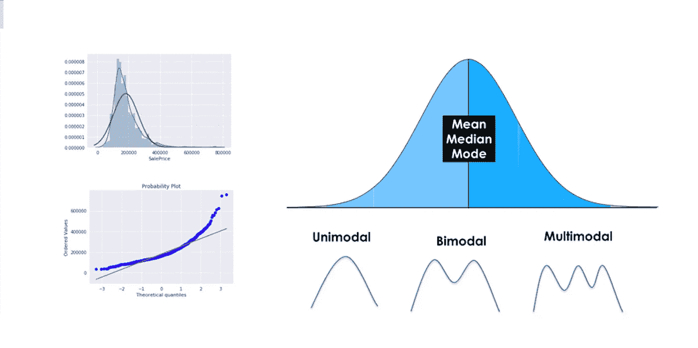
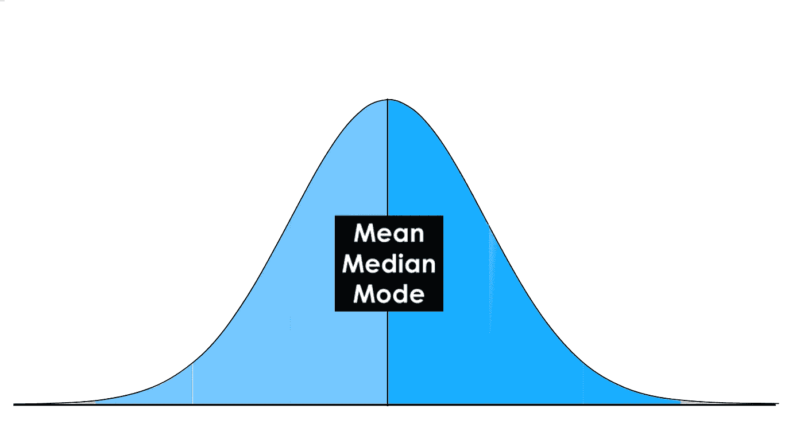
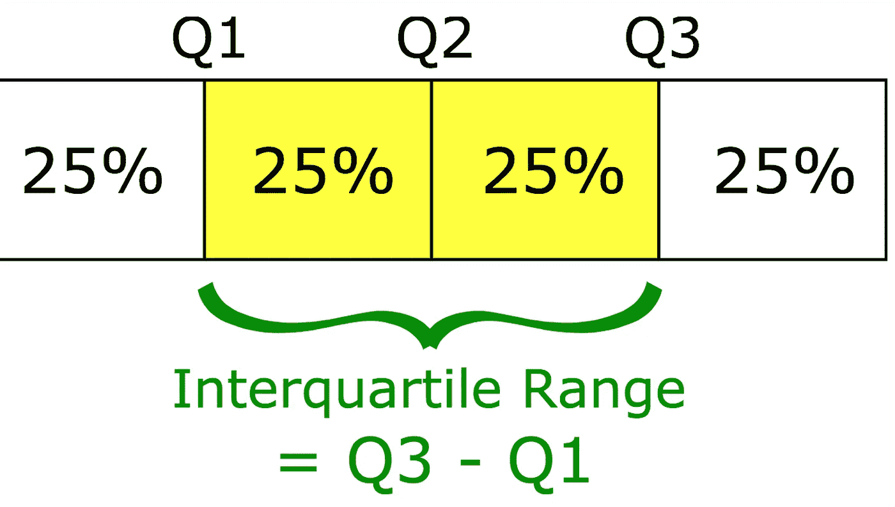
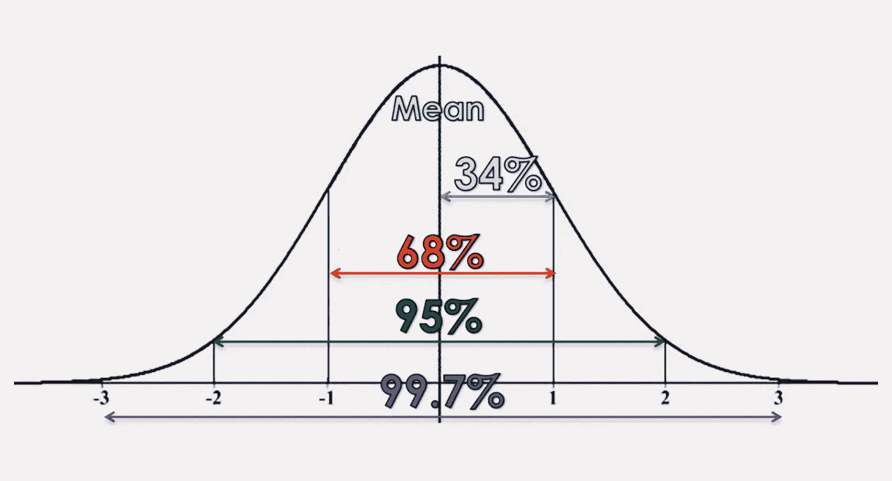
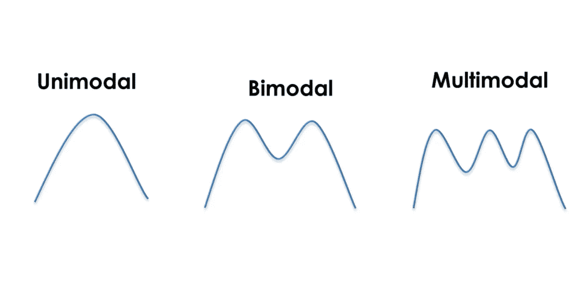
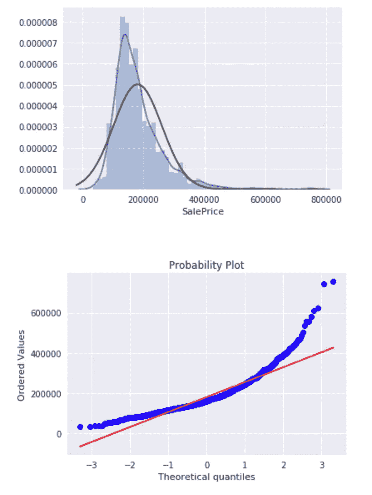

# 描述统计学简介

> 原文：<https://towardsdatascience.com/intro-to-descriptive-statistics-252e9c464ac9?source=collection_archive---------0----------------------->

**描述性统计分析帮助你理解你的数据，是机器学习非常重要的一部分。这是因为机器学习就是做预测。另一方面，统计学就是从数据中得出结论，这是必要的第一步。在本帖中，你将了解最重要的描述性统计概念。它们将帮助你更好地理解你的数据试图告诉你什么，这将导致整体更好的机器学习模型和理解。**

**目录:**

*   介绍
*   正态分布
*   集中趋势(平均值、众数、中位数)
*   可变性的度量(范围，四分位范围)
*   方差和标准差
*   形式
*   歪斜
*   峭度
*   摘要

# 介绍

对数据集进行描述性统计分析绝对至关重要。许多人跳过了这一部分，因此失去了许多关于他们数据的有价值的见解，这往往会导致错误的结论。慢慢来，仔细运行描述性统计，确保数据满足进一步分析的要求。

但是首先，我们应该回顾一下统计学到底是什么:

***统计学是数学的一个分支，处理数据的收集、解释、组织和解释。***

在统计学中，有两个主要类别:

**1。描述性统计:在描述性统计中，你通过数字计算或图表来描述、展示、总结和组织你的数据(总体)。**

**2。推断统计:**推断统计是由更复杂的数学计算产生的，它允许我们根据对样本的研究来推断趋势，并对总体做出假设和预测。

# 正态分布

正态分布是统计学中最重要的概念之一，因为几乎所有的统计检验都需要正态分布的数据。它基本上描述了大样本数据在绘制时的样子。它有时被称为“钟形曲线”或“高斯曲线”。

推理统计和概率计算要求给出正态分布。这基本上意味着，如果你的数据不是正态分布的，你需要非常小心你应用的统计测试，因为它们可能会导致错误的结论。

**如果您的数据是对称的、钟形的、居中的和单峰的，则给出正态分布。**

在完美的正态分布中，每一边都是另一边的精确镜像。它应该看起来像下图中的分布:

你可以在图片上看到，分布是钟形的，这仅仅意味着它没有严重见顶。单峰意味着只有一个峰值。

# 集中趋势

在统计学中，我们必须处理均值、众数和中位数。这些也被称为“集中趋势”。这只是三种不同的“平均值”，当然也是最受欢迎的一种。

平均值是简单的平均值，被认为是对单个样本的总体趋势做出假设的最可靠的度量。集中趋势确定数据值围绕其平均值、众数或中位数聚集的趋势。平均值由所有值的总和除以值的个数计算得出。

**众数是数据中最常出现的值或类别。**因此，如果没有重复的数字或没有相同的类别，数据集就没有模式。一个数据集可能有多种模式，但我将在下面的“模态”一节中介绍这一点。
该模式也是可用于分类变量的集中趋势的唯一衡量标准，因为您无法计算变量“性别”的平均值。您只需将分类变量报告为数字和百分比。

**中位数是数据的“中间”值或中点**，也称为“第 50 百分位”。请注意，中位数比平均值受异常值和偏差数据的影响要小得多。我将通过一个例子来解释这一点:假设您有一个房屋奖励数据集，大部分奖励从 10 万美元到 30 万美元不等，但包含一些价值超过 300 万美元的房屋。这些昂贵的房子会严重影响价值，因为它是所有价值的总和，除以价值的数量。中位数不会受到这些异常值的严重影响，因为它只是所有数据点的“中间”值。因此，中位数是一个更适合用来报告数据的统计数字。

在正态分布中，这些度量都落在同一中线点。这意味着平均值、众数和中位数都是相等的。

# 差异量数

最受欢迎的变异性度量是极差、四分位差(IQR)、方差和标准差。这些用于测量数据中的分布或变化量。

****范围描述数据中最大和最小点之间的差异。****

**四分位数间距(IQR)是上四分位数(第 75 个)和下四分位数(第 25 个)之间的统计离差的度量。**

****

****范围衡量的是数据点的开始和结束位置，而四分位数范围衡量的是大多数值的位置。****

**对于初学者来说，标准差和方差之间的区别往往有点难以理解，但我会在下面详细解释。**

# **方差和标准差**

**像范围和 IQR 一样，标准差和方差也衡量我们的数据有多分散(例如离差)。因此，它们都是由平均值派生出来的。**

**方差的计算方法是找出每个数据点与平均值之间的差值，将它们平方，求和，然后取这些数字的平均值。**

**在计算过程中使用正方形，因为它们比接近平均值的点更重视异常值。这可以防止平均值以上的差异抵消平均值以下的差异。**

**方差的问题在于，由于平方，它与原始数据的度量单位不同。**

**假设您正在处理一个包含厘米值的数据集。你的方差是平方厘米，因此不是最好的测量。

这就是为什么标准差用的比较多，因为它是在原单位。它只是方差的平方根，正因为如此，它被返回到原始的度量单位。**

**让我们看一个说明方差和标准差之间区别的例子:**

**假设一个数据集包含 1 到 15 之间的厘米值，其平均值为 8。对每个数据点和平均值之间的差求平方，并对平方求平均，得到 18.67(平方厘米)的方差，而标准偏差是 4.3 厘米。**

**当标准偏差较低时，您的数据点往往接近平均值。高标准偏差意味着您的数据点分布在很大的范围内。**

**当数据为单峰时，最好使用标准差。在正态分布中，大约 34%的数据点位于平均值和高于或低于平均值的一个标准差之间。由于正态分布是对称的，68%的数据点落在平均值以上一个标准差和平均值以下一个标准差之间。大约 95%落在低于平均值的两个标准偏差和高于平均值的两个标准偏差之间。并且大约 99.7%落在平均值以上三个标准偏差和平均值以下三个标准偏差之间。**

**下图完美地说明了这一点。**

****

**通过所谓的“Z 得分”，您可以检查特定数据点有多少标准差低于(或高于)平均值。对于熊猫，您只需使用[“STD()”功能](https://pandas.pydata.org/pandas-docs/stable/generated/pandas.DataFrame.std.html)。为了更好地理解正态分布的概念，我们现在将讨论模态、对称性和峰值的概念。**

# **形式**

****一个分布的模态是由它包含的峰的数量决定的。**大多数分布只有一个峰值，但也有可能遇到有两个或更多峰值的分布。**

**下图显示了三种形态的视觉示例:**

****

**单峰意味着分布只有一个峰值，这意味着它只有一个频繁出现的分数，聚集在顶部。双峰分布有两个频繁出现的值(两个峰值)，多峰分布有两个或几个频繁出现的值。**

# **歪斜**

**偏斜度是对分布对称性的一种度量。**

**因此，它描述了一个分布与正态分布有多大的不同，或者向左，或者向右。偏斜值可以是正数、负数或零。请注意，完美的正态分布的偏斜度为零，因为平均值等于中位数。**

**下面你可以看到不同类型的偏斜度:**

****

****如果数据堆积在左边**，使得尾部指向右边，我们称之为正偏斜。**

****如果数据堆积到右边**，会出现负偏斜，使得尾部指向左边。注意，正偏斜比负偏斜更频繁。**

**对分布的偏斜度的一个很好的度量是皮尔逊偏斜系数，它提供了对分布对称性的快速估计。要计算熊猫的偏斜度，你只需使用[“skew()”函数](https://pandas.pydata.org/pandas-docs/stable/generated/pandas.DataFrame.skew.html)。**

# **峭度**

**峰度测量数据集与正态分布相比是重尾还是轻尾。峰度高的数据集尾部重，离群值多，峰度低的数据集尾部轻，离群值少。请注意，直方图是显示数据集的偏斜度和峰度的有效方法，因为您可以很容易地发现数据是否有问题。概率图也是一个很好的工具，因为正态分布是沿着直线的。**

**在下图中，您可以看到正倾斜数据集的两种情况:**

****

**用数学方法测量分布的峰度的一个好方法是 fishers 峰度测量法。**

**现在我们将讨论三种最常见的峰度。**

**正态分布称为**中峰度**，峰度为零或接近零。与正态分布相比，**宽峰分布**具有负峰度，并且尾部非常细。**尖峰分布**的峰度大于 3，厚尾意味着该分布产生更多的极值，并且具有相对较小的标准偏差。**

**如果你已经认识到一个分布是偏斜的，你不需要计算它的峰度，因为这个分布已经不正常了。在 pandas 中，您可以简单地通过调用[“Kurt osis()”函数](https://pandas.pydata.org/pandas-docs/stable/generated/pandas.DataFrame.kurtosis.html)来查看峰度。**

# **摘要**

**这篇文章给了你一个正确的描述统计学的介绍。您学习了正态分布的样子以及它的重要性。此外，您还了解了三种不同的平均值(平均值、众数和中位数)，也称为集中趋势。之后，您学习了极差、四分位差、方差和标准差。然后我们讨论了三种类型的模态，你可以用偏斜度来描述一个分布和一个正态分布有多大的不同。最后，你学习了薄黑洞、中黑洞和宽黑洞的分布。**

**这篇文章最初发表在我的博客上(【https://machinelearning-blog.com】T2)。**