# 数据科学的描述统计和概率介绍

> 原文：<https://towardsdatascience.com/intro-to-descriptive-statistics-and-probability-for-data-science-8effec826488?source=collection_archive---------2----------------------->

# 目录:

*   介绍
*   集中趋势的度量(平均值、众数、中位数)
*   可变性测量(范围、IQR、方差、标准差)
*   概率(伯努利试验，正态分布)
*   中心极限定理
*   z 分数

## 简介:

在描述统计学中，你通过数字计算、图表或表格来描述、展示、总结和组织你的数据。在描述性统计中，一些常用的度量是集中趋势，另一些是数据集的可变性。

描述性统计分析帮助我们理解我们的数据，并且是机器学习的非常重要的部分。对我们的数据集进行描述性统计分析绝对至关重要。许多人跳过了这一部分，因此失去了许多关于他们数据的有价值的洞察力，这常常导致错误的结论。

## 集中趋势的测量:

它用代表其分布中心的单个值来描述一整套数据。有三种主要的集中趋势测量方法:

1.  **均值**:是观察值之和除以样本量。这不是一个稳健的统计数据，因为它受到极值的影响。因此，非常大或非常低的值(即异常值)会扭曲答案。
2.  **中位数**:数据的中间值。它将数据分成两半，也称为第 50 百分位。与平均值相比，它受异常值和偏差数据的影响要小得多。如果数据集中的元素数量是奇数，则最中间的元素是中值。如果数据集中的元素数量是偶数，则中位数将是两个中心元素的平均值。
3.  **模式**:数据集中出现频率较高的值。因此，一个数据集没有模式，如果没有类别是相同的，也可能一个数据集有一个以上的模式。这是唯一可以用于分类变量的集中趋势的量度。

## **可变性测量**

可变性的度量也称为数据的分布，描述了一组观察值的相似性或差异性。最受欢迎的变异性度量是极差、四分位差(IQR)、方差和标准差。

1.  **范围**:范围描述数据中最大和最小点之间的差异。范围越大，数据越分散。
2.  **IQR** :四分位数间距(IQR)是对上四分位数(第 75 个)即第三季度和下四分位数(第 25 个)即 Q1 之间的统计离差的衡量。你可以通过下面的例子理解这一点。

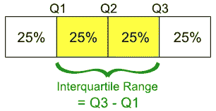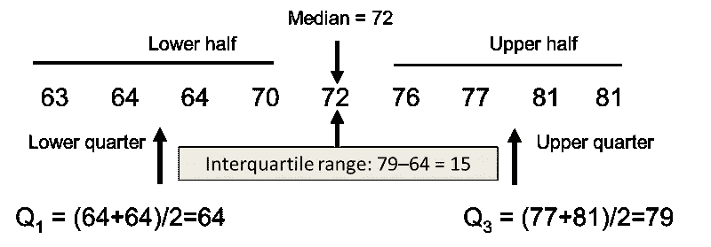

虽然范围衡量的是数据点的开始和结束位置，但四分位数范围衡量的是大多数值所在的位置。

3.**方差:**是均值的均方差。方差的计算方法是找出每个数据点与平均值之间的差值，将它们平方，求和，然后取这些数字的平均值。

方差的问题在于，由于平方，它与原始数据的度量单位不同。

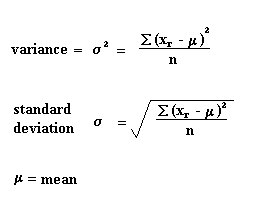

4.**标准差:**标准差因为是原单位，所以用的比较多。它只是方差的平方根，正因为如此，它被返回到原始的度量单位。

当标准偏差较低时，您的数据点往往接近平均值。高标准偏差意味着您的数据点分布在很大的范围内。

当数据为单峰时，最好使用标准差。在正态分布中，大约 34%的数据点位于平均值和高于或低于平均值的一个标准差之间。由于正态分布是对称的，68%的数据点落在平均值以上一个标准差和平均值以下一个标准差之间。大约 95%落在低于平均值的两个标准偏差和高于平均值的两个标准偏差之间。并且大约 99.7%落在平均值以上三个标准偏差和平均值以下三个标准偏差之间。

下图完美地说明了这一点。

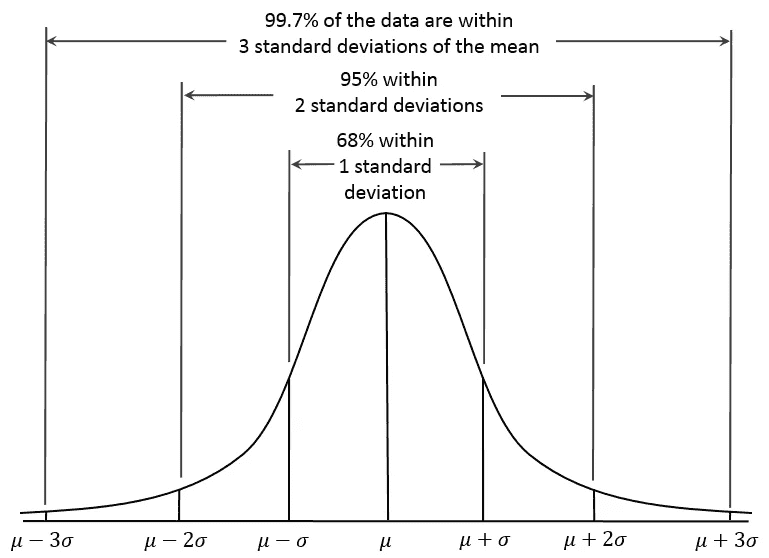

通过所谓的“Z 得分”，您可以检查特定数据点有多少标准差低于(或高于)平均值。

## 可能性

我将简单介绍一下概率。在给出概率的实际定义之前，让我们先看看一些术语。

*   **实验**:实验可能类似于——德里每天是否下雨。
*   **结果**:结果是单次试验的结果。如果今天下雨，今天的审判结果就是“下雨了”。
*   **事件**:事件是实验的一个或多个结果。对于德里每天是否下雨的实验，事件可能是“下雨了”或“没下雨”。
*   **概率**:简单来说就是事件发生的可能性。所以如果今天有 60%的可能性下雨，那么下雨的概率是 0.6。

**伯努利** **试验**

像掷硬币一样有两种结果的实验叫做伯努利试验。

n 次伯努利试验中成功次数的概率分布称为**二项式分布**。

二项式分布的公式如下。

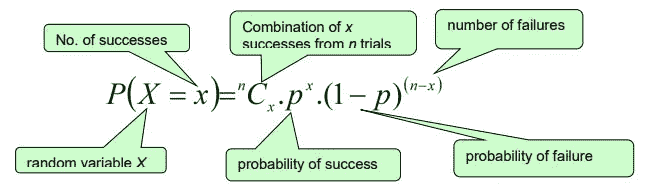

Binomial distribution Formula

**具有不同成功概率和 100 个随机变量的二项分布的概率质量函数**。

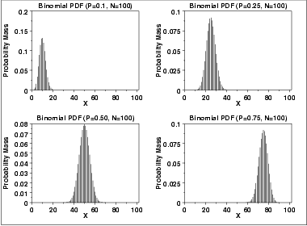

**Probability Mass Function**

**连续随机变量(**变量可以取两点之间的任何可能值)的概率分布称为**概率密度函数**。在连续随机变量的情况下，将有无限个试验。

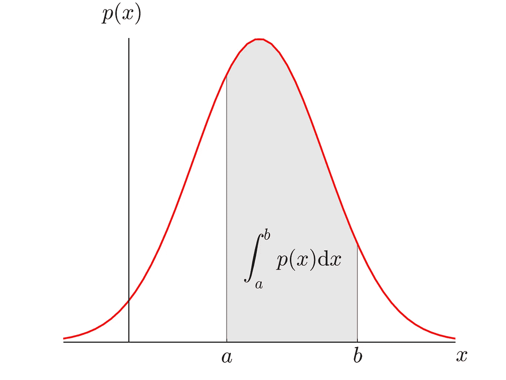

概率密度函数下的面积给出了随机变量在该范围内的概率。

如果我有一个总体数据，我从数据中随机抽取相同大小的样本，样本均值大致呈正态分布。

## 正态分布

它基本上描述了大样本数据在绘制时的样子。它有时被称为“钟形曲线”或“高斯曲线”。

推理统计和概率计算要求给出正态分布。这基本上意味着，如果你的数据不是正态分布的，你需要非常小心你应用的统计测试，因为它们可能会导致错误的结论。

在完美的正态分布中，每一边都是另一边的精确镜像。它应该看起来像下图中的分布:

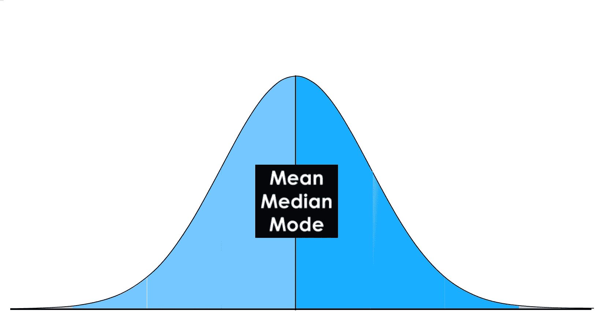

**Normal Distribution**

在正态分布中，均值、众数和中位数都相等，并且落在同一中线点。

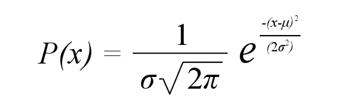

**Normal Distribution Function**

均值为 0，标准差为 1 的正态分布称为**标准正态分布**。标准正态分布曲线下的面积为 1。

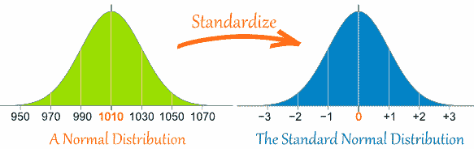

## 中心极限定理

*   如果我们从一个分布中取随机样本的平均值，并画出平均值，当我们取了足够多的这种样本时，图表就接近正态分布。
*   该定理还指出，均值将近似等于样本均值，即总体均值。

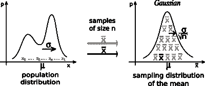

标准偏差较高的正态分布更平坦，即与标准偏差较低的正态分布相比，分布范围更广。

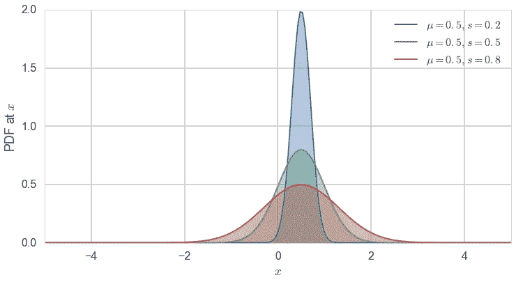

## z 分数

以标准偏差数表示的距离，即观察值远离平均值的距离，是标准分数或 Z 分数。

正 Z 值表示观察值高于平均值 Z 个标准差。Z 分数为负表示该值低于平均值。

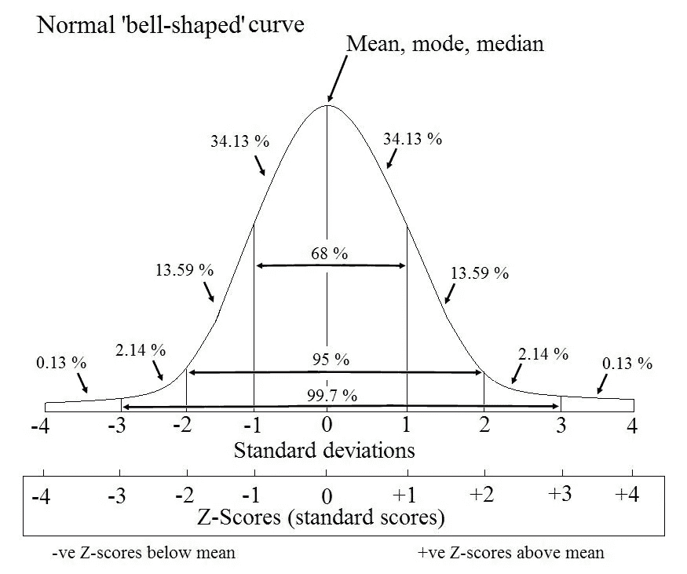

观察值= +zσ [是平均值，σ是标准偏差]

从上图来看，平均值 2 附近的标准偏差为 0.95，这意味着数据位于该范围内的概率为 0.95。

对于特定的 Z 得分，我们可以查看 Z 表，找出值小于该特定 Z 值的概率。

所以，我希望这篇文章给了你一个正确的描述统计学的介绍。