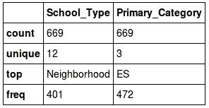
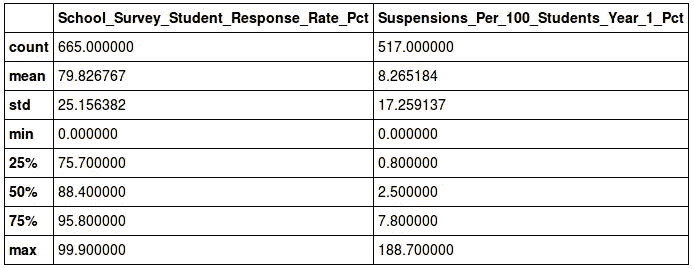
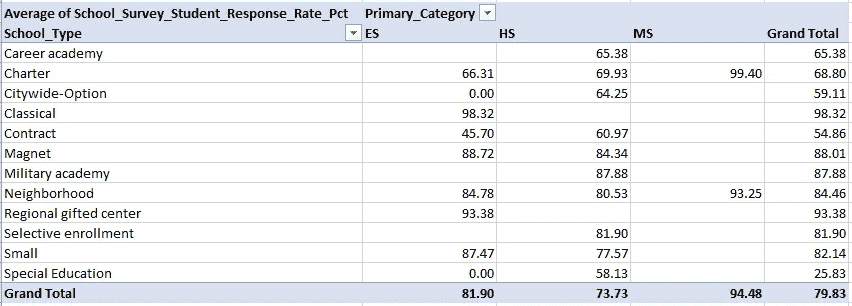
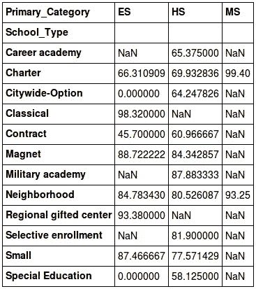
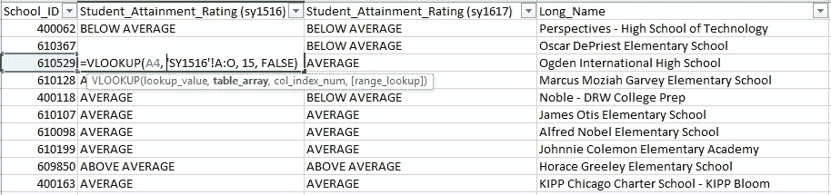
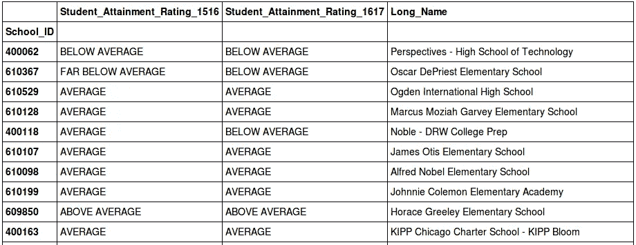

# Excel 超级用户熊猫简介

> 原文：<https://towardsdatascience.com/intro-to-pandas-for-excel-super-users-dac1b38f12b0?source=collection_archive---------2----------------------->

我和微软 Excel 认真交往多年。它伴随着我度过了大学时光和两份分析师工作。我非常了解 Excel 它所有的曲线和边缘，它的捷径和不完美。虽然它不是最有效的工具，但它完成了工作，不需要我学习如何编码。

然后，大概八个月前，我开始读研，被介绍认识了 Python。我们成了即时的朋友。随着 Python 的出现，出现了一种叫做[熊猫](http://pandas.pydata.org/)的东西。一开始我不确定我对熊猫的感觉。老实说，感觉有点像这样:


在 Excel 中花了我 10 秒钟的分析将需要 10 多分钟的谷歌搜索和反复试验。然而，随着时间的推移，我越来越喜欢熊猫了。它能做 Excel 能做的一切，甚至更多，只是更快、更灵活、完全可复制。我每天都在学习一些关于熊猫的新知识，但是还没有达到我和 Excel 之间的亲密程度。

与此同时，我想通过分享一些常用的 Excel 函数/工具来传播这种爱，这些函数/工具可以在熊猫身上进行分析。在下面的例子中，我们将探索来自芝加哥公立学校 2016-2017 学年的学校进度报告[数据](https://data.cityofchicago.org/Education/Chicago-Public-Schools-School-Progress-Reports-SY1/cp7s-7gxg)。数据包含学校级别的详细信息，每行一所学校。

## 表示数据

**Excel** :数据在 Excel 表格中用列、行、单元格表示。对于不同的数据集，我们可以有不同的工作表。

**Pandas** :数据的“表格”存储在[数据帧](http://pandas.pydata.org/pandas-docs/stable/generated/pandas.DataFrame.html)中。我们可以从头开始创建数据框架，或者更常见的是，从 csv 文件导入数据:

```
import pandas as pd

sy1617 = pd.read_csv('CPS-Progress-Reports_SY1617.csv', index_col='School_ID')
```

列将被标记为它们在 csv 中的样子。行也标有唯一标识符，称为“索引”我们选择了 School_ID 列作为索引，因为每个学校 ID 唯一地标识一个学校行。如果我们在加载 csv 时没有明确地指定一个列作为索引，Pandas 将自动生成一个索引，标记从 0 开始的行。

要快速查看数据框的顶部:

```
sy1617.head()
```

## 访问数据

**Excel**:Excel 的一个好处就是数据随时都在我们眼前。我们使用基本点和点击命令或键盘快捷键来选择数据。

**Pandas** :有几种不同的方法来访问特定的行、列和单元格。

若要访问单个列，请使用方括号。输出是一个 Series 对象，它是一个一维数组:

```
sy1617['School_Type']
```

若要访问多个列，请指定列名列表。输出现在是一个数据帧:

```
sy1617[['School_Type', 'Primary_Category']]
```

我们可以通过索引标签来访问一行:

```
sy1617.loc[400062]
```

我们也可以改为指定行号:

```
sy1617.iloc[0]
```

要访问单个单元格，只需按行和列划分子集:

```
sy1617.loc[400062]['School_Type']
```

## 基本汇总统计

**Excel** :应用计数、平均值、中位数、百分位数等。跨所需列或行的函数。

**熊猫**:[描述](http://pandas.pydata.org/pandas-docs/stable/generated/pandas.DataFrame.describe.html)方法可以显示所选列的汇总统计数据。输出的统计类型将取决于列的数据类型。

文本列将输出计数、唯一、最常见和最常见的频率:

```
sy1617[['School_Type', 'Primary_Category']].describe()
```



数字列将输出计数、平均值、标准差、最小值、最大值以及下限、50%和上限百分点:

```
sy1617[['School_Survey_Student_Response_Rate_Pct', 'Suspensions_Per_100_Students_Year_1_Pct']].describe()
```



## 过滤

**Excel** :通过特定值或某些条件将过滤器应用到子集数据的列。

熊猫:子集 a 数据帧按某种条件。首先，我们将一个条件语句应用于一个列，并获得一系列真/假布尔。然后，我们将这些结果放入方括号中，以便只为满足条件(即 True)的行划分数据帧的子集。

例如，筛选“特许”类型学校的数据框架:

```
is_charter = sy1617['School_Type'] == 'Charter'
sy1617[is_charter]
```

我们可以使用 [isin](http://pandas.pydata.org/pandas-docs/stable/generated/pandas.DataFrame.isin.html) 方法在一列中查找多个值，例如“特许”和“磁铁”学校:

```
charter_magnet = sy1617['School_Type'].isin(['Charter','Magnet'])
sy1617[charter_magnet]
```

筛选学生调查回复率至少为 80%的学校:

```
gt80 = sy1617['School_Survey_Student_Response_Rate_Pct'] >= 80
sy1617[gt80]
```

我们可以用&和|组合多个条件:

```
sy1617[is_charter & gt80]
```

## 整理

**Excel** :按某一列或一组列对数据进行排序。

**Pandas** :使用 [sort_values](http://pandas.pydata.org/pandas-docs/stable/generated/pandas.DataFrame.sort_values.html) 方法对数据进行排序。例如，按小学/初中/高中和学校名称的字母顺序排序:

```
sy1617.sort_values(by=['Primary_Category', 'Short_Name'])
```

## 数据透视表

Excel:数据透视表是我在 Excel 中的首选。拖放功能使得以任何方式聚集和过滤数据变得容易。下面是一个数据透视表示例，它在行中按学校类型分组，在列中按小学类别分组，并计算表中学校调查学生响应率百分比的平均值。



熊猫:我们可以使用 pivot_table 函数在熊猫中生成同一个表。得到的数据帧并不漂亮，但是它完成了任务！

```
pd.pivot_table(sy1617, values='School_Survey_Student_Response_Rate_Pct', index='School_Type', columns=['Primary_Category'], aggfunc=np.mean)
```



## 视频库

**Excel:** [VLOOKUP](https://support.office.com/en-us/article/VLOOKUP-function-0bbc8083-26fe-4963-8ab8-93a18ad188a1) s 是我在 Excel 中的首选。简而言之，VLOOKUP 函数在一系列单元格中搜索一个特定的值，然后返回一个与该值位于同一行的值。

我过去非常依赖 VLOOKUPs 将一个数据集的相关列与另一个数据集连接起来。例如，假设我们有芝加哥公立学校前一年的学校进度报告，在一个标题为“SY1516”的表中。我们想知道 SY1617 数据集中每所学校的 sy 1516 Student _ achievement _ Rating，以便我们可以分析两年间评级的变化。

我们可以通过创建一列 VLOOKUPs 来引入这些数据，使用 School_ID 作为查找值:



如果我们想从 SY1516 表中引入任何其他列，我们需要为每个列添加一个额外的 VLOOKUP 列。

**Pandas:** 在 Pandas 中，连接两个数据集要简单得多。我们可以用数据帧做很多事情，你可以在这里找到一些很好的合并、连接和连接的例子。

现在，让我们使用 Pandas 来复制上面的 VLOOKUP 示例。 [merge](http://pandas.pydata.org/pandas-docs/stable/generated/pandas.DataFrame.merge.html) 函数允许我们使用它们的索引(School_ID)作为一种“查找值”来组合两个数据集。

```
# read in the csv for prior year's data
sy1516 = pd.read_csv('Chicago_Public_Schools_-_School_Progress_Reports_SY1516.csv', index_col='School_ID')sy1617_short = sy1617[['Student_Attainment_Rating', 'Long_Name']]
sy1516_short = sy1516[['Student_Attainment_Rating']]
pd.merge(sy1516_short, sy1617_short, how='right', left_index=True, right_index=True, suffixes=('_1516','_1617'))
```



注意:how='right '确保我们从第二个/right (SY1617)数据帧中捕获所有学校 id；这类似于 SQL 中的右外连接。

或者，由于 School_ID 是两个数据帧的索引，我们可以使用 [join](http://pandas.pydata.org/pandas-docs/stable/generated/pandas.DataFrame.join.html) 方法来获得相同的结果:

```
sy1617_short.join(sy1516_short, how='left', lsuffix='_1617', rsuffix='_1516')
```

使用合并和连接，我们可以根据需要轻松地从上一年的数据中提取尽可能多的列。

这些只是熊猫可以执行 Excel 功能的许多方法中的一些，还有更多。我希望这能激励你考虑离开 Excel，给熊猫一个机会！