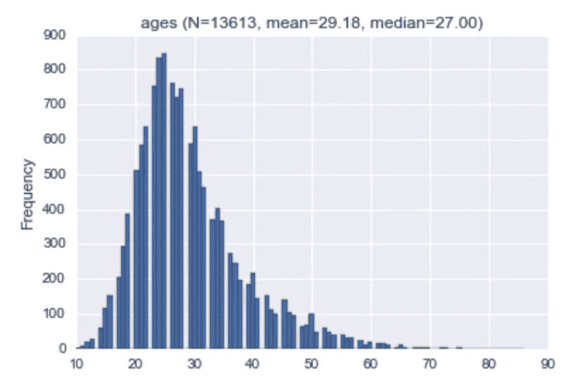
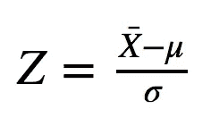
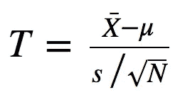

# 统计测试介绍——谁想成为一名程序员？

> 原文：<https://towardsdatascience.com/intro-to-statistical-tests-who-wants-to-be-a-coder-c5e04c3ea7ce?source=collection_archive---------5----------------------->


在 [kaggle](https://www.kaggle.com/) 闲逛时，我遇到了 [2016 年新编码器调查](https://www.kaggle.com/freecodecamp/2016-new-coder-survey-)数据集。这是一项针对学习编码的人的调查。

该调查包括一个问题，询问参与者他们感兴趣的工作角色是什么。我很好奇，想知道一个新程序员的年龄和他梦想的工作角色之间是否有联系。

在这篇文章中，我将尝试回答这个问题。这篇文章将是一篇技术文章，我将带你浏览数据探索，如何处理我们的研究问题，以及为了找到答案可以使用哪些统计测试。

首先，让我们导入一些东西:

```
import numpy as np
import pandas as pd
import scipy.stats
import matplotlib.pyplot as plt
import seaborn as sns
%matplotlib inlinedata = pd.read_csv('2016-FCC-New-Coders-Survey-Data.csv')
```

对于我们的研究问题，没有说明年龄的受访者对我们来说没有价值。然而，那些指定了年龄但没有指定工作角色的受访者确实给了我们关于新程序员年龄的一般信息。

```
data = data[data['Age'].notnull()]
data['JobRoleInterest'] = data['JobRoleInterest'].fillna('unspecified').map(lambda job: job.strip())
```

让我们来考察一下受访者的大致年龄:

```
data['Age'].plot.hist(title='ages (N=%d, mean=%.2f, median=%.2f)' % (len(data), data['Age'].mean(), data['Age'].median()),
                     bins=100)
```



我们可以看到数据看起来几乎正常。平均值大于中位数，根据[非参数偏度](https://en.wikipedia.org/wiki/Nonparametric_skew)定义，这意味着分布具有右偏度。这意味着学习编程的老年人比年轻人多(平均年龄约为 29 岁)。

有趣的是，当我写这篇文章的时候，我的妻子也在学习编码；她 29 岁，是平均年龄。我想这会帮助我记起…

# 向下钻取

让我们探讨一下受访者群体的平均年龄，每个群体都是由感兴趣的工作角色定义的。

```
average_ages = pd.DataFrame([{
            'job': group,
            'N': len(data.loc[rows]),
            'average age': data.loc[rows]['Age'].mean()
        } for group, rows in data.groupby('JobRoleInterest').groups.items()]).sort_values(by='average age')
sns.barplot(data=average_ages, x='average age', y='job', hue='N', palette='Blues_d')
```


每个组都有一个长度等于该组平均年龄的条形。组越大，条形的颜色越浅。

我选择关注质量保证工程师团队。他们的平均年龄比其他群体大，大约 32 岁。理解这种影响是否是由于偶然，或者也许成为 QA 工程师的愿望更有可能与平均年龄较大的人联系在一起是很有趣的。

我来解释一下“由于偶然”是什么意思。请记住，我们的数据有限。它只讲述了一小部分新编码者的故事。具体来说，我们只有 91 个 QA 工程师的数据。事实上，有更多的新程序员想成为 QA 工程师:有些人没有参与调查，有些未来的新程序员甚至还没有开始学习编码。32 年是新的编码员 QA 工程师**样本的意思是**。我们很想知道新程序员 QA **的人口平均数**是否大于其他新程序员**的人口平均数**。我们没有全部人口的数据，所以我们能做的最好的事情就是估计他们的平均值。我们通过使用样本均值来实现这一点。样本均值是一个随机变量；这取决于我们得到的样品。我们可以得到一些 QA 工程师的其他样本，样本均值会有所不同。另一方面，总体均值是分布的一个非随机参数。

给定我们拥有的新编码样本，有两种互补的可能性:

1.  QA 群体的平均年龄等于一般新编码者群体的平均年龄。
2.  他们是不同的。

样本支持第二个选项，但这可能是偶然的(尤其是因为 QA 样本量很小)。接下来，我们将使用统计测试来量化观察到这种偶然差异的可能性。

# 统计框架


对于外行读者来说，许多统计测试的工作方式如下:首先陈述一个零假设，这是可以描述这个世界的默认选项。在我们的例子中，无效假设是 QA 工程师的平均年龄和其他新程序员的平均年龄没有区别。然后，提出另一个假设。在我们的情况下，另一种选择是差异确实存在。然后，计算检验统计量(数据的函数)。假设零假设为真，检验统计量的分布是已知的，并且可以计算观察检验统计量的现有值的概率。这个概率叫做 p 值。如果 p 值小于我们在进行实验之前决定的显著性水平(例如 0.01)，则零假设被拒绝，取而代之的是替代假设。

# z 检验

假设年龄呈正态分布，我们可以使用 Z 检验。请注意，即使它们不是正态分布，我们也可以利用中心极限定理，并利用平均年龄近似正态分布的事实。

如果我们知道平均年龄的标准偏差，我们可以通过以下方式归一化平均年龄:



x̄是观察到的平均年龄。μ是假设零假设为真时的预期平均年龄。在我们的例子中，我们选择一般新编码者样本的平均年龄 29.18 为μ。注意，有更好的估计μ的方法，也有更合适的统计检验，例如双样本 T 检验，为了简单起见，我选择不在本文中描述。为了简单起见，我将坚持 29.18。因为我有很多数据，我认为这是一个足够好的估计。

Z 是一个标准的正态随机变量:Z∞N(0，1)。因此，给定 x̄的观测值，我们可以计算它的概率，看看它是否低于一个合理的阈值。如果是的话——我们将拒绝无效假设。

z 检验假设我们知道σ。我们不知道。不要绝望，测试救援！

# t 检验

t 检验和 Z 检验一样，区别是不知道σ。它的工作原理如下:



s 是年龄的样本标准差。s/√N 为平均年龄的样本标准差(其中 N 为样本数)。你可以在这里阅读它是如何产生的[。](https://en.wikipedia.org/wiki/Variance#Sum_of_uncorrelated_variables_.28Bienaym.C3.A9_formula.29)

您可以看到该统计数据与在 Z 测试中计算的数据非常相似…T 统计数据根据 [T 分布](https://en.wikipedia.org/wiki/Student%27s_t-distribution)进行分布。每当一个正态分布的随机变量的方差未知时，就会出现 t 分布。

它有一个参数叫做自由度。我不会对此进行详细说明，但直观地说，它捕捉了用于估计参数的数据量。在我们的例子中，σ是被估计的参数，自由度是 n1。

随着自由度接近无穷大，t 分布接近正态分布。

我们将使用`scipy`来计算这个概率:

```
qa = average_ages[average_ages['job'] == 'Quality Assurance Engineer'].iloc[0]
t_score = float(qa['average age'] - data['Age'].mean()) / (data['Age'].std() / np.sqrt(qa['N']))
degrees_of_freedom = qa['N'] - 1
p_value = 1 - scipy.stats.t(df=degrees_of_freedom).cdf(t_score)
print 'The p-value is', p_value>>> The p-value is 0.000551459304572
```

这个数字相当小。这意味着 QA 工程师平均年龄与总人口平均年龄的偏差不到百分之十的概率是由于偶然。如果我们选择 0.01 的显著性水平——这是一个常见的选择，我们会拒绝零假设。

让事情变得复杂一点，你应该注意到我刚才做的叫做单侧检验:我们计算了观察到大于或等于观察值的 T 值的概率。我们实际上关心两个方向上的差异:如果 QA 工程师的平均年龄明显小于预期值(零假设)，这也将是有趣的。在 T 检验中，通过将计算出的 p 值乘以 2(由于分布的对称性)来检验两个方向上的显著差异，从而得出

```
print "The two sided test's p-value is", p_value * 2>>> The two sided test's p-value is 0.00110291860914
```

仍然重要…

# 模拟

统计学家喜欢统计测试。它们功能强大，但有两大缺点:

1.  他们对数据进行假设。在我们的例子中，样本平均年龄并不正常。近似正态，所以 T 检验结果是近似值。不过还是很不错的一个…
2.  有时他们会让你测试一些类似的东西，但不完全是你想要的。在我们的例子中，这不是真的:我们感兴趣的是平均差异，而这正是 T 检验所提供的。如果我们想测试一些更复杂的东西，而没有对用例进行经典的统计测试，我们会有麻烦。

为了解决这两个问题，我们可以使用模拟。我们首先计算观察数据的一些统计数据——就像以前做的那样。我们没有计算观察统计值的概率，而是模拟了许多假设零假设为真的实验。我们计算实验中产生一个统计量的部分，这个统计量至少和我们以前计算的统计量一样极端。

让我解释一下为什么模拟有效:如果一个人选择使用假设得到满足的统计检验，计算出的 p 值就是观察到一个统计数据的真实概率，该统计数据至少与从实际数据计算出的统计数据一样极端，假设零假设为真。我们可以把它当作伯努利试验，其中 p 值是成功的概率。执行模拟就像多次运行伯努利试验。运行模拟的目标是估计成功的概率，即 p 值。使用 MLE 方法，我们简单地估计这个概率是成功的分数。随着模拟次数接近无穷大，该估计量接近真实 p 值。

让我们在我们的例子中尝试这种方法:零假设表明 QA 工程师的平均年龄和普通新编码员的平均年龄没有区别。这意味着 QA 工程师小组观察到的平均年龄也可以被新编码员的任何随机小组观察到。所以这正是我们要做的:我们将随机抽取一个与 QA 工程师小组规模相同的小组，并计算他们的平均年龄与一般新编码员平均年龄之间的差异:

```
observed_diff = abs(qa['average age'] - data['Age'].mean())
num_of_simulations = 100000
num_of_extreme_values = sum(abs(data.sample(n=qa['N'])['Age'].mean() - data['Age'].mean()) >= observed_diff
                            for _ in range(num_of_simulations))
p_value = float(num_of_extreme_values) / num_of_simulations
print 'The p-value is', p_value>>> The p-value is 0.0007
```

我们得到了相似的结果，但是有点不同。请注意，我们运行的模拟越多，结果就越精确(它将趋向于真实的 p 值)。

为什么它不同于 T 检验方法？因为 T 检验假设数据是正态的，而它只是近似正态的。

在过去，计算机速度很慢，计算能力很昂贵，所以运行模拟没有太大意义。然而，如今它确实有意义——至少在某些情况下。这是一个很好的方法，应该在需要的时候使用。这里的是一篇很棒的帖子，它进一步讨论了模拟方法。

# 多重测试问题

你们中的一些人可能已经注意到我的分析是有问题的:它引发了[多重测试问题](http://www.stat.berkeley.edu/~mgoldman/Section0402.pdf)。只有在检查数据后，我才注意到 QA 工程师的平均年龄高于其他组的平均年龄。然后我做了一个统计测试，看看这是否是由于偶然。问题是，因为我们有多个组，我们检查的组越多，一个组在平均年龄上有显著差异的可能性就越大。有很多方法可以解释这个问题。一种选择是在不同于提出假设的数据集上测试假设。其他选项包括相应地调整显著性水平。

# 含义

这个分析有什么含义吗？首先要区分统计意义和实际意义。这可能有统计学意义:观察到的数据不仅仅是偶然的结果，差异确实存在。

实际意义意味着我们观察到的差异具有实际意义:人们可以据此采取行动。实际意义取决于手头的问题。

在我们的案例中，我认为与观察到的平均年龄差异没有太大关系……如果一般新程序员的平均年龄是 20 岁，而 QA 是 40 岁，我们可以建议新程序员的学校应该改变 QA 轨道的时间表，因为 QA 学生可能有孩子在家里等着他们。

【www.anotherdatum.com】*这个帖子最初是我在* [*发的。*](http://anotherdatum.com/who-wants-to-be-a-coder.html)