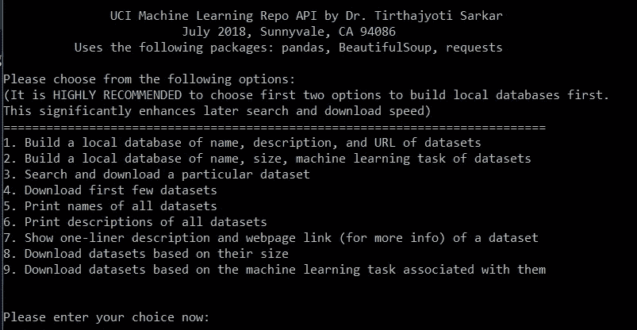
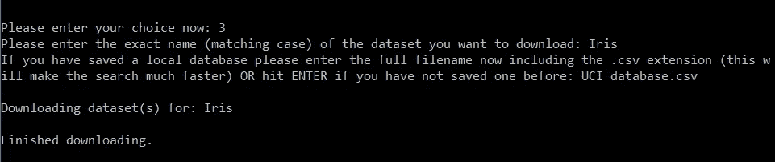
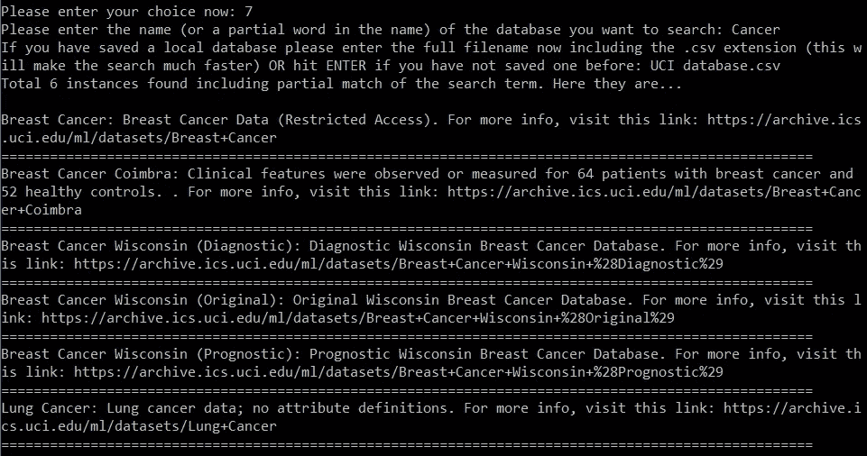

# 为 UCI 机器学习库引入简单直观的 Python API

> 原文：<https://towardsdatascience.com/introducing-a-simple-and-intuitive-python-api-for-uci-machine-learning-repository-fd2ce8eb6cd4?source=collection_archive---------4----------------------->

> 为 UCI 机器学习门户引入简单直观的 API，用户可以在其中轻松查找数据集描述，搜索他们感兴趣的特定数据集，甚至下载按大小或机器学习任务分类的数据集。


## 介绍

[UCI 机器学习数据集库](https://archive.ics.uci.edu/ml/index.php)是机器学习教育学领域的一个传奇。对于初学者和高级学习者来说，这都是一个*‘逛商店’*。它是数据库、领域理论和数据生成器的集合，由机器学习社区用于机器学习算法的经验分析。这个档案是 1987 年由加州大学欧文分校的大卫·阿哈和其他研究生创建的 ftp 档案。从那时起，它就被世界各地的学生、教育工作者和研究人员广泛用作机器学习数据集的主要来源。作为档案影响的一个标志，它被引用了 1000 多次，使其成为所有计算机科学中被引用次数最多的 100 篇“论文”之一。


也就是说，导航门户可能会有点令人沮丧和耗时，因为对于您感兴趣的数据集，没有简单直观的 API 或下载链接。您必须跳过多个页面才能进入您正在寻找的原始数据集页面。此外，如果您对特定类型的 ML 任务(例如回归或分类)感兴趣，并希望下载与该任务对应的所有数据集，则没有简单的命令来完成此任务。

> 我很高兴为 UCI ML 门户网站推出一个简单直观的 API，用户可以在这里轻松查找数据集描述，搜索他们感兴趣的特定数据集，甚至下载按大小或机器学习任务分类的数据集。

## 从这里下载/克隆

这是一个麻省理工学院许可的开源 Python 3.6 代码库，它提供了允许用户以交互方式使用 UCI ML 数据集的函数和方法。从我的 [**Github 页面这里**](https://github.com/tirthajyoti/UCI-ML-API) **下载/克隆/分叉代码库。**

## 必需的包/依赖项

运行这段代码只需要三个广泛使用的 Python 包。为了便于安装这些支持包，我的 repo 中包含了 setup.bash 和 setup.bat 文件。只要在您的 Linux/Windows shell 中执行它们，您就准备好了！

*   [熊猫](https://pandas.pydata.org/)
*   [美丽组 4](https://www.crummy.com/software/BeautifulSoup/?)
*   [请求](http://docs.python-requests.org/en/master/)

## 怎么跑？

确保你连接到互联网:-)然后，只需下载/克隆 Gitgub 回购，确保有支持包安装。

`**git clone https://github.com/tirthajyoti/UCI-ML-API.git {your_local_directory}**`

然后转到您克隆 Git 的`your_local_directory`，在您的终端上运行下面的命令。

`**python Main.py**`

将打开一个菜单，允许您执行各种任务。这是菜单的截图，



## 当前支持的特性和功能

目前实施了以下功能…

*   通过搜索整个门户，构建包含数据集的名称、描述和 URL 的本地数据库
*   通过爬取整个门户来构建数据集的名称、大小、机器学习任务的本地数据库
*   搜索并下载特定数据集
*   下载前几个数据集
*   打印所有数据集的名称
*   打印所有数据集的简短描述
*   搜索数据集的单行描述和网页链接(了解更多信息)
*   根据数据集的大小下载数据集
*   基于与数据集相关联的机器学习任务下载数据集

## 示例(搜索和下载特定数据集)

例如，如果您想下载著名的数据集 Iris，只需从菜单中选择选项 3，输入存储的本地数据库的名称(以加快搜索速度)，瞧！您将下载 Iris 数据集并将其存储在目录中名为“Iris”的文件夹中！



## 示例(使用特定关键字搜索数据集)

如果您通过选择选项 7 使用关键字进行搜索，那么您将得到所有数据集的简短的一行摘要，这些数据集的名称与您的搜索字符串匹配(甚至部分匹配)。您还将获得这些结果的相关网页链接，这样，如果您愿意，您就可以进一步探索它们。下面的屏幕截图显示了使用术语`Cancer`进行搜索的示例。



## 如果想绕过简单的 API，使用低级功能

如果您想绕过简单的用户 API，使用底层功能，欢迎您这样做。这是它们的概要。首先，导入必要的包，

```
from UCI_ML_Functions import *
import pandas as pd
```

`read_dataset_table()`:从 URL“https://archive . ics . UCI . edu/ml/datasets . html”中读取数据集的表格，并对其进行进一步处理，以进行清理和分类。

`clean_dataset_table()`:接受原始数据集表格(DataFrame 对象)并返回一个清除了未知数量样本和属性的条目的清理版本。还使指示与数据集相关联的主要机器学习任务的“默认任务”类别列合理化。

`build_local_table(filename=None,msg_flag=True)`:读取 UCI ML 门户并构建一个包含名称、大小、ML 任务、数据类型等信息的本地表。

*   `filename`:用户可以选择的可选文件名。如果未选择，程序将选择一个默认名称(“UCI 表. csv”)。
*   `msg_flag`:控制详细程度。

`build_dataset_list()`:浏览 UCI ML 数据集页面，建立所有数据集的列表。

`build_dataset_dictionary()`:浏览 UCI ML 数据集页面，建立一个包含所有数据集名称和描述的字典。还存储对应于数据集的唯一标识符。下载器功能需要该标识符字符串来下载数据文件。通用名称不起作用。

`build_full_dataframe()`:构建包含所有信息的数据框架，包括下载数据的 url 链接。

`build_local_database(filename=None,msg_flag=True)`:读取 UCI ML 门户网站，并建立一个本地数据库，其中包含名称、摘要、数据页面 URL 等信息。

*   `filename`:用户可以选择的可选文件名。如果未选择，程序将选择一个默认名称(“UCI 数据库. csv”)。
*   `msg_flag`:控制详细程度。

`return_abstract(name,local_database=None,msg_flag=False)`:通过搜索给定的`name`，返回特定数据集的一行描述(以及获取更多信息的网页链接)。

*   `local_database`:本地存储(即在同一目录下)的数据库(CSV 文件)的名称，其中包含有关 UCI ML repo 的所有数据集的信息。
*   `msg_flag`:控制详细程度。

`describe_all_dataset(msg_flag=False)`:调用`build_dataset_dictionary`函数并打印所有数据集的描述。

`print_all_datasets_names(msg_flag=False)`:调用`build_dataset_dictionary`函数并从中打印所有数据集的名称。

`extract_url_dataset(dataset,msg_flag=False)`:给定数据集标识符，此函数提取实际原始数据所在页面的 URL。

`download_dataset_url(url,directory,msg_flag=False,download_flag=True)`:从给定 url 中的链接下载所有文件。

*   `msg_flag`:控制详细程度。
*   `download_flag`:默认为真。如果设置为 False，则仅创建目录，但不启动下载(出于测试目的)。

`download_datasets(num=10,local_database=None,msg_flag=True,download_flag=True)`:下载数据集，放在以数据集命名的本地目录下。默认情况下，仅下载前 10 个数据集。用户可以选择要下载的数据集数量。

*   `msg_flag`:控制详细程度。
*   `download_flag`:默认为真。如果设置为 False，则仅创建目录，但不启动下载(出于测试目的)。

`download_dataset_name(name,local_database=None,msg_flag=True,download_flag=True)`:通过搜索给定的名称下载特定的数据集。

*   `local_database`:本地存储(即在同一目录下)的数据库(CSV 文件)的名称，其中包含有关 UCI ML repo 的所有数据集的信息。
*   `msg_flag`:控制详细程度。
*   `download_flag`:默认为真。如果设置为 False，则仅创建目录，但不启动下载(出于测试目的)。

`download_datasets_size(size='Small',local_database=None,local_table=None,msg_flag=False,download_flag=True)`:下载满足“大小”标准的所有数据集。

*   `size`:用户想要下载的数据集的大小。可能是以下任何一种:“小号”、“中号”、“大号”、“超大号”。
*   `local_database`:本地存储的数据库(CSV 文件)的名称，即存储在同一目录中，其中包含 UCI ML repo 上所有数据集的名称和 URL 信息。
*   `local_table`:本地存储的数据库(CSV 文件)的名称，即存储在同一目录中，其中包含 UCI ML repo 上所有数据集的特征信息，即样本数量、对数据集执行的机器学习任务的类型。
*   `msg_flag`:控制详细程度。
*   `download_flag`:默认为真。如果设置为 False，则仅创建目录，但不启动下载(出于测试目的)。

`download_datasets_task(task='Classification',local_database=None,local_table=None,msg_flag=False,download_flag=True)`:下载符合用户输入的 ML 任务标准的所有数据集。

*   `task`:用户想要下载数据集的机器学习任务。可能是以下任何一种:
*   “分类”、“推荐系统”、“回归”、“其他/未知”、“聚类”、“因果发现”。
*   `local_database`:本地存储的数据库(CSV 文件)的名称，即在同一目录中，包含 UCI ML repo 上所有数据集的名称和 URL 信息。
*   `local_table`:本地存储的数据库(CSV 文件)的名称，即存储在同一目录中，其中包含 UCI ML repo 上所有数据集的特征信息，即样本数量、要对数据集执行的机器学习任务的类型。
*   `msg_flag`:控制详细程度。
*   `download_flag`:默认为真。如果设置为 False，则仅创建目录，但不启动下载(出于测试目的)。

如果您有任何问题或想法要分享，请通过[**tirthajyoti【AT】Gmail . com**](mailto:tirthajyoti@gmail.com)联系作者。你也可以查看作者的 [**GitHub 资源库**](https://github.com/tirthajyoti?tab=repositories) 中其他有趣的 Python、R 或 MATLAB 代码片段和机器学习资源。如果你像我一样对机器学习/数据科学充满热情，请随时[在 LinkedIn 上添加我](https://www.linkedin.com/in/tirthajyoti-sarkar-2127aa7/)或[在 Twitter 上关注我。](https://twitter.com/tirthajyotiS)