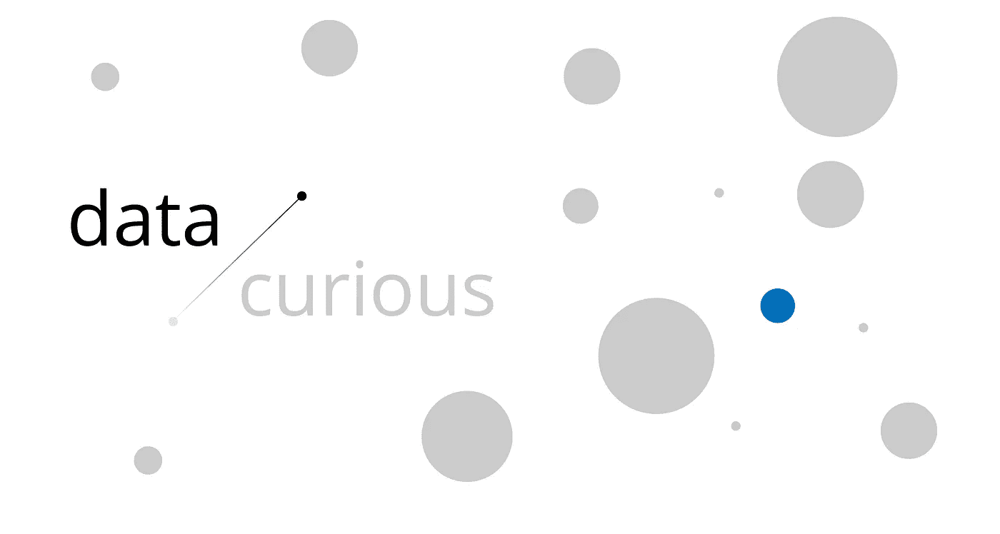

# 简介:数据好奇，时事通讯

> 原文：<https://towardsdatascience.com/introducing-data-curious-the-newsletter-cf16ff57770c?source=collection_archive---------11----------------------->

## 经过长时间的中断，我的最佳数据资源的每周综述以一种新的形式回来了。

*TL；博士:我正在把综述移到每周电子邮件时事通讯上。订阅* [*这里*](https://mailchi.mp/7029eac7f34a/data-curious-signup) *如果你很投入的话。如果你有疑问，或者想了解新版本的更多信息，请继续阅读。*

去年，我开始在 Medium 上发布我最喜欢的数据故事、数据集和数据可视化的每周综述(阅读旧版本[此处](/data-curious-02-11-2017-a-roundup-of-data-stories-datasets-and-visualizations-from-last-week-79de97ad6af1)了解一下味道)。在这个过程中，我收集了大量的灵感。但是现在，我想尝试一些不同的东西。

# 这是独家新闻

## 新的“数据好奇”将更加关注策展。

更少的数量，只有最好的。足够容易理解，比如说，一封电子邮件。

## 它还将优先考虑科学领域的数据发展。

当你专注于你感兴趣的东西时，数据项目总是更有趣。对我来说，是科学、环境和技术。因此，期待大量的酷的东西，但少一点政治(尽管在那个领域也有大量伟大的数据工作)。

我将寻找与环境、空间、教育、健康、技术和自动化相关的数据驱动内容。这些天我也少做新闻，多做数据项目开发:所以自然就少了新闻性。

## 出于学习目的，我正在添加更多的内容。

关于数据处理，我最喜欢的一点是社区有多开放。我花了无数的时间受益于其他人的教程和演练。因此，作为一种向前推进的方式，我将包括一些我自己的教程，以及我在其他地方找到的与数据科学和数据可视化相关的有用的学习资源。

关于《新方向》的最后一点:最重要的是，我希望这篇时事通讯能激发一些好奇心。最好的发现是通过问大量的问题发现的。最好的数据项目是从提出正确的问题开始的。

因此，与之前的三部分文章格式不同，每封邮件都将涉及几个主要部分:

# 阅读

我的 top 在一个与数据相关的主题上挑选了一些有趣的想法。

# 探索

最好的数据可视化不只是讲述一个故事，而是讲述多个故事。这一部分将包括一周的数据，这些数据提供了重要的洞察力/影响力。

# 分析

当我想学习一项新的数据相关技能时，手头有实践数据集总是很方便的。在这里，我将每周分享一个有趣的数据集，供您参考。

# 学习

在过去的一年里，我花了更多的时间来发展我在 Python 和数据科学方面的技能。我可能会分享与这两者相关的文章，但偶尔他们会更关注数据可视化(如 d3.js 和 bokeh)。

这将是一次疯狂的旅程。所以我需要你的反馈！您可以随时在这里提交(也会在每封邮件的页脚)。如果有足够的需求，我会尽最大努力改编和改变每份简讯的内容。

## [在这里注册每周数据灵感](https://mailchi.mp/7029eac7f34a/data-curious-signup)