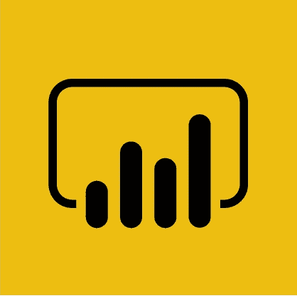
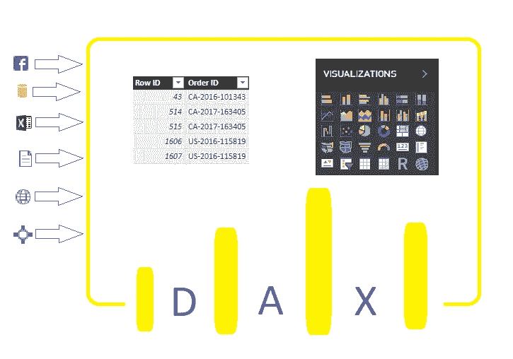
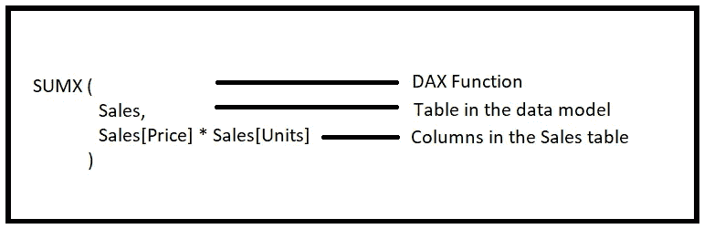
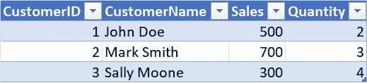
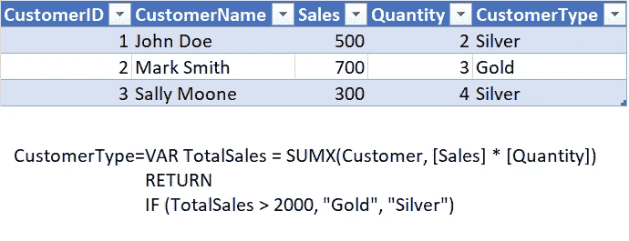
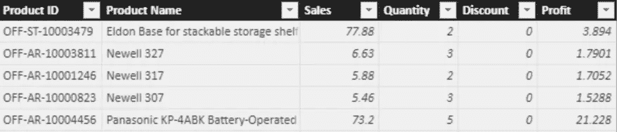
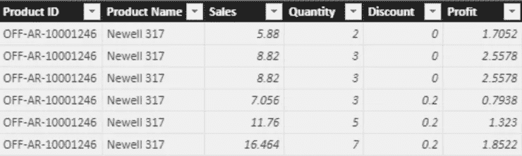
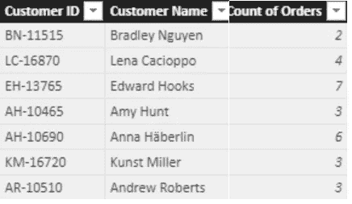

# DAX 简介—数据分析表达式

> 原文：<https://towardsdatascience.com/introducing-dax-data-analysis-expressions-dca49cb68501?source=collection_archive---------6----------------------->

**D**ATA**A**analysis E**x**pression 是一个函数的集合，可以用来执行一个任务并返回一个或多个值。虽然这听起来与任何其他编程语言都非常相似，但 DAX 只是一种公式或查询语言。DAX 是微软在 2009 年左右开发的，用于微软的 PowerPivot，当时是作为 Excel (2010)插件提供的。它现在非常受欢迎，因为它现在是 Power BI 的首选语言，并且也受到表格 SSAS 的支持。由于 DAX 在 Power BI 中被广泛使用，所以在本文中，我将重点放在 DAX for Power BI 上，但是它也可以应用于其他适用的工具。

Power BI logo

Power BI 是一种商业智能工具，它可以从数百个数据源中获取数据，准备数据，并生成漂亮的交互式报告和仪表盘，提供令人信服的见解。它提供了一套服务来引入数据，构建仪表板或报告，并与所需人员共享。虽然 Power BI 相对较新，但它的核心在某种程度上已经酝酿了很长时间。它基于 SSAS (SQL Server Analysis Services)、Power Pivot、Power View 和 Power Query，其中一些是免费的 Excel 插件。

DAX usability in Power BI Desktop

在 Power BI 的整个套件中，DAX 主要用于转换导入 Power BI 的数据模型和/或为可视化添加新的度量。这些函数用于创建计算列或度量，以帮助进行报告。

DAX 还通过在数据模型级别提供行级安全性(RLS)来保护发布的报告和仪表板。

**计算列**

计算列在数据模型中创建，在列级别逐行计算，存储在数据模型中，成为其所在表的一部分。计算列也会消耗更多内存。计算列通常表示为 Table[Column]。

**措施**

顾名思义，度量是聚合，DAX 有助于根据数据模型创建额外的度量，以帮助进行报告/可视化。这些 DAX 函数动态运行，也称为动态聚合，因此不与数据模型一起存储。由于度量是在查询时计算的，因此会消耗额外的 CPU。一个测度简单的表示为【测度】。

**语法**

Syntax of a DAX function

**聚合函数**

DAX 聚合函数聚合表中行上的列或表达式，用于度量中。DAX 提供了很多内置的聚合函数，这里有一个[引用列表](https://msdn.microsoft.com/en-us/query-bi/dax/statistical-functions-dax)。

***举例:***

Customer Table

平均销售额=平均(客户[销售额])

平均销售额现在将返回 500。

**‘X’聚合函数**

X 聚合函数对表中的行进行迭代和聚合，与聚合函数相同，唯一的区别是 X 版本的聚合函数对表达式而不是表中的列进行聚合。

***举例:***

Customer Table

平均销售额=AVERAGEX(客户，[销售额]*[数量])

平均销售额现在将返回 1433.34。

**VAR 函数**

命名变量存储表达式的结果，该结果可以作为参数传递给其他表达式。变量减少了代码中的冗余，并通过避免创建新的计算列来提高性能。

***举例:***

An example of variable in DAX

**时间智能功能**

时间智能函数在商业智能中非常有用，并且在简单函数中执行复杂计算时可以节省时间。这些函数处理日期和时间字段，根据不同级别的时间段产生各种计算。这里有一个[时间智能功能的列表](https://msdn.microsoft.com/en-us/query-bi/dax/time-intelligence-functions-dax)。

**文本功能**

文本函数对表中的列进行操作，以连接、搜索或操作字符串，并返回整个或部分字符串。这里有一个文本函数的列表。

**表格功能**

表函数返回完整的表而不是值。它们通常与其他函数结合使用，以迭代返回的结果表中的每一行。

假设您有一组相关的表，并且需要基于两个或更多的表执行计算。在这种情况下，一些表函数非常有用。这里有一个[表函数列表](https://msdn.microsoft.com/en-us/query-bi/dax/filter-functions-dax)。

函数 **FILTER** 根据提供的表达式返回当前表的子集，并返回一个表作为结果。

***举例:***

Orders Tables

SuperStore = FILTER (Orders，Orders[产品名称] = "Newell 317 ")

这将创建一个名为 SuperStore 的新表，其中只包含 Newell 317 产品，如下所示。

SuperStore Table

函数 **RELATEDTABLE** 返回表格中与当前表格相关的所有行。

***举例:***

Customer Table

订单计数= COUNTROWS(RELATEDTABLE('超市'))

**Outro**

虽然这只是对 DAX 的简单介绍，但 DAX 中还有许多其他有用的功能，它们将使分析师或开发人员的工作变得更加轻松。

这里有一些学习 DAX 的优秀资源

*   在 [SQLBI](https://www.sqlbi.com/training/dax/) 的 DAX 培训视频
*   DAX on [教程点](https://www.tutorialspoint.com/dax_functions/index.htm)
*   [立方体中的家伙](https://www.youtube.com/results?search_query=guy+in+a+cube+DAX)