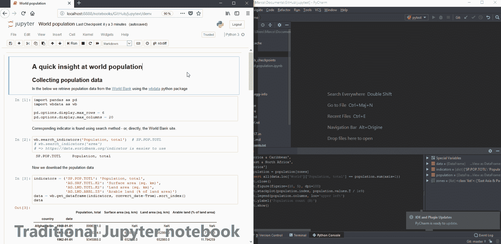
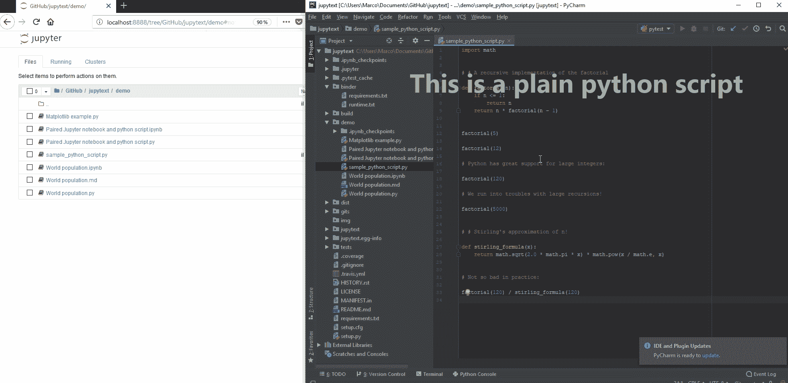
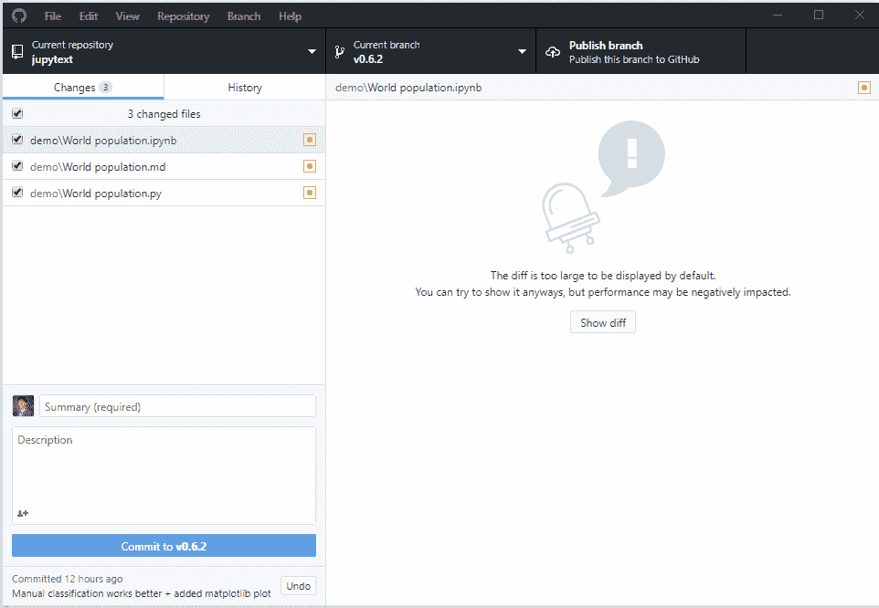

# Jupytext 简介

> 原文：<https://towardsdatascience.com/introducing-jupytext-9234fdff6c57?source=collection_archive---------4----------------------->

Jupyter 笔记本是包含代码、叙述和情节的交互式文档。它们是试验代码和数据的绝佳场所。笔记本很容易分享，GitHub 上的 [2.6M 笔记本](https://github.com/parente/nbestimate)正好说明笔记本有多受欢迎！

Jupyter 笔记本很棒，但是它们通常是巨大的文件，具有非常特殊的 JSON 文件格式。让我们来介绍一下 [*Jupytext*](https://github.com/mwouts/jupytext/blob/master/README.md) ，这是一个 Jupyter 插件，它以纯文本文件的形式读写笔记本:Julia、Python、R scripts、Markdown 或 R Markdown 文档。

# Jupyter 笔记本作为文本文件

我们编写了 Jupytext 来处理 Jupyter 笔记本，就像我们处理文本文件一样。使用 *Jupytext* ，

*   在您最喜欢的文本编辑器或 IDE 中重构笔记本(例如用普通的 Python 脚本来表示)成为了一个真正的选择，
*   将笔记本直接写成脚本或降价是另一种选择
*   使用 Git 在 Jupyter 笔记本上进行协作变得非常简单。

笔记本的文本表示集中在我们实际书写的部分:单元格输入。我们重视投入甚于产出。通常，它们是笔记本中唯一我们想要版本控制的部分。输入比输出轻得多(通常是千字节比兆字节)。

我们也重视产出。使用[配对笔记本](https://github.com/mwouts/jupytext#paired-notebooks)可以保存输出。在该配置中，除了脚本或 Markdown 文档之外，Jupyter 还将笔记本保存为传统的`.ipynb`文件。文本表示可以在 Jupyter 之外编辑。在 Jupyter 中重新加载笔记本时，单元格输入来自文本文件，匹配的输出来自`.ipynb`文件。

# 作为脚本编辑的 Jupyter 笔记本

在第一个动画中，我们展示了如何使用您最喜欢的文本编辑器或 IDE 来编辑您的 Jupyter 笔记本。在浏览代码、编辑和执行单元或单元片段以及调试方面，ide 比 Jupyter 更方便。

动画脚本:

*   我们从 Jupyter 笔记本开始。
*   笔记本包括一幅世界人口图。剧情图例没有按照人口递减的顺序排列，我们会解决这个问题。
*   我们希望将笔记本保存为一个`.ipynb`和一个`.py`文件:我们向笔记本元数据添加一个`"jupytext_formats": "ipynb,py",`条目。
*   Python 脚本可以用 PyCharm 打开:
*   在代码和文档中导航比在 Jupyter 中更容易。
*   控制台便于快速测试。我们不需要为此创建细胞。
*   我们发现数据帧的列顺序不正确。我们更新相应的单元格，并得到正确的绘图。
*   Jupyter 笔记本在浏览器中刷新。从 Python 脚本加载修改后的输入。输出和变量被保留。我们最终重新运行代码并得到正确的图形。



# 脚本和降价作为 Jupyter 笔记本

有了 [*Jupytext*](https://github.com/mwouts/jupytext/blob/master/README.md) ，每一个 Julia、Python 或者 R script、R Markdown 或者 Markdown 文档都变成了一个潜在的 Jupyter 笔记本。把你的笔记本写成文本，需要的时候在 Jupyter 中呈现出来。

在下面的动画中，

*   Jupyter notebook(不是 lab，[敬请关注](https://github.com/mwouts/jupytext/issues/8))将我们的普通 Python 脚本作为 Jupyter notebook 打开。
*   从 Jupyter 中保存会给其他未更改的文件添加一个 YAML 头。
*   向笔记本添加一个单元格会带来一个非常简单的区别。
*   刷新笔记本会保留变量，但不会保留输出。输出不存储在文本文件中。
*   我们通过向笔记本元数据添加一个`"jupytext_formats": "ipynb,py",`条目，将脚本与传统的 Jupyter 笔记本配对。当我们保存时，会创建一个新的`ipynb`文件。
*   由于有了`ipynb`文件，当笔记本刷新或重新加载时，输出会保留下来。



# Jupyter 笔记本协作

你试过合并 Jupyter 笔记本吗？您应该使用 [nbdime，](https://nbdime.readthedocs.io/en/stable/)或者准备好面对*不可读的笔记本:NotJSONError* 如果合并的 JSON 中缺少逗号或括号！

有了 [*Jupytext*](https://github.com/mwouts/jupytext/blob/master/README.md) ，在笔记本上协作就像在脚本上协作一样简单。

只签入文本版本。享受简单的合并和有意义的差异！



# 安装 Jupytext

[*Jupytext*](https://github.com/mwouts/jupytext/blob/master/README.md) 在 [pypi](https://pypi.org/project/jupytext/) 上有售。安装 python 包并将 Jupyter 配置为使用 Jupytext 的内容管理器:

```
# Get Jupytext from pip
pip install jupytext --upgrade# Append this to .jupyter/jupyter_notebook_config.py c.NotebookApp.contents_manager_class="jupytext.TextFileContentsManager"# And restart your notebook server
jupyter notebook 
```

通过在笔记本元数据中添加`"jupytext_formats": "ipynb,py",`(用您喜欢的扩展名替换`py`)，将 Python 脚本与您的 Jupyter 笔记本相关联，或者将`ipynb`文件与您的 Python 脚本相关联(为了方便保存单元格输出)。如果您计划在 Jupyter 之外编辑文本文件时保持 Jupyter 打开，请通过在单元格中运行`%autosave 0`来关闭 Jupyter 的自动保存。

# 参考

将 Jupyter 笔记本作为文本使用的想法并不新鲜。Python 中实现的可选转换器包括:

*   [笔记](https://github.com/aaren/notedown) : Jupyter 笔记本作为减价文件，
*   [ipymd](https://github.com/rossant/ipymd) : Jupyter 笔记本作为 Markdown 文档，Python 脚本，OpenDocument 文件，
*   [ipymd 的一个分支](https://github.com/grst/ipymd)增加了对 R Markdown 和 R HTML 笔记本的支持，
*   [pynb](https://github.com/minodes/pynb) :作为 Python 脚本的 Jupyter 笔记本。

我们怀着极大的兴趣关注着 Atom 的 [Hydrogen](https://atom.io/packages/hydrogen) 插件，以及 Visual Studio 代码的 [Jupyter](https://marketplace.visualstudio.com/items?itemName=donjayamanne.jupyter) 扩展。这些扩展将脚本(带有明确的单元格标记，我们希望在 Jupytext 中在[某个点](https://github.com/mwouts/jupytext/issues/59)支持这些标记)转化为类似于笔记本的交互式环境。

# 感谢

Jupytext 是我第一个重要的开源贡献。从事开源项目是一次很棒的经历。我问了很多问题，非常感谢这些有帮助的回答、建议和合作。

特别是，我要感谢 Gregor Sturm 提出了一个伟大的想法，让我们可以将 T21 的笔记本和传统的 Jupyter 笔记本配对，并感谢他对这个项目的反馈。Eric Lebigot 和 Franç ois Wouts 关于如何推进和沟通项目的建议非常有帮助。最后，我要感谢早期的测试人员花时间在 Jupyter 笔记本和 Jupytext 上尝试新的协作方式。

# 反馈

Jupytext 很大程度上归功于用户的反馈。欢迎提出建议和问题:请在我们的 [GitHub](https://github.com/mwouts/jupytext/) 项目中使用问题跟踪器，以便对程序或文档提出改进建议。那里见！