# 介绍 K-FAC

> 原文：<https://towardsdatascience.com/introducing-k-fac-and-its-application-for-large-scale-deep-learning-4e3f9b443414?source=collection_archive---------9----------------------->

## 大规模深度学习的二阶优化方法

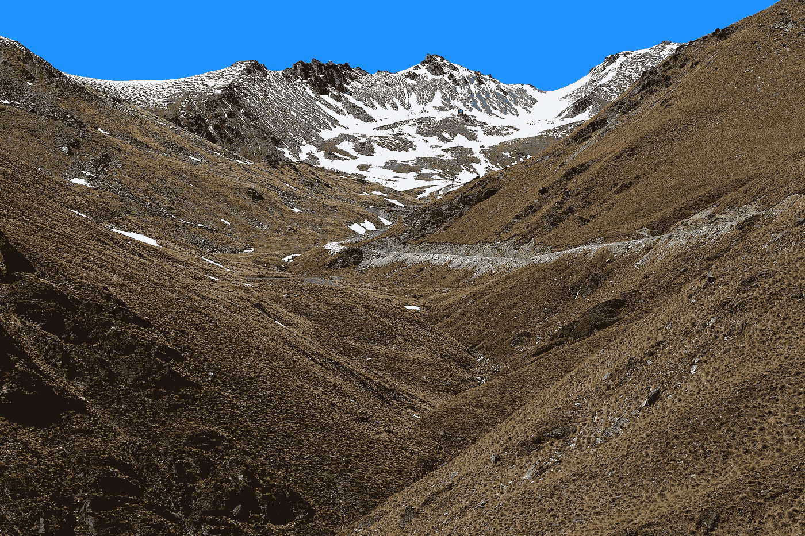

Photo by [Nareeta Martin](https://unsplash.com/@splashabout?utm_source=medium&utm_medium=referral) on [Unsplash](https://unsplash.com?utm_source=medium&utm_medium=referral)

在本文中，我总结了 [Kronecker-factored 近似曲率(K-FAC)](https://arxiv.org/abs/1503.05671) (James Martens et al .，2015)，深度学习最高效的二阶优化方法之一。

## 概观

曲率的繁重计算限制了二阶优化方法在深度学习中的应用数量。[Kronecker-factored approximated Curvature(K-FAC)](https://arxiv.org/abs/1503.05671)是由多伦多大学的 [James Martens](http://www.cs.toronto.edu/~jmartens/) 和 [Roger Grosse](https://www.cs.toronto.edu/~rgrosse/) 在 [ICML2015](https://icml.cc/2015/) 中提出的一种深度学习的二阶优化方法，通过 *Kronecker 因子分解*来逼近曲率，降低了参数更新的计算复杂度。得益于包括 K-FAC 在内的高效二阶方法，ML 研究人员现在开始重新审视二阶方法快速收敛对于减少深度学习训练时间的好处。

## 自然梯度下降

[自然梯度下降(NGD)](https://www.mitpressjournals.org/doi/10.1162/089976698300017746) 是由甘利顺一(Shun-Ichi Amari)在 1998 年提出的一种基于信息几何的优化方法。NGD 通过使用**费希尔信息矩阵(FIM)** 作为损失函数的曲率，正确地获得损失情况，并且在“迭代”方面比简单的一阶方法(例如随机梯度下降)收敛得更快。因此，人们可以把 NGD 看作二阶优化的有效实现。

给定 **x** ，输出条件概率为 **y** 的概率模型的 FIM 定义如下:

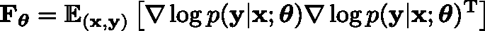

Fisher information matrix (Empirical Fisher)

这个取数据期望值的定义叫做 [*经验费希尔*](https://arxiv.org/abs/1503.05671) (当你使用小批量时，你计算其中数据的平均值来得到 FIM)。在图像分类任务中，由于人们经常使用负对数似然的平均值作为损失函数，因此可以将 FIM 视为损失函数的曲率的近似。下面的等式显示了 FIM 和负对数似然损失 E(θ)的 *Hessian* 之间的关系:

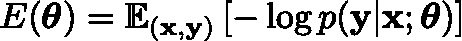

The loss function

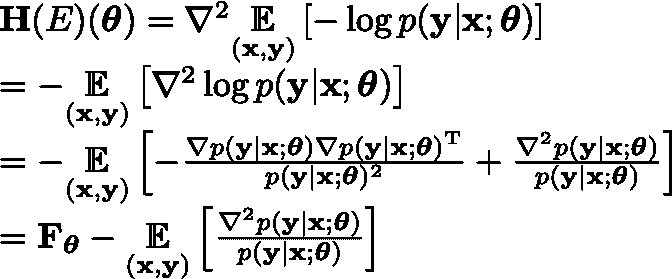

The Hessian of the loss function and the relationship between the FIM

NGD 的更新规则是:

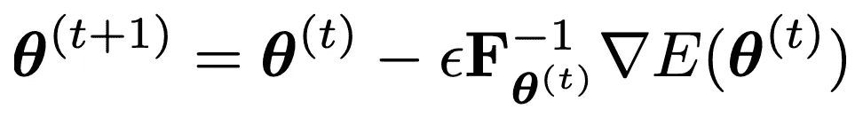

The update rule of Natural Gradient Descent (NGD)

这里，FIM 的逆过程应用于损失梯度，FIM 预处理的梯度称为*自然梯度*。对于 N 的参数，FIM 的大小是 N×N，深度学习中使用的神经网络往往具有大量的参数(例如，用于 ImageNet 分类的 AlexNet 中的 6000 万个参数)，因此 FIM 的逆是难以处理的，并且它限制了 NGD 在深度学习中的应用数量。

## 自然梯度近似方法

近年来，一些作品提出了近似(或避免)反演 FIM 的方法，深度学习研究者[重温了 NGD](https://openreview.net/forum?id=vz8AumxkAfz5U) 的“快速收敛”。

粗略地说，有三种近似方法(我引用了[这篇文章](https://www.jstage.jst.go.jp/article/pjsai/JSAI2017/0/JSAI2017_1A2OS05b4/_article/-char/ja)进行这种分类。)

1.  近似 Fisher 信息矩阵(以便逆矩阵易于计算)
2.  重新参数化，使 FIM 更接近单位矩阵。
3.  直接逼近自然梯度。

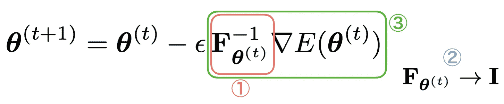

The three approaches for approximating NGD

## 使用克罗内克因子分解(K-FAC)的近似

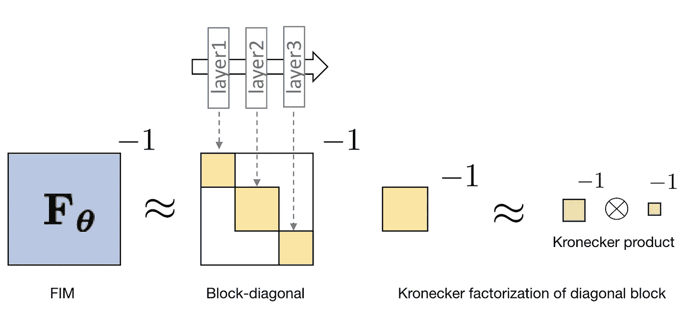

Approximation of (inverse of) FIM by K-FAC

可以将 K-FAC 视为自然梯度近似方法之一，其对应于“1。近似 Fisher 信息矩阵(这样逆矩阵容易计算)”。特别地，与其他自然梯度近似方法相比，它是基于数学原理的最有效的近似方法。

首先，K-FAC 块对角化 FIM，其中每个对角块对应于神经网络每层的参数。例如，K-FAC 将三层网络的 FIM 近似为具有三个块的块对角矩阵。

接下来，K-FAC 用两个矩阵的 Kronecker 积来近似每个块(称为 **Kronecker 因式分解**)。

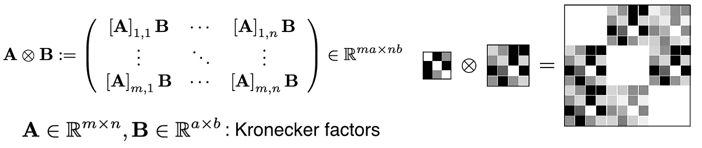

Kronecker product of two matrices

最后，K-FAC 使用矩阵的 Kronecker 积的临界性质:

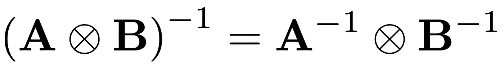

The inverse of Kronecker product = Kronecker product of the inverse matrices

简而言之，K-FAC 将 FIM 的逆近似为块对角矩阵，其中每个对角块是微小克罗内克因子的逆(与 FIM 相比)。

为了阐明克罗内克因子的大小(你可以降低多少求逆的复杂度)，我解释一下克罗内克因子分解的机制。以一个全连接层为例，你可以看到如何因式分解 FIM 的一个对角块(为方便起见，称为 *Fisher 块*)对应于这个层。第 I 层中的 Fisher 块表示为

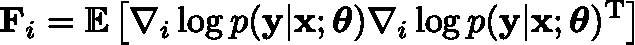

The Fisher block of i-th layer (i-th diagonal block of the FIM)

(期望值的符号被简化。)其中∇i 是第 I 层参数的梯度。通过使用*反向传播方法*，这是一种在深度神经网络中计算梯度的有效方法，对数似然的梯度(对于每个样本)被表示为两个向量的克罗内克乘积:

利用这种关系，费希尔区块可以转化为“克罗内克乘积的期望值”的形式:

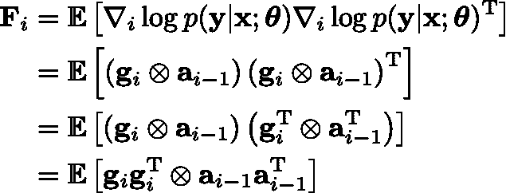

K-FAC 将“克罗内克积的期望值”近似为“期望值的克罗内克积”(克罗内克因式分解)。

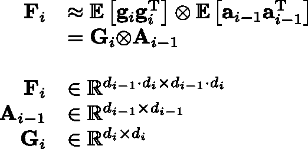

Kronecker factorization of a Fisher block by K-FAC

如上所述，Kronecker 因式分解显著降低了 Fisher 块逆运算的计算复杂度。以图像分类领域经常使用的架构 [AlexNet](http://papers.nips.cc/paper/4824-imagenet-classification-with-deep-convolutional-neural-networks) 为例，可以更清晰地看到这种效果。下图显示了 Alex net for ImageNet(1000 类分类)的所有层和最后一层(全连通层)的矩阵大小的比较结果。

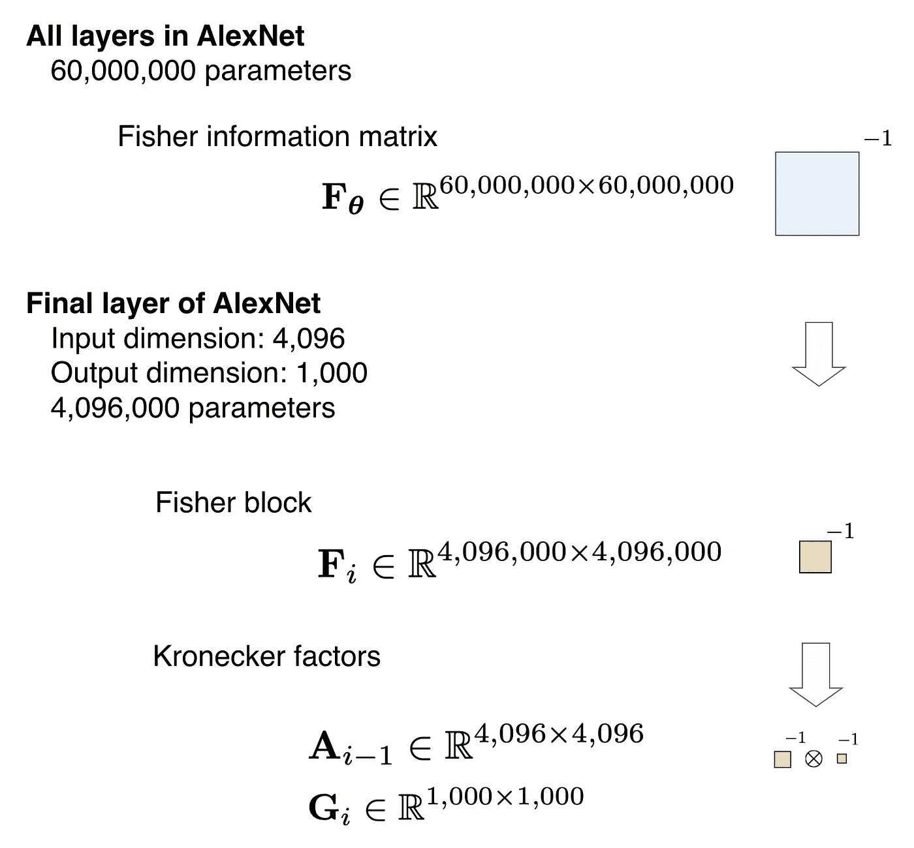

AlexNet for Imagenet (1,000 classification)

总结到目前为止，可以说 K-FAC 是一种自然梯度近似方法，它执行以下三个过程。

1.  通过费希尔信息矩阵的块对角化(每个对角块对应于每一层)，忽略“跨层参数”的相关性。
    * [还有一种使用分块三对角](https://arxiv.org/abs/1503.05671)的方法(考虑相邻层参数的相关性)。
2.  通过对每个对角块(Fisher 块)的 Kronecker 分解，忽略每层中“输入”和“输出梯度”之间的相关性。
3.  通过 1，2 的近似，有效地计算费希尔信息矩阵的逆矩阵，以产生自然梯度。

在这里，我为全连接层引入了 K-FAC，但是在卷积层的 K-FAC 中，除了 2 之外，还应用了更多的近似。(参考[论文](https://arxiv.org/abs/1602.01407)。)

最后，以图像数据集 CIFAR-10 的分类任务(10 类分类)为例，说明了 K-FAC 的有效性。下图显示了随机梯度下降法(SGD)、无任何近似的自然梯度下降法(NGD)和 K-FAC 的训练曲线的比较。

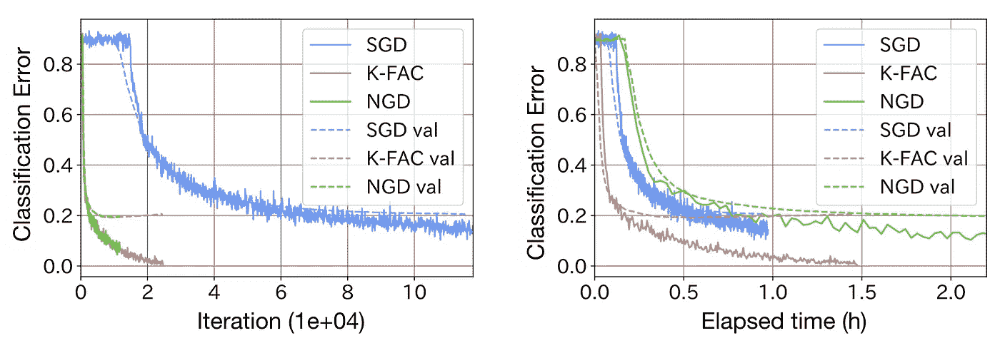

The comparison of training of ConvNet for CIFAR-10 dataset. Solid line: train, dashed line: validation

你可以看到 NGD 在“迭代次数”上比 SGD 收敛得快，但是在 NGD，每次迭代的计算时间很长，所以你也可以看到“经过的时间”比 SGD 晚。另一方面，K-FAC 在“迭代次数”方面很好地再现了 NGD 的训练曲线，并且在“经过的时间”方面也比“SGD”快

这种快速收敛促使引入了 K-FAC 等自然梯度近似方法，但 K-FAC 在 ImageNet 等大规模深度学习中的应用受到限制，之前没有人针对 SGD 验证过有效性。

## K-FAC 的应用

*   递归神经网络(RNN)
    ，
    詹姆斯·马滕斯，吉米·巴，
    ICLR2018。
*   强化学习
    [基于克罗内克因子自然梯度的最近策略优化实证分析](https://arxiv.org/abs/1801.05566)，
    宋家明，吴，
    arXiv:1801.05566【cs .AI]，2018 年 1 月。
*   贝叶斯深度学习
    [噪声自然梯度作为变分推理](https://arxiv.org/abs/1712.02390)，
    张国栋，孙升阳，大卫·杜文瑙，罗杰·格罗斯，
    arXiv:1712.02390【cs .LG]，2018 年 12 月。

## K-FAC 的实现

*   张量流
    [https://github.com/tensorflow/kfac](https://github.com/tensorflow/kfac)
*   py torch
    https://github.com/yaroslavvb/kfac_pytorchT21【在[本帖](https://medium.com/@yaroslavvb/optimizing-deeper-networks-with-kfac-in-pytorch-4004adcba1b0)中介绍)
*   链轮
    https://github.com/tyohei/chainerkfac

## 结论

在本文中，我解释了自然梯度法的近似方法之一 K-FAC 的概要。我牺牲了数学的严谨性，致力于直观的理解。