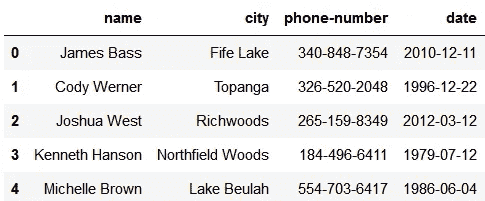
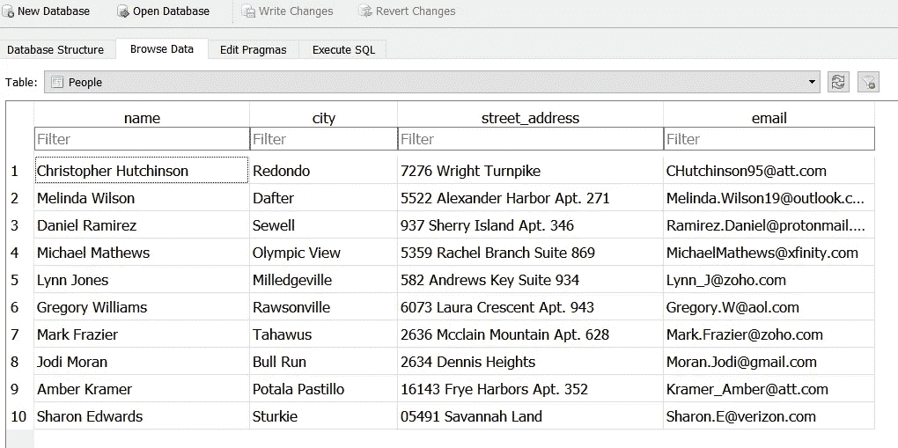
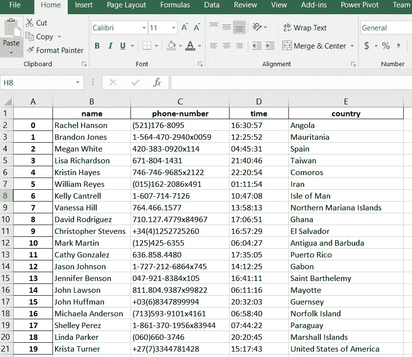

# pydbgen 简介:一个随机数据帧/数据库表生成器

> 原文：<https://towardsdatascience.com/introducing-pydbgen-a-random-dataframe-database-table-generator-b5c7bdc84be5?source=collection_archive---------3----------------------->

## 通常，SQL 或数据科学的初学者都很难轻松访问大型样本数据库文件(**)。DB** 或**。sqlite** )用于练习 SQL 命令。**如果有一个简单的工具或库来生成一个包含多个表的大型数据库，并用自己选择的数据填充，岂不是很棒？**


当你开始学习和实践数据科学时，通常最大的担忧不是算法或技术，而是原始数据的可用性。幸运的是，网上有许多高质量的真实数据集可供尝试很酷的机器学习技术。但是，从我个人的经验来看，我发现在学习 SQL 的时候，情况并非如此。现在，对于数据科学来说——对 SQL 有一个基本的熟悉几乎和知道如何用 Python 或 r 编写代码一样重要，但是访问一个足够大的包含真实数据(比如姓名、年龄、信用卡、SSN、地址、生日等)的数据库。)远不如访问 Kaggle 上专门为机器学习任务设计或管理的玩具数据集常见。

> 如果有一个简单的工具或库来生成一个包含多个表的大型数据库，并用自己选择的数据填充，岂不是很棒？

除了数据科学的初学者之外，即使是经验丰富的软件测试人员也会发现拥有一个简单的工具是很有用的，在这个工具中，他们只需要几行代码就可以生成任意大的数据集，其中包含随机的(伪造的)但有意义的条目。

我很高兴介绍一个轻量级的 Python 库，叫做 ***pydbgen*** 。[你可以在这里阅读关于套餐的详细信息](http://pydbgen.readthedocs.io/en/latest/#)。我将在这篇短文中讨论类似的细节。

## pydbgen 到底是什么？

这是一个轻量级的纯 python 库，可以生成任意有用的条目(例如，姓名、地址、信用卡号、日期、时间、公司名称、职位、车牌号码等)。)并将它们保存在 Pandas dataframe 对象中，或者作为数据库文件中的 SQLite 表，或者保存在 MS Excel 文件中。

## 怎么安装？

它(当前版本 1.0.5)托管在 PyPI (Python 包索引库)上。记住你需要安装 [**Faker**](https://faker.readthedocs.io/en/latest/index.html) 来完成这项工作。所以，只要输入，

```
pip install pydbgen 
```

注意，它目前只在 Python 3.6 上测试过。它在 Python 2 安装上不起作用。

## 怎么用？

你必须启动一个**pydb**对象来开始使用它。

```
import pydbgen
from pydbgen import pydbgen
myDB=pydbgen.pydb()
```

之后，您可以访问由`**pydb**`对象公开的各种内部函数。例如打印随机美国城市，

```
**myDB.city_real()**
>> 'Otterville'for _ in range(10):
    print(**myDB.license_plate()**)
>> 8NVX937
   6YZH485
   XBY-564
   SCG-2185
   XMR-158
   6OZZ231
   CJN-850
   SBL-4272
   TPY-658
   SZL-0934
```

如果你只是说'城市'而不是'城市 _ 真实'，你会得到虚构的城市名称:)

```
print(myDB.gen_data_series(num=8,data_type='city'))
>>
New Michelle
Robinborough
Leebury
Kaylatown
Hamiltonfort
Lake Christopher
Hannahstad
West Adamborough
```

## 如何用随机条目生成熊猫数据帧？

您可以选择要生成多少数据和什么数据类型。注意，所有内容都以字符串/文本的形式返回。

```
testdf=**myDB.gen_dataframe**(5,['name','city','phone','date'])
testdf
```

产生的数据帧如下所示:



## 如何生成数据库表？

您可以选择要生成多少数据和什么数据类型。注意，数据库的所有内容都以 text/VARCHAR 数据类型返回。您可以指定数据库文件名和表名。

```
**myDB.gen_table**(db_file='Testdb.DB',table_name='People',
fields=['name','city','street_address','email'])
```

这将生成一个. DB 文件，可用于 MySQL 或 SQLite 数据库服务器。生成的数据库表在 DB Browser for SQLite 中打开，如下所示:



## 如何生成 Excel 文件？

与上面类似，只需使用下面的代码生成一个带有随机数据的 Excel 文件。注意,“simple_phone”设置为 False，从而生成复杂的长格式电话号码。这对于试验更复杂的数据提取代码来说很方便！

```
myDB.gen_excel(num=20,fields=['name','phone','time','country'],
***phone_simple=False***,filename='TestExcel.xlsx')
```

结果文件看起来像…



## 一个很酷的方式来生成随机电子邮件 id 的废料使用？

pydbgen 中的一个内置方法是`realistic_email`，它从种子名称生成随机的电子邮件 id。你能想到这种方法在网络上的任何用途吗？你不想给出你真实的电子邮件 ID，而是一些相近的东西。

```
for _ in range(10):
    print(myDB.realistic_email('Tirtha Sarkar'))
>>
Tirtha_Sarkar@gmail.com
Sarkar.Tirtha@outlook.com
Tirtha_S48@verizon.com
Tirtha_Sarkar62@yahoo.com
Tirtha.S46@yandex.com
Tirtha.S@att.com
Sarkar.Tirtha60@gmail.com
TirthaSarkar@zoho.com
Sarkar.Tirtha@protonmail.com
Tirtha.S@comcast.net
```

# 未来改进和用户贡献

当前版本是 1.0.5，可能包含许多 bug。如果你注意到任何和你的程序在执行过程中崩溃(除了你的错误输入)，请让我知道。此外，如果你有很酷的想法来贡献源代码，那么 [**Github repo**](https://github.com/tirthajyoti/pydbgen) 全部为你开放。一些问题很容易浮现在脑海中，

*   我们能否将一些机器学习/统计建模与这个随机数据生成器集成在一起？
*   *生成器是否应该增加可视化功能？*

> **可能性无穷无尽，令人兴奋……**

如果您有任何问题或想法要分享，请联系作者在[**tirthajyoti【AT】Gmail . com**](mailto:tirthajyoti@gmail.com)。你也可以查看作者的 [**GitHub 资源库**](https://github.com/tirthajyoti?tab=repositories) 中其他有趣的 Python、R 或 MATLAB 代码片段和机器学习资源。如果你像我一样对机器学习/数据科学充满热情，请随时[在 LinkedIn 上添加我](https://www.linkedin.com/in/tirthajyoti-sarkar-2127aa7/)或[在 Twitter 上关注我。](https://twitter.com/tirthajyotiS)