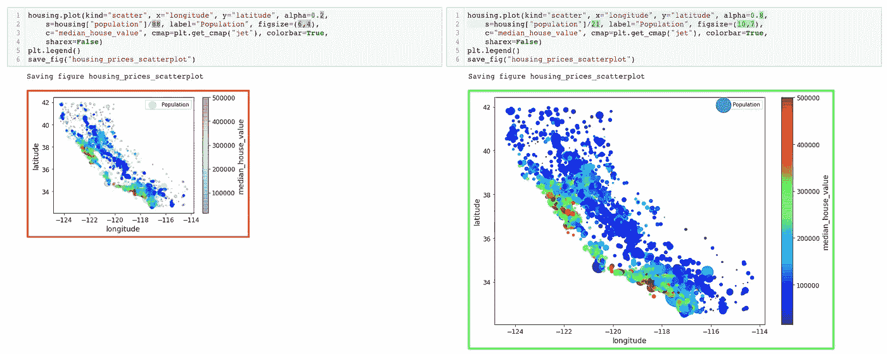
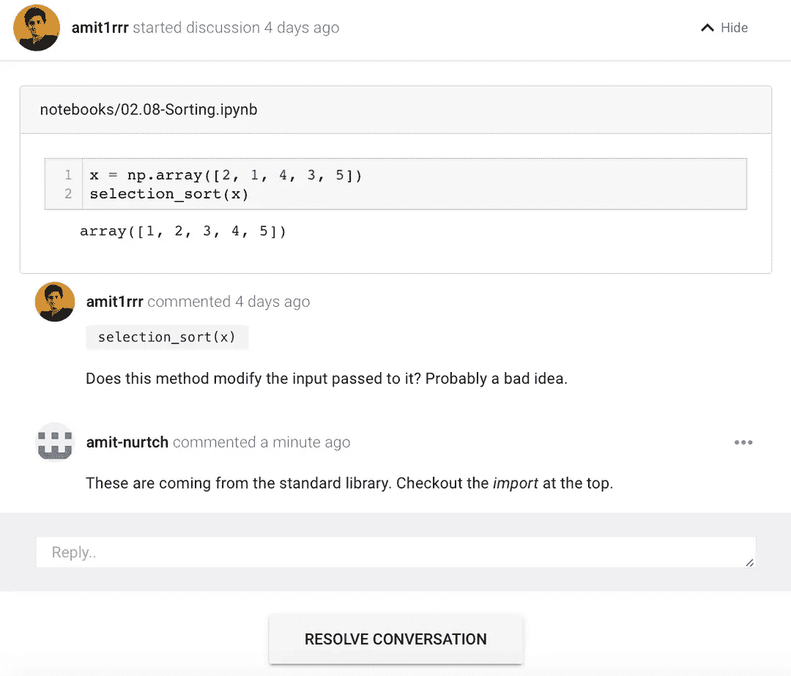
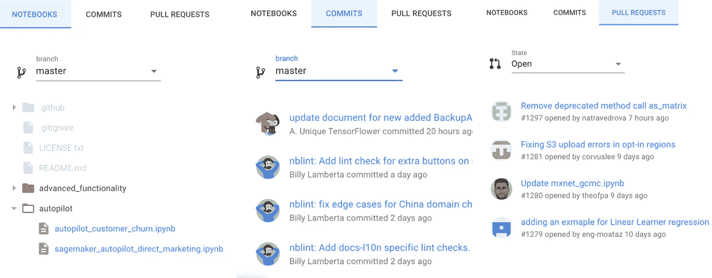

# 介绍 ReviewNB:Jupyter 笔记本的代码审查

> 原文：<https://towardsdatascience.com/introducing-reviewnb-visual-diff-for-jupyter-notebooks-6797e6dfa20c?source=collection_archive---------12----------------------->

我们很高兴地宣布 [ReviewNB](https://www.reviewnb.com/?utm_source=reviewnb_blog) ，这是一款帮助您对 Jupyter 笔记本进行版本控制&的工具。

# 问题

Jupyter 非常适合数据探索，但是很难超越这个范围&使用它进行协作。将 Jupyter 笔记本电脑与现代版本控制系统(如 Git)配合使用存在以下挑战:

*   笔记本[差](https://github.com/amit1rrr/PythonDataScienceHandbook/pull/9/files#diff-e22a52536f6abec89c21d900cd8ddfa6)难读。因此我们不能在 GitHub 上做代码审查
*   由于笔记本文件的 JSON 格式，合并远程更改很困难。ipynb)
*   没有简单的方法来分享反馈&围绕笔记本电脑进行讨论
*   重现笔记本结果并不容易
*   测试笔记本代码单元并不容易

# 解决办法

ReviewNB 旨在从差异、代码审查和协作入手解决这些问题

*   我们为笔记本电脑打造了一流的视觉差异。[更多例子](https://reviewnb.com/)在我们的主页上。

Visual Diff for Jupyter Notebooks

*   您可以在 repo 中浏览 GitHub 提交、拉取请求或打开笔记本文件&在笔记本单元格上写评论以提出改进建议、寻求澄清，或者只是为您同事的工作鼓掌！

Conversation Threads to Track All Ongoing Discussions

它是如何工作的？

*   ReviewNB 是 GitHub marketplace 上提供的 GitHub 应用[(我们的应用通过 GitHub 的](https://github.com/marketplace/review-notebook-app)[验证](https://developer.github.com/marketplace/getting-started/requirements-for-listing-an-app-on-github-marketplace/#security))
*   ReviewNB 与 GitHub APIs 通信，以获取在提交或拉取请求中所做的笔记本更改。我们以并排差异的格式向用户展示这些变化。所有笔记本内容(降价、代码、图像、公式)都以 Jupyter UI 中的方式呈现。这种[视觉差异](https://uploads-ssl.webflow.com/5ba4ebe021cb91ae35dbf88c/5ba93ded243329a486dab26e_sl-code%2Bimage.png)比笔记本常见的混乱 [JSON 差异](https://github.com/amit1rrr/PythonDataScienceHandbook/pull/1/files#diff-30a2a6562c626b99b9c69ce3e26ddc03)更具可读性。
*   您还可以在 pull 请求中的笔记本单元格上，甚至在独立的笔记本文件上写注释。您的队友将会收到评论的电子邮件通知&任何人都可以表达他们的想法。

# 工作流程

ReviewNB 使用起来超级简单。它不需要任何本地安装或配置。人们可以在不到一分钟的时间内在他们的 GitHub 库上开始使用它。

*   任何人都可以[通过 GitHub](https://github.com/login/oauth/authorize?client_id=Iv1.b2736a9bd3b3e896) 登录并选择 ReviewNB 有权访问的存储库(需要大约 30 秒)。
*   登录后，您可以在存储库上浏览提交或拉取请求。

Browse notebooks, commits & pull requests on ReviewNB

*   就是这样！您可以开始看到任何提交或拉请求的可视差异，并开始与您的同事进行讨论！

# 为我们的路线图做出贡献

我们在露天建造。你可以查看[即将推出的新功能](https://github.com/ReviewNB/support/issues?utf8=%E2%9C%93&q=is%3Aopen+is%3Aissue+label%3A%22Feature+Request%22+sort%3Acreated-desc)，为它们投票，甚至申请一个新功能。

暂时就这样吧！在我们的[网站](https://www.reviewnb.com/?utm_source=reviewnb_blog)上有更多的信息，还有一个精心制作的[常见问题解答部分](https://www.reviewnb.com/#faq)供你询问其他问题。我们还为有兴趣自行运行 ReviewNB 的公司提供[自托管选项](https://docs.reviewnb.com/self-hosting/index.html)。如果你有任何问题，我可以在 amit@reviewnb.com 找到你。试试 ReviewNB，让我知道你对它的看法！

[查看 Amit Rathi 的所有帖子](https://blog.amirathi.com/author/amirrathi/)

*原载于 2018 年 10 月 24 日*[*blog.amirathi.com*](https://blog.amirathi.com/2018/10/24/introducing-reviewnb-jupyter-notebook-visual-diff/)*。*