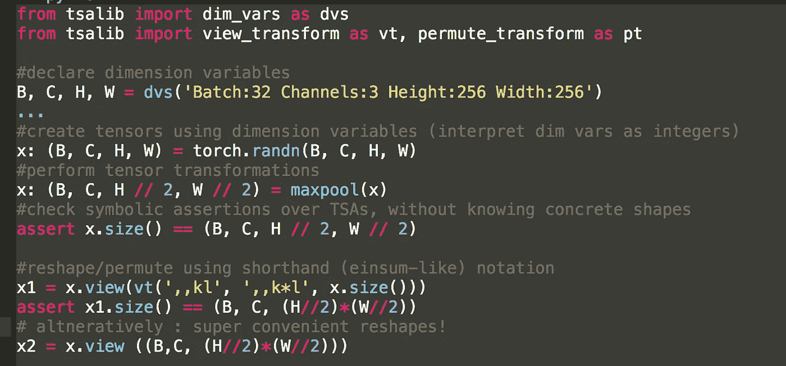
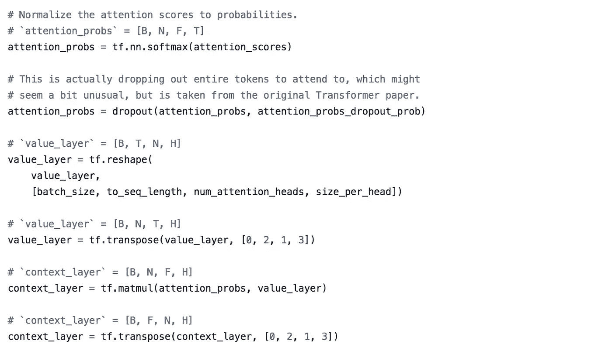
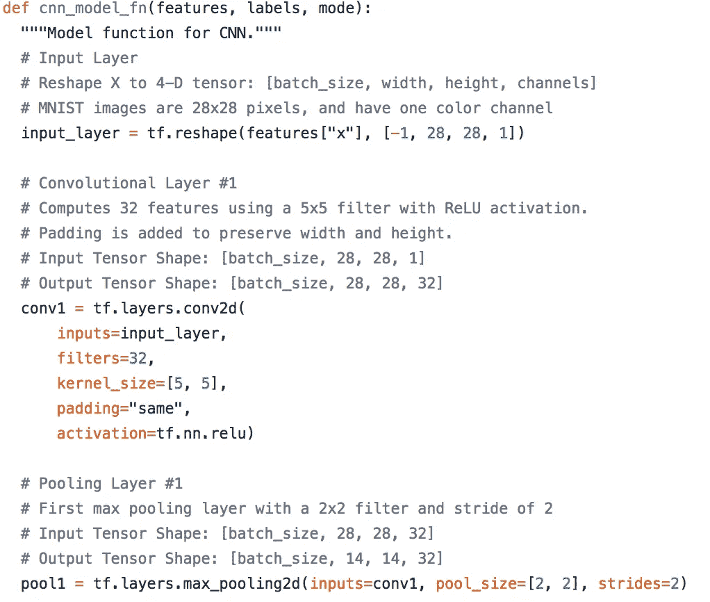
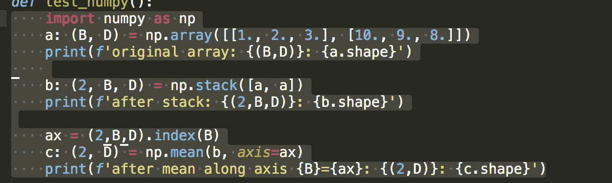
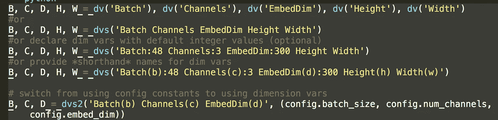
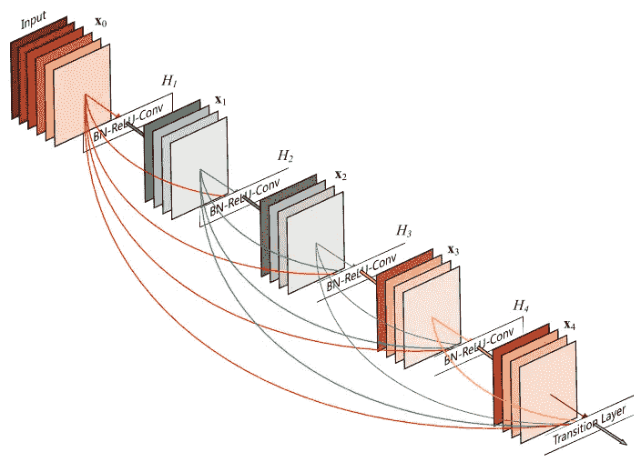
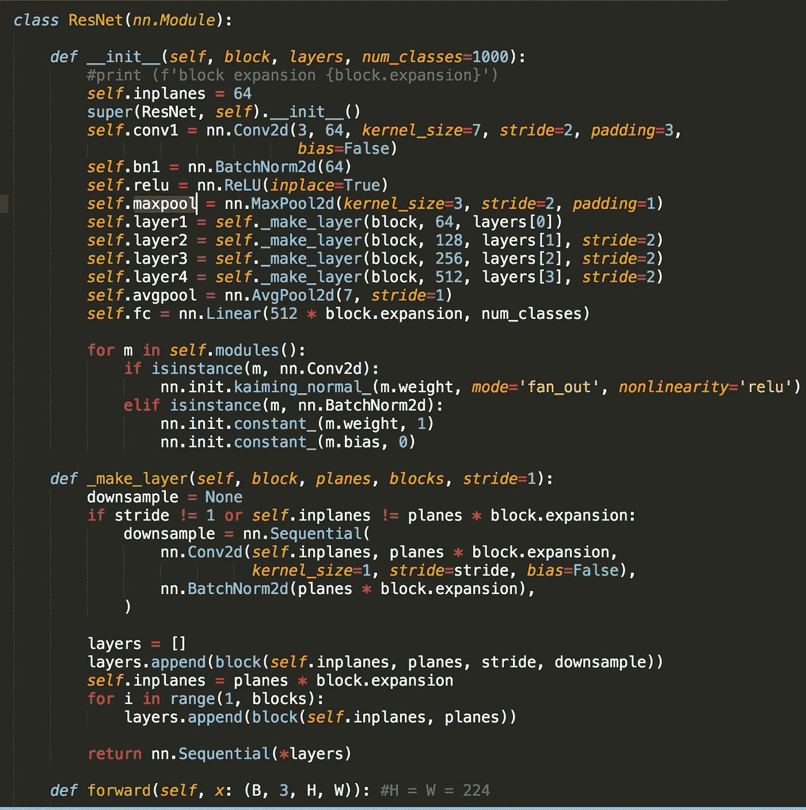
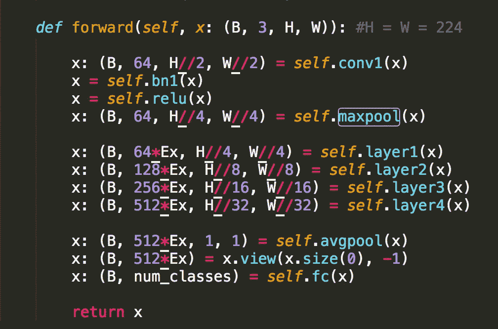
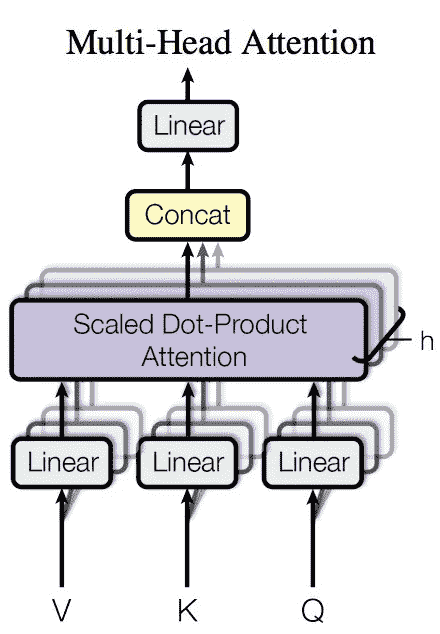

# 与 tsalib 图书馆的 Tensors 成为朋友

> 原文：<https://towardsdatascience.com/introducing-tensor-shape-annotation-library-tsalib-963b5b13c35b?source=collection_archive---------7----------------------->

*tldr:* `[tsalib](https://github.com/ofnote/tsalib)`是为张量定义维度名称和命名形状表达式的库。允许变量上的形状标签、形状断言和使用名称的直观形状转换。使用任意张量库。显式形状注释加速了深度学习程序的调试，并提高了开发人员的生产率和代码可读性。

## **源代码可在 github** [**资源库**](https://github.com/ofnote/tsalib) **获得。**

**更新(2019 年 11 月):**检查我们的库 [tsanley](https://github.com/ofnote/tsanley) 到**注释**和**动态检查**命名的形状。使用 tsanley，您可以避免编写显式的形状断言，并自动注释您想要重用的第三方深度学习代码。

编写操纵张量的深度学习程序(例如，使用`numpy`、`pytorch`、`tensorflow`、`keras`..)要求你仔细记录张量变量的形状。当你编写更复杂的程序时，在你的头脑中思考这些图形变得越来越困难。例如，当创建一个新的`RNN`细胞或设计一种新的`attention`机制或试图做一个非平凡的预训练架构的手术(`resnet101`，`densenet`)。不幸的是，没有在代码中跟踪形状的原则性方法——大多数开发人员求助于编写嵌入代码中的特别注释来跟踪张量形状。

例如，考虑一下最近流行的来自 Google 的 **BERT** 模型实现的[片段](https://github.com/google-research/bert/blob/a21d4848ec33eca7d53dd68710f04c4a4cc4be50/modeling.py#L664)。注意每条语句是如何被其`input`和`output`形状标记的。没有这种明确的形状跟踪，实际上不可能编写和调试复杂的张量程序。

Code from BERT [implementation](https://github.com/google-research/bert/blob/a21d4848ec33eca7d53dd68710f04c4a4cc4be50/modeling.py#L664) from Google.

同样，考虑 tensorflow [教程](https://github.com/tensorflow/tensorflow/blob/master/tensorflow/examples/tutorials/layers/cnn_mnist.py)中的这个 CNN 模型。注意每个语句是如何用其`input` 和`output`形状来标记的，以帮助开发人员。因为形状可能是动态的，所以这些注释同时包含了*参数* (batch_size)和*常量* (28)。

随着网络架构变得复杂，这些注释对于保持开发人员的理智以及其他人理解和扩展代码变得非常重要。不幸的是，没有对这些注释的本地支持，工程师们继续编写*特别注释*来填补空白。事实上，从业者一直在向 T21 寻求更好的支持。

## 张量形状注释

美国运输安全管理局图书馆 ( `tsalib`)来帮你了。

*   该库允许您定义自定义维度变量( *B* =Batch， *C* =Channels，…)以及它们的张量形状表达式。
*   `tsalib`不触及代码所依赖的张量库的内部——适用于任何张量库(`numpy`、`tensorflow,`、`pytorch`等等)。
*   直接在代码中用其形状表达式标注张量变量，作为*一级*类型标注。
*   您可以使用 TSA 直接构建(清晰的)形状变换(`reshape`、`permute`、`axis`索引)和简洁的矩阵/张量运算——稍后将详细介绍。

这里是使用 TSAs 的简单张量程序(代码在这里[可用](https://github.com/ofnote/tsalib/blob/master/tests/test.py))。注意变量`a`、`b`和`c`是如何用它们的形状标注的。**形状标注**，例如`(2,B,D)`既可以包含常量，也可以包含**命名的尺寸变量** ( `B`、`D`)。请注意代码是如何立即变得更具可读性的——您可以简单地浏览一下形状注释，发现由`numpy`函数执行的形状转换(即使您不熟悉 API)。

## 尺寸变量，形状表达式

该库背后的核心思想是**维度变量**及其表达式。

*   `[tsalib](https://github.com/ofnote/tsalib)`允许你为你的架构声明*自定义*维度变量，在形状注释中使用它们，并像普通 Python 变量一样对它们执行算术运算。
*   声明包括可选的大小默认值和简写名称。用 dim 变量(`B`、`D`)替换您的配置参数(`batch_size`、`embed_dim`)。在代码的所有部分只使用 dim 变量。

TSA 在很多方面都很有用。

*   当编写新的转换或修改现有模块时，它们帮助我们快速地*交叉检查*和*调试*变量形状。
*   TSA 作为有用的文档来指导其他人理解或扩展你的模块。
*   周围有明确的形状是有益的，原因有几个(见下文)。
*   TSA 不会以任何方式影响程序的性能或正确性。您可以根据需要或多或少地添加注释。

## 示例:带 TSAs 的 Resnet

这里有一个更复杂的例子，一个来自`pytorch` `torchvision`库的`resnet`模块。这个模块是多个`resnet` 实现的基础:`resnet{18,34,50,101,152}`。现在，通过查看`__init__`和`_make_layer`模块很难获得对架构的任何洞察，即使你直觉地*非常了解*架构。因此，你也不能理解`forward`函数。

Resnet Implementation (Pytorch)

现在，让我们看看带注释的`forward`函数。无需了解各组件层的细节，TSA 允许您发现模块的预期输入(图像)的形状`x`以及它如何被每一层转换。如果您正在重用该模块，例如在`SSD`中用于对象检测，或在`U-Net`中用于分割，您可以一目了然地读出所有中间层的形状。

请注意在命名维度上编写算术表达式的能力是多么有帮助。配置变量(`num_classes`)可以直接在形状中使用。同样，很明显，架构是通过块扩展变量`Ex` 来参数化的(在较小的 resnetss 中为 1，在较大的 resnet 中为 4)。

**基于注意力的架构**，例如 Transformer，也深受不透明问题的困扰。参见[TSA lib/examples/open ai _ transformer . py](https://github.com/ofnote/tsalib/blob/master/examples/openai_transformer.py)(注释从 AllenNLP 的[实现](https://github.com/allenai/allennlp/blob/master/allennlp/modules/openai_transformer.py)开始)了解 TSA 如何显著影响代码的可读性。同样，通过浏览前进模块，我们可以快速了解架构。解剖一个多头注意力架构现在是小菜一碟！

# 形状变换，速记符号

一旦代码中有了维度变量，我们就可以利用它们来进一步提高代码的生产率和清晰度。我们可以使用维度变量直接指定视图和置换转换。例如，这就是从 [AllenNLP](https://github.com/allenai/allennlp) 库中在原始`openai_transformer.py`中实现`merge_heads`的方式。

现在，我们可以使用`tsalib`简洁地编写它。所有形状都是显式的，不再需要代码操作。通过使用它们的速记`string`表示代替元组，形状注释可以变得更加简洁，例如用`'bcd'`代替`(B,C,D)`。`tsalib`允许使用快捷键来指定转换。在这里阅读更多。

在所有张量库(numpy，pytorch，tensorflow)中拥有类似 TSA 的原生支持将对从业者极为有益。然而，这可能涉及到[严重的](https://www.python.org/dev/peps/pep-0472/) [重新设计](https://docs.google.com/document/d/1vpMse4c6DrWH5rq2tQSx3qwP_m_0lyn-Ij4WHqQqRHY/edit#heading=h.rkj7d39awayl)。相比之下，TSA 是独立于库的、轻量级的和即插即用的。你可以从今天开始在你的深度学习项目中使用它们！

## 一定要给`[tsalib](https://github.com/ofnote/tsalib)`一次机会，并给我发送反馈——通过 [twitter](https://twitter.com/ekshakhs) 联系我，或者直接给我发[电子邮件。](mailto:nishantsinha@acm.org)

# **库内部**

类型注释(或类型提示)是 Python 3 中一个受支持的可选特性。随着 Python 3 的改进和被广泛采用，对注释和类型检查的支持也在改进。例如， [AllenNLP](https://github.com/allenai/allennlp/tree/master/allennlp) 的人在他们的代码中使用类型和形状注释，并且[推荐](https://github.com/allenai/writing-code-for-nlp-research-emnlp2018/blob/master/writing_code_for_nlp_research.pdf)作为最佳实践。

`tsalib`内部使用一个奇妙的符号表达式库`[sympy](https://www.sympy.org/)`来构建和转换表达式。`sympy`是它唯一的依赖。

**关于我:**我是一名独立的计算机科学研究员、工程师和演讲者，喜欢提炼复杂的技术并将其转化为可消费的产品。我在学术界、工业界和初创公司都工作过。我帮助公司理解和应对复杂、不断发展的人工智能空间，并构建基于深度学习的解决方案，以最大化投资回报。如果你喜欢这篇文章，请*鼓掌*并发表你的评论。你可以关注我，在这里阅读我的其他文章[，在](https://medium.com/@ekshakhs) [linkedin](https://in.linkedin.com/in/nishant-sinha-a610311) 上找到我，或者[直接发邮件给我](mailto:nishant@offnote.co)。