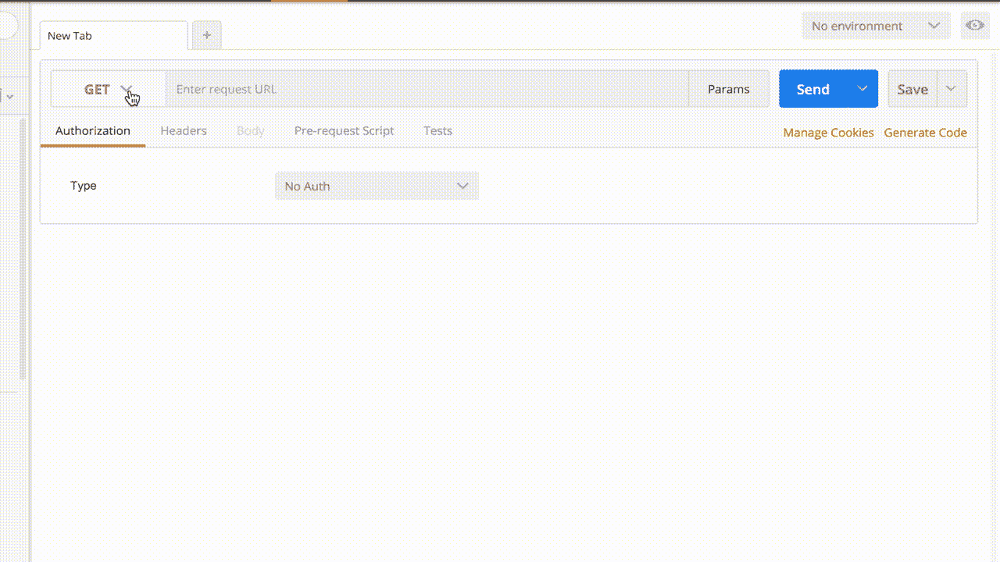

# TFServe 简介:用于 tensorflow 模型推理的简单易用的 HTTP 服务器

> 原文：<https://towardsdatascience.com/introducing-tfserve-simple-and-easy-http-server-for-tensorflow-model-inference-582ea1b07da8?source=collection_archive---------12----------------------->


机器学习最有趣(也是最有趣)的部分是利用你花时间训练的模型。虽然有很多关于如何训练模型的资源，但我们经常发现很难弄清楚如何部署一个使用训练好的模型进行推理(即进行预测)的系统。TFServe 是一个框架，旨在通过 HTTP 服务器以简单和容易的方式为 tensorflow 模型提供服务。

TFServe 是构建在 [apistar](https://github.com/encode/apistar) 之上的微框架。要安装它，只需运行:

```
$ pip install tfserve
```

# 如何使用 TFServe？

让我们从这个常见的场景开始。你已经发现了一个惊人的 Tensorflow Inception CNN 模型，该模型由 Google 在 ImageNet 上训练。**您** **希望构建一个使用该模型进行推理的 HTTP 服务。**

从描述中可以看出，该模型接收 224x224 的标准化 RGB 图像，并返回最可能的类(从 ImageNet 中的 1000 个类中)。你下载模型，得到一个`frozen_graph.pb`(或者类似的)文件。

*现在怎么办？关于如何让它运行的说明涉及到关于模型架构(你对此一无所知)、TF 服务或其他工具的知识。**运行 HTTP 服务器进行推理有多难？这里是** `**tfserve**` **发挥作用的地方:***

## 你需要 5 个零件:

1.  **模型文件**:可以是`.pb`文件，也可以是包含`ckpt`文件的模型目录。
2.  **输入张量名称**:图形输入张量的名称。
3.  **输出张量名称**:图形的输出张量名称。
4.  `encode` : python 函数，接收请求体数据并输出一个`dict`映射输入张量名称到输入 *numpy* 值。
5.  `decode` : python 函数，接收一个`dict`映射输出张量名称到输出 *numpy* 值并返回 HTTP 响应。

## 输入和输出张量名称？

您可能知道，每个张量流图张量都有一个唯一的名称。这个名称是在创建图形时声明的。你需要向`tfserve`指定输入张量的名称。输出张量也是如此。

> 但是我已经从一些 Tensorflow repo 下载了这个模型，我不知道输入/输出张量的名称！

不要惊慌。只需使用 `tfserve.helper.estimate_io_tensors`函数了解可能的 i/o 张量供您选择。

举个例子，

```
> import tfserve import helper
> helper.estimate_io_tensors("frozen_model.pb")Possible INPUT tensors:
        import/img:0

Possible OUTPUT tensors:
        pred/out:0
        pred/softmax_out:0
```

> *太好了！*我将需要`import/img:0`作为我的输入张量，需要`pred/softmax_out:0`作为我的输出张量(这将是一个多类概率分布)。

## 编码功能

实现一个函数，该函数接收 HTTP 请求主体数据并输出一个将输入张量名称映射到输入`numpy`值的`dict`。

在图像分类示例之后，`encode`函数将接收 HTTP 请求主体中提供的二进制数据，并应输出一个映射“`import/img:0`”到 224x224 标准化 RGB `numpy`图像的`dict`:

```
def encode(request_data):
    with tempfile.NamedTemporaryFile(mode="wb", suffix=".jpg") as f:
        f.write(request_data)
        img = PIL.Image.open(f.name).resize((224, 224)) 
        img = np.asarray(img) / 255.

    return {"import/img:0": img}
```

## 解码功能

实现一个函数，该函数接收将输出张量名称映射到输出值并返回 HTTP 响应。

在图像分类示例之后，`decode`函数将接收到一个将“`pred/softmax_out:0`”映射到一个 1000 大小的数组的`dict`映射，该数组具有分类概率。我希望返回一个 JSON 对象，如下所示:

```
{
    class: "german shepard",
    prob: 0.98,
}
```

它包含关于最可能的类的信息。

然后，`decode`功能将会是:

```
def decode(outputs):
    p = outputs["pred/softmax_out:0"]
    index = np.argmax(p)
    return {
               "class": index_to_class_name(index),
               "prob": float(p[index])
           }
```

## 运行服务器

您现在可以运行提供上述所有 5 个部分的服务器(*模型路径、输入张量、输出张量、* `*encode*` *和* `*decode*` *函数*):

```
from tfserve import TFServeAppapp = TFServeApp("frozen_graph.pb", ["import/img:0"],
                 ["pred/softmax_out:0"], encode, decode)app.run('127.0.0.1', 5000, debug=True)
```

# 如何向模型发送实际图像？

服务器将在`127.0.0.1:5000`启动并运行。为了运行模型，您应该向`/`发送一个`**POST**`请求，并将二进制图像作为请求体。您应该得到在`decode`函数中实现的 JSON 响应。



Using the server through [Postman](https://www.getpostman.com/)

您可以在请求正文中提供任何类型的数据。你只需要在`encode`函数中正确处理它，就可以得到图形的输入张量。

此外，您可以在 HTTP 响应中返回任何类型的数据(例如，除了 JSON 对象之外，它还可以包含带有分段信息的二进制图像)。您只需要在`decode`函数中构建响应。

# 结论

有了`tfserve`，运行一个 tensorflow 训练好的模型真的简单又容易。只需提供模型路径、输入/输出张量名称、将请求数据转换成输入张量的`encode`函数和将输出张量转换成响应的`decode`函数。就是这样！`tfserve`会处理剩下的。

# 有关更多信息，请访问项目网站！

[](https://github.com/iitzco/tfserve) [## iitzco/tfserve

### 将 TF 模型作为 HTTP API 简单方便地提供。通过在…上创建帐户，为 iitzco/tfserve 的发展做出贡献

github.com](https://github.com/iitzco/tfserve) 

*喜欢这个项目吗？*在 github 回购上留个⭐！