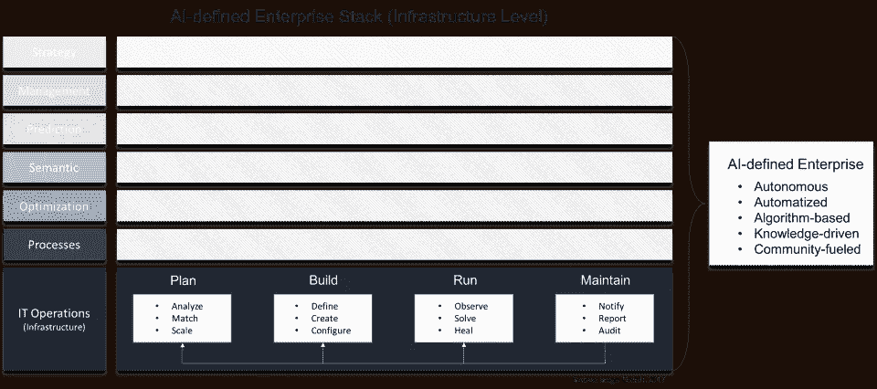

# 引入人工智能定义的基础设施

> 原文：<https://towardsdatascience.com/introducing-the-ai-defined-infrastructure-aidi-because-its-not-just-about-software-anymore-ab04f27e413f?source=collection_archive---------7----------------------->

## (AiDI)——因为这不再仅仅是关于软件

软件定义的基础设施(SDI)是数据中心和云环境中最流行和持续的趋势之一，它通过基于脚本和源代码开发基础设施来提高基础设施的灵活性。然而，SDI 越来越成为达到目的的一种手段，因为自动化、复杂的算法以及智能系统正在导致人工智能定义的基础设施(AI 定义的基础设施——AiDI)。

# 空间数据基础设施并没有消亡，它只是达到目的的一种手段

SDI 从硬件层抽象出软件。因此，智能不再在硬件组件中实现，而是被移到软件堆栈中。SDI 以软件和高度自动化为基础，旨在无需人工干预的情况下构建和控制基础设施。

典型的 SDI 环境，例如云基础设施，是通过开发脚本或源代码来构建的。该软件包括配置整个基础设施环境所需的所有命令，包括运行在基础设施上的应用程序和服务。基于 SDI 的基础设施独立于特定的硬件环境工作。因此，一个完整的基础设施可以通过软件进行交换，而不考虑底层的硬件组件。SDI 是当今云基础设施环境的基础的一个原因。

然而，SDI 一点也不聪明！它基于静态源代码，包括用于自动采取某些动作的硬编码命令。

# 了解人工智能定义的基础设施(AIDI)

软件定义的基础架构是构建和运行动态 IT 环境的一个重要概念。然而，SDI 仅限于静态源代码以及负责为环境编写脚本/代码的开发人员和管理员的技能。此外，SDI 仅在一定程度上是动态的，因为它不能理解或了解它正在运行的自身环境。

人工智能定义的基础设施(AI-defined infra structure-AiDI)通过必要的复杂算法、机器学习和人工智能来增强 SDI，从而为 SDI 提供智能。AiDI 允许 SDI 建立和运行自我学习和自我修复的基础设施环境。因此，在没有人工交互的情况下，人工智能定义的 IT 基础设施环境能够

*   根据工作负载要求部署必要的资源，并在不再需要时取消资源分配。
*   不断分析每一个基础设施组件不断变化的行为和状态，从而了解自身。
*   通过自主采取行动，根据单个基础架构组件的状态做出反应或主动采取行动，从而使整个基础架构进入无错误状态。

人工智能定义的基础设施无法与经典的自动化软件相比，后者通常使用预定义的脚本。人工智能定义的基础设施利用公司的现有知识，自动独立地执行它。然而，像每一个新生的有机体一样，人工智能定义的基础设施需要训练，但之后可以自主工作。因此，基于学到的知识，可以解决干扰——甚至通过连接过去的适当事件来主动解决未预期的事件。因此，人工智能定义的基础设施实时监控和分析所有响应组件，以基于其现有知识识别和解决问题。解决的事件越多，基础架构知识就越丰富。人工智能定义的基础设施的核心是一个基于知识的架构，可以分析事件和变化，并自主制定策略来解决问题。

此外，人工智能定义的基础设施包含社区以

*   吸收外部专家的知识，变得更加聪明。
*   与其他人工智能定义的基础设施环境连接，以链接、组合和共享他们的知识库。
*   不断扩大知识池。
*   优化知识。

总而言之，人工智能定义的基础设施是一个智能系统，它最初由外部知识驱动，可以在没有人类交互的情况下自主学习和决策。

# AIDI 只是整个人工智能定义的企业堆栈的一部分

人工智能定义的基础设施是当今 IT 运营的重要组成部分，为人工智能支持的企业奠定了基础。然而，最重要的是，它使 it 部门能够将基础架构行为从今天的半动态环境转变为真正的实时 IT 环境。

这种规划、构建、运行和维护整个基础架构的自主方式让 IT 运营和开发人员能够以最高效的方式部署 IT 资源，如服务器、存储、网络、数据库和其他现成的服务——利用不止一位专家而是整个 IT 运营团队的知识。此外，IT 运营正从纯粹的资源消费者转变为完全自动化和智能化 IT 体系的协调者和管理者。端到端人工智能就绪企业的基础。

*原载于*[*www . reasoning . world*](http://www.reasoning.world/introducing-the-ai-defined-infrastructure-aidi-because-its-not-just-about-software-anymore/)*。*