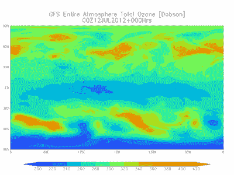

# Weacast 简介

> 原文：<https://towardsdatascience.com/introducing-weacast-e6e98487b2a8?source=collection_archive---------2----------------------->

## [*Weacast*](https://weacast.github.io/weacast-docs) *是一个新的开源平台，用于收集、展示和利用天气预报数据。*

# 为什么选择 Weacast？

现在每天都可以从主要的气象机构获得天气预报数据。当前的天气观测结果通过一个被称为数据同化的过程被输入到数字计算机模型中，以产生对未来天气状况的预测。这些模型从海洋向大气顶部输出数百种其他气象要素，如温度、降水、结冰条件等。例如，下面的动画图像代表了来自 [NOAA](https://www.ncdc.noaa.gov/data-access/model-data/model-datasets/global-forcast-system-gfs) 的 [GFS 天气预报模型](https://www.ncdc.noaa.gov/data-access/model-data/model-datasets/global-forcast-system-gfs)的典型输出。

Weacast**Weacast**(Weacast**Wea**fore**cast**的快捷方式)旨在提供 web 服务和可视化工具，以简单的方式和格式收集、展示和利用天气预报数据。事实上，尽管公开可用的天气预报数据来自许多不同的来源，采用许多不同的专用协议/格式(例如 [WCS](https://en.wikipedia.org/wiki/Web_Coverage_Service) 、 [GeoTIFF](https://en.wikipedia.org/wiki/GeoTIFF) 、 [GRIB](http://en.wikipedia.org/wiki/GRIB) 等)。)，使得在 web 应用程序中消费变得不那么容易，尤其是在客户端。此外，预报数据通常覆盖大片大陆地区，包含数百个要素，如温度、风等。但是一些通常是特定业务用例所需要的。最后但并非最不重要的一点是，预测数据本质上是动态的，因此用最近可用的数据更新您的应用程序始终是一项乏味的任务。

# 广播哲学

Weacast 是**天气预报模型不可知的**，也就是说，它主要公开了一个极简框架，可以按需添加预报数据源，以插件式架构扩展其功能。然后，这些数据可以通过简单的 REST/Websocket 服务以 JSON 格式在 Weacast 中获得，并可以使用内置的 web 应用程序进行可视化。

当前支持的插件如下:

*   [来自](https://weacast.gitbooks.io/weacast-docs/api/PLUGIN.html#arpege) [Meteo France](http://www.meteofrance.com/simulations-numeriques-meteorologiques/monde) 的 ARPEGE 型号
*   [来自](https://weacast.gitbooks.io/weacast-docs/api/PLUGIN.html#arome)[法国气象局](http://www.meteofrance.com/simulations-numeriques-meteorologiques/monde)的阿罗梅模型
*   [GFS](https://weacast.gitbooks.io/weacast-docs/api/PLUGIN.html#gfs) 型号来自 [NOAA](https://www.ncdc.noaa.gov/data-access/model-data/model-datasets/global-forcast-system-gfs)

Weacast 的目标不仅仅是提供粗略的预测数据，它还包括一些工具，通过以下方式获取您自己的业务数据:

*   [探查](https://weacast.github.io/weacast-docs/api/probe.html#probes-api)预测数据，提取或分析您感兴趣的地点的相关数据(如机场、城市、商店等。)
*   [查询](https://weacast.github.io/weacast-docs/api/probe.html#probe-results-api)您探测到的数据，找出哪些位置符合特定的天气条件
*   [在特定地点满足某些天气条件时发出警报](https://weacast.github.io/weacast-docs/api/alert.html#alerts-api)。

# 怎么品尝？

首先，您可以根据我们的 [Weacast web app 模板](https://github.com/weacast/weacast)来看看我们的展示区，更具体地说:

*   可视化预测数据

This short video demonstrates how Weacast can be used to gather forecast data from different models to visualize and predict wind in different locations.

*   探索预测数据

This short video demonstrates how Weacast can be used to explore forecast data and future wind prediction using a timeline widget.

*   探测预测数据

This short video demonstrates how Weacast can be used to probe your own business data to find locations matching target weather conditions. Using runways data, first are found airports with a target wind direction, then runways with a target wind direction relative to their own orientation.

This short video demonstrates how Weacast can be used to probe your own business data or any location in the world to obtain time series of any forecast elements.

然后你可以试着安装你自己的[演示](https://weacast.github.io/weacast-docs/guides/basics.html#deploying)。要全面了解它是如何工作的，请阅读我们的[在线文档](https://weacast.github.io/weacast-docs)并开始开发您自己的基于 Weacast 的应用程序！

# 生产准备好了吗？

Weacast 已经足够可靠，可以在现实世界的应用中使用，因为它主要依赖于一小组经过良好测试的模块: [weacast-core](https://github.com/weacast/weacast-core) 、[wea cast-ar page](https://github.com/weacast/weacast-arpege)、 [weacast-arome](https://github.com/weacast/weacast-arome) 、 [weacast-gfs](https://github.com/weacast/weacast-gfs) 、 [weacast-probe](https://github.com/weacast/weacast-probe) 。虽然这个社区还很新[但是为一个大的行业玩家开发的应用已经在生产了](https://weacast.github.io/weacast-docs/about/ecosystem.html#production-applications)。

# 里面是什么？

Weacast 是可行的，主要由以下堆栈提供支持:

*   [后端的羽毛](https://feathersjs.com/)
*   [前端侧的类星体](http://quasar-framework.org/)
*   [用于映射的传单](http://leafletjs.com/)和[插件](http://leafletjs.com/plugins.html)
*   [叶片速度](https://github.com/danwild/leaflet-velocity)用于风力可视化
*   [传单-时间维度](https://github.com/socib/Leaflet.TimeDimension)用于时间管理
*   [用于彩色地图可视化的传单-canvaslayer-field](https://github.com/IHCantabria/Leaflet.CanvasLayer.Field)
*   [小叶风钩](https://github.com/JoranBeaufort/Leaflet.windbarb)为[风钩](https://en.wikipedia.org/wiki/Station_model)