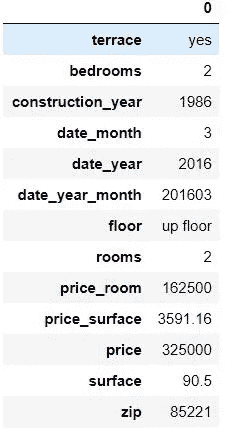
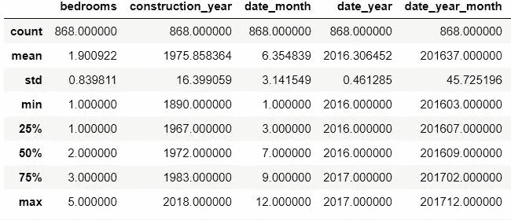
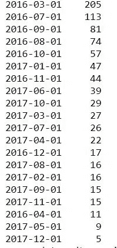
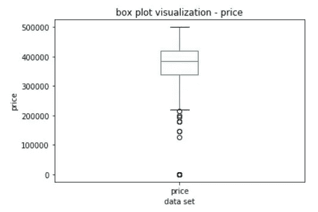
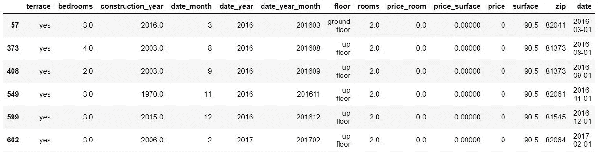
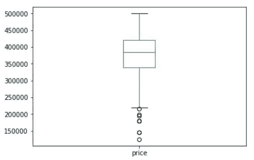
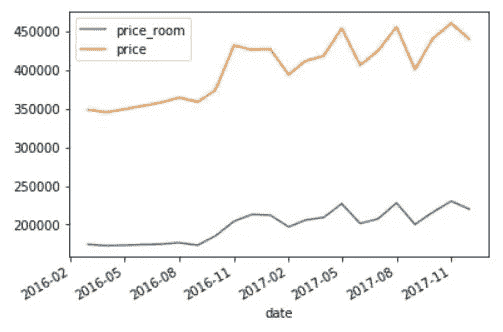
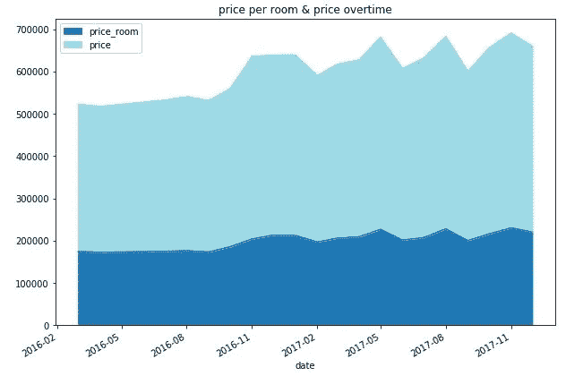
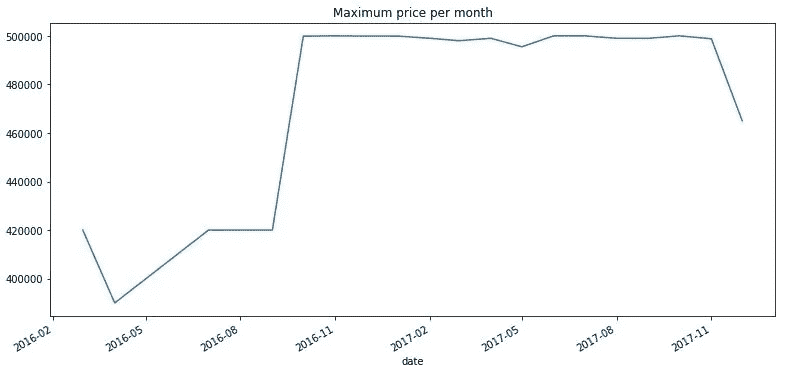
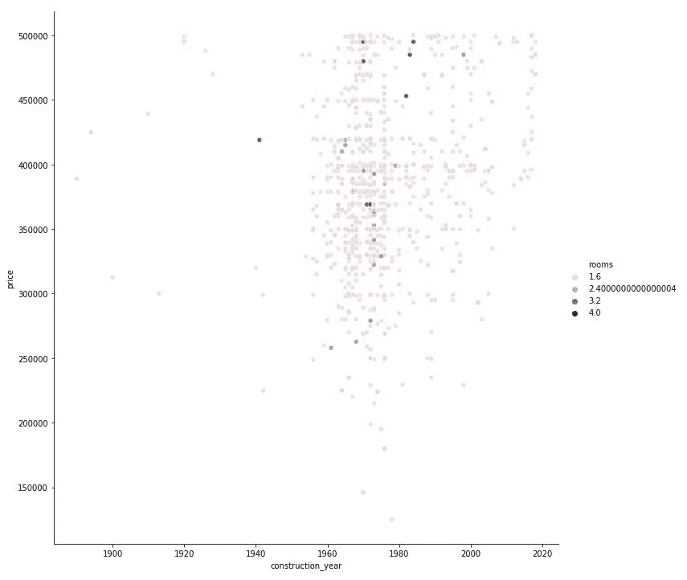

# 熊猫基础数据分析介绍(慕尼黑私人住宅市场数据集)

> 原文：<https://towardsdatascience.com/introduction-to-basic-data-analysis-with-pandas-private-munich-housemarket-data-set-4da58720172e?source=collection_archive---------21----------------------->

这篇文章是上一篇文章(此处链接到[媒体](/introduction-to-cleaning-data-with-pandas-private-munich-housemarket-data-set-be5fc558c9e3))的延续，在那篇文章中，我解释了我为了买房而确定慕尼黑房产市场价值的目标。

因为我得到了数据，在慕尼黑买房子是不可能的，我没有(可能永远也不会)赚到足够的钱来真正意识到这一点，但这些数据仍然很有趣，以便快速浏览熊猫的数据分析。

第一篇文章真正关注的是清理数据，因为为了实现正确的数据分析，您需要干净的数据。否则，在运行代码时，您会遇到很多问题。此外，我真的很喜欢这句话:“垃圾进来，垃圾出去”

如果你不清理你的数据，那么你可能会分析错误的数据点，给你错误的结果。

在这篇文章中，我们将深入探讨熊猫图书馆在数据集分析和一些可视化方面能为你做些什么。我喜欢习语的*【一图胜千言】*。我也非常直观，所以它真的有助于描绘你在数据集中看到的东西。

# Pandas 方法概述

在最开始的时候，通过导入数据集的最新版本(你已经清理或从我的 github 帐户中获取的)，你可以通过一些方法开始，这些方法会给你一些信息。

```
import pandas as pd
df = pd.read_csv('data_immo.clean.csv', delimiter='\t')
df.head(1).T ## I like the transpose function as it gives you a better view
```



*using the transpose on one line allows you to see easily type of data and column name*

```
df.describe() ## Always worth checking
```



你可能已经注意到了，我们对每一列都有相同的计数。多亏了我们的清理，所有剩下的数据都可供我们找到一些有趣的信息。

现在您可能已经意识到，这个数据集是一个时间序列，这意味着有一个类似时间戳的列，这将使您能够看到数据集随时间的演变。这对我们的分析很有用，可以看出是否有进化。

为了设置时间序列，我们需要使用某种方法来确定哪一列包含此信息，以及如何将其转换为 pandas 数据帧。

您可能希望(但不是必须)导入 datetime 库并转换 date_year_month 列。
如果我们想从我们将从这个翻译创建的日期时间列中实际做其他事情，我们导入日期时间。

```
import datetime
df['date'] = pd.to_datetime(df['date_year_month'],format= '%Y%m') ## This will create a new column that contains your datetime element
##Let's not stop here and analyze the different element identified in that column 
df['date'].value_counts() ##Unique values and number of occurences
```



我们看到 2016 年 4 月、2017 年 5 月和 12 月
的数值较低。

我们需要记住这一点，以免在那一个月得出结论。没有足够的数据来做出任何假设。

从对你的数据集有一个想法开始，你可以实现一些简单的可视化，以便分析你的数据集或只是一个系列。
如果我们想看到价格的分布，我们可以实现这种盒子绘图

```
ax = df['price'].plot(kind='box', title='box plot visualization - price') #return an object from matplotlib
ax.set_ylabel('price')
ax.set_xlabel('data set')
```



*oh oh… what are those data points near 0 ?*

在这里，您可以看到大多数值(25–75%)在 210 k 和 500 K€范围内。
但你也可以看到一些额外的点，更重要的是，似乎有数据点要清理。我们有它的价格，但它是 0，这是不可能的，即使我真的很喜欢这个。

```
df[df['price'] == df['price'].min()] ## look for the data that match the minimum.
## In case you want to have some margin against the minimum, you can do something like this 

df[df['price'] < df['price'].min()*1.1] ## Will take everything below 10% more than the minimum.
## it doesn't work in our case as our minimum is 0 but we can set a hardcap nothing below 50K. 

df[df['price'] < 50000]
```



让我们暂时保存它们，我们以后可以使用这些数据。
我们只是将它们从主要分析中移除，并将它们保存在一个单独的数据框架中。

```
df_0_price = df[df['price'] < 50000].copy()
df_0_price.reset_index(inplace=True,drop=True) ## let's reset their index
df = df[df['price'] > 50000]
df.reset_index(inplace=True,drop=True) ## let's reset their index
df['price'].plot(kind='box')
```



This is a lot better

我认为这部分是你在实际工作中所做的一个很好的例子。即使您已经花了一些时间清理您的数据集，当您意识到分析时，您总是会发现一些要清理的东西。这是你真正挖掘数据的时候，你会经常遇到这种情况。重新清理数据。

回到分析，熊猫的一个有趣的方法是看两个变量之间是否有相关性。
为了做到这一点，您可以在 2 个系列之间使用 corr()。

```
df[['date_year_month','price']].corr()
## returns 0.42 : So positive correlation, price are increasing with time
## note that we are taking the 'date_year_month' data that are a number such as 201801 so it increased over time. 
df[['rooms','price']].corr()
## returns 0.093 : No correlation between price and number of rooms. 
## But this can be biased by the few number of different room number. 

df['rooms'].value_counts()
## returns 3 values 2 (821), 3 (24), 4 (8). 
## The over representation of 2 rooms will bias the correlation here.
```

对您的数据做的一件有趣的事情是通过按分类数据对元素进行分组来反转视图。如果你懂一点 SQL，你会直接对“分组”这个词挠痒痒。是的，熊猫有 groupby 功能，而且很容易使用。

我们可以做的一个有趣的分析是查看每个邮政编码的平均价格。为了有真正的比较，我们将采取每平方米的价格(价格 _ 表面)。

这将返回一个 groupby 对象，最好将它存储在一个变量中。

```
df_groupby_zip = df.groupby('zip')['price_surface'].mean() ## The good thing is that you can do a groupby on multiple elements. 

df_groupby_zip_room =  df.groupby(['zip','rooms'])['price'].mean()
```

这个方法其实很厉害。在这种状态下，它提供了更清晰的视图和查看数据的新方法。你也可能会说“这很好，它摆脱了复杂性，但我想知道实际上发生了什么”
如果我告诉你，你可以使用这种方法来查看发生了什么(聚合了多少数据点)，但在一个命令中添加了更多的计算，会怎么样？

```
df_groupby_zip_agg = df.groupby('zip').agg({'price_surface' : ['mean','count','max']})
```

什么？？？在一条线上？
是的，很容易获得每个邮政编码的每平方米平均价格、数据点的数量以及每个群体聚集的最大值。的。agg 绝对是你需要记住的。

正如您可能已经猜到的那样，它只要求我们在字典中添加另一个列名，以便实际考虑另一个列(使用您想要应用于它的适当计算)。

问题出现在这里，因为 *price_surface* 列将有一个多重索引，这不容易处理。
我用来从 *price_surface* 数据类型中只选择一列的方法是使用。loc[]选择。

```
df_groupby_zip_agg.loc[:,('price_surface','mean')]
```

# 熊猫可视化

Pandas 集成了 matplotlib 以实现一些简单的可视化。
您已经看到了箱线图，这是一个非常有趣的数据集分布视图。在本文的下一部分，我们将看到如何创建这样的可视化来查看您的数据集。

为了看到可视化效果，您需要编写这行代码:

```
%matplotlib inline #will generate the graph in your console
```

正如我之前解释的，我们的数据集很酷的一点是它是一个时间序列。
要真正获得这类数据，您需要将 datetime 列放在索引中。
一旦你这样做了，所有的情节将以时间序列的方式生成。

```
ddf = df.set_index('date')
ddf_gby_mean = ddf.groupby('date').mean()
ddf_gby_mean[['price_room','price']].plot()
```



simple visualization

这是一个非常基本的绘图。
你可以改变类型，使用*种类*属性，但是你可以使用更多的属性。对我来说最有用的是:

*   种类:决定情节的类型，我最喜欢的是 barh 或 bar。
*   figsize:使用一个元组来调整图形的大小
*   标题:给你的图表起一个标题
*   cmap:使用不同的颜色地图，链接到一些[文档](https://matplotlib.org/examples/color/colormaps_reference.html)

```
ddf_gby_mean[['price_room','price']].plot(kind='area',title='price per room & price overtime',figsize=(10,7),cmap='tab20')
```



How better is it ?

你可以清楚地看到从 2016 年 11 月开始的数据集的演变。
我们得到了一个更高的平均价格，这可能是因为最高价格已经提高了。我可以告诉你这是事实，但让我们看看数据来证实这一点。

```
graph = pd.DataFrame(df.groupby('date').agg({'price':['max','count']})) ##setting a new view with groupby
ax = graph.loc[:,('price','max')].plot(kind='line',title='Maximum price per month',figsize=(13,6))
```



您可以清楚地看到，我提高了我期望的最高价格。这是因为慕尼黑的物价太高，没有其他选择。

熊猫图形表示非常有用，将帮助您更好地理解您的数据。但是，您也可以使用具有一些高级可视化表示其他绘图库。这个主题本身值得再写一篇博文，但是让我们看看另一篇，它非常容易使用，并且对于额外的图形可视化非常强大:seaborn

```
import seaborn as sns
sns.relplot(x="construction_year", y="price", hue='rooms',sizes=(20, 400), alpha=.7, height=10, data=df)
```



很容易通过建筑年份和房间数量来显示价格吗？我们可以看到，市场上的大多数报价(在我的价格范围内)都在 1960 英镑到 1990 英镑之间。甚至有一些建筑预计建造时间会持续到 2020 年。

总的来说，绘图函数的使用通常来自 matplotlib 的包装。因此，您应该真正开始了解这个库是关于什么的，这样您就可以更好地整合它提供的可能性。

我希望这篇文章有助于了解如何使用 pandas 进行基本的数据分析。我计划涵盖更多的主题和可视化，但这已经变得很长了。我会回来的；)