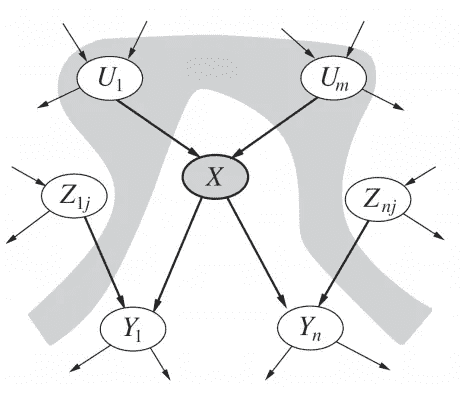
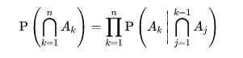
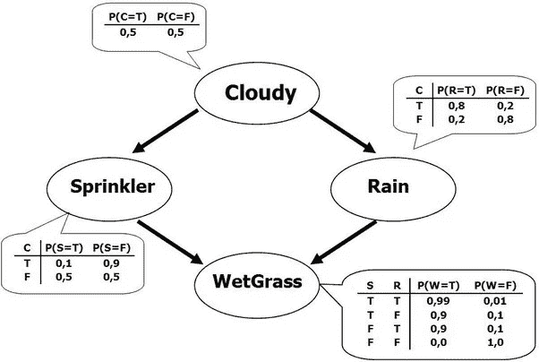
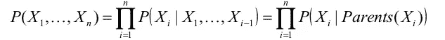
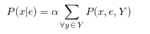

# 贝叶斯网络简介

> 原文：<https://towardsdatascience.com/introduction-to-bayesian-networks-81031eeed94e?source=collection_archive---------1----------------------->

**贝叶斯网络**是一种概率图形模型，使用贝叶斯推理进行概率计算。贝叶斯网络旨在通过用有向图中的边来表示条件依赖，从而对条件依赖以及因果关系进行建模。通过这些关系，人们可以通过使用因子有效地对图中的随机变量进行推断。

## 可能性

在深入到底什么是贝叶斯网络之前，首先回顾一下概率论是很有用的。

先记住随机变量 A_0，A_1，…，A_n 的联合概率分布，记为 P(A_0，A_1，…，A_n)，由概率的[链式法则，等于 P(A_1 | A_2，…，A_n) * P(A_2 | A_3，…，A_n) * … * P(A_n)。我们可以认为这是分布的**分解**表示，因为它是局部概率的 N 个因子的乘积。](https://en.wikipedia.org/wiki/Chain_rule_(probability))

接下来回想一下两个随机变量 A 和 B 之间的**条件独立**给定另一个随机变量 C，等价于满足以下性质:P(A，B|C) = P(A|C) * P(B|C)。换句话说，只要 C 的值已知且固定，A 和 B 就是独立的。另一种表述方式是 P(A|B，C) = P(A|C ),我们稍后会用到。

## 贝叶斯网络

使用我们的贝叶斯网络指定的关系，我们可以通过利用条件独立性来获得联合概率分布的紧凑、分解的表示。

贝叶斯网络是一个**有向无环图**，其中每条边对应一个条件依赖，每个节点对应一个唯一的随机变量。形式上，如果连接随机变量 A 和 B 的图中存在一条边(A，B ),则意味着 P(B|A)是联合概率分布中的一个**因子**,所以我们必须知道 B 和 A 的所有值的 P(B|A ),才能进行推断。在上面的示例中，由于 Rain 具有进入 WetGrass 的边，这意味着 P(WetGrass|Rain)将是一个因子，其概率值在条件概率表中 WetGrass 节点的旁边指定。

贝叶斯网络满足**局部马尔可夫性质**，该性质声明给定其父节点，节点有条件地独立于其非后代。在上面的例子中，这意味着 P(洒水喷头|多云，雨)= P(洒水喷头|多云)，因为洒水喷头有条件地独立于它的非后代，雨，给定多云。这一性质使我们能够将上一节中使用链式法则得到的联合分布简化为更小的形式。简化后，贝叶斯网络的联合分布等于所有节点的 P(node|parents(node))的乘积，如下所示:

在较大的网络中，这一特性使我们能够大大减少所需的计算量，因为一般来说，相对于网络的整体规模，大多数节点的父节点很少。

## 推理

贝叶斯网络上的推理有两种形式。

第一种是简单地评估网络中每个变量(或子集)的特定赋值的联合概率。为此，我们已经有了联合分布的分解形式，所以我们简单地使用提供的条件概率来评估该产品。如果我们只关心变量的子集，我们将需要边缘化那些我们不感兴趣的变量。在许多情况下，这可能导致下溢，因此通常取该乘积的对数，这相当于将乘积中每一项的单独对数相加。

第二，更有趣的推理任务，是找到 P(x|e)，或者，在给定其他变量赋值的情况下，找到变量子集(x)的某个赋值的概率(我们的证据，e)。在上面的示例中，可以找到 P(sprayer，WetGrass | Cloudy ),其中{ Sprinkler，WetGrass}是我们的 x，而{Cloudy}是我们的 e。为了计算这一点，我们使用了 P(x|e) = P(x，e) / P(e) = αP(x，e)这一事实，其中α是归一化常数，我们将在最后计算该常数，使得 P(x|e) + P( x | e) = 1。为了计算 P(x，e ),我们必须将没有出现在 x 或 e 中的变量的联合概率分布边缘化，我们将它们表示为 y。

对于给定的示例，我们可以如下计算 P(洒水喷头，湿草|多云):

我们将以同样的方式计算 P( x | e ),只是将 x 中变量的值设置为 false 而不是 true。一旦 P( x | e)和 P(x | e)都计算出来，我们就可以解出α，它等于 1 / (P(x | e) + P( x | e))。

请注意，在较大的网络中，Y 很可能相当大，因为大多数推理任务将只直接使用变量的一个小子集。在这种情况下，如上所示的精确推理计算量非常大，因此必须使用一些方法来减少计算量。一种更有效的精确推断方法是通过[变量消除](https://en.wikipedia.org/wiki/Variable_elimination)，它利用了每个因素只涉及少量变量的事实。这意味着求和可以重新排列，以便在该变量的边缘化中只使用涉及给定变量的因子。或者，许多网络甚至对于这种方法来说都太大了，所以使用近似推理方法，例如[MCMC](https://en.wikipedia.org/wiki/Markov_chain_Monte_Carlo)；这些提供的概率估计比精确推断方法需要更少的计算。