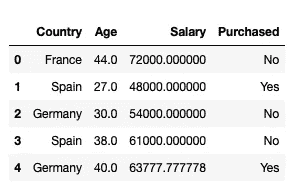
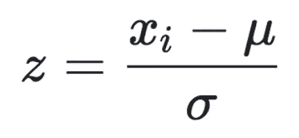
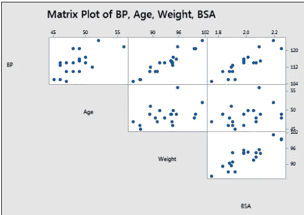
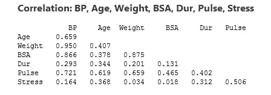

# 机器学习中的数据预处理导论

> 原文：<https://towardsdatascience.com/introduction-to-data-preprocessing-in-machine-learning-a9fa83a5dc9d?source=collection_archive---------0----------------------->

## 数据预处理初学者指南


Photo by [Markus Spiske](https://unsplash.com/@markusspiske?utm_source=unsplash&utm_medium=referral&utm_content=creditCopyText) on [Unsplash](https://unsplash.com/?utm_source=unsplash&utm_medium=referral&utm_content=creditCopyText)

数据预处理是机器学习中不可或缺的一步，因为数据的质量和从中获得的有用信息会直接影响模型的学习能力；因此，在将数据输入模型之前，对数据进行预处理是非常重要的。

我将在本文中介绍的概念是-

1.  处理空值
2.  标准化
3.  处理分类变量
4.  一键编码
5.  多重共线性

您可以获得完整的代码(。ipynb) [这里](https://github.com/Dhairya10/Medium_Data_Preprocessing)

# 处理空值—

在任何真实世界的数据集中，总是很少有空值。无论是回归、分类还是任何其他类型的问题，都没有关系，没有模型能够独自处理这些 NULL 或 NaN 值，因此我们需要干预。

> 在 python 中，NULL 用 NaN 表示。所以不要混淆这两者，它们可以互换使用。

首先，我们需要检查我们的数据集中是否有空值。我们可以使用 isnull()方法来实现。

```
df.isnull()      
# Returns a boolean matrix, if the value is NaN then True otherwise Falsedf.isnull().sum() 
# Returns the column names along with the number of NaN values in that particular column
```

我们有各种方法来处理这个问题。解决这个问题最简单的方法是删除包含空值的行或列。

```
df.dropna()
```

dropna()接受各种参数，比如—

1.  axis —如果要删除行，我们可以指定 axis = 0；如果要删除列，我们可以指定 axis=1。
2.  how —如果我们指定 how = 'all ',那么只有当所有值都是 NaN 时，才会删除行和列。默认情况下，how 设置为“any”。
3.  thresh——它确定阈值，因此如果我们指定 thresh=5，那么具有少于 5 个实数值的行将被丢弃。
4.  subset-如果我们有 4 列 A、B、C 和 D，那么如果我们指定 subset=['C']，那么只有 C 值为 NaN 的行将被删除。
5.  就地-默认情况下，不会对数据框进行任何更改。因此，如果您希望这些更改反映到您的数据帧中，那么您需要使用 inplace = True。

但是，从数据集中删除行和列并不是最佳选择，因为这会导致大量信息丢失。如果您有 300，000 个数据点，那么删除 2-3 行不会对您的数据集产生太大影响，但是如果您只有 100 个数据点，并且其中 20 个数据点对于特定字段具有 NaN 值，那么您不能简单地删除这些行。在现实世界的数据集中，某个特定字段有大量 NaN 值的情况经常发生。

例如，假设我们从调查中收集数据，那么可能会有一个可选字段，假设 20%的人留为空白。因此，当我们获得数据集时，我们需要了解剩余的 80%的数据仍然是有用的，因此，与其丢弃这些值，我们需要以某种方式替换缺失的 20%的值。我们可以在**插补的帮助下做到这一点。**

## 插补—

插补就是简单地替换我们数据集缺失值的过程。我们可以通过定义我们自己的定制函数来实现这一点，或者我们可以通过使用 sklearn 提供的**simple imputr**类来简单地执行插补。

```
from sklearn.impute import SimpleImputer
imputer = SimpleImputer(missing_values=np.nan, strategy='mean')
imputer = imputer.fit(df[['Weight']])
df['Weight'] = imputer.transform(df[['Weight']])
```

**。这里使用的值**返回数据帧的 numpy 表示。
仅返回数据框中的值，轴标签将被移除。

# 标准化—

这是另一个完整的预处理步骤。在标准化中，我们转换我们的值，使平均值为 0，标准差为 1。



*Image by author*

考虑上面的数据帧，这里我们有 2 个数值:**年龄**和**体重**。因为年龄是以年为单位，体重是以公斤为单位，所以它们不在一个等级上，因为体重更有可能大于年龄；因此，我们的模型将赋予权重更多的权重，这不是理想的情况，因为年龄也是一个不可或缺的因素。为了避免这个问题，我们执行标准化。



*Image by author*

简单来说，我们只需计算这些值的平均值和标准差，然后对于每个数据点，我们只需减去平均值，然后除以标准差。

**示例—**

考虑数据帧 1 中的列年龄。为了标准化该列，我们需要计算平均值和标准偏差，然后我们将使用上述公式转换每个年龄值。

我们不需要手动完成这个过程，因为 sklearn 提供了一个名为 **StandardScaler 的函数。**

```
from sklearn.preprocessing import StandardScaler
std = StandardScaler()
X = std.fit_transform(df[['Age','Weight']])
```

这里需要注意的重要一点是，我们需要标准化训练和测试数据。

*   fit_transform 相当于先使用 fit，再使用 transform。
*   fit 函数计算平均值和标准差，transform 函数实际上标准化数据集，我们可以使用 fit_transform 函数在一行代码中完成此过程。

> 这里要注意的另一件重要的事情是，当处理测试数据时，我们将只使用 transform 方法。

# 处理分类变量—

处理分类变量是机器学习的另一个重要方面。分类变量基本上是离散而非连续的变量。例如，商品的颜色是一个离散变量，而价格是一个连续变量。

分类变量进一步分为两种类型—

*   **有序分类变量** —这些变量可以排序。ex——T 恤衫的尺寸。我们可以说 M < L < XL。
*   **名义分类变量** —这些变量不能排序。前——t 恤的颜色。我们不能说蓝色是绿色，因为比较这两种颜色没有任何意义，因为它们没有任何关系。

> **这里需要注意的重要一点是，我们需要不同地预处理序数和名词性分类变量。**

## **处理有序分类变量—**

首先，我们需要创建一个数据框架。

```
df_cat = pd.DataFrame(data = 
                     [['green','M',10.1,'class1'],
                      ['blue','L',20.1,'class2'],
                      ['white','M',30.1,'class1']])
df_cat.columns = ['color','size','price','classlabel']
```

这里，列“size”和“classlabel”是顺序分类变量，而“color”是名义分类变量。

有两个非常简单和整洁的技术来转换顺序 cv。

1.  使用 map()函数—

```
size_mapping = {'M':1,'L':2}
df_cat['size'] = df_cat['size'].map(size_mapping)
```

这里 M 将用 1 代替，L 用 2 代替。

2.使用标签编码器—

```
from sklearn.preprocessing import LabelEncoder
class_le = LabelEncoder()
df_cat['classlabel'] =
class_le.fit_transform(df_cat['classlabel'].values)
```

这里，class1 用 0 表示，class2 用 1 表示。

## **处理名词性分类变量的方式不正确—**

大多数人犯的**最大错误**是他们无法区分序数型和名义型简历。因此，如果您对名义变量使用相同的 map()函数或 LabelEncoder，那么模型将认为名义变量之间存在某种关系。

所以如果我们使用 map()来映射颜色，就像-

```
col_mapping = {'Blue':1,'Green':2}
```

然后根据模型，绿色>蓝色，这是一个毫无意义的假设，模型会给出考虑这种关系的结果。所以，虽然你会用这种方法得到结果，但它们不会是最佳的。

## **处理名义分类变量的正确方法—**

处理名义 cv 的正确方法是使用一键编码。使用独热编码最简单的方法是使用 get_dummies()函数。

```
df_cat = pd.get_dummies(df_cat[['color','size','price']])
```

在这里，我们传递了“size”和“price”以及“color ”,但是 get_dummies()函数非常聪明，它将只考虑字符串变量。所以它只是转换“颜色”变量。

现在，你一定想知道这到底是什么一次性编码。所以让我们试着去理解它。

# 一键编码—

因此，在一键编码中，我们主要做的是创建“n”列，其中 n 是名义变量可以接受的唯一值的数量。

例如，在这里，如果颜色可以是蓝色、绿色和白色，那么我们将只创建三个新列，即颜色 _ 蓝色、颜色 _ 绿色和颜色 _ 白色，如果颜色是绿色，那么颜色 _ 蓝色和颜色 _ 白色列的值将是 0，颜色 _ 绿色列的值将是 1。

因此，在 n 列中，只有一列的值为 1，其余的列的值都为 0。

一键编码是一个非常酷和简洁的技术，但是只有一个问题与之相关，那就是多重共线性。因为你们一定都认为这是一个相当沉重的词，所以一定很难理解，所以让我来验证一下你们新形成的信念。多重共线性确实是一个有点棘手但极其重要的统计学概念。这里的好处是，我们不需要真正理解多重共线性的所有本质细节，我们只需要关注它将如何影响我们的模型。因此，让我们深入了解多重共线性的概念，以及它将如何影响我们的模型。

# **多重共线性及其影响—**

当我们的数据集中存在彼此高度依赖的要素时，就会出现多重共线性。在这种情况下，我们有一些特征-

color_blue，color_green 和 color_white，这些都是相互依赖的，并且会影响我们的模型。

> 如果数据集存在多重共线性，则无法使用权重向量来计算特征重要性。
> 
> 多重共线性会影响我们模型的可解释性。

我认为，在机器学习的背景下，这些信息已经足够了。但是，如果您仍然不相信，您可以访问下面的链接，了解与多重共线性相关的数学和逻辑。

[](https://newonlinecourses.science.psu.edu/stat501/node/344/) [## 12.1 -什么是多重共线性？| STAT 501

### 如课程概述中所述，只要回归模型中有两个或多个预测因子，就存在多重共线性…

newonlinecourses.science.psu.edu](https://newonlinecourses.science.psu.edu/stat501/node/344/) 

现在，我们已经了解了多重共线性的含义，接下来让我们尝试了解如何识别它。

*   识别多重共线性的最简单方法是绘制一对图，您可以观察不同要素之间的关系。如果两个要素之间存在线性关系，则它们之间存在强相关性，并且数据集中存在多重共线性。



*Image by author*

此处(体重，BP)与(BSA，BP)密切相关。您也可以使用相关矩阵来检查特征的紧密相关性。



*Image by author*

我们可以观察到，体重与 BP、BSA 与 BP 之间存在很强的协整关系(0.950)(0.875)。

## 避免多重共线性的简单技巧-

我们可以使用 drop_first=True 来避免多重共线性问题。

```
df_cat = pd.get_dummies(df_cat[['color','size','price']],drop_first=True)
```

这里 drop_first 将删除第一列颜色。所以这里蓝色将被去掉，我们只有绿色和白色。

这里需要注意的重要一点是，我们不会丢失任何信息，因为如果 color_green 和 color_white 都是 0，那么这意味着颜色一定是蓝色的。因此，我们只能借助这两栏来推断全部信息，因此这三栏之间的强相关性被打破了。

说完这些，我们就到了本文的结尾。非常感谢你阅读它。

您可以获得完整的代码()。ipynb) [此处为](https://github.com/Dhairya10/Medium_Data_Preprocessing)

如果你愿意，你可以鼓掌。这是免费的。

我的 [LinkedIn](https://www.linkedin.com/in/dhairya-kumar/) 、 [Twitter](https://twitter.com/DhairyaKumar16) 和 [Github](https://github.com/Dhairya10)
你可以登陆我的[网站](https://alpha-dev.in/)了解更多关于我和我的工作。