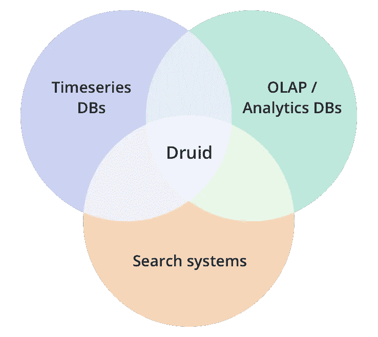
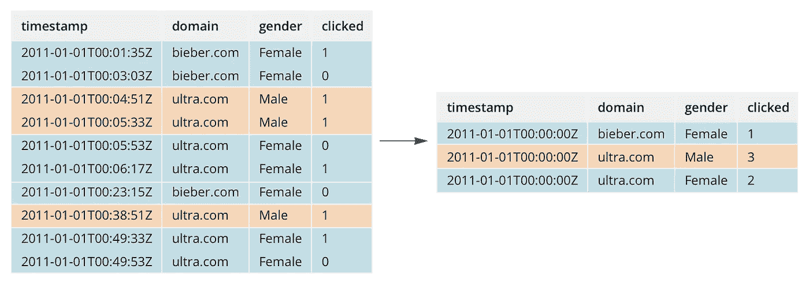
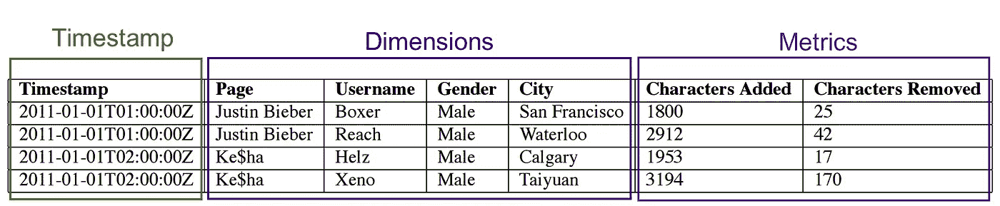
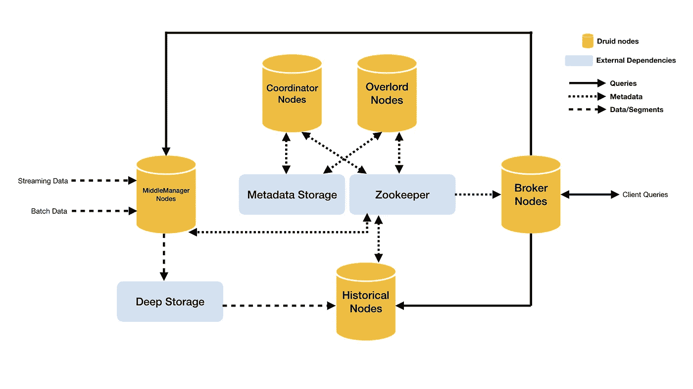
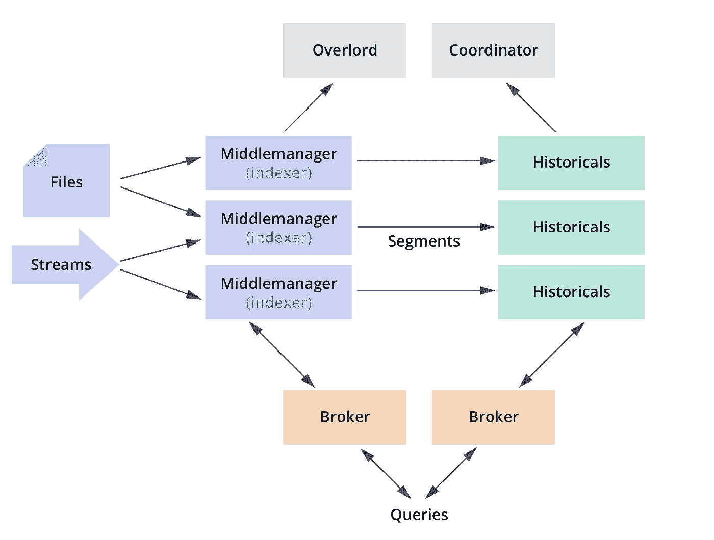

# 德鲁伊介绍，你的大规模互动分析

> 原文：<https://towardsdatascience.com/introduction-to-druid-4bf285b92b5a?source=collection_archive---------3----------------------->

我大约在 2 年前发现了德鲁伊( [http://druid.io](http://druid.io/) )。

当时我在 [SuperAwesome](https://www.superawesome.tv) 工作，我们需要一个解决方案来替换我们现有的基于 Mongo 的报告系统，该系统已经显示出了它的疲态。由于数据基数大，我们的 MongoDB 实现没有很好地扩展，存储成本使我们认为它不是这项工作的最佳工具。

当时，我们每天处理大约 **1 亿个事件**，我们的一些报告需要 **30 秒**才能生成。我们目前每天处理**数十亿个** **事件**，大部分时间报告花费**不到 1 秒**。

我们在 MongoDB 中的数据被迁移了。存储在 MongoDB 中的数据使用了大约 **60GB** 的磁盘空间，当在 Druid 中进行索引时，相同的数据仅代表 **600MB** 。没错。**存储容量减少 100 倍**！

这篇文章将解释什么是 Druid，为什么你应该关心它，一个关于它如何工作的高级概述，以及一些关于如何开始和实现不到 1 秒的查询时间的信息！

# 德鲁伊？那是电子游戏吗？

不。但这并不能说明它是 WoW 中的一个类；这使得有时很难找到资源。

为了描述德鲁伊，我只是引用他们的网站:

> *Apache Druid(孵化)是一个用于事件驱动数据的高性能分析数据存储。德鲁伊的核心设计结合了来自*[*【OLAP】/分析数据库*](https://en.wikipedia.org/wiki/Online_analytical_processing)*[*时间系列数据库*](https://en.wikipedia.org/wiki/Time_series_database)*[*搜索系统*](https://en.wikipedia.org/wiki/Full-text_search) *的思想，创建一个统一的运营分析系统。***

****

**Druid according to their website**

**如果要我用自己的话来描述:**

> ***Druid 是一个关于类固醇的实时柱状时间序列数据库，伸缩性非常好。***

**显然还有其他可用的数据库来存储时间序列数据，但这不是本文的目的。我只想向你介绍这一个，因为我有这方面的经验，不像其他的。(我当时很快尝试了一下，但我肯定不习惯比较或讨论它们。)**

# **谁在用德鲁伊？我还是第一次听说这件事。**

**德鲁伊正在被科技市场的一些大玩家使用。druid 网站维护着一份在其架构中使用 Druid 的公司列表。**

**以下是部分清单:**

*   ****元市场**:他们创造了德鲁伊来驱动他们的程序报告。**
*   ****网飞**:监控他们的基础设施。它们每小时摄取大约 2TB。**
*   **AirBNB :快速获得用户的互动信息。**
*   ****Optimizely** : Druid 为优化个性化的结果仪表板提供动力。**
*   ****沃尔玛**:他们发表了一篇关于他们[事件分析流](https://medium.com/walmartlabs/event-stream-analytics-at-walmart-with-druid-dcf1a37ceda7)的好文章。**
*   **很多其他人…**

# **什么时候应该考虑用德鲁伊？**

**如果你有以下问题，你应该使用德鲁伊:**

*   **要存储的时间序列数据**
*   **数据具有较高的基数**
*   **您需要能够快速查询这些数据**
*   **您想要支持流数据**

**几个好的用例示例:**

*   **数字营销(广告数据)**
*   **产品中的用户分析和行为**
*   **应用性能管理**
*   **OLAP 和商业智能)**
*   **物联网和设备指标**

# **关于数据存储方式的快速说明**

**您的数据存储在*段*中。段是不可变的。一旦创建，就不能更新。(您可以创建一个新版本的段，但这意味着要为该期间的所有数据重新编制索引)**

****

**Roll-up explained simply**

**您可以配置如何创建这些段(每天一个，每小时一个，每月一个等等)。您还可以定义段内数据的粒度。如果您知道每小时需要的数据，您可以配置您的段来自动累计数据。**

**在段内，数据按时间戳、维度和指标存储。**

*   ****时间戳**:时间戳(是否汇总)**
*   ****维度**:维度用于拼接或过滤数据。常见维度的几个例子有*城市、州、国家、设备 Id、活动 Id、…***
*   ****指标**:指标是完成的计数器/聚合。sof 指标的几个例子可以是*点击量、浏览量、响应时间、…***

****

***A druid segment:* [http://druid.io/docs/latest/design/segments.html](http://druid.io/docs/latest/design/segments.html)**

**德鲁伊默认支持多种可能的[聚合](http://druid.io/docs/latest/querying/aggregations.html)，比如 *first、last、doubleSum、longMax、…* 也有自定义/实验聚合可用，比如 [*近似直方图*](http://druid.io/docs/latest/development/extensions-core/approximate-histograms.html) 、 [*DataSketch*](http://druid.io/docs/latest/development/extensions-core/datasketches-aggregators.html) ，或者你自己的！您可以轻松地将自己的聚合实现为 Druid 的插件。**

**你可以在德鲁伊文档中读到更多关于数据如何存储在段内的信息:[http://druid.io/docs/latest/design/segments.html](http://druid.io/docs/latest/design/segments.html)**

# **它是如何在引擎盖下工作的？**

**每个 Druid 安装都是一个集群，需要运行多个组件。Druid 集群可以运行在一台机器上(非常适合开发)，或者完全分布在几台到几百台机器上。**

****

**Druid Architecture from [http://druid.io/docs/latest/design/](http://druid.io/docs/latest/design/)**

**让我们首先从 Druid 所需的外部依赖性开始:**

*   ****元数据存储**:SQL 驱动的数据库，如 PostgreSQL 或 MySQL。它用于存储关于段的信息、一些加载规则，以及保存一些任务信息。Derby 可以用于开发。**
*   **动物园管理员:动物园管理员需要在德鲁伊建筑的不同组件之间进行交流。某些类型的节点使用它来向其他节点传输它们的状态和其他信息。**
*   ****深度存储**:深度存储用于保存所有的分段文件，以便长期保存。支持多种存储，例如 S3、HDFS、本地挂载……其中一些是本地可用的，而另一些则需要[安装扩展](http://druid.io/docs/latest/development/extensions.html)。**

**现在让我们来看看在一个 Druid 集群中运行的不同节点类型:**

*   ****历史**:它们正在加载集群中可用的部分或全部段。然后，他们负责响应对这些段的任何查询。他们不接受任何书写。**
*   **中层经理:他们负责索引你的数据，不管是流式的还是批量摄取的。当一个段被索引时，它们还能够响应对这些段的任何查询，直到切换到一个历史节点。**
*   ****经纪人**:这是查询界面。它处理来自客户端的查询，并将它们分派到托管相关段的相关历史和中间管理器节点。最后，在发送给客户端之前，它会将结果合并回来。**
*   ****协调者**:协调者在这里管理集群的状态。当需要通过 zookeeper 加载段时，它们会通知历史节点，或者在集群中重新平衡段。**
*   ****霸主**:负责管理所有的索引任务。他们协调中层管理人员，并确保数据的发布。*注意:现在有一种方法可以在与协调器相同的进程中运行霸王。***
*   ****路由器(可选)**:霸王、经纪人、协调人前面的某种 API 网关。正如你可以直接询问这些，我真的不认为有任何必要。**

**中层管理人员的实时指数化通常与 Kafka 一起运行，但也可以使用其他 fire hose(rabbit MQ，RocketMQ，..)作为扩展。**

****

# **运行查询时会发生什么？**

**现在让我们看看当一个查询被发送到代理时会发生什么。**

**该查询将包含关于间隔(时间段)、维度和所需指标的信息。**

**1)查询命中代理。代理知道所请求间隔的相关段在哪里(即，需要来自*历史节点 A* 的 2 个段，来自历史节点 B*的 2 个段，并且它还需要来自在*中间管理器 A* 中发布的当前索引段的数据)。***

**2)查询被发送到所有需要的节点(在我们的例子中是*历史 A* 、*历史 B* 和*中间管理者 A* )。**

**3)这些节点中的每一个都将执行请求的聚合，并根据查询拼接数据，然后将结果发送回代理。**

**4)然后，根据查询，在代理中合并数据，并将其返回给客户端。**

**由于*经纪人*、*中层经理、*、*历史节点*的查询接口是一样的(如果你愿意，可以直接向历史节点发送查询。你可能得不到你所期望的所有数据。)，调试你的段，或者测试单个历史节点，真的很容易。代理只是发送相同的查询，但是简单地改变*请求间隔*以从每个其他节点只获得它需要的数据。**

# **限制**

**即使最好的数据库也有局限性。这就是生活。**

**其中一些是我在过去两年和德鲁伊一起工作时发现的:**

*   **无*窗口*功能，如滚动平均。您必须在自己的 API 中实现它。**
*   **不可能连接数据。但是如果你真的有这个用例，你可能做错了。**
*   **你可能需要在它前面有某种 API，只是为了将你的 id 重新映射到用户可读的信息。由于数据库主要是附加的，我不会保存某个东西的值，而只是一个引用(*活动 id* 而不是*活动名称*，除非您的数据在您的数据库中也是只读的)。有可能直接在德鲁伊里做这个[的方法，但是我还没试过。](http://druid.io/docs/latest/querying/lookups.html)**

# **关于性能和基础设施管理的说明**

**说实话，德鲁伊是“相当野兽”。根据您拥有的数据量，可能需要一个相当大的基础设施来维持亚秒级的查询时间。**

**一旦有了更多的数据，您还需要使用进程的配置(堆、CPU、缓存、线程……)。**

**在我看来，这也是德鲁伊的不足之处。他们还没有任何简单的工具来配置和维护不同的服务器(他们的云产品中有[https://imply.io/product](https://imply.io/product)，但我还没有尝试过)。你可能需要用 Chef、Ansible、Puppet、Kubernetes 等工具设置自己的工具来实现自动化。**

***在 SuperAwesome，我们决定使用****Kubernetes****结合* ***掌舵*** *来尽可能自动化我们的德鲁伊部署。如果你喜欢解决那类问题，*[*SuperAwesome*](https://www.superawesome.tv/)*正在招聘* [*全栈工程师*](https://superawesome.workable.com/j/D38D7B45F6) *和* [*DevOps 工程师*](https://superawesome.workable.com/j/AA680358BB) *！***

# **我在哪里可以试着学习德鲁伊？**

**我目前正在编写和编辑一个关于德鲁伊的视频课程。这里有[和](https://www.fullstackonlineschool.com/p/druid-masterclass)。确保[查看计划](https://www.fullstackonlineschool.com/p/druid-masterclass)并注册，以便在计划上线时得到通知！**

**你也可以在我的博客上订阅我未来的帖子，因为我可能会谈论更多关于德鲁伊的事情，还会发布关于德鲁伊职业的更新。**

**与此同时，还有一些其他有趣的链接可供参考:**

*   **德鲁伊快速入门:【http://druid.io/docs/latest/tutorials/index.html】T2**
*   **关于德鲁伊的演讲/论文列表:【http://druid.io/docs/latest/misc/papers-and-talks.html **
*   **德鲁伊的暗示分布:[https://docs.imply.io/on-prem/quickstart](https://docs.imply.io/on-prem/quickstart)**

# **来源**

*   **[http://druid.io/technology](http://druid.io/technology)**
*   **[http://druid.io/docs/latest/design/](http://druid.io/docs/latest/design/)**