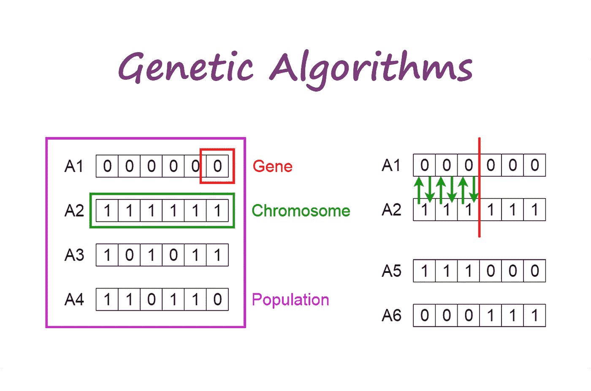
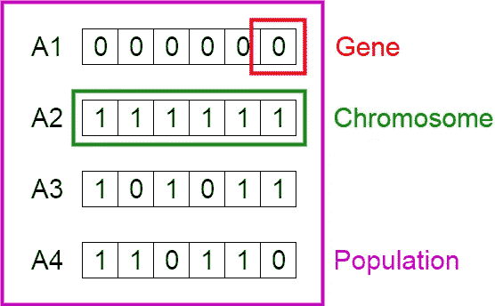
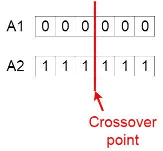
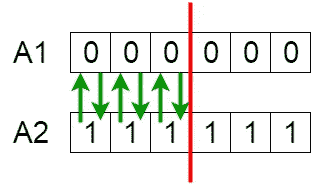
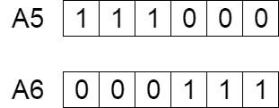
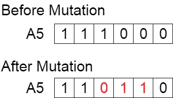
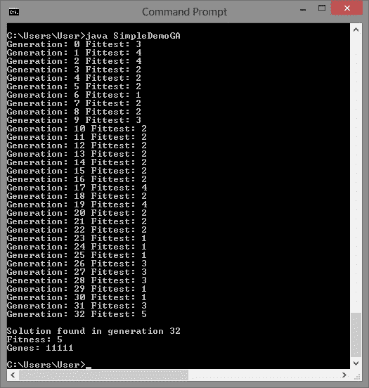

# 遗传算法简介—包括示例代码

> 原文：<https://towardsdatascience.com/introduction-to-genetic-algorithms-including-example-code-e396e98d8bf3?source=collection_archive---------0----------------------->

遗传算法是一种受查尔斯·达尔文的自然进化理论启发的启发式搜索。这种算法反映了自然选择的过程，即选择最适合的个体进行繁殖，以产生下一代的后代。



# 自然选择的概念

自然选择的过程始于从群体中选择最适合的个体。他们产生的后代继承了父母的特征，并将被添加到下一代。如果父母有更好的健康状况，他们的后代会比父母更好，有更好的生存机会。这一过程不断迭代，最终会找到具有最适合个体的一代。

这个概念可以应用于搜索问题。我们考虑一个问题的一组解决方案，并从中选择最佳方案。

遗传算法中考虑了五个阶段。

1.  原始群体
2.  适应度函数
3.  选择
4.  交叉
5.  变化

# 原始群体

这个过程从一组被称为**群体**的个体开始。每个个体都是你想要解决的问题的解决方案。

一个个体由一组被称为**基因**的参数(变量)来表征。基因连成一串形成**染色体**(解)。

在遗传算法中，一个个体的基因组用一串字母来表示。通常，使用二进制值(1 和 0 的字符串)。我们说我们在染色体中编码基因。



Population, Chromosomes and Genes

# 适应度函数

**适应度函数**决定个体的适应度(个体与其他个体竞争的能力)。它给每个人一个健康分数。一个个体被选择繁殖的概率是基于它的适合度分数。

# 选择

**选择**阶段的思路是选择最适的个体，让他们把自己的基因传递给下一代。

两对个体(**父母**)基于他们的适应性分数被选择。高适合度的个体有更多的机会被选择繁殖。

# 交叉

**交叉**是遗传算法中最重要的阶段。对于每对要交配的亲本，从基因中随机选择一个**交叉点**。

例如，假设交叉点为 3，如下所示。



Crossover point

后代是通过在他们之间交换父母的基因来创造的，直到到达交叉点。



Exchanging genes among parents

新的后代被添加到种群中。



New offspring

# 变化

在某些新形成的后代中，他们的一些基因可能以低随机概率发生**突变**。这意味着位串中的一些位可以翻转。



Mutation: Before and After

变异的发生是为了保持群体的多样性，防止过早收敛。

# 结束

如果群体已经收敛(不产生与上一代明显不同的后代)，则算法终止。然后说遗传算法为我们的问题提供了一套解决方案。

# 评论

人口数量是固定的。随着新一代的形成，最不适应的个体死亡，为新的后代提供空间。

这些阶段的顺序被重复，以在每一代中产生比上一代更好的个体。

# 伪代码

```
START
Generate the initial population
Compute fitness
REPEAT
    Selection
    Crossover
    Mutation
    Compute fitness
UNTIL population has converged
STOP
```

# Java 实现示例

下面给出了一个遗传算法在 Java 中的实现示例。请随意摆弄代码。

给定一组 5 个基因，每个基因可以保存二进制值 0 和 1 中的一个。

适应值计算为基因组中存在的 1 的数量。如果有五个 1，那么它是最适合的。如果没有 1，那么它有最小的适合度。

这种遗传算法试图最大化适应度函数，以提供由最适合的个体组成的群体，即具有五个 1 的个体。

注意:在这个例子中，在交叉和变异之后，最不适合的个体从新的最适合的后代中被替换。



Sample output where the fittest solution is found in the 32nd generation

# 编辑

在 [mem ento](https://medium.com/u/93477f57305f?source=post_page-----e396e98d8bf3--------------------------------) 的[**【https://github.com/memento/GeneticAlgorithm】**](https://github.com/memento/GeneticAlgorithm)查看这一令人敬畏的遗传算法实现，以及每一代基因库的可视化。

非常感谢 [mem ento](https://medium.com/u/93477f57305f?source=post_page-----e396e98d8bf3--------------------------------) 与我分享这份报告，并让我添加文章的链接。